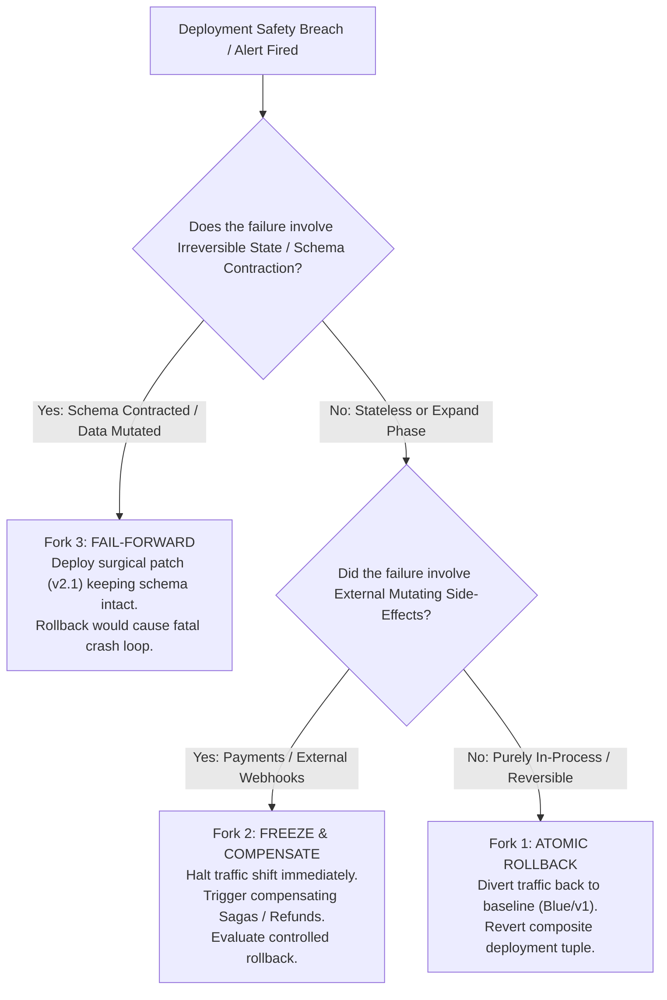
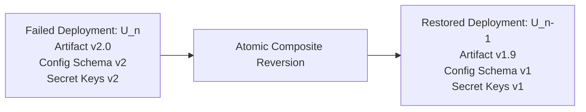

# Recovery, Rollback & Blast Containment: Decision Lattices, Side-Effect Taint & Forensic Preservation

> **Mandate**: *Recovery is not merely issuing an undo command; it is the deterministic stabilization of an operational system under active fault conditions.* When a deployment degrades or breaches an error budget, the system must choose between atomic rollback, progressive freeze, or controlled forward compensation based on state reversibility and external side-effect taint. Every recovery action must preserve complete forensic evidence before mutating failed instances and converge idempotently to a known-good state.

---

## 1 · The 3-Fork Recovery Decision Lattice

When a deployment fails or triggers a safety breach, the agent must evaluate the system against the 3-Fork Recovery Lattice:



### The 3 Forks Defined
1. **Fork 1: Atomic Rollback (Stateless / Clean Separation)**:
   * *Pre-condition*: The failure is isolated to software logic; database state is in Expand/Dual-write mode; external side-effects are absent or idempotent.
   * *Action*: Atomically divert 100% of traffic back to the known-good baseline ($v_1$). Revert routing rules, terminate canary instances after forensic snapshot.
2. **Fork 2: Freeze & Compensate (Tainted Side-Effects)**:
   * *Pre-condition*: Canary or rolling instances executed real external side-effects (e.g. processed charges, emitted orders) before failing.
   * *Action*: Immediately freeze traffic shifting ($0\%$ further progression). Isolate failed instances. Run the automated compensating saga handlers (e.g. issue credit refunds, cancel downstream vendor tasks). Once compensated, revert traffic.
3. **Fork 3: Surgical Fail-Forward (Irreversible State Transitions)**:
   * *Pre-condition*: Database migration has completed Phase 5 (Contract) or disk formats were migrated in-place.
   * *Action*: **Strictly forbid binary rollback**. Rolling back the binary to $v_1$ will cause an immediate crash loop because $v_1$ cannot read the contracted schema. Deploy a targeted hotfix patch ($v_{2.1}$) that rectifies the application logic while maintaining the new data layout.

---

## 2 · Composite Tuple Reversion Protocol

A software rollback is never an isolated binary change. Reverting an artifact without reverting its accompanying operational configuration and secrets causes catastrophic startup crashes:

$$\text{RollbackTarget} = \mathcal{U}_{n-1} = \langle A_{n-1}, \; \mathcal{C}_{n-1}, \; \mathcal{S}_{n-1} \rangle$$



### 2.1 Reversion Steps
1. **Schema Check**: Confirm that $\mathcal{C}_{n-1}$ is compatible with target environment stores.
2. **Secret Injection**: Ensure that decryption keys and tokens for $\mathcal{S}_{n-1}$ are active in the secret manager before booting $A_{n-1}$.
3. **Atomic Cutover**: Re-point the process supervisor or container orchestrator to the complete tuple $\mathcal{U}_{n-1}$.

---

## 3 · Session Draining & Graceful Disconnect Frames

Abruptly killing degraded instances can turn a partial deployment failure into a major data loss incident by severing active in-flight transactions or long-lived streams.

```mermaid
sequenceDiagram
    participant LB as Ingress Router / Load Balancer
    participant Old as Terminating Instance (v2)
    participant Client as Connected WebSocket / Streaming Client

    LB->>Old: Remove from Active Upstream Pool (Zero new traffic)
    Old->>Client: Send WebSocket Close Frame (Code 1001: Going Away)
    Note over Client: Client reconnects to Baseline (v1) with jittered backoff
    Old->>Old: Wait for active in-flight HTTP requests to finish (T_drain)
    Old->>Old: SIGTERM received; internal workers terminate cleanly
    Old->>Old: SIGKILL only if T_drain deadline expires
```

### 3.1 Termination Sequence
1. **Deregistration ($t = 0$)**: Instantly remove the instance from service discovery and routing pools.
2. **Protocol-Native Close Frames ($t = 1\text{s}$)**: For WebSockets, send Close Code `1001` ("Going Away"). For HTTP/2 or gRPC, send `GOAWAY` frames with the last processed stream ID.
3. **In-Flight Drain Window ($t \le T_{\text{drain}}$)**: Allow running database transactions and computational jobs to finish cleanly (default: 30–60 seconds).
4. **Controlled Process Shutdown**: Send $\text{SIGTERM}$. If the process fails to exit after $T_{\text{drain}}$, issue $\text{SIGKILL}$.

---

## 4 · Forensic Preservation Before Destruction

In automated CI/CD and self-healing systems, failing instances are often automatically terminated and garbage-collected within seconds, destroying all evidence needed to perform root-cause analysis (RCA).

### 4.1 The Mandatory Forensic Snapshot Protocol
Before any failed pod, container, or VM instance is decommissioned or terminated:
1. **Memory & Crash Dump**: Trigger an in-memory heap dump or core dump and upload to an isolated debug bucket:
   `/forensics/<deployment-id>/<instance-id>/heap.dump`
2. **Structured Log Tail**: Capture the last 5,000 lines of standard output and standard error from the failing instance.
3. **Distributed Trace Exemplars**: Pin and tag active trace IDs associated with the 5xx status codes to prevent trace sampling from discarding them.
4. **Environment Context Record**: Snapshot active environment variable keys (with secrets redacted) and system resource utilization metrics (CPU, RAM, open file descriptors, TCP socket states).
5. **Handoff to Failure Recovery**: Emit a formal failure event payload to [`failure-recovery`](../failure-recovery/SKILL.md) for automated fault attribution.
