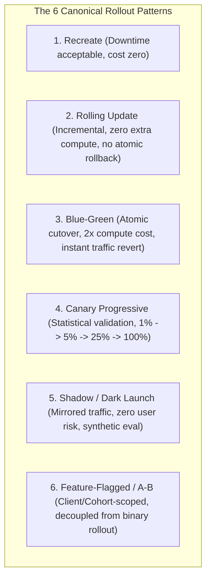
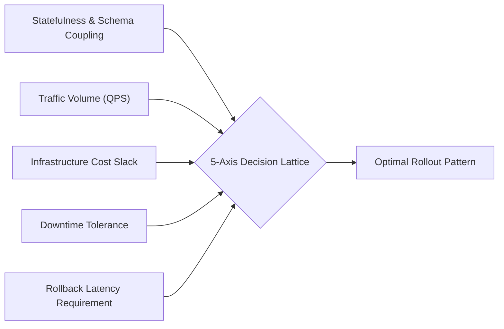
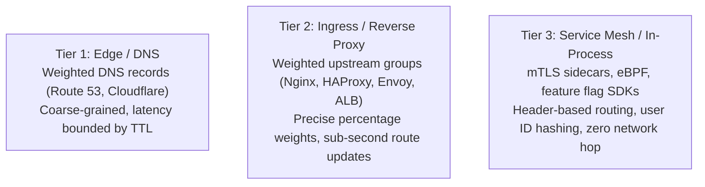

# Rollout Strategies & Risk Taxonomy: Decision Matrix, Traffic Steering & Capacity Modeling

> **Mandate**: *The rollout strategy is the mathematical function that balances risk exposure against operational cost and verification velocity.* There is no universally superior deployment strategy. Recreate is optimal for batch jobs and low-cost development; Blue-Green is optimal for instant cutover with zero downtime; Canary is optimal for high-traffic public workloads where empirical statistical validation is required. An engineer must select the strategy derived from physical and operational constraints: statefulness, traffic volume, infrastructure slack, and downtime tolerance.

---

## 1 · The 6 Canonical Rollout Patterns

### 1.1 Recreate (Cold Swap)
* **Mechanics**: Terminate all active instances of version $v_1$ ($N_{v_1} \to 0$); deploy and boot version $v_2$ ($0 \to N_{v_2}$).
* **Properties**:
  * Downtime: Guaranteed ($T_{\text{downtime}} = T_{\text{drain}} + T_{\text{boot}} + T_{\text{probe}}$).
  * Compute Overhead: $0\%$ additional capacity.
  * State Coupling: Trivial. Zero risk of concurrent version divergence ($v_1$ and $v_2$ never run simultaneously).
  * Ideal For: Batch data processing, monolithic staging environments, internal developer tooling, memory-constrained single-board embedded systems.

### 1.2 Rolling Update (Staged In-Place Replacement)
* **Mechanics**: Incrementally replace batches of $v_1$ instances with $v_2$ instances while maintaining a specified minimum available capacity:
  $$N_{\text{available}}(t) \ge N_{\text{total}} - N_{\text{maxUnavailable}}$$
  $$N_{\text{total}}(t) \le N_{\text{total}} + N_{\text{maxSurge}}$$
* **Properties**:
  * Downtime: Zero (if readiness probes are properly configured).
  * Compute Overhead: Bounded by $N_{\text{maxSurge}}$ (typically $10\%–25\%$).
  * State Coupling: **High**. Version $v_1$ and $v_2$ run concurrently during the rollout window. Database schemas and network contracts must be backward and forward compatible.
  * Ideal For: Standard stateless microservices, web application fleets, message queue consumer workers.

### 1.3 Blue-Green (Atomic Dual-Stack Cutover)
* **Mechanics**: Stand up a complete, identical clone environment (Green) running $v_2$ alongside the existing environment (Blue) running $v_1$. Verify Green in isolation. Atomically shift the traffic router from Blue to Green. Retain Blue on hot standby for instant rollback.
* **Properties**:
  * Downtime: Zero. Cutover latency is bounded by router/DNS propagation.
  * Compute Overhead: $+100\%$ ($2\times$ resource capacity during deployment).
  * Rollback Latency: Sub-second ($O(1)$ routing switch back to Blue).
  * State Coupling: **Extreme**. Both stacks connect to the shared persistent datastore simultaneously. Database mutations by Green must not break Blue if rollback occurs.
  * Ideal For: Mission-critical APIs, payment gateways, e-commerce checkout paths, systems requiring instant atomic recovery.

### 1.4 Canary Progressive (Metric-Driven Traffic Steered Rollout)
* **Mechanics**: Deploy $v_2$ to an isolated cohort receiving a fractional slice of production traffic ($\alpha = 1\% \to 5\% \to 25\% \to 100\%$). Telemetry is continuously compared against the baseline cohort via Automated Canary Analysis (ACA).
* **Properties**:
  * Downtime: Zero.
  * Blast Radius: Mathematically bounded by $\alpha$.
  * Validation Quality: Maximum. Validates performance under true organic customer traffic.
  * Ideal For: High-QPS public web services, multi-tenant SaaS platforms, global consumer apps.

### 1.5 Shadow / Dark Launch (Mirrored Replay)
* **Mechanics**: Fork incoming production read traffic at the edge or ingress proxy. Send live requests to $v_1$ (returning responses to users) and duplicate requests asynchronously to $v_2$ (discarding responses).
* **Properties**:
  * Blast Radius: **Zero user impact**. If $v_2$ crashes or corrupts data in memory, users experience zero errors.
  * Mutating Traffic Warning: **Must strictly mock or virtualize write operations**. If shadowed requests execute real external database writes or payments, state corruption occurs.
  * Ideal For: Heavy algorithmic rewrites, search ranking upgrades, LLM agent prompt evaluations, protocol parser overhauls.

### 1.6 Feature-Flagged / Dynamic Cohort (Decoupled Release)
* **Mechanics**: Code for $v_2$ is deployed to 100% of the fleet in a dormant state. A centralized dynamic configuration engine activates execution paths per user ID, tenant ID, or geographic cohort.
* **Properties**:
  * Decoupling: Separates deployment (moving bits) from release (enabling capabilities).
  * Granularity: User-level targeting, beta testers, ring progression without process restarts.
  * Ideal For: Complex UI features, pricing algorithm experiments, enterprise tenant gradual onboarding.

---

## 2 · The 5-Axis Strategy Selection Lattice

To eliminate guessing and prevent arbitrary decisions, the agent evaluates the deployment context across 5 orthogonal axes:

| Strategy | Statefulness / Schema Risk | Min QPS Required for ACA | Compute Overhead | Downtime Tolerance | Rollback Latency |
|---|---|---|---|---|---|
| **`Recreate`** | Zero risk (single active version) | N/A (None) | $0\%$ | Permitted ($>1\text{min}$) | Slow (Redeploy $v_1$) |
| **`Rolling`** | Dual-version compatibility required | Medium ($>10\text{ QPS}$) | $+10\%–25\%$ | Zero-downtime required | Moderate (Reverse rolling update) |
| **`Blue-Green`** | Shared DB requires strict Expand/Contract | Low ($>0\text{ QPS}$) | $+100\%$ ($2\times$) | Zero-downtime required | Instant ($<1\text{s}$ route swap) |
| **`Canary`** | Dual-version compatibility + Side-effect safety | High ($>100\text{ QPS}$) | $+5\%–20\%$ | Zero-downtime required | Fast (Divert canary traffic $\to 0\%$) |
| **`Shadow`** | Read-only or virtualized sinks required | High ($>50\text{ QPS}$) | $+100\%$ for target | Zero-downtime required | N/A (No user exposure) |
| **`Feature-Flag`** | Schema must support both code branches | Any QPS | Minimal | Zero-downtime required | Instant (Toggle flag to `false`) |

---

## 3 · Blast Radius Mathematical Modeling

The operational risk of a deployment is quantified by the Blast Radius metric $R_{\text{blast}}$:

$$R_{\text{blast}}(t) = \left( \frac{\mathcal{T}_{\text{exposed}}(t)}{\mathcal{T}_{\text{total}}} \right) \times \mathcal{C}_{\text{impact}} \times \left( 1 - \mathcal{R}_{\text{confidence}}(t) \right)$$

Where:
* $\mathcal{T}_{\text{exposed}}(t)$: Request rate or active user count routed to the new version at time $t$.
* $\mathcal{C}_{\text{impact}}$: Criticality factor of the service (e.g. 1.0 for core checkout/auth, 0.2 for localized internal telemetry).
* $\mathcal{R}_{\text{confidence}}(t) \in [0, 1]$: Empirical confidence accumulated via passing verification gates:
  $$\mathcal{R}_{\text{confidence}}(t) = 1 - e^{-\lambda \cdot N_{\text{verifiedRequests}}(t)}$$

### The Safe Exposure Envelope
At no point in the deployment lifecycle may $R_{\text{blast}}(t)$ exceed the allocated Error Budget $\mathcal{B}_{\text{error}}$:
$$R_{\text{blast}}(t) \le \mathcal{B}_{\text{error}}$$

---

## 4 · Capacity Protection & Connection Pool Sizing

Running concurrent versions during Blue-Green or progressive Canary rollouts introduces a major failure mode: **Database Connection Starvation**.

### 4.1 The $2\times$ Connection Multiplier Problem
If an application runs 50 active instances with a maximum pool size of 10 connections each:
$$\text{ActiveConnections}_{\text{base}} = 50 \times 10 = 500$$
During a Blue-Green deployment, 50 Green instances boot up simultaneously:
$$\text{TotalConnections}_{\text{peak}} = (50_{\text{Blue}} + 50_{\text{Green}}) \times 10 = 1000$$
If the database `max_connections` is configured to 800, both Blue and Green instances will crash in a catastrophic connection starvation storm.

### 4.2 Dynamic Pool Throttling Formula
When executing concurrent stack deployments, the agent must ensure that total allocated connections never exceed $80\%$ of database capacity:
$$\text{PoolSize}_{\text{instance}} \le \left\lfloor \frac{\text{DB}_{\text{MaxConnections}} \times 0.8}{N_{\text{active}} + N_{\text{canary}}} \right\rfloor$$
Alternatively, architectures must route all application instances through a connection multiplexing proxy (e.g. PgBouncer, ProxySQL, AWS RDS Proxy) prior to engaging Blue-Green or Canary workflows.

---

## 5 · Cache Warming & JIT Primer Protocols

### 5.1 The Thundering Herd Phenomenon
When traffic is atomically shifted to a fresh instance or stack (Blue-Green cutover), cache hit rates drop from $98\% \to 0\%$. All requests penetrate directly to the primary database, causing CPU spikes, query queue saturation, and sudden cascading failure.

### 5.2 The 3-Step Priming Protocol
Before routing live user traffic to newly deployed instances:
1. **Connection Pre-Allocation**: Initialize connection pools to minimum required steady-state capacity during process boot (never defer connection creation to the first user request).
2. **Synthetic Cache Warming**: Issue synthetic HTTP/gRPC requests targeting the top 5% most frequently accessed cache keys (e.g. product catalog metadata, tenant configuration schemas) to pre-seed Redis/Memcached.
3. **JIT Code Warming**: For managed runtimes (JVM, Node.js V8, .NET CLR), execute synthetic iterations against core serialization and routing routines during the Startup probe phase to force JIT compilation before entering the `Ready` pool.

---

## 6 · Traffic Steering Mechanisms

The skill abstracts traffic shifting mechanisms into three universal architectural tiers:

1. **DNS Weighted Steering**:
   * *Mechanism*: DNS providers return alternating IP records weighted by percentage.
   * *Limitation*: Client-side DNS caching and ISP resolver overrides ignore TTLs; not suitable for sub-minute rollback.
2. **Reverse Proxy / Load Balancer Weighted Upstreams**:
   * *Mechanism*: Envoy, Nginx, or cloud ALBs allocate percentage weights across target groups ($95\% \to v_1, 5\% \to v_2$).
   * *Advantage*: Instantaneous dynamic reconfiguration with zero client-side caching delay.
3. **Layer 7 Header & Context Steering**:
   * *Mechanism*: Routes requests based on HTTP headers (`X-Canary: true`), user cookies (`session_cohort=beta`), or tenant ID claims in JWTs.
   * *Advantage*: Enables deterministic testing for internal employees and beta customers without exposing general traffic.
