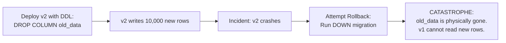
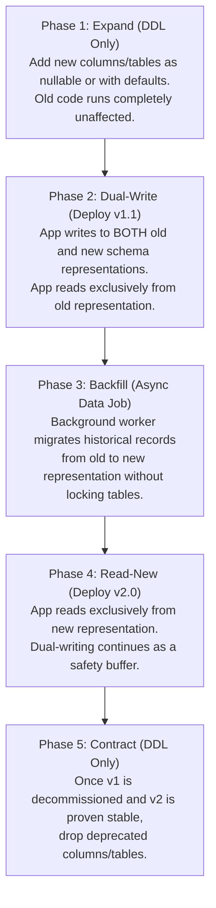

# Stateful Migrations & Schema Evolution: The Expand/Contract Protocol & Data Integrity

> **Mandate**: *Code has zero physical inertia; persistent state has infinite physical inertia.* Reverting an application binary takes seconds; undoing a corrupted 500-gigabyte database migration or an unparseable distributed message stream can destroy a business. Naive `down` migration scripts in production are a catastrophic illusion. Every stateful transformation must co-evolve with application code via the Expand/Contract protocol, guaranteeing that every intermediate state is fully forward and backward compatible across rolling version boundaries.

---

## 1 · The Myth of the Instant Database Rollback

In naive deployment guides, engineers are taught to write matching `up` and `down` migration scripts. In real-world distributed architectures, **down migrations frequently fail catastrophically**:



### Why Naive Rollbacks Break
1. **Destructive Information Loss**: Dropping a table or column permanently purges bytes. Re-adding the column in a `down` script creates an empty column, corrupting domain state.
2. **Data Divergence Under Mixed Versions**: During a 20-minute rolling rollout, both $v_1$ and $v_2$ instances read and write to the same database simultaneously. A schema change must accommodate both versions at all times.
3. **Locking Cascades**: Running an `ALTER TABLE` that locks a high-throughput table causes connection pool exhaustion across all running instances within milliseconds.

---

## 2 · The 5-Phase Expand/Contract (Parallel Run) Protocol

To achieve zero-downtime, fully reversible stateful migrations, every schema change must be decomposed into 5 distinct, decoupled deployment phases:



### Detailed Phase Execution Contract

| Phase | Deployment Action | Database State | Application Reads | Application Writes | Rollback Safety |
|---|---|---|---|---|---|
| **1. Expand** | Run additive migration script (DDL). | New nullable columns/tables exist. | Reads Old schema. | Writes Old schema. | **Trivial**: Drop added column or leave inert. |
| **2. Dual-Write** | Deploy application $v_{1.1}$. | Old & New columns both exist. | Reads Old schema. | **Writes BOTH** Old & New schemas. | **Trivial**: Revert code to $v_{1.0}$; DB retains old data. |
| **3. Backfill** | Execute batched background script. | Historical rows copied Old $\to$ New. | Reads Old schema. | Writes BOTH schemas. | **Trivial**: Halt background script; no app impact. |
| **4. Read-New** | Deploy application $v_{2.0}$. | All rows populated in New schema. | **Reads New** schema. | Writes BOTH schemas. | **Safe**: Revert to $v_{1.1}$; old columns are still up to date! |
| **5. Contract** | Run cleanup migration script (DDL). | Deprecated columns dropped. | Reads New schema. | Writes New schema only. | **Point of No Return**: Must fail-forward. |

---

## 3 · Schema Compatibility Rules (Databases, RPC & Events)

To prevent mixed-version deployment failures, all schemas must adhere to Postel's Law and strict compatibility rules:

### 3.1 Relational Database DDL Invariants
1. **Never Add Non-Nullable Columns Without Defaults**:
   * Adding `NOT NULL` without a default will cause all existing $v_1$ instances to fail immediately on `INSERT` statements because $v_1$ does not know about the new column.
2. **Never Rename Columns In-Place**:
   * Renaming a column instantly breaks either $v_1$ or $v_2$. Use Expand/Contract: add new column $\to$ dual write $\to$ backfill $\to$ drop old.
3. **Index Creation Must Be Non-Blocking**:
   * In PostgreSQL: `CREATE INDEX CONCURRENTLY`.
   * In MySQL: `ALGORITHM=INPLACE, LOCK=NONE`.

### 3.2 Wire Protocols & Event Streams (Protobuf, JSON, Avro)
When deploying services that communicate via message brokers (Kafka, RabbitMQ, SQS) or gRPC:
* **Rule of Additive Evolution**: New fields may be added, but existing field tags/keys must never be renumbered or deleted.
* **Tolerant Reader Pattern**: Deserializers must be configured to silently ignore unrecognized JSON fields or unknown Protobuf tags rather than throwing parsing exceptions.
* **Dual Consumer Groups for Breaking Changes**: If a message payload format must change breakingly, create a new topic or use independent consumer group IDs with parallel stream processors.

---

## 4 · Distributed Lock Invalidation & Monotonic Fencing Tokens

During rolling updates or Blue-Green cutovers, multiple instances of background workers or cluster leaders run concurrently. Clock skew or delayed network packets can cause a deprecated instance to execute mutations after a new leader has taken over.

```mermaid
sequenceDiagram
    participant Old as Old Leader (v1)
    participant Lock as Distributed Lock (etcd/Redis)
    participant New as New Leader (v2)
    participant DB as Datastore

    Old->>Lock: Acquire Lease (Token = 41)
    Note over Old: Paused by GC / Network delay...
    Lock-->>New: Lease expires; Grants to New (Token = 42)
    New->>DB: Write Data (Token = 42) -> ACCEPTED
    Old->>DB: Wakes up; Writes Data (Token = 41) -> REJECTED (Stale Token)
```

### The Monotonic Fencing Token Protocol
1. **Token Generation**: Every distributed lock, lease, or master election mechanism must return a strictly monotonically increasing generation token ($T_{\text{fence}}$).
2. **Datastore Verification**: The database or storage layer must record the highest seen fencing token per resource:
   $$\text{ProcessWrite}(T_{\text{incoming}}, \text{data}) \iff T_{\text{incoming}} \ge T_{\text{maxRecorded}}$$
3. **Rejection of Stale Leaders**: Any write bearing a stale token ($T_{\text{incoming}} < T_{\text{maxRecorded}}$) is unconditionally rejected, preventing split-brain corruption during staged rollouts.

---

## 5 · Irreversible Transitions & Forward Recovery

When a stateful mutation cannot be undone (e.g. Phase 5 Contract completed, irreversible data hashing, or external third-party ledger synchronization), the agent must engage the **Forward Recovery Protocol**:

1. **Never Attempt In-Place Rollback on Contracted Schemas**:
   * Once Phase 5 (Contract) has been executed, rolling back application code will cause an immediate crash loop.
2. **Surgical Forward Compensation**:
   * If a defect is discovered after schema contraction, write an immediate forward patch (application $v_{2.1}$) that fixes the computational logic while keeping the contracted schema intact.
3. **Point-in-Time Recovery (PITR) as Last Resort**:
   * If catastrophic data corruption occurred during backfill or migration:
     1. Stop incoming write traffic immediately (enter Maintenance / Read-Only mode).
     2. Restore the database from the snapshot taken immediately prior to Phase 1.
     3. Replay transactional write-ahead logs (WAL) up to the exact transaction timestamp prior to the corrupting migration.
