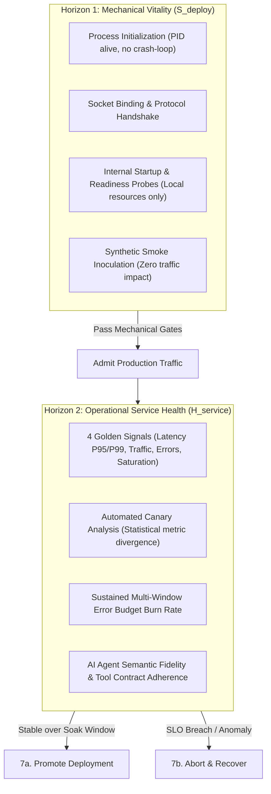
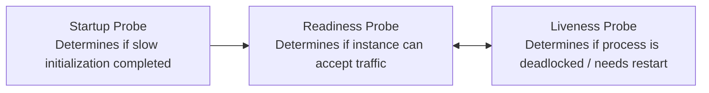
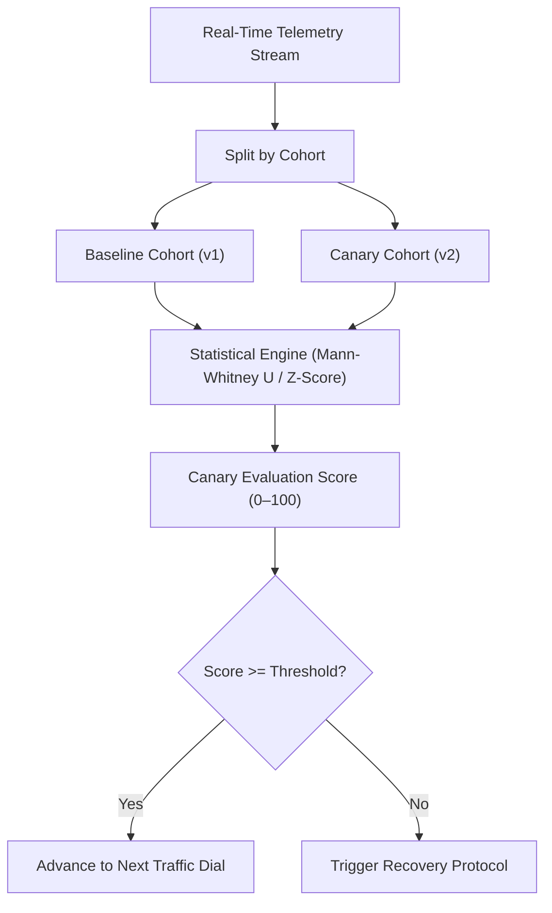
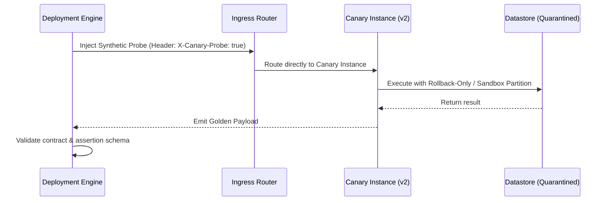

# Verification Gates & Observability: Dual-Horizon Health, Automated Canary Analysis & Probing

> **Mandate**: *A deployment is not successful when a process starts, binds to a port, or passes a synthetic ping. It is successful only when operational service health is proven under live traffic without consuming an impermissible share of the system's error budget.* Deployment engineering demands a rigorous dual-horizon verification model: mechanical process vitality must be established before traffic is admitted, and operational service health must be continuously certified across an explicit stabilization soak window before promotion is finalized.

---

## 1 · Dual-Horizon Health Verification

### 1.1 The Fundamental Equivalence Fallacy
The most common disaster in software operations is equating $S_{\text{deploy}}$ with $H_{\text{service}}$:
$$\text{HealthyDeployment} \neq S_{\text{deploy}}(\text{exitCode} == 0 \land \text{HTTP 200})$$
A microservice may boot perfectly, bind to port 8080, and return HTTP 200 on `/healthz`, yet fail on 100% of real user queries due to a misconfigured serialization serializer, an invalid database dialect, or an expired OAuth token that is only invoked during user request handling.

### 1.2 The Formal Verification Contract
A deployment is verified if and only if both horizons pass their respective invariant gates:
$$\text{Verified} \iff S_{\text{deploy}}(\text{Startup}, \text{Liveness}, \text{Readiness}) \land \left( \forall t \in [t_{\text{deploy}}, t_{\text{deploy}} + \Delta t_{\text{soak}}], \; H_{\text{service}}(t) \models \text{SLO} \right)$$

---

## 2 · Health Probe Architecture & Anti-Patterns

Health probes must be strictly decoupled to prevent cascading cluster death spirals:

### 2.1 The Three Probe Tiers
1. **Startup Probe**:
   * *Purpose*: Protects slow-starting applications (e.g. warming local caches, JIT compilation, model weight loading).
   * *Action on Failure*: Restarts process only after `failureThreshold * periodSeconds` expires. Disables Liveness and Readiness probes until it succeeds.
2. **Readiness Probe**:
   * *Purpose*: Signals whether the instance is ready to receive network traffic from the load balancer.
   * *Action on Failure*: Removes instance from load balancer active endpoints. **Does NOT kill the process**.
3. **Liveness Probe**:
   * *Purpose*: Detects unrecoverable deadlocks, infinite loops, or corrupted internal state.
   * *Action on Failure*: Terminates and restarts the process.

### 2.2 Deadly Probe Anti-Patterns
* ❌ **The Cascading Deep Probe Anti-Pattern**: Configuring a readiness probe to execute `SELECT 1 FROM database` or ping an upstream payment service. If the database experiences a momentary latency spike, all readiness probes across the entire fleet fail simultaneously, removing 100% of instances from the load balancer and turning a minor database slow-down into a total system outage.
  * **Rule**: *Probes must inspect ONLY in-process local state* (is connection pool initialized? are local workers listening? is memory within limits?). Downstream dependency health is monitored via operational telemetry, never liveness probes.
* ❌ **Aggressive Liveness Timeouts**: Setting a 1-second liveness timeout on a service subject to Stop-the-World garbage collection or bursty CPU spikes. The GC pause triggers a liveness failure, causing a restart storm.
  * **Rule**: Set liveness `failureThreshold \ge 3` with an interval greater than maximum expected GC or CPU contention pauses.

---

## 3 · Automated Canary Analysis (ACA)

Automated Canary Analysis mathematically evaluates whether a canary cohort $C_{\text{canary}}$ behaves indistinguishably from the control baseline cohort $C_{\text{baseline}}$:

### 3.1 Core Metrics for Canary Evaluation
1. **Error Budget Burn Rate**:
   $$\text{BurnRate} = \frac{\text{ErrorRate}_{\text{canary}} - \text{ErrorRate}_{\text{baseline}}}{\text{AllowedBudgetRate}}$$
2. **Latency Distributions (P95, P99)**:
   * Evaluate whether latency distribution has statistically shifted using the non-parametric **Mann-Whitney U Test** (which makes no assumption of normal distribution).
3. **Resource Saturation**:
   * CPU utilization per request, memory leak trajectory ($\frac{\Delta \text{Heap}}{\Delta t}$), open file descriptor growth.

### 3.2 Filtering Transient Metric Noise (Anti-Thrashing Protocol)
To prevent transient internet blips or external provider glitches from triggering a false-positive rollback loop:
1. **Sustained Multi-Window Evaluation**:
   * A rollback trigger must observe sustained SLO violation across at least 3 consecutive probe intervals ($\ge 3 \times \Delta t_{\text{interval}}$). Single-spike anomalies generate warnings, not immediate aborts.
2. **Causal Attribution Filter**:
   * The analysis engine checks whether the error spike is unique to the canary:
     $$\Delta \text{Error} = \text{ErrorRate}_{\text{canary}} - \text{ErrorRate}_{\text{baseline}}$$
   * If $\Delta \text{Error} \approx 0$ (both baseline and canary error rates jumped simultaneously), the failure is attributed to an external dependency outage, preventing a useless rollback of valid application code.

---

## 4 · The Low-Traffic Synthetic Inoculation Protocol

Statistical canary analysis fails on low-QPS systems (e.g. specialized B2B software, internal administrative portals, or batch ingest services) where hours can pass before a single organic request arrives.

### The 4-Step Inoculation Procedure
1. **Hermetic Header Injection**: The deployment runner generates synthetic requests bearing a cryptographic header:
   `X-Canary-Inoculation: <signed-token>`
2. **Deterministic Route Mapping**: Ingress proxies intercept this header and guarantee routing directly to the canary instance, bypassing normal traffic percentage dials.
3. **Storage Sandbox Quarantining**:
   * *Read Operations*: Execute directly against live production read replicas.
   * *Mutating Operations*: Execute inside an isolated sandbox tenant, write to a designated scratch partition, or run within a database transaction that explicitly issues a `ROLLBACK` after query validation.
4. **Golden Contract Assertion**: Verify that the response conforms to strict runtime schema contracts and latency ceilings. 100% of synthetic inoculation checks must pass within 60 seconds to certify deployment health.

---

## 5 · Stabilization Soak Windows

A deployment cannot be finalized immediately upon reaching 100% traffic. Latency degradations, slow memory leaks, connection pool leaks, and edge-case exceptions often take time to manifest under live load.

### 5.1 Soak Window Calculation Formula
The duration of the stabilization soak window $\Delta t_{\text{soak}}$ is a function of service criticality and request periodicity:

$$\Delta t_{\text{soak}} = \max\left( T_{\text{min}}, \; k \cdot T_{\text{periodicCycle}} \right)$$

| Service Tier | Minimum Soak Window ($T_{\text{min}}$) | Traffic Requirement | Primary Risk Monitored |
|---|---|---|---|
| **Tier 1 (Core Checkout / Auth)** | 30 minutes | $\ge 10,000$ requests | Slow memory leaks, GC degradation, P99 tail latency |
| **Tier 2 (Internal Microservices)** | 10 minutes | $\ge 1,000$ requests | Unhandled downstream exceptions, pool exhaustion |
| **Tier 3 (Batch / Background)** | 1 full batch cycle | $\ge 1$ complete job execution | State corruption, deadlocks, data volume anomalies |
| **Tier 4 (Dev / Ephemeral Previews)** | 1 minute | $\ge 1$ synthetic probe | Process crash, startup failure |

### 5.2 Promotion Decision Protocol
* During $\Delta t_{\text{soak}}$, if all SLIs remain within acceptable error budget envelopes, the deployment engine automatically transitions state to **PROMOTED**.
* If an alert fires during $\Delta t_{\text{soak}}$, the soak timer immediately freezes, diagnostic state is snapshot, and the recovery protocol is engaged.
