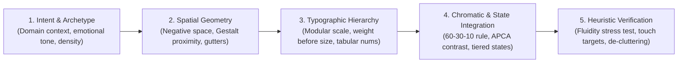

# UI Design Philosophy: Universal Visual Engineering & Perceptual Protocol

> **Mandate**: Design interfaces grounded in human perceptual physics, cognitive ergonomics, and intentional aesthetic judgment. Eliminate accidental visual clutter (gratuitous boxes, arbitrary padding, uncalibrated lines); amplify intentional signal. Structure visual hierarchy through luminance, typographic weight, and negative space before applying raw pixel tweaks or color decoration. Never restrict artistic creativity—liberate it through structural discipline.

---

## 1 · The 4-Phase Design Lifecycle

Every interface—whether a high-density financial terminal, a mobile consumer app, an operating system shell, or an ANSI CLI—must be engineered through this 4-phase protocol:



1. **Intent & Archetype Calibration**: Identify the domain problem, audience mental model, and emotional temperature. Select an aesthetic archetype (see [`references/intent-and-archetypes.md`](references/intent-and-archetypes.md)) to anchor density, typography, and contrast.
2. **Spatial Geometry & Scaffolding**: Treat white space as active structural material. Group elements using proximity and negative space gutters. Avoid wrapping every data point in a bordered box (see [`references/perceptual-physics.md`](references/perceptual-physics.md)).
3. **Typographic Hierarchy & Cadence**: Establish reading flow through typographic weight, luminance step-downs, and modular mathematical scales before resorting to oversized font scaling. Ensure all comparative numeric data uses tabular figures (see [`references/spatial-and-typography.md`](references/spatial-and-typography.md)).
4. **Chromatic Semantics & State Integration**: Apply the 60-30-10 chromatic balance. Reserve saturated hues strictly for system state and primary interactive affordances. Map components to their appropriate state tier without bloat (see [`references/chromatic-semantics.md`](references/chromatic-semantics.md) and [`references/state-and-fluidity.md`](references/state-and-fluidity.md)).
5. **Heuristic Verification Pass**: Subject the design to the 5-point verification gate: check Gestalt grouping, 3x content expansion reflow, 200% font zoom survival, hit target ergonomics, and APCA contrast.

---

## 2 · Adaptive Cognitive Sizing (The 3 Execution Modes)

Size your design reasoning to the scope and operational risk of the task. Do not write essays for simple patches, and never skip structural scaffolding on full workflows:

| Mode | Trigger & Scope | Design Discipline | Required Output & Protocol |
| :--- | :--- | :--- | :--- |
| **`micro`** | Button styling, localized form input, isolated icon alignment, bug fix (< 30 lines). | Immediate execution; check state affordances (idle, active, focus, disabled); optical alignment; APCA contrast. | **Zero preamble essay**. Emit the code/diff directly with a 1-line rationale. |
| **`component`** | New data table, card cluster, navigation bar, dialog, or form flow. | Gestalt proximity audit; internal vs. external padding ($P < M$); Tier 2 state mapping (5 states); reflow stress check. | **3-Line Intent Block** immediately preceding the component implementation. |
| **`system`** | Full screen layout, multi-step flow, new application shell, design system tokens. | Full 4-phase lifecycle; archetype selection; mathematical spacing ladder; 60-30-10 chromatic mapping; Tier 3 state specs. | Structured **Values $\rightarrow$ Principles $\rightarrow$ Moves** specification + complete code/mockup. |

### The 3-Line Intent Protocol (For `component` and `system` modes)
To prevent philosophical essay bloat, summarize design intent in exactly 3 structured lines before emitting implementation code:
```markdown
> **Intent**: [Aesthetic Archetype] · [Density: Compact / Balanced / Expansive] · [Emotional Tone]
> **Hierarchy**: [Primary Focal Anchor] · [Luminance Step-Down Strategy] · [Contrast Mechanism]
> **Spatial Rhythm**: [Base Unit U = 4px|8px|1cell] · [Grouping Strategy: Proximity over Borders]
```

---

## 3 · The 8 Universal Laws of UI Design

Regardless of technology (Web, iOS, Android, Flutter, TUI, Canvas, Spatial), every interface must adhere to the 8 Universal Laws:

### 3.1 Gestalt Organization & Grouping by Proximity
* **Proximity Over Borders**: Elements placed close together are perceived as belonging together. If spacing alone cleanly establishes grouping, **delete enclosing boxes, card outlines, and dividing lines**.
* **Figure/Ground Separation**: Interactive layers must maintain unambiguous elevation. Floating controls, menus, and sheets must never sit on the same perceptual plane as passive canvas content.
* *(Perceptual mechanics & ocular laws: [`references/perceptual-physics.md`](references/perceptual-physics.md).)*

### 3.2 Negative Space as Structural Material
* **Space is Active**: White space is the structural scaffold of cognitive comprehension, not empty leftover void.
* **The Stepped Spacing Ladder**: Base all spatial intervals on integer multiples of a single base unit $U$ ($4\text{px}$, $8\text{px}$, or character cells): $0.5U, 1U, 2U, 3U, 4U, 6U, 8U, 12U$. Zero magic numbers.
* **The Containment Tension Invariant**: Internal element padding must always be strictly less than the external margin separating it from sibling elements: $P_{\text{internal}} < M_{\text{external}}$.

### 3.3 Typographic Architecture & Reading Rhythm
* **Weight and Luminance Before Font Size**: Establish primary vs. secondary relationships by stepping down text luminance (e.g. 100% $\rightarrow$ 65% $\rightarrow$ 45%) and stepping up weight (medium/semibold) before blowing up font size.
* **Modular Typographic Scale**: Anchor font sizes to consistent geometric ratios ($1.125, 1.2, 1.25, 1.333$).
* **Measure & Leading Limits**: Keep sustained reading measures within 45–75 characters per line (`ch`). Keep display titles tightly leaded ($1.1 - 1.25\times$) and body prose generously leaded ($1.45 - 1.6\times$).
* **Tabular Figures**: Every numeric column, data counter, or timer must use monospaced/tabular numerals to prevent horizontal jitter during updates.
* *(Typography scales & spatial math: [`references/spatial-and-typography.md`](references/spatial-and-typography.md).)*

### 3.4 Chromatic Semantics & Luminance Restraint
* **The 60-30-10 Rule**: 60% neutral surface canvas, 30% structural medium (text, panels, dividers), 10% intentional accent (interactive triggers, critical alerts).
* **Hue Reservation for Semantics**: Pure red, amber, green, and blue are strictly reserved for state (error, warning, success, info). Never use semantic status colors as decorative background fills.
* **Luminance Contrast Over Color (APCA)**: Never convey meaning solely through hue. Maintain legible luminance contrast ($L^c \ge 60$ for body, $L^c \ge 45$ for large headers) and pair color with icons or text labels.
* *(Color mechanics & dark mode luminance: [`references/chromatic-semantics.md`](references/chromatic-semantics.md).)*

### 3.5 Fluidity, Elasticity & Responsive Reflow
* **Dynamic Content Sizing**: Never place variable user-generated text into rigidly fixed pixel boxes.
* **The 3 Stress Invariants**:
  1. *Expansion Invariance*: Must survive 3x string length without breaking layout.
  2. *Translation Invariance*: Must survive 30% text expansion (e.g. German translations).
  3. *Accessibility Zoom*: Must survive 200% font zoom without clipping or horizontal page scroll.
* **Priority-Based Reflow**: Compress gutters $\rightarrow$ wrap horizontal groups into vertical stacks $\rightarrow$ collapse secondary actions into overflow menus.

### 3.6 Scaled State Dynamics & Asymmetric Interaction
* **No Frozen or Dead-End States**: Every interactive entity must account for its lifecycle without freezing:
  - *Tier 1 (Leaf controls)*: Idle, Focused/Active, Disabled (3 states).
  - *Tier 2 (Data inputs)*: Idle, Focused, Populated, Validating, Error (5 states).
  - *Tier 3 (Screens / Async boundaries)*: Pristine, Loading/Skeleton, Populated, Empty/On-Ramp, Partial, Error (6 states).
* **Feedback Latency Invariant**: Every user gesture must receive visual acknowledgment within $\le 100\text{ms}$.
* *(State matrices & transition rules: [`references/state-and-fluidity.md`](references/state-and-fluidity.md).)*

### 3.7 Ergonomic Reachability & Perceptual Accessibility
* Apply interactive target sizing, feedback timing, and contrast thresholds per [`references/shared-ui-constants.md`](references/shared-ui-constants.md).
* **Visible Focus Affirmation**: Never suppress keyboard focus rings without providing an enhanced, high-contrast, accessible replacement focus state.

### 3.8 Domain Intent, Brand Warmth & Aesthetic Expression
* **Zero Aesthetic Dogmatism**: The skill does not mandate a single corporate house style. Agents are actively empowered to choose between **Precision Cockpit**, **Swiss Industrial**, **Humanist Editorial**, **Tactile Playful**, or **Neo-Brutalist** archetypes based on domain intent.
* **Delight and Tactile Joy**: Warmth, organic curves, playful micro-physics, and friendly micro-copy are first-class design values alongside precision and restraint.
* *(Archetype catalog & emotional design: [`references/intent-and-archetypes.md`](references/intent-and-archetypes.md).)*

> **Boundary**: This skill owns *visual structure and aesthetic judgment*. For *user task flows and cognitive load optimization*, activate `ux-engineering`. For *inclusive access for disabled users* (screen readers, ARIA, motor impairment), activate `accessibility`.

---

## 4 · The Rosetta Translation Engine

Translate universal spatial moves directly into idiomatic primitives for your target technology:

```
Universal Spatial Move:
"Group related items by proximity, step down secondary text luminance, and align tabular numbers."

├── Web (CSS / Tailwind):
│   gap-2 flex flex-col | text-muted-foreground font-medium | tabular-nums
│
├── iOS (SwiftUI):
│   VStack(spacing: 8) | .foregroundStyle(.secondary).fontWeight(.medium) | .monospacedDigit()
│
├── Android (Jetpack Compose):
│   Column(verticalArrangement = Arrangement.spacedBy(8.dp)) | color = onSurfaceVariant | fontFamily = FontFamily.Monospace
│
├── Cross-Platform (Flutter):
│   Column(spacing: 8.0) | color: theme.colorScheme.onSurfaceVariant | FontFeature.tabularFigures()
│
└── Terminal TUI (Rust Ratatui):
│   Layout::vertical().spacing(1) | Style::default().fg(Color::DarkGray) | native character cells
```
*(Complete cross-platform implementation guide: [`references/rosetta-bridge.md`](references/rosetta-bridge.md).)*

---

## 5 · Guardrails & Anti-Patterns

### 5.1 Strictly Disallowed Visual Patterns
- ❌ **No Nested Box Soup**: Never wrap a bordered card inside a bordered panel inside a bordered container. Use negative space and surface background shifts.
- ❌ **No Low-Contrast Faux-Minimalism**: Never render light-gray text on a white background or dark-gray text on a black background that fails APCA/WCAG.
- ❌ **No Uncalibrated Magic Numbers**: Never use random margins or paddings (`margin-top: 13px`, `padding: 7px`). All intervals must snap to the base unit ladder.
- ❌ **No Decorative State Colors**: Never use pure red, green, amber, or blue for decorative background cards, borders, or meaningless badge styling.
- ❌ **No Frozen Async UIs**: Never trigger an asynchronous operation without an immediate loading indicator, skeleton state, or button spinner.
- ❌ **No Silent Dead-Ends**: Never show an empty state without an actionable next step or an error state without a retry/recovery mechanism.
- *(Complete visual before/after anti-pattern catalog: [`references/anti-pattern-catalog.md`](references/anti-pattern-catalog.md).)*

---

## 6 · The 5-Point Timeless UI Verification Gate

Before declaring any UI task, component, or screen complete, verify:

- [ ] **1. Gestalt & De-Cluttering**: Are all unnecessary boxes, card borders, and dividing lines deleted and replaced with negative space gutters and proximity?
- [ ] **2. Typographic Rhythm**: Is hierarchy established through weight, position, and luminance contrast before increasing font size? Are changing numbers set to tabular/monospaced figures?
- [ ] **3. Fluidity & Stress Invariants**: Does the layout survive 3x text expansion, narrow screen reflow, and 200% accessibility font zoom without clipping or overflow?
- [ ] **4. Scaled State Coverage**: Are all relevant tier states (idle, active/focus, empty, loading, error) handled without unhandled async freezes or dead ends?
- [ ] **5. Ergonomic & Contrast Compliance**: Are all interactive touch/click targets $\ge 44 \times 44\text{pt}$? Do all text elements meet APCA/WCAG contrast requirements?
