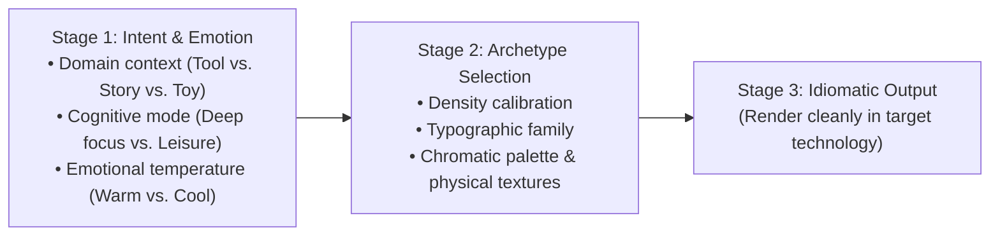

# Aesthetic Intent & Visual Archetypes

> **Mandate**: Great visual design begins with unambiguous intent. Never default to generic "AI template slop" (purple gradient, rounded pill, light gray 3-card grid). Articulate the domain intent, audience cognitive mode, and emotional temperature first, then select an aesthetic archetype that serves that mission.

---

## 1. The Two-Stage Execution Protocol

Before placing a single pixel or writing a line of UI code, execute this 2-stage mental model:



1. **Stage 1 · Articulate the Philosophy**:
   - What task is the human trying to accomplish? (e.g. "Rapidly scan 50 telemetry metrics without eye fatigue" vs. "Immerse in an editorial essay on architecture" vs. "Feel a sense of playful accomplishment completing a language drill").
   - What is the user's stress level? High stress requires high contrast, generous hit targets, and zero decorative distraction.
2. **Stage 2 · Anchor to an Archetype**:
   - Choose a cohesive visual world. An interface must speak with one consistent, confident aesthetic accent.

---

## 2. The 5 Core Visual Archetypes

The `design-philosophy` skill provides 5 distinct archetypal palettes. Each represents a proven visual tradition with its own internal rules:

```
┌─────────────────────────────────────────────────────────────────────────────┐
│                       THE 5 VISUAL ARCHETYPE WORLDS                         │
│                                                                             │
│  [ 1. Precision Cockpit ]             [ 2. Swiss Industrial ]               │
│  • Extreme functional density         • Stark monochrome contrast           │
│  • Monospaced tabular alignment       • Heavy grotesque sans-serifs         │
│  • Dark canvas, phosphor indicators   • Unapologetic geometric grid         │
│  • IDEs, DAWs, Bloomberg, CAD         • Braun, Nothing OS, Teenage Eng.     │
│                                                                             │
│  [ 3. Humanist Editorial ]            [ 4. Tactile & Playful ]              │
│  • Warm, organic paper tones          • Saturated accents & tactile depth   │
│  • Literary serif typography          • Bouncy spring micro-physics         │
│  • Generous reading measures          • Whimsical copy & celebrations       │
│  • Substack, Medium, NYT, Kindle      • Duolingo, Raycast, Linear confetti  │
│                                                                             │
│                    [ 5. Neo-Brutalist / Modern Raw ]                        │
│                    • High-contrast solid ink shadows                        │
│                    • Thick black structural rules                           │
│                    • Monospaced technical labels                            │
│                    • Figma marketing, Gumroad, Web3/DevTools                │
└─────────────────────────────────────────────────────────────────────────────┘
```

### Archetype 1 · Precision Cockpit (High-Density Professional)
* **Domain**: Software engineering tools, telemetry dashboards, audio workstations (DAWs), trading desks, CAD software.
* **Density**: Ultra-compact. Zero decorative padding. Every millimeter carries information.
* **Typography**: Highly legible sans-serif (e.g. Inter, SF Pro, Roboto) paired with a robust monospace for code, coordinates, and metrics (JetBrains Mono, SF Mono). Tabular numerals mandatory.
* **Color System**: Deep charcoal or OLED black canvas ($60\%$), muted zinc/slate chrome ($30\%$), bright phosphor/amber/cyan micro-accents strictly for active state and telemetry status ($10\%$).
* **Surfaces**: Flat, unbordered or 1px hairline dividers; negative space gutters used instead of nested cards.

### Archetype 2 · Swiss Industrial (Minimalist Honesty)
* **Domain**: Design systems, architectural portals, luxury hardware interfaces, high-end consumer technology.
* **Density**: Balanced. High structural negative space.
* **Typography**: Stark Grotesque or Neo-Grotesque sans-serif (Helvetica Neue, Neue Haas Grotesk, Akzidenz-Grotesk). High weight contrast (Black display headers paired with Light/Regular captions).
* **Color System**: Pure monochrome (white, deep black, stepped neutral grays). Zero color except for a single signature brand dot or physical LED indicator.
* **Surfaces**: Razor-sharp corners or subtle micro-radii ($2-4\text{px}$). Heavy reliance on asymmetric grid alignment and oversized typographic scale.

### Archetype 3 · Humanist Editorial (Longform & Thoughtful)
* **Domain**: Longform reading, blogging platforms, research papers, knowledge repositories, documentation hubs.
* **Density**: Expansive. Generous vertical breathing room.
* **Typography**: Elegant transitional or old-style Serif for prose (Charter, Merriweather, Georgia, Newsreader) paired with a clean geometric sans-serif for navigation.
* **Color System**: Warm, organic paper backgrounds (soft cream, parchment, warm linen `#FBFBF9`), deep ink typography (`#1A1A18`), warm amber/terracotta/forest green accents.
* **Surfaces**: Borderless. Flowing vertical rhythm. Line measure strictly capped at 60–70 characters.

### Archetype 4 · Tactile & Playful (Consumer Delight)
* **Domain**: Education apps, consumer habit trackers, creative tools, social experiences, onboarding wizards.
* **Density**: Comfortable to generous. Large, friendly touch targets.
* **Typography**: Rounded or geometric humanist sans-serif (Nunito, Poppins, circular grotesque).
* **Color System**: Cheerful, vibrant palette. Saturated primary colors (sunny yellow, cobalt blue, mint, coral) anchored by soft, warm neutral backgrounds.
* **Surfaces & Motion**: Soft pill corners ($12-24\text{px}$), tactile drop shadows with low blur and slight vertical offset (simulating physical tokens), bouncy spring easing curves ($300\text{ms}$ spring-damping physics), celebratory completion moments.

### Archetype 5 · Neo-Brutalist (Modern Raw)
* **Domain**: Developer tooling landing pages, creator commerce platforms, avant-garde portfolios, creative agency portals.
* **Density**: Punchy, bold, graphic.
* **Typography**: Heavyweights, monospaced headers, uppercase micro-labels, high contrast.
* **Color System**: Stark off-white canvas with bright saturated collisions (electric lime, hot magenta, safety orange), framed by dense jet-black outlines (`#000000`).
* **Surfaces**: Solid drop shadows ($3-4\text{px}$ offset with 0px blur, `#000`), heavy $2\text{px}$ borders, intentional grid collisions, raw mechanical honesty.

---

## 3. Archetype Decision Matrix

| Criterion | Precision Cockpit | Swiss Industrial | Humanist Editorial | Tactile & Playful | Neo-Brutalist |
| :--- | :--- | :--- | :--- | :--- | :--- |
| **User State** | Focused, high urgency | Deliberate, analytical | Reflective, immersive | Casual, engaged | Curious, energetic |
| **Base Spacing $U$** | $4\text{px}$ | $8\text{px}$ | $8\text{px}$ | $8\text{px}$ | $4\text{px} / 8\text{px}$ |
| **Corner Radius** | $0-3\text{px}$ | $0-4\text{px}$ | $0-4\text{px}$ | $12-24\text{px}$ / Pill | $0-4\text{px}$ |
| **Shadow Style** | None / Subtle 1px ring | None / Deep diffuse ambient | Soft elevation | Hard pill drop / Toy depth | Solid 0-blur hard offset |
| **Numeric Style** | Tabular Monospace | Neutral Grotesque | Proportional Old-Style | Rounded Semibold | Chunky Monospace |

---

## 4. Emotional Temperature & The "AI Tell" Antidote

### The "AI Tell" Syndrome
LLMs naturally gravitate toward a homogenized "Corporate SaaS Midjourney" aesthetic:
- Gradient backgrounds (specifically purple-to-blue or pink-to-orange).
- Over-rounded pills on every container.
- Floating translucent glassmorphism that destroys text readability.
- Meaningless abstract floating 3D spheres or sparkles.

### The Antidote: Commitment to Aesthetic Contrast
To break out of the AI default:
1. **Commit fully to your chosen archetype**: If you choose Swiss, be ruthlessly minimal. If you choose Playful, make the buttons physically tactile and delightfully responsive. If you choose Cockpit, pack the data with monospaced surgical clarity.
2. **Never mix incompatible visual languages**: Do not put bouncy pill-shaped cartoon buttons inside a Bloomberg financial terminal; do not put sterile 10pt monospace tables inside a warm children's storytelling app.
