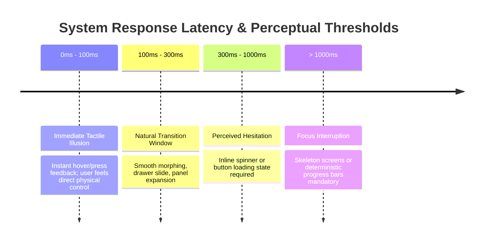
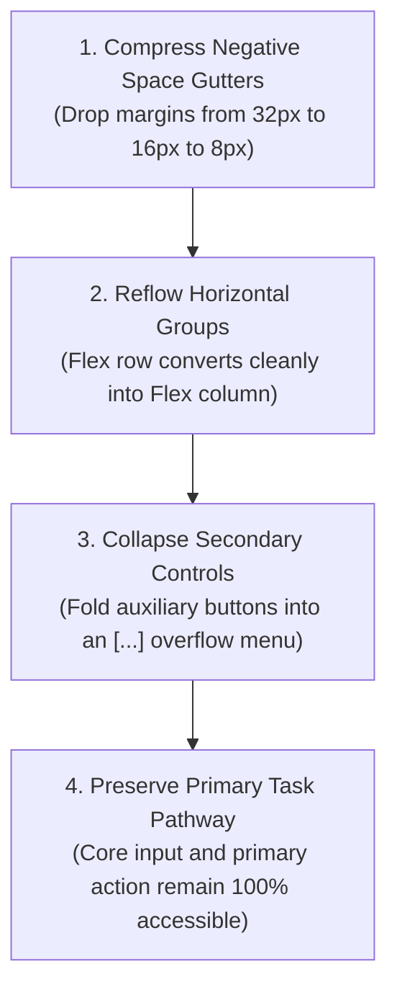

# State Continuum & Fluidity Mechanics

> **Mandate**: Software is not a static picture; it is a living state machine that exists across dimensions of time, network latency, and physical screen dimensions. Eliminate static canvas assumptions, prevent context bloat via scaled state scoping, and build elastic interfaces that survive dynamic content stress.

---

## 1. Scaled State Scoping (The 3-Tier State Matrix)

To prevent cognitive bloat and token exhaustion, never generate exhaustive 9-state state machines for trivial controls. Map components to their appropriate operational risk tier:

```
┌─────────────────────────────────────────────────────────────────────────────┐
│                           THE SCALED STATE TIERS                            │
│                                                                             │
│   [ Tier 1: Leaf Controls ]          [ Tier 2: Interactive Inputs ]         │
│   • Idle / Resting                   • Idle / Resting                       │
│   • Hover / Focus / Active           • Focused / Editing                    │
│   • Disabled                         • Populated / Valid                    │
│   (Buttons, badges, toggles)         • Validating / Pending                 │
│                                      • Invalid / Error                      │
│                                      (Text inputs, dropdowns, datepickers)  │
│                                                                             │
│               [ Tier 3: Async Boundaries & Full Screens ]                   │
│               • Pristine / Uninitialized                                    │
│               • Loading / Skeleton Placeholder                              │
│               • Populated / Happy Path                                      │
│               • Empty State / On-Ramp with Primary Action                   │
│               • Partial / Degraded Network Mode                             │
│               • Fatal Error with Retry Action                               │
│               (Dashboards, data tables, checkout screens)                   │
└─────────────────────────────────────────────────────────────────────────────┘
```

### When to Invoke the Full 9-State Matrix
Reserve the complete 9-state formal specification exclusively for **mission-critical transactional workflows**:
* Financial checkouts and payment processing
* Multi-step cloud provisioning wizards
* Medical dose calculators or telemetry feeds
* Complex authentication and password recovery funnels

---

## 2. Feedback Latency Physics

Human perception of time dictates strict thresholds for system responsiveness:



### Rules of Latency Engineering:
1. **$\le 100\text{ms}$ (Instant Tactile Illusion)**:
   - Button press states, checkbox toggles, and focus rings must trigger within $100\text{ms}$. If feedback takes longer, users subconsciously double-click, causing duplicate submissions.
2. **$100\text{ms} - 300\text{ms}$ (Natural Animation)**:
   - Use cubic-bezier easing or spring-damping curves (`ease-out`, `cubic-bezier(0.16, 1, 0.3, 1)`). Avoid linear animations—physical objects in the real world never accelerate or stop instantaneously.
3. **$\ge 1000\text{ms}$ (Deep Asynchronous Boundary)**:
   - Never freeze the user interface. Display a non-shifting **skeleton screen** that mirrors the final layout geometry, preventing jarring Content Layout Shifts (CLS) when data arrives.

---

## 3. The Empty State Contract

An empty state is an opportunity, not a dead end. Never show a blank screen or a sterile "No data found."

```
// ❌ BAD: Dead End
┌────────────────────────────────────────────────────────┐
│ No projects found.                                     │
└────────────────────────────────────────────────────────┘

// ✅ GOOD: The Helpful On-Ramp
┌────────────────────────────────────────────────────────┐
│                   [ Folder Icon ]                      │
│                No Active Projects Yet                  │
│   Create your first project to start tracking tasks,   │
│   collaborating with your team, and managing sprints.  │
│                                                        │
│               [ + Create First Project ]               │
│              or [ Import from GitHub → ]               │
└────────────────────────────────────────────────────────┘
```

*Every empty state must contain*:
1. **Visual Anchor**: An unpretentious, relevant icon or subtle illustration.
2. **Contextual Explanation**: What goes here and why it is currently empty.
3. **Primary Action**: A high-prominence on-ramp trigger to create the first item.
4. **Alternative Path**: Optional secondary import or documentation link.

---

## 4. Fluidity & Elastic Reflow Dynamics

Never design for a single frozen viewport dimension. Every interface must obey the **3 Stress Invariants**:

### Invariant 1 · The 3x Content Expansion Test
User-generated strings are unpredictable. A user's name can be "Jo" or "Dr. Wolfeschlegelsteinhausenbergerdorff Jr."
* **The Rule**: Every container must have explicit overflow rules:
  - *Body / Descriptions*: Allow natural vertical expansion; never set fixed pixel heights (`height: 200px` is banned).
  - *Titles / Table Cells*: Explicitly declare wrapping behavior (`break-words`) or purposeful truncation with full text revealed on hover/focus tooltip (`text-overflow: ellipsis`).

### Invariant 2 · Translation Expansion Invariance
Text translated from English to German, French, or Spanish expands by **$20\% - 40\%$** in character length on average.
* **The Rule**: Ensure navigation bars, tabs, and action buttons have at least $30\%$ horizontal breathing room before colliding or wrapping awkwardly.

### Invariant 3 · The 200% Accessibility Zoom Test
Under WCAG 2.2 criteria, when a user magnifies the screen font to $200\%$:
* Content must reflow into a single vertical column without requiring two-dimensional (horizontal and vertical) scrolling.
* Sticky navigation headers must gracefully compact or unpin to prevent consuming half the viewport height.

### The Priority-Based Reflow Ladder
When horizontal viewport width is constrained:

