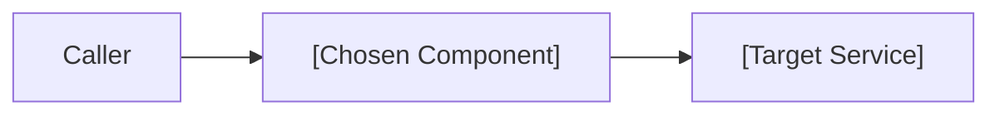

# Architecture Decision Record (ADR) Template

Use this template when authoring Architecture Decision Records (ADRs). Store records under `docs/adr/` with numeric prefixes (e.g., `0001-record-architecture-decisions.md`).

---

```markdown
# ADR-[NUMBER]: [Short, Descriptive Title of Decision]

## Metadata
- **Status**: [Proposed | Accepted | Superseded by ADR-XXXX | Deprecated]
- **Date**: YYYY-MM-DD
- **Deciders**: [List of engineers/stakeholders involved]
- **Consulted**: [Domain experts consulted]
- **Informed**: [Teams notified]

---

## 1. Context and Problem Statement
[Describe the context, technical challenge, constraints, and driving factors behind this decision. What problem are we solving? What invariants must be preserved?]

---

## 2. Decision Drivers
- [Driver 1: e.g., Low-latency query requirement (< 50ms)]
- [Driver 2: e.g., Zero external cloud dependencies for local dev]
- [Driver 3: e.g., Maintainability and standard TypeScript tooling]

---

## 3. Considered Options
1. **Option A**: [Short description]
2. **Option B**: [Short description]
3. **Option C**: [Short description]

---

## 4. Decision Outcome & Rationale
Chosen Option: **[Option A]**, because:
[Detailed technical rationale explaining why this option best addresses the problem statement and drivers compared to alternatives.]

### Architecture Diagram


---

## 5. Pros and Cons of Options

### Option A: [Chosen Option]
- **Good**: [Positive aspect / benefit]
- **Good**: [Positive aspect / benefit]
- **Bad**: [Trade-off or downside to mitigate]

### Option B: [Alternative Option]
- **Good**: [Positive aspect]
- **Bad**: [Reason for rejection]

---

## 6. Consequences & Follow-Ups

### Positive Consequences
- [Immediate benefit, e.g., Simplifies client payload]

### Negative Consequences / Trade-offs
- [Technical debt, migration effort, or operational overhead accepted]

### Mitigation & Implementation Plan
- [ ] [Task 1: Migration script or schema update]
- [ ] [Task 2: Update integration tests]
- [ ] [Task 3: Update documentation and runbooks]
```
