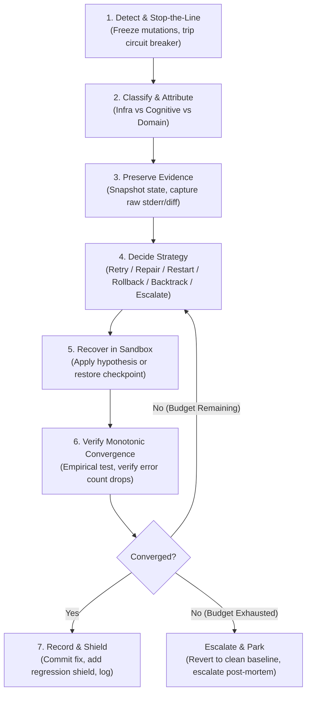

# Failure Recovery: Universal Resilience & Self-Healing Protocol

> **Mandate**: *Recovery is an active decision problem, not a passive retry loop.* Never mutate state without evidence preservation; never retry without a revised hypothesis; and always maintain an atomic rollback path to a known-clean baseline. Recovery must guarantee monotonic convergence toward correctness without weakening test assertions or masking failure signals.

---

## 1 · The 7-Phase Failure Recovery Lifecycle

Every failure, exception, test breakage, or operational anomaly traverses this 7-phase protocol:



1. **Phase 1 — Detect & Stop-the-Line (Jidoka)**: The instant an error, test failure, compilation break, or stall occurs, halt all forward mutations immediately. Freeze speculative file edits. Prevent compounding damage.
2. **Phase 2 — Classify & Attribute (Three-Tier Attribution)**: Disentangle the failure into its true operational layer: **Infrastructure/Runtime (Layer 0)**, **Cognitive/Agent (Layer 1)**, or **Domain/Task (Layer 2)**, and determine whether the fault is transient or deterministic.
3. **Phase 3 — Preserve Evidence**: Record exact stderr/stdout streams, exit codes, and environment deltas. Compute the normalized error signature hash $H(E)$. Establish a recovery checkpoint (Git worktree/stash or filesystem snapshot).
4. **Phase 4 — Decide Strategy (The 6-Fork Decision Lattice)**: Map the classified fault to the optimal recovery path: `Retry`, `Repair`, `Restart`, `Rollback`, `Backtrack`, or `Escalate`. Never default to a blind retry.
5. **Phase 5 — Recover in Sandbox**: Execute the chosen strategy inside an isolated unit of work (sandbox, branch, or transactional scratchpad). Formulate an explicit causal hypothesis before touching code.
6. **Phase 6 — Verify Monotonic Convergence**: Empirically verify the outcome ($||E_{t+1}|| < ||E_t||$). Forbid false convergence (never delete or weaken assertions). Detect oscillations ($H(E_t) == H(E_{t-2})$) and trip circuit breakers.
7. **Phase 7 — Record & Shield**: Commit the verified state atomically. Convert the minimal reproduction into a permanent regression shield. Prune transient snapshots and release recovery locks.

---

## 2 · Progressive Disclosure (Reference Routing)

To prevent cognitive overload and preserve LLM context bandwidth, **never load all reference manuals simultaneously**. Consult reference manuals strictly on demand based on task context:

| Context Trigger | Mandatory Reference Manual | Purpose |
| :--- | :--- | :--- |
| **Strategy selection, retry limits, soft/hard restarts, parking, escalation** | [`references/decision-lattice-and-escalation.md`](references/decision-lattice-and-escalation.md) | Algorithmic rules for 6-Fork choices, finite recovery budgets ($N \le 3$), `needs_attention` queue, escalation payloads. |
| **Checkpoints, snapshots, diffs, surgical undo, git worktrees, rollbacks** | [`references/transactional-sandboxing-and-rollback.md`](references/transactional-sandboxing-and-rollback.md) | Multi-tier snapshotting (Git/FS/Memory), Unit-of-Work pattern, non-destructive surgical reverts, compensating Sagas. |
| **Root cause diagnosis, reproduction harnesses, error hashing, Heisenbugs** | [`references/root-cause-debugging-and-convergence.md`](references/root-cause-debugging-and-convergence.md) | Jidoka protocol, error signature hashing $H(E)$, oscillation tripping, Lyapunov convergence, statistical seed pinning. |
| **Flawed architectural premise, wrong library, invalid schema assumption** | [`references/upstream-backtracking-and-assumption-graphs.md`](references/upstream-backtracking-and-assumption-graphs.md) | Assumption dependency DAGs, detecting the "wrong mountain", bounded backtrack horizon ($K \le 2$), forward re-derivation. |
| **Context saturation, token bloat, crashed subagents, orphan worktrees** | [`references/session-state-and-cross-worktree-resilience.md`](references/session-state-and-cross-worktree-resilience.md) | Transcript compaction, Restore vs Recompute economics, orphan worktree triage, crash-resilient session manifests. |
| **Attributing errors, rate limits vs code bugs, tool schema mismatches, health** | [`references/three-tier-fault-attribution-and-telemetry.md`](references/three-tier-fault-attribution-and-telemetry.md) | Tri-Layer Fault Matrix (Infra vs Cognitive vs Domain), 5-step fast triage, anti-hallucination guard, health telemetry. |

---

## 3 · Adaptive Cognitive Sizing (The 6 Execution Modes)

Size your recovery protocol to the scope, risk, and blast radius of the failure. Do not generate verbose bureaucracy for single-line typos, and never skip transactional scaffolding for multi-file refactors:

| Mode | Trigger & Scope | Recovery Protocol | Required Documentation |
| :--- | :--- | :--- | :--- |
| **`micro-fix`** | Single-line typo, missing import, trivial syntax or lint error ($< 5$ lines). | In-place repair, local scoped re-verification. **Zero boilerplate**. | **3-Line Recovery Intent** block directly preceding code edit. |
| **`transactional-unit`** | Multi-file feature edit, refactor, API contract change with risk of broken state. | Pre-mutation checkpoint, isolated sandbox execution, auto-rollback on failure, atomic commit on green. | Checkpoint tag + structured commit message. |
| **`subagent-recovery`** | Delegated worker stall, hallucination, contract breach, or subagent crash. | Soft/Hard restart ladder, context compaction, worktree re-spawn, `needs_attention` queue. | Worker diagnostic post-mortem in orchestrator transcript. |
| **`backtrack-pivot`** | Invalid architectural premise, wrong library chosen, fundamental spec mismatch. | Assumption DAG walk, derived artifact pruning, checkpoint rollback, re-plan from fork ($K \le 2$). | `RECOVERY_PIVOT.md` (Invalidated premise $\to$ new hypothesis $\to$ pruned artifacts). |
| **`session-rescue`** | Agent context saturation ($> 80\%$ window), process crash, orphan worktrees. | Transcript compaction, stale log purging, orphan worktree triage, Restore vs Recompute execution. | Clean session resumption header. |
| **`forensic-audit`** | Flaky/intermittent test (Heisenbug), production incident, memory leak, race condition. | Stop-the-line diagnostic capture, statistical repetition harness ($N \ge 5$), binary search bisect, permanent shield. | `POST_MORTEM.md` (Timeline, root cause, proof of resolution, regression shield). |

### The 3-Line Recovery Intent Protocol (For `micro-fix` Mode)
To eliminate bureaucratic overhead on small, deterministic fixes, summarize intent in exactly 3 lines directly before emitting the edit:
```markdown
> **Defect**: [Precise causal defect, e.g., missing import for `Path` in utils.py]
> **Hypothesis**: [Why this edit resolves the defect without side effects]
> **Verification**: [Deterministic command run to confirm, e.g., `pytest tests/test_utils.py`]
```

---

## 4 · The 7 Universal Failure Recovery Invariants

Regardless of language, framework, or execution runtime, every resilient computational system upholds these 7 timeless invariants:

### 4.1 Invariant 1: Decision Primacy over Retry Loops (Anti-Thrashing Law)
Repeating a failed operation without a revised hypothesis, a modified environment, or an altered state is non-deterministic gambling. An agent must never execute an identical mutation or tool call repeatedly. Every recovery intervention must explicitly select from the 6-Fork Decision Lattice based on causal classification.

### 4.2 Invariant 2: Forensic Evidence Preservation (The Stop-the-Line Rule)
Before mutating code, cleaning directories, or re-running destructive commands, the agent must preserve the failure signature, exit codes, stderr/stdout streams, call stacks, and working diff. Never destroy forensic evidence in a rush to fix.

### 4.3 Invariant 3: Transactional Boundary & State Reversibility
Every multi-file edit, risky refactor, or complex tool execution must be treated as an atomic unit of work with a defined checkpoint. If an intervention fails to converge, the system must cleanly restore the pre-transaction baseline without leaving orphan debris or half-mutated files.

### 4.4 Invariant 4: Three-Tier Orthogonal Fault Attribution
A failure must be attributed to its true operational origin before taking action:
* **Infrastructure/Runtime (Layer 0)**: Timeouts, network drops, rate limits (429), OOM, tool process segfaults.
* **Cognitive/Agent (Layer 1)**: Malformed tool calls, schema violations, hallucinated arguments, context window overflow.
* **Domain/Task (Layer 2)**: Failing unit tests, compilation errors, business logic defects, domain contract violations.  
*Rule*: Never mutate application code (Layer 2) to fix an infrastructure blip (Layer 0) or an agent schema mistake (Layer 1).

### 4.5 Invariant 5: Semantic Monotonic Convergence (The Metric of Progress)
Every recovery step must measurably shrink the error surface, reduce the remaining failure count, or increase diagnostic certainty:
$$||E_{t+1}|| < ||E_t|| \quad \text{and} \quad H(E_{t+1}) \neq H(E_t)$$
*Anti-False-Convergence*: Deleting tests, commenting out assertions, or adding empty `catch` blocks to artificially silence errors is strictly forbidden. Error reduction must reflect real behavioral correction.

### 4.6 Invariant 6: Upstream Assumption Invalidation (The Backtrack Law)
When a downstream operation fails due to an invalid upstream premise (e.g., wrong API contract, incompatible library choice, faulty schema model), patching downstream symptoms is forbidden. The agent must backtrack to the root premise, prune derived artifacts, and re-derive forward. Backtracking depth is bounded by $K \le 2$ ancestor nodes before escalating.

### 4.7 Invariant 7: Bounded Recovery Budgets & Non-Violent Escalation
Recovery efforts must operate under finite attempt ($N_{max} \le 3$), time, and token budgets. When budgets expire, mutations cease, state is pinned/parked safely in the `needs_attention` queue, and a structured post-mortem is escalated without corrupting project state.

---

## 5 · The Invariant Exception Protocol (Irreversible Operations)

When an agent interacts with external, physical, or distributed systems where state cannot be rolled back via local disk or Git (e.g., external REST APIs, sending emails/webhooks, charging payment cards, irreversible database migrations with data drops):

> [!CAUTION] INVARIANT EXCEPTION PROTOCOL
> An agent may execute an operation that violates local state reversibility **IF AND ONLY IF**:
> 1. **Explicit Human Confirmation Gate**: Details the exact blast radius, cost, and irreversibility to the user before execution.
> 2. **Pre-Registered Compensating Action (Saga Pattern)**: Declares the inverse compensating action (e.g., `ArchiveRecord` if `CreateRecord` cannot be rolled back).
> 3. **Mandatory Idempotency Keys**: Attaches unique idempotency tokens to prevent duplicate side-effects during retries.

---

## 6 · Universal Archetype Adaptation

The 7 invariants adapt dynamically across every software archetype:

* **Modular Monoliths & Monorepos**: Execute recovery inside ephemeral Git branches or worktrees; revert toxic PRs via atomic branch reset; verify regressions across workspace dependency graphs.
* **Distributed Cloud & Microservices**: Use exponential jittered backoff on network timeouts; implement circuit breakers for downstream services; enforce Saga compensation for multi-service transactions.
* **Legacy & Zero-Test Codebases**: Pin baseline behavior by generating temporary black-box characterization tests before mutating code; use filesystem snapshots if Git is absent.
* **Embedded, Systems & CLI Tools**: Attribute failures against hardware limits (RAM, stack depth, register bounds); isolate POSIX signal handling from core logic; verify process exit codes deterministically.
* **Data, ML & Notebook Pipelines**: Checkpoint intermediate tensors/dataframes to disk before long training runs; decouple deterministic data transforms from non-deterministic model weights; isolate data corruption.
* **Autonomous AI Agents & Swarms**: Apply the Soft/Hard restart ladder; isolate subagent mutations in separate worktrees; enforce anti-false-success gates; park blocked tasks in `needs_attention`.

---

## 7 · Guardrails & Anti-Patterns

### 7.1 Strictly Disallowed Actions
- ❌ **No Blind Retrying**: Never rerun a failed command or re-prompt an agent without changing inputs, clearing corrupted state, or adopting a new hypothesis.
- ❌ **No Test Assertion Weakening**: Never delete, comment out, or loosen existing test assertions to make a build pass without explicit written user authorization.
- ❌ **No Catastrophic Full Resets**: Never execute `git reset --hard` across an entire repository without stashing or preserving valid uncommitted progress.
- ❌ **No Error Masking**: Never wrap failing code in catch-all blocks (`catch (...) {}` or `except: pass`) that hide root causes.
- ❌ **No Layer-Confused Code Mutations**: Never modify project source code when the error is an infrastructure timeout, rate limit, or tool schema mismatch.
- ❌ **No Infinite Assumption Regress**: Never backtrack past the user's explicit objective ($K > 2$) without asking for clarification.

---

## 8 · The Clean Recovery Stopping Contract

A failure recovery task is strictly **COMPLETE** only when:
1. **Root Cause Empirically Proven**: The causal defect is identified and documented, not guessed.
2. **Deterministic Baseline Restored**: The system compiles cleanly, and all pre-existing tests pass without regression.
3. **Regression Shield Committed**: A dedicated test (unit, integration, or property test) is committed that reliably reproduces the defect when unpatched and passes cleanly with the patch.
4. **Transient State Cleaned**: Sandboxes, temporary stashes, scratch reproduction scripts, and orphan worktrees are pruned.
5. **Zero Masked Failures**: No swallowed exceptions, skipped tests, or false-positive assertions remain in the codebase.
