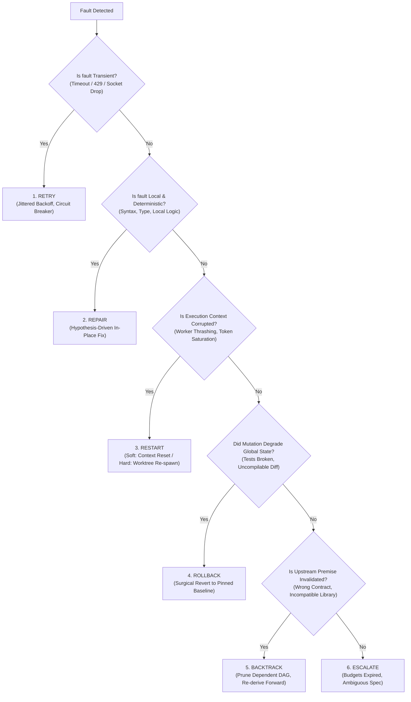
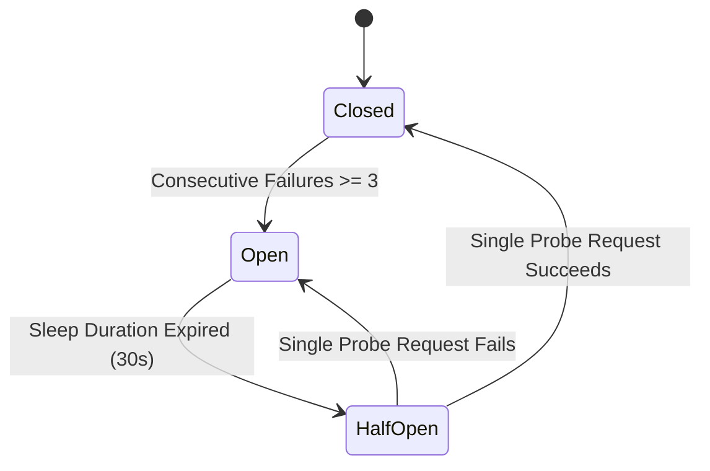
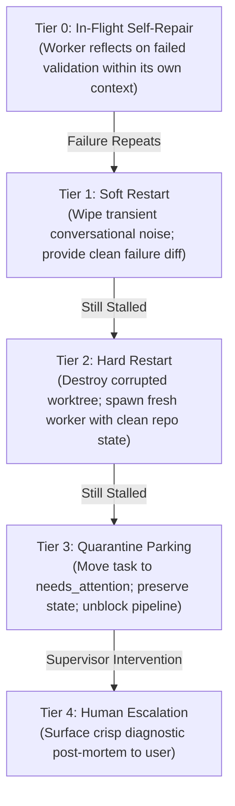

# The 6-Fork Decision Lattice & Bounded Escalation Protocol

> **Mandate**: *Recovery is a multi-dimensional decision problem, not a single retry loop.* Repeating a failed action without an altered state, updated hypothesis, or changed environment is non-deterministic gambling. Every failure must be routed through the 6-Fork Decision Lattice, bounded by finite recovery budgets, and escalated cleanly without corrupting the broader system.

---

## 1 · The 6-Fork Decision Lattice

When an execution breaks, validation fails, or an anomaly is detected, evaluate the fault against these mathematical and causal criteria:



### Mathematical Selection Matrix

| Fork | Necessary & Sufficient Conditions | Required Recovery Action | Maximum Budget |
| :--- | :--- | :--- | :--- |
| **`Retry`** | $P(\text{Transient}) \approx 1 \land \text{Idempotent}(\text{Op}) \land \text{Attempt} < N_{retry}$ | Apply exponential backoff with full jitter. Check circuit breaker state. | $N_{retry} \le 3$, $T_{wait} \le 30\text{s}$ |
| **`Repair`** | $P(\text{Deterministic}) \approx 1 \land \text{BlastRadius} \le 3 \text{ files} \land \text{Valid}(\text{Premise})$ | Formulate causal hypothesis. Apply minimal in-place edit within sandbox. Verify regression. | $N_{repair} \le 3$ attempts |
| **`Restart`** | $\text{WorkerStalled} \lor \text{TokenExhausted} \lor \text{Thrashing}(\text{Diffs})$ | Soft restart: Reset memory/transcript. Hard restart: Re-clone worktree from base commit. | 1 Soft, then 1 Hard |
| **`Rollback`** | $||E_{t+1}|| > ||E_t|| \lor \text{Uncompilable} \lor \text{ToxicDiff}$ | Discard uncommitted mutations via surgical delta rollback. Restore pinned checkpoint. | Immediate on degradation |
| **`Backtrack`** | $\text{PremiseFalsified}(\text{Root}) \land \text{Depth}(K) \le 2$ | Invalidate downstream derived artifacts in DAG. Re-plan from branching node with new premise. | $K \le 2$ ancestor steps |
| **`Escalate`** | $\sum \text{Attempts} \ge \text{Budget} \lor \text{ContradictorySpec} \lor \text{SafetyBreach}$ | Freeze all mutations. Park state in `needs_attention`. Emit structured post-mortem payload. | Deterministic exit |

---

## 2 · Retry Mechanics: Jittered Exponential Backoff

For transient faults (rate limits, network timeouts, temporary file locks), blind instantaneous retries cause **thundering herds** and self-inflicted denial-of-service.

Retries must apply **Decorrelated Full Jitter**:
$$T_{wait} = \min\left(T_{max}, \; U\left(0, \; T_{base} \cdot 2^{\text{attempt}}\right)\right)$$

Where:
* $T_{base} = 500\text{ms}$ (default base delay).
* $T_{max} = 30\text{s}$ (hard upper ceiling).
* $U(0, X)$ is a uniform random distribution between $0$ and $X$.

### Circuit Breaker States

* **Closed**: Requests flow normally. Failures increment error counter.
* **Open**: Fast-fail immediately without network call. Returns fallback response or triggers degraded mode.
* **Half-Open**: Allows exactly one canary request to test recovery.

---

## 3 · The 4-Tier Subagent Escalation Ladder

When supervising autonomous subagents or background workers, apply this graduated recovery ladder:



### Tier Protocol Specifications
1. **Tier 0 (In-Flight Self-Repair)**: Worker receives the exact stderr and validation failure. Worker has 1 attempt to adjust code locally.
2. **Tier 1 (Soft Restart)**: If worker repeats the error, wipe the worker's chat transcript. The orchestrator re-dispatches the worker with:
   - The original immutable task contract.
   - A 5-line structured summary of what failed previously.
   - The clean starting diff.
3. **Tier 2 (Hard Restart)**: If the worker remains blocked or produces a toxic workspace state:
   - Terminate worker process.
   - Delete the worker's Git worktree / shadow directory.
   - Create a fresh worktree checked out to the clean parent baseline.
   - Dispatch a new worker with an alternative architectural prompt or simplified scope.
4. **Tier 3 (Quarantine Parking — `needs_attention`)**:
   - If Tier 2 fails, the orchestrator **parks** the task in the `needs_attention` queue.
   - The worker is retired; system resources are freed.
   - Parallel tasks continue unaffected (zero pipeline deadlock).
5. **Tier 4 (Human Escalation)**: If no automated path remains, escalate to the human supervisor with the Escalation Payload.

---

## 4 · The `needs_attention` Parking Pattern

In multi-agent or concurrent workflows, an unresolvable failure in one module must **never block independent concurrent workers**.

### Quarantine Data Schema (`.recovery/needs_attention.json`)
```json
{
  "task_id": "auth-jwt-refresh-worker",
  "status": "PARKED",
  "timestamp": "2026-09-25T12:00:00Z",
  "attempts_exhausted": 3,
  "last_fault_class": "DOMAIN_INVARIANT_BREACH",
  "error_signature_hash": "e7b89f2a4c",
  "quarantine_worktree": ".worktrees/quarantine-auth-jwt",
  "blocking_dependencies": ["api-gateway-routes"],
  "summary": "JWT refresh token rotation failed concurrency test under 50 simultaneous requests. Race condition detected on token revocation store.",
  "recommended_action": "Requires architectural decision: Redis distributed lock vs Database row-level locking."
}
```

The orchestrator proceeds with other independent branches, ensuring partial progress is never bottlenecked.

---

## 5 · Escalation Payload Schema

When automated recovery exhausts budgets or hits an immutable constraint, output this high-signal, zero-fluff diagnostic summary:

```markdown
### 🚨 Failure Escalation Report

**Task ID**: `[Task Name / Symbol]`  
**Status**: `ESCALATED (Budget Exhausted / Spec Ambiguity / Safety Gate)`  
**Fault Classification**: `[Infrastructure / Cognitive / Domain]`  

#### 1. What Was Attempted
- **Baseline**: Commit `[hash]` / State `[ID]`
- **Attempt 1 (Repair)**: Applied `[Hypothesis 1]` ➔ Result: `[Error A]`
- **Attempt 2 (Soft Restart)**: Compaction & re-prompt ➔ Result: `[Error A repeated - Oscillation]`
- **Attempt 3 (Hard Restart)**: Fresh worktree checkout ➔ Result: `[Error B / Deadlock]`

#### 2. Root Cause Evidence
- **Minimal Repro**: `[Exact command to reproduce]`
- **Causal Defect**: `[Precise line/symbol or architectural constraint triggering failure]`
- **Error Signature**: `[Normalized error message & stack trace snippet]`

#### 3. State Preservation
- **Preserved Diff**: Saved in branch `recovery/[task-id]-quarantine`
- **Active Baseline**: Reverted cleanly to `[hash]`; working tree is clean.

#### 4. Decision Required from User
1. **Option A (Recommended)**: `[Action, e.g., Relax constraint / Change DB schema]`
2. **Option B**: `[Alternative, e.g., Drop feature / Use simpler in-memory store]`
```
