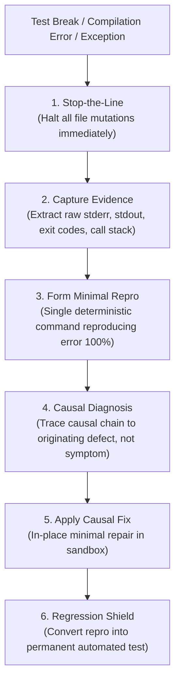
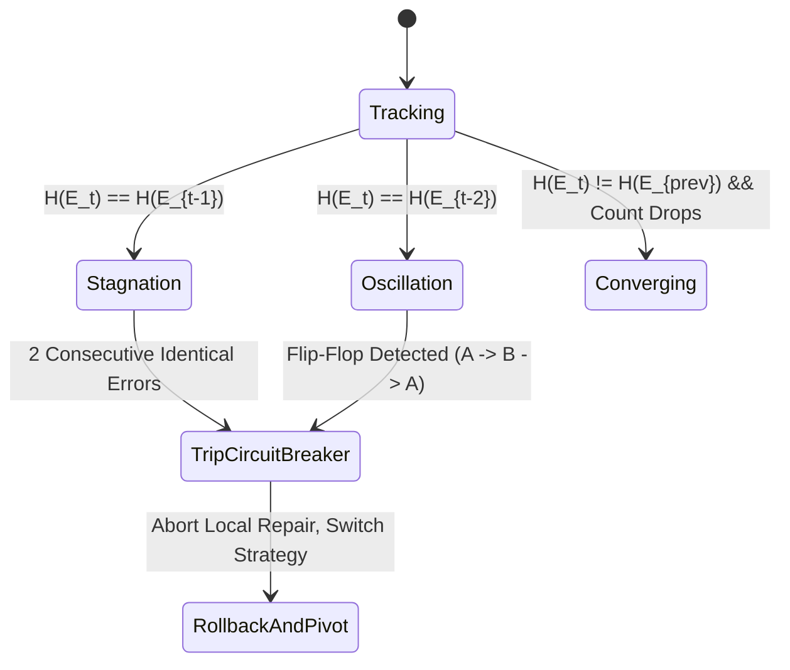
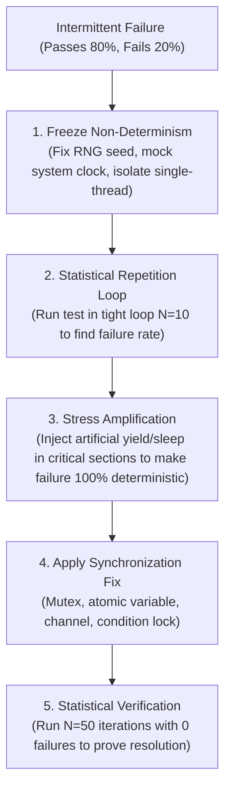

# Root-Cause Debugging, Error Signatures & Monotonic Convergence

> **Mandate**: *Never treat symptoms when you can cure the disease; never measure progress by silenced errors.* Debugging is a forensic investigation governed by evidence, not speculative guessing. Every fix must prove monotonic convergence toward correctness without deleting test assertions, masking exceptions, or falling into cyclic oscillation traps.

---

## 1 · The Stop-the-Line (Jidoka) Protocol

The instant an error or broken test occurs, invoke the Toyota Production System principle of **Jidoka (Stop-the-Line)**:



### The 4 Non-Negotiable Forensic Questions
Before modifying any line of code, answer these four questions in thought or log:
1. **What is the exact observed behavior?** (The raw failure output, not a summary).
2. **What was the expected behavior?** (The exact invariant or assertion breached).
3. **What is the minimal execution path that triggers it?** (The single test, CLI command, or input).
4. **Why did the system take this path?** (The causal defect, not the superficial symptom).

---

## 2 · Error Signature Hashing & Anti-Thrashing

To prevent agents from spinning in circles (changing code back and forth between two invalid states), compute an **Error Signature Hash**:

$$H(E) = \text{MD5}\Big(\text{Normalize}(\text{ErrorClass}) + \text{Normalize}(\text{NormalizedStackTrace}) + \text{Normalize}(\text{SourceFile})\Big)$$

### Error Normalization Rules
Before hashing, strip dynamic, non-deterministic noise:
* Strip memory addresses (`0x7fff5fbff820` $\to$ `0xADDR`).
* Strip variable line numbers if diff shifted them (`line 142` $\to$ `line N`).
* Strip execution timestamps and durations (`took 0.42s` $\to$ `[TIME]`).

### Oscillation Detection & Circuit Breaker
Track the history of error signatures: $[H(E_0), H(E_1), H(E_2), \dots]$



* **Stagnation Trap**: If $H(E_t) == H(E_{t-1})$, your previous edit did nothing to address the root cause. **Forbid a 3rd identical attempt**.
* **Oscillation Trap**: If $H(E_t) == H(E_{t-2})$, you are flipping between two conflicting invalid states. **Immediately rollback both edits and switch to `Backtrack` or `Restart`**.

---

## 3 · Monotonic Convergence Verification (Lyapunov Metric)

In control theory, a system is stable if its energy function (Lyapunov function) strictly decreases over time. In software recovery:

$$\Delta(t) = \text{FailingTests}(t) + \text{StaticTypeErrors}(t) + \text{LintViolations}(t)$$

### The Convergence Law
A recovery step is valid **IF AND ONLY IF**:
$$\Delta(t+1) < \Delta(t) \quad \lor \quad \Big(\Delta(t+1) == \Delta(t) \land \text{InformationEntropyIncreased}\Big)$$

If $\Delta(t+1) > \Delta(t)$ (your fix broke additional tests or added new compilation errors), the step is **divergent**. You must instantly invoke `Rollback` to state $t$ before attempting another hypothesis.

### The Semantic Invariant Rule (Anti-Goodhart Shield)
> *Goodhart's Law: "When a measure becomes a target, it ceases to be a good measure."*

An agent must **never** reduce $\Delta(t)$ by:
* Deleting failing test cases.
* Commenting out assertions.
* Changing test expectations from `assert result == 42` to `assert result is not None`.
* Catching and swallowing exceptions (`except Exception: pass`).

Any error reduction achieved by weakening assertions is **false convergence** and constitutes a critical failure.

---

## 4 · Statistical Pinning for Heisenbugs & Race Conditions

When a test or bug is non-deterministic (fails intermittently, timing-dependent, concurrency race):



### The 5-Step Statistical Pinning Protocol
1. **Freeze Seeds**: Set explicit random seeds (`random.seed(42)`, `srand(42)`).
2. **Mock Clocks**: Replace real-time delays with deterministic virtual clocks.
3. **Stress Amplification**: If a race condition only occurs under load, amplify it by injecting synthetic micro-delays (`sleep(0.01)`) inside the suspected critical section until the bug fails 100% of the time.
4. **Fix Synchronization**: Address the concurrency flaw using language-appropriate primitives (locks, channels, atomics, or thread-safe queues).
5. **Statistical Verification**: Run the verification harness for $N=50$ continuous iterations. If any single run fails, the bug is un-fixed.

---

## 5 · The Permanent Regression Shield

A bug fix is incomplete until a permanent automated regression test is added:

### Anatomy of a High-Quality Regression Shield
```python
def test_regression_issue_482_jwt_expiry_under_clock_skew():
    """
    Regression shield for Issue #482.
    Root Cause: Token validator rejected valid JWTs when server clock was 
    skewed by < 5 seconds because leeway was set to 0.
    Verification: Confirms leeway tolerance allows 5s drift without false rejection.
    """
    # 1. Arrange: Recreate exact failure preconditions
    skewed_clock = MockClock(now=1700000000)
    token = generate_token_expiring_at(1700000002) # Expires in 2s
    
    # 2. Act: Advance clock past expiration by 1s (drift window)
    skewed_clock.advance(seconds=3)
    validator = TokenValidator(clock=skewed_clock, clock_skew_leeway_seconds=5)
    
    # 3. Assert: Must pass with leeway (previously failed with TokenExpiredException)
    result = validator.verify(token)
    assert result.is_valid is True
```

The regression shield ensures the bug can never re-enter the codebase unnoticed.
