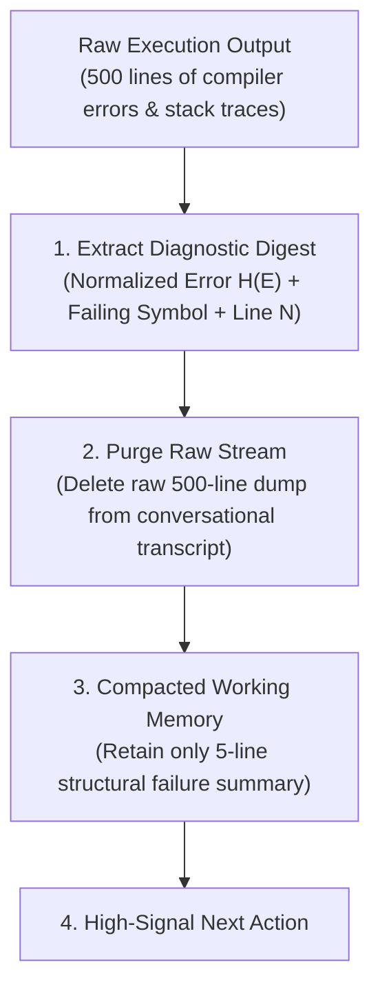
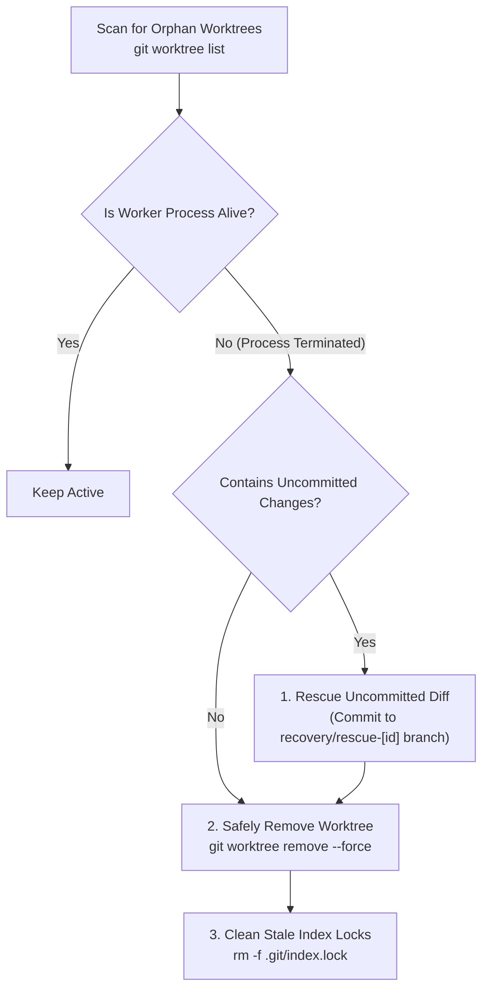

# Session State, Context Compaction & Cross-Worktree Resilience

> **Mandate**: *A saturated context is a blind agent; an abandoned worktree is a landmine.* Autonomous systems must survive process crashes, API rate-limit terminations, and context window limits. Recovery demands relentless transcript compaction, mathematically grounded restore-versus-recompute economics, and surgical triage of orphaned multi-agent worktrees.

---

## 1 · Context Compaction & Stale-State Purging

As an agent debugs and recovers, the context window fills with megabytes of obsolete compiler errors, large raw file dumps, and repetitive stack traces. This creates **Token Saturation**: the agent loses track of foundational constraints and begins hallucinating.



### The 3-Rule Context Compaction Protocol
1. **Never Retain Raw Dumps**: Once the error signature $H(E)$ and minimal reproduction line are recorded, purge the raw multi-page terminal output.
2. **Compress Iteration History**: Replace previous failed attempts with a single summary line:
   `Attempt 1: Adjusted import in auth.py -> Failed with ModuleNotFoundError: jwt`
3. **Keep State Anchors Fixed**: Never compact or truncate the original User Task Contract, current file paths, and verification commands.

---

## 2 · The "Restore vs. Recompute" Calculus

When resuming after an interruption or crash, an agent must decide whether to **load a cached artifact** or **recompute it from scratch**:

$$\text{Decision Rule}: \quad \text{If } \text{Cost}(\text{Restore}) < \text{Cost}(\text{Recompute}) \implies \text{Restore, else Recompute}$$

### Evaluation Dimensions

| Factor | Favor Restore (Cached / Serialized) | Favor Recompute (Execute Fresh) |
| :--- | :--- | :--- |
| **Token / Compute Cost** | High cost (LLM multi-turn reasoning, external API calls). | Low cost (Deterministic build command, local script). |
| **Execution Duration** | Slow ($> 60\text{ seconds}$). | Fast ($< 5\text{ seconds}$, e.g. running linter or quick test). |
| **Determinism** | Non-deterministic (web scraping, stochastic models). | 100% Deterministic (pure functions, compiler checks). |
| **Storage / Serialization** | Small structured manifest ($< 1\text{MB}$ JSON). | Massive binary blobs ($> 500\text{MB}$ tensor weights / caches). |

### Concrete Heuristic
* **Recompute**: Compilations, type-checking passes, test runs, and localized lint fixes. Never serialize these; run the command fresh.
* **Restore**: Architectural plans, intermediate prompt reasoning, parsed external schema definitions, and validated Git commit hashes. Store these in minimal JSON/YAML state manifests.

---

## 3 · Cross-Worktree Forensics & Orphan Cleanup

In multi-agent workflows, an agent process crash often leaves behind orphaned Git worktrees, stale file locks (`.git/index.lock`), and detached HEAD branches.



### Worktree Recovery CLI Commands
```bash
# 1. List all active and orphaned worktrees
git worktree list

# 2. If a worker crashed, rescue its uncommitted work before deletion:
cd .worktrees/worker-auth-module
git status
git checkout -b recovery/rescue-auth-module
git commit -am "rescue: uncommitted changes from crashed worker"
cd ../..

# 3. Safely delete the orphaned worktree
git worktree remove --force .worktrees/worker-auth-module
git worktree prune

# 4. Clean up any stale git locks preventing future commits
find .git -name "*.lock" -delete
```

---

## 4 · Crash-Resilient Session Manifest Schema

To ensure seamless recovery across process restarts or terminal crashes, maintain a lightweight session manifest at `.recovery/session_manifest.json`:

```json
{
  "session_id": "sess-2026-09-25-a1b2",
  "active_task": "payment-webhook-handler",
  "sizing_mode": "transactional-unit",
  "pinned_baseline_commit": "7f9a12c8b",
  "current_checkpoint_tag": "pre-tx-payment-webhook-002",
  "active_worktree_path": null,
  "attempt_counter": 1,
  "active_error_signature": "d41d8cd98f00b204e9800998ecf8427e",
  "open_sagas": [
    {
      "forward": "aws sqs create-queue --queue-name payment-dlq",
      "inverse": "aws sqs delete-queue --queue-url https://sqs.us-east-1.amazonaws.com/123/payment-dlq"
    }
  ],
  "last_updated": "2026-09-25T12:00:00Z"
}
```

On restart, the agent reads `session_manifest.json`, validates that the working directory matches `pinned_baseline_commit`, and resumes execution without re-prompting the user.
