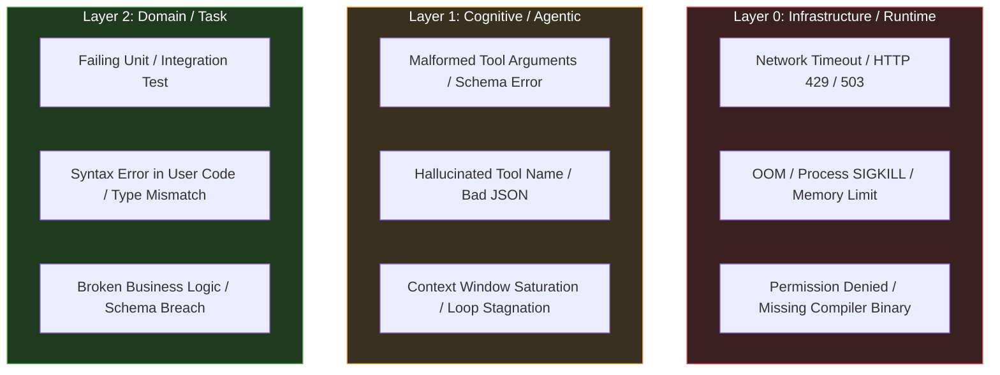
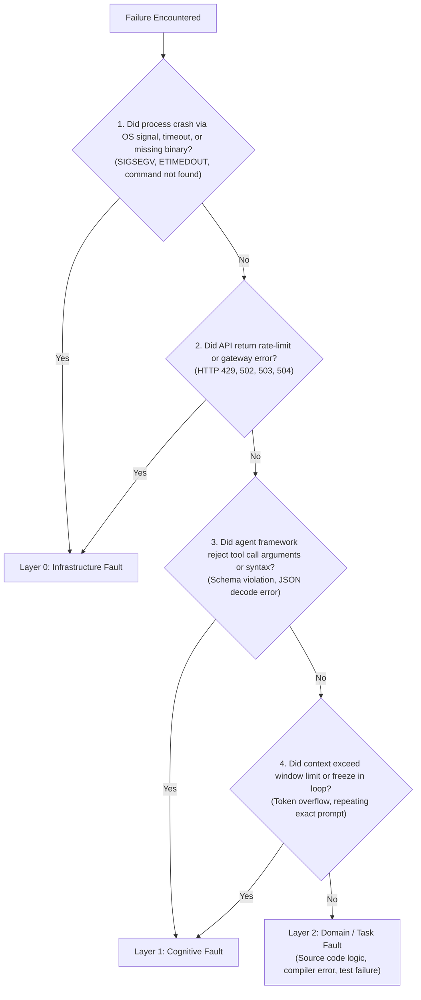

# Three-Tier Fault Attribution & Agent Health Telemetry

> **Mandate**: *Never modify application code to fix a network timeout; never blame a flaky network for a logic bug.* An unclassified error is a breeding ground for hallucinated fixes. Every anomaly must be strictly attributed to its true operational tier—Infrastructure (Layer 0), Cognitive (Layer 1), or Domain (Layer 2)—before formulating any recovery action.

---

## 1 · The Tri-Layer Fault Matrix

Every computational failure in an autonomous development environment originates from exactly one of three distinct layers:



### Attribution Matrix & Action Boundaries

| Fault Tier | Typical Signatures | Permitted Actions | Strictly Forbidden Actions |
| :--- | :--- | :--- | :--- |
| **Layer 0: Infrastructure** | `ETIMEDOUT`, `ECONNREFUSED`, `HTTP 429`, `SIGKILL`, `killed: 9 (OOM)`, `command not found: cargo`. | Exponential backoff, retry with jitter, memory limit adjustment, container restart, PATH repair. | **NEVER modify source code or tests in the project**. |
| **Layer 1: Cognitive / Agentic** | `Invalid tool call schema`, `Missing required argument 'path'`, `Malformed JSON in tool call`, `Token limit exceeded`. | Tool schema correction, prompt reflection, context compaction, soft restart. | **NEVER modify project business logic or write code workarounds**. |
| **Layer 2: Domain / Task** | `AssertionError: expected 200 got 500`, `TypeError: cannot unpack non-iterable`, `cargo check: borrow of moved value`. | Root-cause debugging, in-place code repair, algorithmic refactor, adding regression shields. | **Never blame the infrastructure or bypass verification**. |

---

## 2 · The 5-Step Rapid Attribution Heuristic

To classify any failure within $< 2$ seconds, follow this deterministic decision tree:



---

## 3 · The Anti-Hallucination Guardrail

The most catastrophic failure mode of an autonomous agent is **Cross-Layer Hallucination**:
* *Scenario*: A test command times out after 30 seconds because of an un-mocked external network call (Layer 0).
* *The Hallucination*: The agent assumes the code logic is wrong, rewrites the core database query, introduces 5 new bugs, and breaks compiling files.
* *The Guardrail*:
  > **If an error is attributed to Layer 0 or Layer 1, the agent is programmatically forbidden from modifying project source files.** All recovery actions must be confined to the execution environment (retrying, mocking external services, or repairing tool call syntax).

---

## 4 · Agent Health Telemetry Schema

Maintain clean internal telemetry without polluting the user-facing conversation. When logging health checkpoints, write to `.recovery/health_telemetry.jsonl`:

```json
{
  "timestamp": "2026-09-25T12:00:00Z",
  "task_id": "auth-service-refactor",
  "tier": "LAYER_0_INFRASTRUCTURE",
  "event_type": "RATE_LIMIT_429",
  "provider": "github_api",
  "retry_count": 2,
  "backoff_applied_ms": 2400,
  "circuit_breaker_state": "CLOSED",
  "resolved": true
}
```

```json
{
  "timestamp": "2026-09-25T12:01:15Z",
  "task_id": "auth-service-refactor",
  "tier": "LAYER_2_DOMAIN",
  "event_type": "ASSERTION_FAILURE",
  "source_file": "src/auth/jwt.py",
  "failing_test": "test_jwt_validation_expired",
  "error_signature_hash": "a8f3b2c1",
  "convergence_delta": {
    "before": 3,
    "after": 2
  },
  "action_taken": "REPAIR",
  "resolved": false
}
```

This telemetry enables post-hoc health diagnostics and ensures the runtime can distinguish flaky environments from broken application code.
