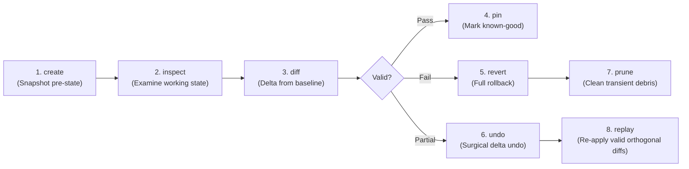
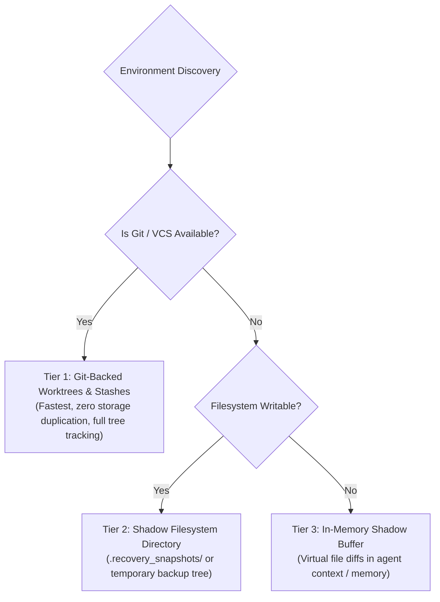
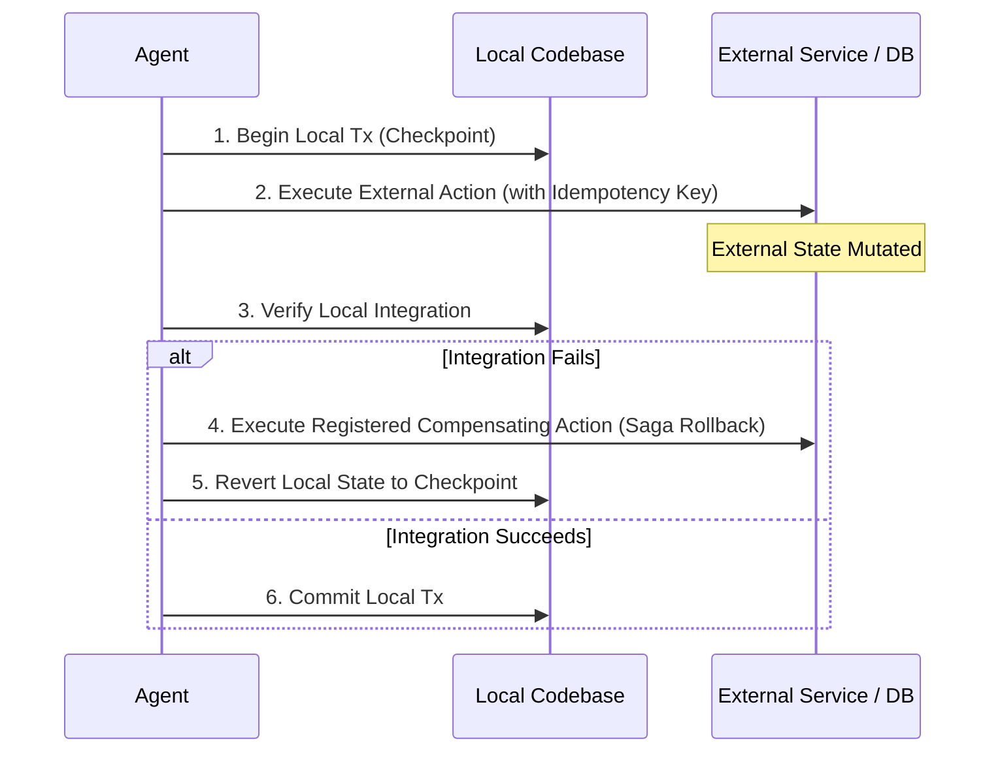

# Transactional Sandboxing, Checkpoints & State Reversibility

> **Mandate**: *Every risky mutation must begin with an escape route.* Treat any code modification, refactoring, or tool execution carrying non-zero uncertainty as an atomic transaction. If verification fails or state deteriorates, the system must restore the pre-transaction baseline cleanly and surgically, without annihilating valid orthogonal progress.

---

## 1 · The Checkpoint Lifecycle Primitives

A complete reversibility engine manages state transitions through 8 discrete primitives:



1. **`create(tag)`**: Captures an immutable snapshot of the current state before any files are touched.
2. **`inspect(tag)`**: Reads metadata, file manifests, and environment state of a saved checkpoint.
3. **`diff(tag_a, tag_b)`**: Computes the exact file and semantic delta between two checkpoints.
4. **`revert(tag)`**: Restores the working tree and index completely to the specified checkpoint.
5. **`undo(file_list | hunk_list)`**: Surgically reverts specific toxic files or AST nodes while preserving adjacent valid changes.
6. **`pin(tag)`**: Flags a checkpoint as a permanent baseline (e.g., "Foundation Settled" or "Pre-Migration Baseline") that is immune to garbage collection.
7. **`prune()`**: Cleans up transient checkpoints, expired stash entries, and dead worktrees.
8. **`replay(patch)`**: Applies a previously verified patch or uncommitted hunk onto a freshly restored baseline.

---

## 2 · Multi-Tier Snapshot Implementations

To ensure universality across any runtime or environment, state snapshotting operates across a **3-tier abstraction ladder**:



### Tier 1: Git-Backed Implementation (Preferred)
```bash
# 1. Capture snapshot before risky operation
git stash create  # Returns commit hash without mutating working tree
# OR tag current HEAD + uncommitted diff:
git branch recovery/snapshot-$(date +%s)

# 2. Revert uncommitted changes cleanly on failure:
git reset --hard HEAD
git clean -fd

# 3. Surgical restore of specific files:
git checkout recovery/snapshot-baseline -- path/to/safe_file.py
```

### Tier 2: Filesystem-Backed Implementation (Non-Git / Embedded)
If Git is absent (e.g., bare server, docker container without vcs, embedded filesystem):
1. Establish shadow directory: `.recovery_snapshots/<snapshot_id>/`
2. Copy manifest of target files (or full directory if $< 50\text{MB}$):
   ```bash
   mkdir -p .recovery_snapshots/tx_001
   cp -p file1.ext file2.ext .recovery_snapshots/tx_001/
   ```
3. To rollback: Copy files back from `.recovery_snapshots/tx_001/` to working location.
4. To commit: Delete `.recovery_snapshots/tx_001/`.

### Tier 3: In-Memory Buffer (Ephemeral Sandboxes / Cloud IDEs)
When local disk is read-only or restricted:
- Store original file contents in the agent's active memory payload as key-value pairs (`{"path": "content"}`).
- On rollback, write original in-memory contents back via standard file write tools.

---

## 3 · The Unit-of-Work Pattern (ACID Coding)

Every non-trivial agent mutation must be executed as an atomic Unit-of-Work:

```python
# Conceptual Agentic Unit-of-Work Lifecycle
def execute_transactional_operation(task, allowed_paths):
    tx_id = generate_tx_id()
    checkpoint = snapshot_engine.create(f"pre-tx-{tx_id}", paths=allowed_paths)
    
    try:
        # Phase 1: Mutate in isolated boundary
        apply_mutations(task)
        
        # Phase 2: Verify invariants
        verification_result = run_verification_suite(task.validation_cmd)
        
        if verification_result.passed:
            # Phase 3a: Commit
            snapshot_engine.pin(f"clean-{tx_id}")
            snapshot_engine.prune(checkpoint)
            return Success(verification_result)
        else:
            # Phase 3b: Automatic Rollback
            snapshot_engine.revert(checkpoint)
            return Failure("Verification failed. State cleanly restored.", verification_result.errors)
            
    except Exception as fatal_error:
        # Emergency Rollback on crash
        snapshot_engine.revert(checkpoint)
        raise FatalOperationException(fatal_error)
```

---

## 4 · Surgical Delta Rollback vs Catastrophic Reset

A common agent failure mode is the **Rollback Paradox**: An agent spends 45 minutes making 4 clean changes across 3 files, encounters an error on file 4, and runs `git reset --hard`, destroying all valid work.

### The Discard Graveyard Pattern
Never permanently destroy discarded experiments. Move them to a **Graveyard**:
```bash
# 1. Stash current un-converged experiment with descriptive message
git stash push -m "graveyard: failed experiment for auth refactor"

# 2. Alternatively, commit to a disconnected quarantine branch:
git checkout -b recovery/graveyard-auth-refactor
git commit -am "quarantine: experimental refactor before rollback"
git checkout main
```

### Surgical File-Level Rollback
If only 1 of 5 modified files is toxic:
```bash
# Revert ONLY the toxic file to baseline:
git checkout HEAD -- src/toxic_module.py

# Re-run verification to see if the remaining 4 files pass cleanly:
npm test
```

---

## 5 · Compensating Sagas for External Realities

When an operation crosses physical boundaries into non-rollbackable external systems (cloud resources, Stripe charges, database DDL):



### Saga Registry Example
For every forward action, declare the explicit inverse:
* `Forward`: `CREATE TABLE user_profiles (...)`  
  `Inverse`: `DROP TABLE IF EXISTS user_profiles;`
* `Forward`: `aws s3api create-bucket --bucket my-bucket`  
  `Inverse`: `aws s3api delete-bucket --bucket my-bucket`
* `Forward`: `stripe.customers.create(...)`  
  `Inverse`: `stripe.customers.del(customer_id)`

If any step in the transaction fails, the agent executes the compensating actions in **reverse topological order**.
