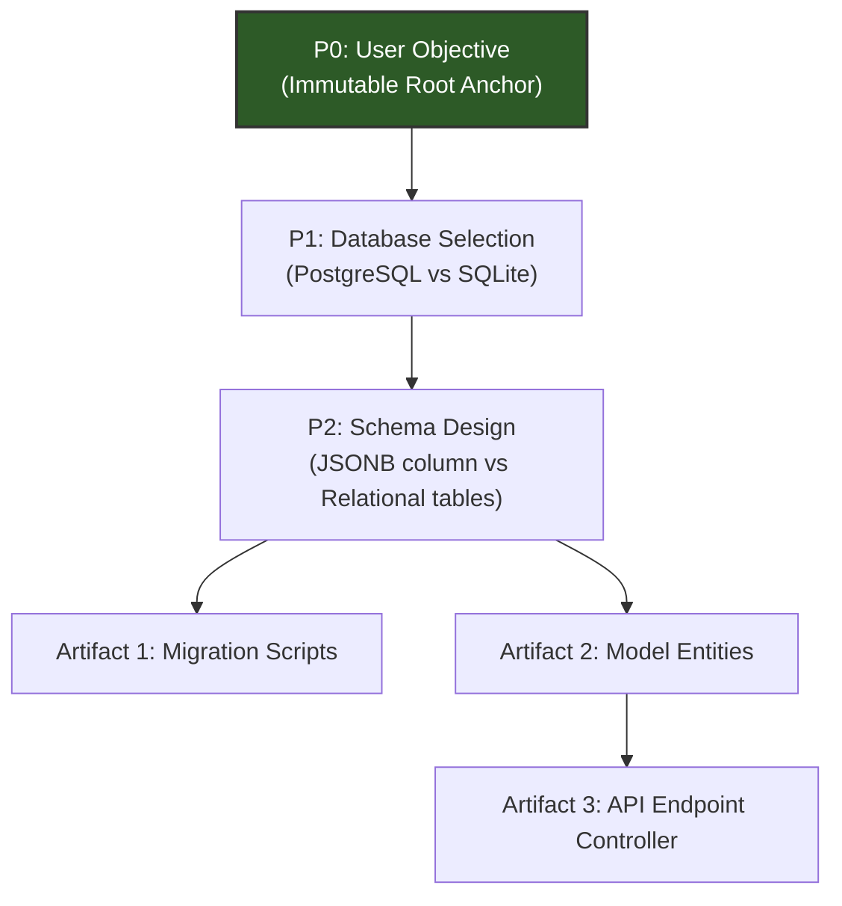
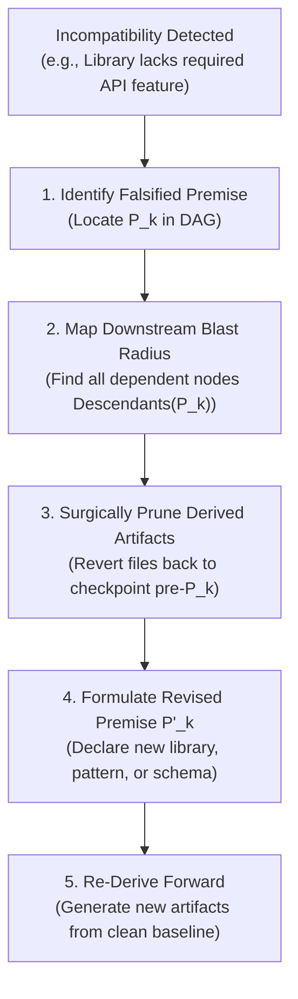

# Upstream Backtracking & Assumption Dependency Graphs

> **Mandate**: *If you climbed the wrong mountain, trying harder will not get you to the right peak.* When a downstream implementation fails because an upstream premise was flawed, local patching is futile. The system must recognize when an assumption is falsified, backtrack to the root branching point in the decision graph, invalidate derived artifacts, and re-derive forward.

---

## 1 · The "Wrong Mountain" Problem

A frequent failure mode of LLMs is **Local Patching Myopia**:
* Step 1: Agent assumes Library $X$ supports streaming responses.
* Step 2: Agent writes 500 lines of plumbing around Library $X$.
* Step 3: Agent discovers Library $X$ buffers the entire response in memory.
* *The Naive Trap*: Agent spends 3 hours trying to hack Library $X$ with threads, reflection, and monkey patches.
* *The Backtrack Solution*: Invalidate the premise *"Library X supports streaming"*, prune the 500 lines of plumbing, substitute with Library $Y$ (which natively streams), and re-derive.

```mermaid
flowchart TD
    subgraph NaiveTrap["The Naive Downstream Trap"]
        P1["Assumption: Library X Streams"] --> A1["Write Plumbing Code"]
        A1 --> A2["Encounter Buffer Limitation"]
        A2 --> H1["Hack with monkey patch"]
        H1 --> H2["Hack with subthreads"]
        H2 --> F1["Catastrophic Failure"]
    end

    subgraph BacktrackEngine["The Upstream Backtrack Engine"]
        BP1["Assumption: Library X Streams"] --> BA1["Discover Buffer Limitation"]
        BA1 --> Disprove["Falsify Assumption"]
        Disprove --> Prune["Prune Derived Plumbing Code"]
        Prune --> BP2["New Premise: Adopt Library Y"]
        BP2 --> CleanSuccess["Clean Native Streaming Implementation"]
    end
```



---

## 2 · The Assumption Dependency DAG

Track architectural assumptions and derived artifacts as a Directed Acyclic Graph (DAG):



### DAG Node Classification
* **Anchor Node ($P_0$)**: The immutable user goal. An agent can **never** invalidate or backtrack past $P_0$ autonomously.
* **Premise Nodes ($P_1, P_2, \dots$)**: Architectural or technical assumptions (e.g., choice of algorithm, library, data schema, IPC mechanism).
* **Artifact Nodes ($A_1, A_2, \dots$)**: Concrete source files, configuration declarations, or tests generated to implement a premise.

---

## 3 · The Invalidation & Re-Derivation Protocol

When an operation fails with a fundamental incompatibility:



### Step-by-Step Execution
1. **Identify the Falsified Premise ($P_k$)**: Ask: *"What foundational belief made me write this code?"* (e.g., *"Belief that SQLite supports concurrent write transactions"*).
2. **Compute Downstream Reachability**: Traverse the DAG to find all files and tests derived from $P_k$:
   $$\text{Descendants}(P_k) = \{N \in \text{DAG} \mid P_k \rightsquigarrow N\}$$
3. **Surgically Prune Derived Artifacts**:
   - Do not manually comment out lines.
   - Use `git checkout <pre-Pk-checkpoint> -- <files>` to restore the clean pre-premise baseline.
4. **Formulate the Revised Premise ($P'_k$)**: Document the pivot in thought or memory:
   > *"P1 (SQLite concurrent writes) is FALSIFIED by SQLITE_BUSY error under load. Replacing with P1' (PostgreSQL with connection pool)."*
5. **Re-Derive Forward**: Build the new implementation on the clean baseline.

---

## 4 · The Bounded Backtrack Horizon ($K \le 2$)

Unbounded backtracking leads to **Philosophical Paralysis** (an agent backing up so far that it concludes it shouldn't write code at all, or begins refactoring unrelated core infrastructure).

### The $K \le 2$ Rule
An agent is permitted to backtrack up to **$K=2$ ancestor premise nodes** automatically:
* $K=1$: Backtrack from specific algorithm/library implementation to library selection.
* $K=2$: Backtrack from library selection to architectural subsystem design.
* $K \ge 3$: **Prohibited**. If resolving the failure requires invalidating fundamental business logic, data contracts, or the user's explicit objective, automated backtracking must immediately halt and invoke **Escalation**.

### Escalation on Deep Backtrack
When $K > 2$, emit this structured clarification to the user:
```markdown
> [!IMPORTANT] ARCHITECTURAL BACKTRACK LIMIT REACHED
> Implementing [Feature] using [Initial Approach] failed because [Fundamental Incompatibility].
> To proceed, we must revise an upstream premise that touches project scope:
> - **Current Premise**: [e.g., Real-time peer-to-peer sync without a central server]
> - **Falsifying Evidence**: [e.g., NAT traversal failure across symmetric cellular gateways]
> - **Proposed Pivot**: [e.g., Adopt lightweight relay server (TURN/STUN)]
> 
> *Awaiting user confirmation before proceeding with architectural pivot.*
```
