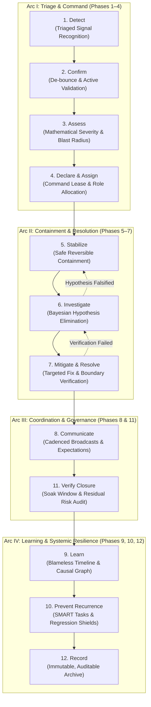

# Incident Response: Universal Operational Crisis Management & Systemic Resilience Protocol

> **Mandate**: *An incident is an emergent operational property of a complex adaptive system under stress, not a personal moral failing or a simple code defect.*  
> 
> Incident response is the cybernetic discipline of rapidly restoring dynamic system equilibrium, bounding user harm, and transforming operational disruption into systemic resilience. When an active failure occurs, the responding agent must prioritize reversible containment over academic curiosity, preserve forensic evidence before taking destructive action, separate hard facts from speculative inferences, and maintain a single unbroken line of operational command. This protocol liberates agent problem-solving creativity, rejects transient vendor dogma, and coordinates seamlessly across the Arsenal ecosystem.

---

## 1 · The 12-Phase Timeless Incident Lifecycle

Every incident—from a minor transient anomaly to a catastrophic multi-region outage or autonomous agent cascade—traverses this 12-phase lifecycle organized into four cohesive operational arcs:



### Operational Arc Breakdown

#### Arc I: Triage & Command
1. **Phase 1 — Detect (Signal Recognition)**: Ingest credible failure alerts, telemetry threshold crossings, or client error reports. Filter out transient network chatter and synthetic noise.
2. **Phase 2 — Confirm (Active Validation)**: De-bounce transient metric spikes and verify that an active, reproducible degradation exists at the system boundary before escalating.
3. **Phase 3 — Assess (Severity & Blast Radius)**: Quantify user harm, critical user journey (CUJ) disruption, and dependency fan-out using the Objective Severity Formula ($S = w_I I + w_U U + w_B B$).
4. **Phase 4 — Declare & Assign (Command Authority)**: Formally declare the incident tier (P1–P4). Issue the Incident Command lease to a single accountable lead and assign operational roles (Technical Lead, Communications Lead, Scribe).

#### Arc II: Containment & Resolution
5. **Phase 5 — Stabilize (Safe Reversible Containment)**: Apply the **Safe Containment Gate**: stop active bleeding using low-risk, reversible mechanisms (traffic shedding, circuit breaking, route failover, feature flag rollbacks) before deep diagnosis.
6. **Phase 6 — Investigate (Hypothesis Elimination)**: Formulate mutually exclusive causal hypotheses using Bayesian updating ($P(H \mid E)$). Execute high-information-gain tests that falsify candidate causes without mutating unquarantined production state.
7. **Phase 7 — Mitigate & Resolve (Targeted Correction)**: Apply the verified fix or durable architectural workaround. Enforce independent boundary verification across external interfaces.

#### Arc III: Coordination & Governance
8. **Phase 8 — Communicate (Structured Broadcasting)**: Maintain synchronized, cadenced communication across three distinct tiers (responders, internal stakeholders, external consumers) with zero technical jargon in public broadcasts.
11. **Phase 11 — Verify Closure (Soak Period & Audit)**: Enforce a mandatory soak period ($T_{\text{soak}}$) under normal production traffic to confirm zero residual latency drift, error echoes, or secondary memory leaks.

#### Arc IV: Learning & Systemic Resilience
9. **Phase 9 — Learn (Blameless Causal Analysis)**: Conduct a blameless Post-Incident Review (PIR). Reconstruct an immutable, distributed timeline and construct multi-factor Causal Factor Trees (eradicating the "human error" myth).
10. **Phase 10 — Prevent Recurrence (Owned Hardening)**: Convert findings into SMART action items backed by automated regression tests and architectural debt retirement; route tasks to `maintenance` and `testing`.
12. **Phase 12 — Record (Immutable Archive)**: Compile and seal an auditable, resumable incident record containing raw telemetry, command transcripts, decision logs, and post-incident verification contracts.

---

## 2 · Progressive Disclosure (Reference Routing)

To prevent cognitive overload and preserve LLM context bandwidth, **never load all reference manuals simultaneously**. Consult reference manuals strictly on demand based on current operational context:

| Context Trigger | Mandatory Reference Manual | Purpose |
| :--- | :--- | :--- |
| **Command structure, roles, agent swarms, communication cadences, status templates** | [`references/incident-command-roles-and-communication.md`](references/incident-command-roles-and-communication.md) | Universal ICS structure, tokenized agent leases, 3-tier audience messaging, cadence formulas ($T_{\text{update}}$), and broadcast templates. |
| **Severity grading (P1–P4), blast radius, CUJ impact, de-bouncing, false-alarm filtering** | [`references/triage-severity-and-blast-radius-assessment.md`](references/triage-severity-and-blast-radius-assessment.md) | Mathematical severity formulation ($S$), dependency fan-out topology ($G = (V,E)$), and dynamic windowing de-bounce filters. |
| **Emergency stabilization, traffic shedding, circuit breaking, failovers, rollbacks** | [`references/stabilization-containment-and-mitigation-patterns.md`](references/stabilization-containment-and-mitigation-patterns.md) | The 6 universal containment archetypes, rollback vs roll-forward lattices, and damped recovery / anti-thundering-herd protocols. |
| **Root-cause investigation, Bayesian elimination, cognitive bias shields, trace navigation** | [`references/hypothesis-testing-and-causal-investigation.md`](references/hypothesis-testing-and-causal-investigation.md) | Bayesian hypothesis ranking, discriminatory test matrices, cognitive bias shields (anchoring/confirmation), and clock-skewed trace traversal. |
| **Postmortems, timelines, blameless reviews, 5-Whys flaws, Causal Factor Trees, SMART tasks** | [`references/postmortem-causal-analysis-and-learning.md`](references/postmortem-causal-analysis-and-learning.md) | Blameless resilience engineering, multi-factor causal modeling, MTTD/MTTR metrics, and closed-loop regression test shields. |
| **Authoring runbooks, executable runbook schemas, drift detection, tabletop chaos drills** | [`references/runbook-engineering-and-readiness-scenarios.md`](references/runbook-engineering-and-readiness-scenarios.md) | Standardized executable runbook JSON/YAML schemas, continuous runbook verification, and non-destructive tabletop fire-drill design. |

---

## 3 · Adaptive Cognitive Sizing (The 6 Execution Modes)

Size your operational discipline and communication overhead to the severity, blast radius, and recovery horizon of the incident. Never apply heavy enterprise bureaucracy to a single-line script or minor transient blip, and never execute speculative, undocumented mutations during a high-severity outage:

| Mode | Trigger & Scope | Operational Structure | Required Output Contract |
| :--- | :--- | :--- | :--- |
| **`p4-anomaly`** | Isolated anomaly, background task retry spike, test harness glitch, zero user harm. | Single responder; autonomous self-contained triage; zero broadcast overhead. | **3-Line Incident Intent Block** directly before code or config mutation. |
| **`p3-degraded`** | Minor feature degradation, partial redundancy loss, performance drift ($< 5\%$ users), workaround exists. | Incident Lead + Engineer; hourly broadcast; standard reversible containment. | **Incident Triage Brief**: Impact, Hypothesis, Containment, Verification. |
| **`p2-major`** | Core workflow broken, major user segment impacted ($> 5\%$), redundancy compromised, SLA at risk. | Full ICS command: Incident Commander, Technical Lead, Comms Lead. 30-min updates. | **Active Incident State Record**: Roles, Severity, Blast Radius, Rollback, Comms. |
| **`p1-critical`** | Critical system outage, catastrophic data corruption risk, total service unavailability, SLA breached. | Executive ICS: Dedicated Commander, Scribe, multiple Domain Leads. 15-min updates. | **Crisis Command Dashboard**: Real-time battle board, containment tracking, public status broadcast. |
| **`postmortem-pir`** | Post-incident phase for any P1/P2 (or high-signal P3/near-miss) following stabilization. | Blameless review group, cross-functional stakeholders, lead investigator. | **Formal Blameless PIR Document**: Distributed timeline, Causal Factor Tree, SMART action items. |
| **`runbook-harden`** | Proactive encoding or hardening of incident runbooks, drift audits, chaos fire-drills. | Reliability engineers, system architects. | **Executable Runbook Specification**: Preconditions, automated checks, containment commands, rollback recipe. |

### The 3-Line Incident Intent Protocol (For `p4-anomaly` Mode)
When resolving isolated, low-risk operational anomalies, eliminate bureaucratic templates in favor of a concise 3-line block directly preceding action:
```markdown
> **Anomaly**: [Exact observed deviation, e.g., Worker pool retry rate spiked to 14% on batch worker #3]
> **Containment**: [Reversible action to stabilize, e.g., Throttle batch ingestion queue concurrency from 10 to 4]
> **Verification**: [External signal proving recovery, e.g., Retry rate drops to < 1% within 2m with zero dropped tasks]
```

> **Boundary**: If the failure is contained within the agent's own development loop (test failures, compilation errors, tool crashes), activate `failure-recovery` instead. This skill handles operational failures affecting live systems and users.

---

## 4 · The 8 Universal Incident Response Invariants

Regardless of runtime, language, or system scale, every resilient operational system strictly adheres to these 8 universal invariants:

### 4.1 Invariant 1: Epistemic Separation ($\mathcal{E} \cap \mathcal{H} = \emptyset$)
Facts, hypotheses, assumptions, and uncertainties must be strictly partitioned in all operational records and communications:
$$\mathcal{I}_{\text{state}} = \langle \mathcal{E}_{\text{facts}}, \; \mathcal{H}_{\text{hypotheses}}, \; \mathcal{A}_{\text{assumptions}}, \; \mathcal{U}_{\text{unknowns}} \rangle$$
* **Prohibition**: An agent must never describe an unverified hypothesis or speculative inference as a proven fact.

### 4.2 Invariant 2: The Safe Containment Gate
Mitigation strictly precedes deep root-cause diagnosis if and only if the containment mutation $M_c$ is non-destructive, bounded in blast radius, and reversibly safe:
$$\text{Precede}(\text{Mitigate}, \text{Diagnose}) \iff \text{Reversible}(M_c) \land \mathcal{B}(M_c) \subseteq \mathcal{B}_{\text{safe}} \land \text{Risk}(M_c) \ll \text{Impact}(\text{ActiveIncident})$$
* **Prohibition**: Speculative destructive operations (e.g., dropping database tables, wiping cache tiers under full production load, unversioned binary patches) are forbidden during containment.

### 4.3 Invariant 3: Single Logical Command Authority
At any timestamp $t$, there exists exactly one accountable Incident Commander holding the active command lease for a given failure domain:
$$\forall \text{Domain } \mathcal{D}, \quad \exists! \, C \in \mathcal{P} \quad \text{s.t.} \quad \text{Lease}(C, \mathcal{D}, t) = \text{Valid}$$
* **Prohibition**: Multiple responders or autonomous agents executing disjoint, uncoordinated mutations within the same resource domain is strictly prohibited.

### 4.4 Invariant 4: Blast-Radius & Reversibility Shield
Every operational intervention $M$ executed against an active system must have a pre-computed blast radius $\mathcal{B}(M)$ and a verified rollback or compensating action $M^{-1}$:
$$\forall M, \quad \exists M^{-1} \quad \text{s.t.} \quad \text{Apply}(M \circ M^{-1}, \mathcal{S}) \approx \mathcal{S}_{\text{baseline}}$$
* **Prohibition**: Applying unversioned or unrecoverable mutations without prior authorization under the Break-Glass Protocol is prohibited.

### 4.5 Invariant 5: Independent Boundary Verification
An incident is resolved if and only if independent, end-to-end consumer journeys and critical SLIs confirm healthy baseline behavior across a mandatory soaking window $T_{\text{soak}}$:
$$\text{Resolved}(\text{Incident}) \iff \left( \forall t \in [t_{\text{fix}}, t_{\text{fix}} + T_{\text{soak}}], \; \text{SLI}_{\text{external}}(t) \in \text{Threshold}_{\text{healthy}} \right)$$
* **Prohibition**: A process returning exit code `0`, an internal health check reporting `200 OK`, or a single synthetic test probe is strictly insufficient to declare an incident resolved.

### 4.6 Invariant 6: Anti-Thrashing & Finite Escalation Budgets
An intervention strategy must never be retried under identical parameters if it fails to improve health. The maximum failed attempts within a single operational tier is bounded:
$$N_{\text{failed\_attempts}} \le 2 \implies \text{Escalate Strategy / Backtrack}$$
* **Prohibition**: Entering infinite restart loops, cycling servers blindly, or thrashing service configurations without new evidence is forbidden.

### 4.7 Invariant 7: Systemic Causal Plurality (Anti-Scapegoating Axiom)
System degradations arise from non-linear interactions across architecture, tooling, telemetry, and operational pressures, never a single point of human or agent failure:
$$\text{Causes}(\text{Incident}) = \sum_{i=1}^k \text{SystemicFactor}_i, \quad \forall i, \; \text{Factor}_i \neq \text{"Human Error"}$$
* **Prohibition**: Attributing root cause to "operator mistake", "developer error", or "agent hallucination" is strictly disallowed in all postmortems.

### 4.8 Invariant 8: Closed-Loop Improvement Enforceability
Every post-incident learning must be converted into an owned, tracked engineering work item with a verifiable regression test and concrete delivery milestone:
$$\forall a \in \text{PIR}_{\text{actions}}, \quad \text{Owner}(a) \neq \emptyset \land \text{DueDate}(a) \neq \emptyset \land \text{RegressionTest}(a) \neq \emptyset$$
* **Prohibition**: Closing an incident review with vague, unassigned, or unverifiable recommendations is forbidden.

---

## 5 · The Break-Glass Invariant Exception Protocol (BGEP)

In extreme crises involving catastrophic active damage (e.g., a runaway loop rapidly draining financial balances, malicious data exfiltration, or silent data corruption propagating at gigabytes per second), strict reversibility may prevent emergency intervention:

> [!CAUTION] BREAK-GLASS INVARIANT EXCEPTION PROTOCOL (BGEP)
> An agent or responder is authorized to execute an irreversible or destructive containment operation **IF AND ONLY IF** the following conditions are simultaneously met:
> 1. **Mathematical Loss Minimization**: The expected systemic loss of inaction overwhelmingly exceeds the cost of the irreversible mutation:
>    $$\mathbb{E}[\text{Loss}(\text{Irreversible Action})] \ll \mathbb{E}[\text{Loss}(\text{Continued Inaction})]$$
> 2. **Explicit Two-Party Authorization**: Explicit authorization from a human authority or a dedicated secondary Supervisor Agent is granted.
> 3. **Pre-Registered Compensating Saga**: A forward-compensating strategy (e.g., data restoration from offline snapshots, manual financial reconciliation, external ledger patching) is documented prior to command execution.
> 4. **Immutable Audit Trail**: The exact command line, operator identifier, timestamp, and rationale are written to an append-only incident record.

---

## 6 · Universal Archetype Adaptation

The 12-phase lifecycle and 8 invariants adapt dynamically across every software archetype:

* **Distributed Microservices & Cloud Platforms**: Contain via traffic shedding, circuit breakers, and canary rollbacks; investigate via distributed trace context propagation; mitigate thundering herds with damped recovery curves and connection jitter.
* **Monolithic & Single-Node Systems**: Contain via connection pool clamping, read-only degradation, and worker process recycling; investigate via system-call tracing, memory profiling, and slow query logs; protect local disk space.
* **Serverless & Event-Driven Topologies**: Contain via queue concurrency choking, dead-letter routing of poison pills, and consumer group pausing; investigate via correlation IDs across async bus hops; eliminate cascading consumer crashes.
* **Autonomous AI Agents & Cognitive Swarms**: Contain via tool-execution lease revocation, token consumption clamping, and worktree isolation; investigate via prompt/response trajectory traces; eliminate conversational deadlock and hallucination loops.
* **Batch, ETL & Big Data Pipelines**: Contain via upstream pipeline halting, output table partition quarantine, and dirty state isolation; investigate via historical data bisecting and schema validation diffs; backfill data via deterministic idempotent reruns.
* **Embedded, IoT & Edge Systems**: Contain via watchdog circuit triggers, safe-mode firmware fallbacks, and local sensor buffering; investigate via non-volatile crash dumps; recover through atomic A/B dual-boot partition swapping.

---

## 7 · Guardrails & Anti-Patterns

### 7.1 Strictly Prohibited Actions
- ❌ **No Blind Retrying**: Never repeatedly re-run failed operations without modifying parameters, clearing poisoned state, or adopting a new hypothesis.
- ❌ **No Panic Patching**: Never push untested, speculative code edits directly to production during an active outage without an isolated sandbox check and rollback path.
- ❌ **No Unverified Resolutions**: Never declare an incident resolved based purely on a process returning `0` or an internal component claiming health; user journey verification is mandatory.
- ❌ **No Scapegoating**: Never assign causal blame to individuals or agents in post-incident reviews; always identify the latent systemic vulnerabilities that permitted the failure.
- ❌ **No Decorative Postmortems**: Never close an incident investigation without creating verifiable, owned engineering tickets backed by automated regression tests.

---

## 8 · The Clean Incident Response Stopping Contract

An incident response engagement is strictly **COMPLETE** only when all 6 conditions are verified:

1. **Service Boundary Health Restored**: Critical SLIs and end-to-end user journeys are verified healthy across the full duration of the mandatory soak window ($T_{\text{soak}}$).
2. **Containment Scaffolding Cleaned**: Temporary rate limits, debug log configurations, scratch reproduction scripts, and isolated quarantine sandboxes are cleanly removed or normalized.
3. **Forensic Evidence Sealed**: Raw log extracts, metric snapshots, trace dumps, and command transcripts are safely archived in the permanent incident record.
4. **Blameless PIR Completed**: A blameless post-incident review has been authored, documenting the distributed timeline, contributing factors, and systemic weaknesses.
5. **Owned Action Items Registered**: Concrete, prioritized engineering tasks with assigned owners, delivery milestones, and automated regression test shields are filed in the project backlog (routed to `maintenance` and `testing`).
6. **Command Leases Released**: Active Incident Commander and Technical Lead leases are formally surrendered, and normal operational monitoring is resumed.
