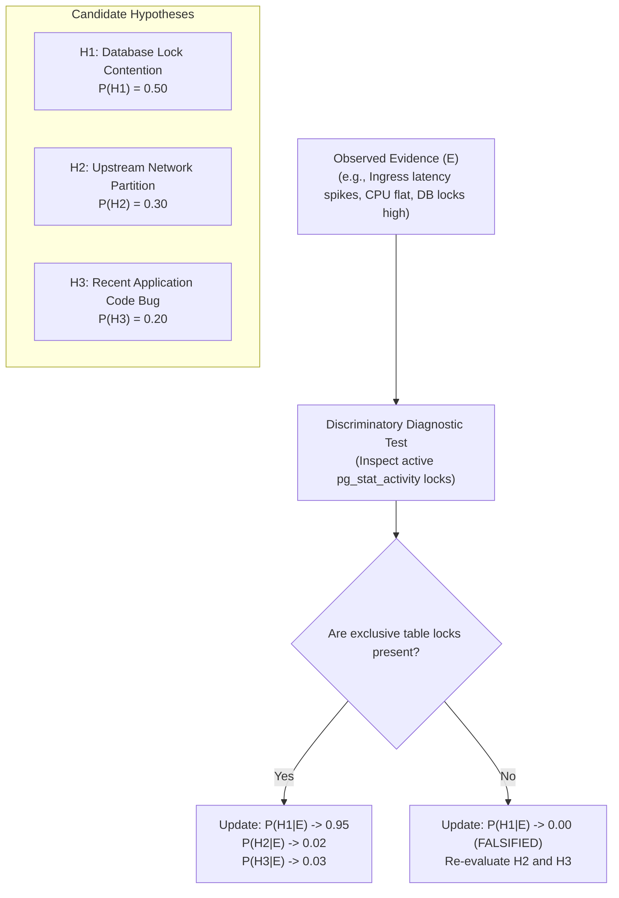
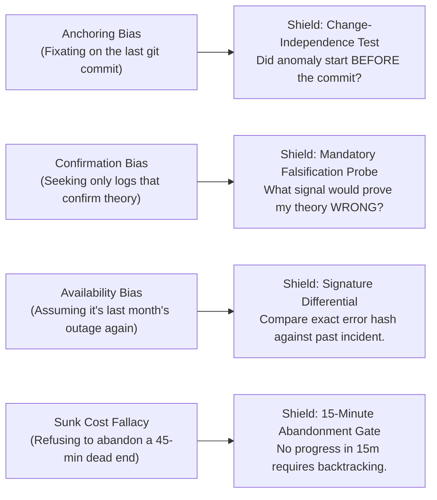
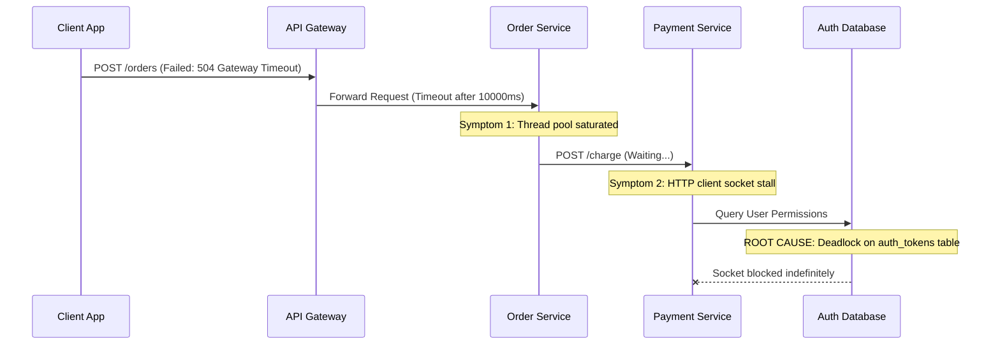

# Hypothesis Testing, Bayesian Elimination & Causal Investigation

> **Mandate**: *Diagnosis is an exercise in scientific falsification, not intuitive guessing or confirmation bias.*  
> 
> Once an incident is stabilized (or when stabilization requires diagnostic clarity), the Technical Lead and responders must uncover the underlying causal factors. In complex distributed systems, surface symptoms routinely masquerade as causes. Responders must formulate competing, mutually exclusive hypotheses, evaluate evidence through Bayesian updating, design high-information-gain tests that aggressively eliminate theories, and maintain strict cognitive shields against human and agent biases.

---

## 1 · The Bayesian Hypothesis Framework

In complex systems, an incident rarely presents a single, unmistakable causal signature. Responders must maintain a set of candidate hypotheses $\mathcal{H} = \{H_1, H_2, \dots, H_n\}$ and update their subjective confidence as forensic evidence $\mathcal{E}$ is uncovered:

$$P(H_i \mid \mathcal{E}) = \frac{P(\mathcal{E} \mid H_i) \cdot P(H_i)}{\sum_{j=1}^n P(\mathcal{E} \mid H_j) \cdot P(H_j)}$$

### Prior Probability Allocation Rules ($P(H_i)$)
1. **Change-Correlated Prior**: Hypotheses directly tied to recent deployments, infrastructure changes, or configuration rollouts start with higher prior probability ($P \approx 0.40 - 0.60$).
2. **Topology-Correlated Prior**: Components with known single points of failure (e.g., non-sharded primary databases, third-party payment gateways) carry elevated priors ($P \approx 0.20 - 0.30$).
3. **Exotic Failure Prior**: Highly esoteric explanations (e.g., CPU hardware microcode bugs, cosmic ray bit flips, compiler optimization errors) must start with near-zero prior probability ($P < 0.01$) until all pedestrian explanations are mathematically falsified.

---

## 2 · The Hypothesis Elimination Matrix

Never attempt to prove a pet hypothesis correct; instead, formulate **discriminatory tests** designed to actively falsify candidates with minimum operational overhead:

| Hypothesis Candidate | Necessary Implication ($H_i \implies X$) | Discriminatory Test Command / Query | Observed Evidence | Status |
| :--- | :--- | :--- | :--- | :--- |
| **$H_1$: Relational DB Connection Exhaustion** | Active client connections $\approx \text{MaxConnections}$ | Query connection metrics: `SELECT count(*) FROM pg_stat_activity;` | Connections at 42 / 500 (8.4%). | **FALSIFIED ($P = 0$)** |
| **$H_2$: Upstream Ingress Dropping Sockets** | Ingress access logs report 499 / 504 status codes. | Query edge load balancer access log aggregates. | Edge logs show clean 200s; zero 504s observed. | **FALSIFIED ($P = 0$)** |
| **$H_3$: Downstream Auth Token Service Latency** | Service span duration for `auth_verify` $> 2000\text{ms}$. | Distributed trace span latency distribution for `auth_verify`. | $P_{99}$ latency is $4800\text{ms}$ (baseline: $12\text{ms}$). | **CONFIRMED ($P = 0.98$)** |

### The Falsification Invariant
A hypothesis $H_k$ is strictly discarded the instant an observed fact $\mathcal{E}_{\text{fact}}$ violates a necessary condition of $H_k$:
$$P(\mathcal{E}_{\text{fact}} \mid H_k) = 0 \implies P(H_k \mid \mathcal{E}) = 0$$
* *Rule*: Once a hypothesis is falsified, immediately cease all diagnostic effort on that branch and re-focus resources on the remaining candidate set.

---

## 3 · Cognitive Bias Shields for Incident Responders

During high-stress operational outages, human and AI agents consistently fall victim to predictable cognitive traps. Responders must enforce these cognitive shields:

### Cognitive Shield Protocols
1. **The Temporal Invariance Check (Anti-Anchoring)**:
   - Before executing a rollback or blaming a recent release, verify the exact onset timestamp ($t_{\text{incident}}$).
   - If the degradation began at $19:02$ and the deployment completed at $19:14$, the deployment is strictly ruled out as the root trigger.
2. **The Falsification Query Mandate (Anti-Confirmation)**:
   - Responders must articulate: *"What piece of evidence, if observed, would conclusively disprove my current theory?"*
   - Execute that diagnostic query first before collecting supporting logs.
3. **The 15-Minute Investigation Timebox (Anti-Sunk-Cost)**:
   - If a diagnostic investigation into a specific subsystem yields zero actionable evidence within 15 minutes, the Incident Commander must order a strategic pivot to an alternate branch of the Causal Tree.

---

## 4 · Distributed Trace & Log Traversal Protocol

In distributed architectures, error symptoms propagate rapidly across boundary hops, creating misleading cascades. Responders must navigate distributed trace DAGs from symptom back to origin:

### Hierarchical Span Navigation Rules
1. **Traverse the Critical Path**:
   - In distributed traces, locate the root request span and identify the child span with the largest self-time:
     $$\text{SelfTime}(S) = \text{Duration}(S) - \sum_{C \in \text{Children}(S)} \text{Duration}(C)$$
   - The span with the highest $\text{SelfTime}$ or the deepest unhandled error exception points to the failure origin.
2. **Account for Clock Skew Across Distributed Nodes**:
   - Never rely on absolute wall-clock timestamps across different hosts when analyzing event order.
   - Reconstruct causal order using logical vector clocks or distributed trace parent-child span linkages ($\text{ParentId} \to \text{SpanId}$).
3. **Separate Causal Origin from Blast Propagation**:
   - When 50 services report alerts simultaneously, sort alerting services by their topological depth in the dependency DAG.
   - The deepest leaf node or lowest-tier storage system in the dependency chain is the probable causal root; upper-tier alerts are almost always downstream symptom echoes.
