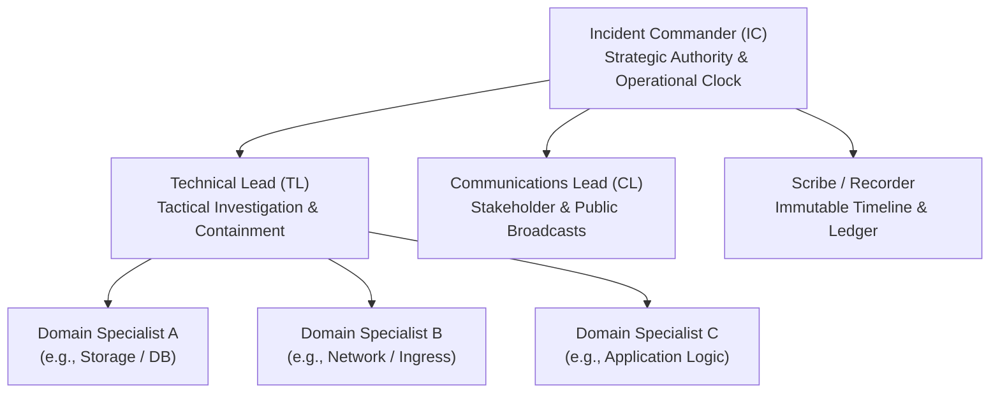
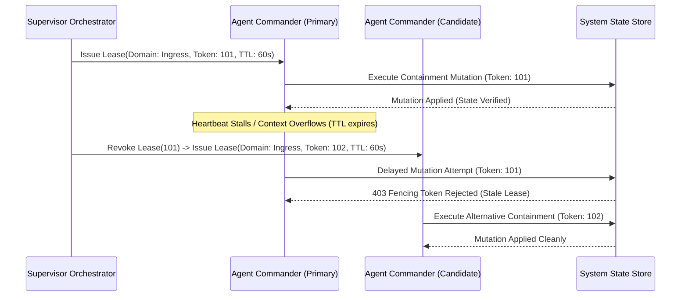
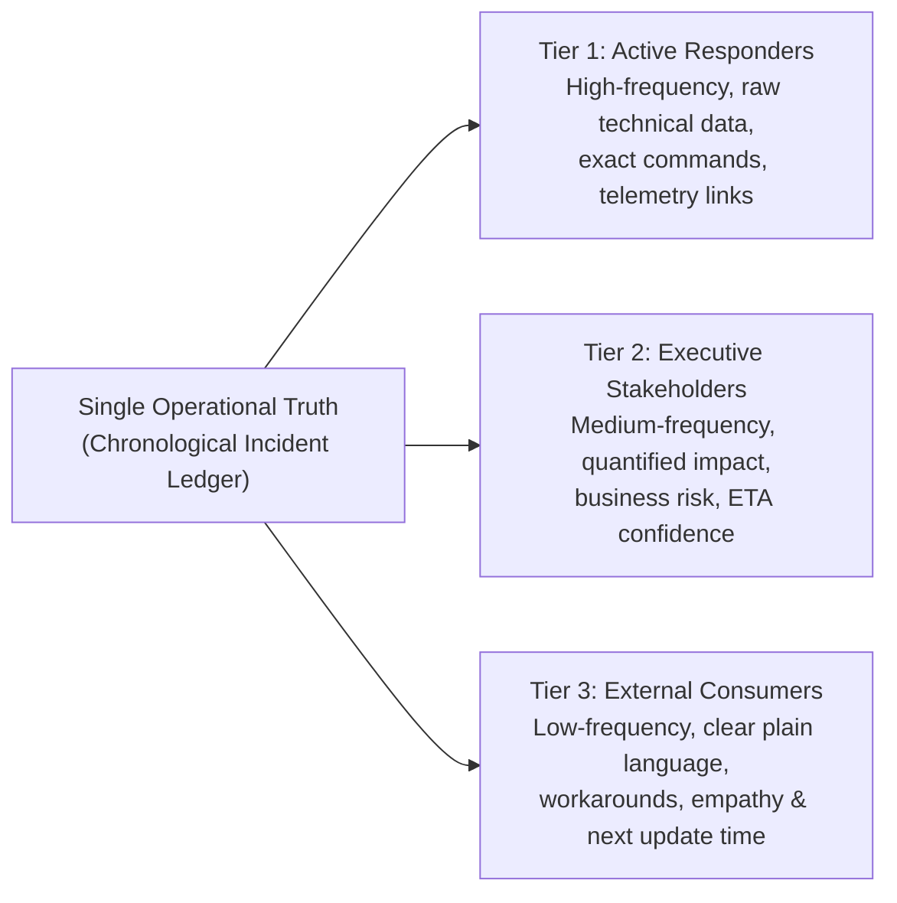
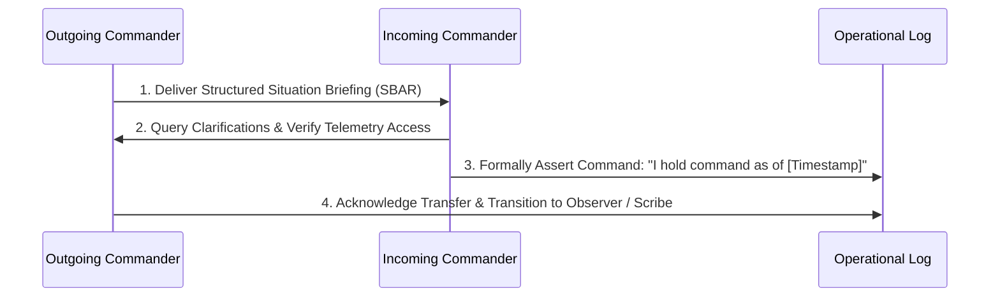

# Incident Command, Operational Roles & Stakeholder Communication

> **Mandate**: *In an operational crisis, ambiguous authority and fragmented communication are as lethal as the technical fault itself.*  
> 
> Incident Command is the sociotechnical discipline of establishing clear operational hierarchy, unbroken command ownership, and synchronized communication during high-stress system degradations. Whether executed by human SREs, autonomous AI agents, or hybrid teams, the operational state must maintain a single source of truth, an immutable audit log, and transparent, cadence-driven broadcasts to all impacted parties.

---

## 1 · The Universal Incident Command System (ICS)

Adapted from classical emergency response for distributed computational systems, the Incident Command System decouples strategic oversight from tactical execution:



### Core Role Specifications

| Role | Primary Responsibility | Explicit Authority | Strictly Prohibited Actions |
| :--- | :--- | :--- | :--- |
| **Incident Commander (IC)** | Sets operational strategy; establishes severity; decides containment trade-offs; manages cadence clock. | Supreme decision authority on rollbacks, traffic shedding, and resource allocation. | Never writes code, executes CLI queries, or investigates root causes directly. |
| **Technical Lead (TL)** | Directs tactical troubleshooting; formulates hypotheses; designs safe containment mutations. | Assigns diagnostic tasks to domain specialists; approves technical command execution. | Never broadcasts status to stakeholders or overrides IC strategy without consultation. |
| **Communications Lead (CL)** | Crafts and delivers synchronized status broadcasts; shields technical responders from external noise. | Full authority over external status page updates and executive briefings. | Never engages in technical debugging or makes unauthorized speculative ETA promises. |
| **Scribe / Recorder** | Records real-time chronology, tool outputs, hypotheses, configuration deltas, and state changes. | Requests clarification on timestamps, command results, and active decisions. | Never modifies historical log entries; maintains an append-only timeline. |

---

## 2 · Tokenized Command Leases for Autonomous AI Agents

In multi-agent systems, centralized human command structures can become catastrophic bottlenecks. To prevent agent thrashing, split-brain command, or deadlock, incident authority is formalized as a **Cryptographic Command Lease**:

$$\mathcal{L} = \langle \text{AgentID}, \; \mathcal{D}_{\text{scope}}, \; \tau_{\text{start}}, \; \tau_{\text{expire}}, \; \nu_{\text{fencing\_token}} \rangle$$



### Protocol Invariants for Agent Command
1. **Fencing Token Enforcement**: Every operational mutation must include the active fencing token $\nu$. The target system must reject mutations carrying $\nu \le \nu_{\text{current\_max}}$, preventing stale or delayed agent commands from corrupting state.
2. **Heartbeat & Dead-Man Switch**: An agent holding an IC lease must emit a structured heartbeat at interval $T_{\text{heartbeat}} \le \frac{1}{3} T_{\text{lease\_ttl}}$. If two consecutive heartbeats are missed, the supervisor orchestrator automatically revokes the lease and initiates failover.
3. **Topological Partitioning**: When an incident spans orthogonal domains ($G_A \cap G_B = \emptyset$), the Global Incident Commander delegates bounded sub-leases to specialized Domain Leads, allowing concurrent, non-interfering containment.

---

## 3 · The 3-Tier Audience Communication Matrix

During an operational incident, information requirements diverge fundamentally across audiences. Responders must never emit internal technical jargon to public consumers or broad, vague summaries to technical engineers:



| Audience Tier | Focus & Metrics | Update Cadence | Tone & Content Rules |
| :--- | :--- | :--- | :--- |
| **Tier 1: Internal Responders** | Raw error signatures, distributed trace links, containment commands, hypothesis state. | Continuous / Real-time ($< 5\text{m}$) | Objective, terse, precise, fact-based. Zero speculation. |
| **Tier 2: Business Stakeholders** | Blast radius (users affected, revenue impact), containment progress, ETA uncertainty range. | P1: Every 15 min<br/>P2: Every 30 min<br/>P3: Every 60 min | Business impact first; transparent risk posture; no deep code details. |
| **Tier 3: External Public** | User experience impact, unaffected features, concrete temporary workarounds, committed next update timestamp. | P1: Every 30 min<br/>P2: Every 60 min (or upon milestone) | Plain human language, empathetic, zero internal architecture names, firm next update promise. |

### Cadence Formulation
The communication broadcast cadence must obey the minimum-interval rule:
$$T_{\text{broadcast}} = \min\left(T_{\text{max\_interval}}, \; \Delta t_{\text{state\_change}}\right)$$
* *Rule*: A status update **must** be emitted immediately upon any major state transition (e.g., Containment Applied, Verification Succeeded, Rollback Initiated), regardless of when the scheduled timer was set to expire.

---

## 4 · Standardized Operational Broadcast Templates

### 4.1 Tier 1: Responder Command Broadcast (Battle Board)
```markdown
### [INCIDENT COMMAND BRIEFING] - T+00:22:15
- **Incident ID**: INC-2026-0925-A
- **Severity**: P1 | Status: ACTIVE (Containment In-Flight)
- **Incident Commander**: @alice | Technical Lead: @bob
- **Confirmed Impact**: 18.2% of API requests returning 503; checkout CUJ degraded.

#### Active Actions
- **Hypothesis**: Connection pool starvation on primary relational store due to unindexed query rollout.
- **Action In-Flight**: Roll back service deployment `order-service` to commit `9f4a12`.
- **Expected Outcome**: Active thread count drops to < 40 within 90 seconds.
- **Abort Condition**: If database CPU exceeds 95% post-rollback, execute read-only shed.
```

### 4.2 Tier 2: Executive & Stakeholder Update
```markdown
### Operational Status Update: Checkout Degradation
- **Incident Tier**: P1 (Critical Outage)
- **Current Business Impact**: Customers in European and Asian regions are experiencing failure rates up to 18% during payment submission. Read-only browsing and cart operations remain fully functional.
- **Containment Strategy**: Engineering is executing an automated rollback of the latest checkout routing release.
- **Estimated Containment Time**: 15 minutes (Confidence: Moderate).
- **Next Executive Update**: 19:30 UTC (or upon state change).
```

### 4.3 Tier 3: External Consumer / Public Status Broadcast
```markdown
### Performance Issue with Checkout
**Investigating** (19:15 UTC): We are currently investigating an issue impacting payment processing for some customers. Product browsing, account management, and item search are completely unaffected.

**Workaround**: If your transaction fails, please wait a few moments before trying again. No duplicate charges have occurred.

We sincerely apologize for the disruption. Our engineering team is actively rolling out a resolution, and we will provide our next update at **19:45 UTC**, or as soon as new information is confirmed.
```

---

## 5 · Shift Handoff & Transfer of Command Protocol

When an incident spans across operational shifts or requires transfer of command authority to another human or autonomous agent, the handoff must follow this atomic 4-step protocol:



### The SBAR Handoff Briefing Structure
1. **Situation**: Current severity, duration, and user impact summary.
2. **Background**: Root triggering event (e.g., deployment, traffic surge, dependency outage), recent changes.
3. **Assessment**: Current hypotheses under evaluation, what has been ruled out, active containment state.
4. **Recommendation**: Immediate next action scheduled, pending verification signals, and fallback abort recipes.
