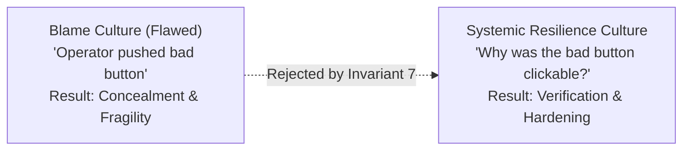
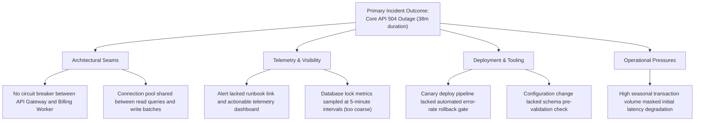
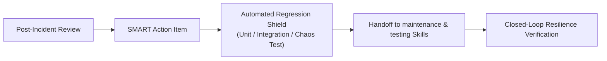

# Postmortem Analysis, Blameless Causal Modeling & Systemic Learning

> **Mandate**: *An outage without systemic learning is an unmitigated disaster; an outage transformed into verifiable resilience is an engineering investment.*  
> 
> The Post-Incident Review (PIR) is the engine of organizational and architectural evolution. Its purpose is never to assign individual blame, find a convenient scapegoat, or produce decorative documentation that gathers dust. A true postmortem conducts rigorous forensic reconstruction, maps complex sociotechnical contributing factors, rejects the superficial illusion of "human error," and converts hard-won operational experience into enforceable, automated engineering shields.

---

## 1 · The Blameless Postmortem Doctrine

Resilience engineering establishes that complex systems are inherently hazardous and operate in partially degraded states. Incidents occur when multiple latent vulnerabilities align, not because an operator or autonomous agent made a mistake:



### The Second-Order Investigation Doctrine
Whenever an operator, engineer, or autonomous agent executed an action that triggered or exacerbated an incident, the review must ask **Second-Order Questions**:
1. *What information, telemetry signals, or system states were visible to the actor at the moment of decision?*
2. *Why did that action appear logical, safe, and necessary given the system design and operational pressures at that moment?*
3. *What architectural guardrails, automated invariant checks, or safe defaults were missing that allowed a single action to produce catastrophic system-wide failure?*

---

## 2 · Distributed Timeline Reconstruction

A postmortem begins with an objective, immutable chronological ledger. Timestamps must be normalized to UTC and correlated across disparate distributed logs, command histories, telemetry alerts, and communication streams:

```mermaid
timeline
    title Incident Chronology & Operational Velocity
    18:45 UTC : Configuration push v4.2 committed
    19:02 UTC : Telemetry anomaly begins (Internal latency drift)
    19:07 UTC : First alert fires (MTTD: 5m from onset)
    19:12 UTC : Incident declared; IC lease issued (MTTI: 5m from alert)
    19:24 UTC : Traffic shedding applied (MTTC: 12m from command)
    19:48 UTC : Permanent rollback verified & soaked (MTTR: 41m from declaration)
```

### Operational Velocity Metrics

| Metric | Full Name | Formal Definition | Target Objective |
| :--- | :--- | :--- | :--- |
| **MTTD** | **Mean Time to Detect** | $t_{\text{alert}} - t_{\text{onset}}$ | $< 5\text{ minutes}$ |
| **MTTI** | **Mean Time to Identify / Acknowledge** | $t_{\text{declaration}} - t_{\text{alert}}$ | $< 5\text{ minutes}$ |
| **MTTC** | **Mean Time to Contain** | $t_{\text{stabilized}} - t_{\text{declaration}}$ | $< 30\text{ minutes}$ |
| **MTTR** | **Mean Time to Resolve** | $t_{\text{verified\_resolved}} - t_{\text{declaration}}$ | $< 60\text{ minutes}$ |

---

## 3 · Causal Factor Trees (Moving Beyond the "5-Whys")

The traditional "5-Whys" approach is fatally flawed: it forces complex, non-linear, multi-variable sociotechnical failures into a single artificial linear thread. Modern postmortems construct a **Causal Factor Tree**:



### Contributing Factor Categories
1. **Architectural & Systemic**: Missing circuit breakers, unbounded queues, lack of bulkhead isolation, shared single-point-of-failure storage.
2. **Telemetry & Observability**: Late alerting, high-cardinality blindness, missing distributed trace context, lack of actionable runbook links.
3. **Deployment & Automation**: Missing canary verification stages, non-atomic configuration pushes, unvalidated migration scripts.
4. **Resilience & Governance**: Missing rate limits, lack of load-shedding defaults, outdated runbooks, unclear escalation paths.

---

## 4 · SMART Action Item Contracts (Closed-Loop Learning)

An incident postmortem is considered unverified theater unless every causal factor is mapped to an enforceable engineering work contract:

$$\forall \text{Action } a \in \text{PIR}, \quad a = \langle \text{TicketID}, \; \text{Owner}, \; \text{Priority}, \; \text{DueDate}, \; \text{VerifiableTest} \rangle$$



### The Action Item Quality Rubric

| Defective Anti-Pattern (Prohibited) | SMART Engineering Contract (Mandatory) |
| :--- | :--- |
| ❌ *"Remind engineers to be more careful when running migrations."* | ✅ **Add automated pre-flight lint check** in CI that fails builds if migrations contain non-concurrent index creation. *(Owner: @devops, Due: Oct 12, PR #412)* |
| ❌ *"Improve database monitoring."* | ✅ **Instrument real-time lock contention metric** with a 1-minute alert firing if exclusive table locks exceed 30 seconds. *(Owner: @dba, Due: Oct 5, Ticket #881)* |
| ❌ *"Write a runbook for billing failures."* | ✅ **Author and verify executable runbook** `runbooks/billing-failover.md` tested in staging via simulated partition. *(Owner: @lead, Due: Oct 19, Ticket #890)* |

---

## 5 · Standard Blameless PIR Document Template

```markdown
# Post-Incident Review: [Incident Title / ID]

## Executive Summary
- **Date & Duration**: YYYY-MM-DD (Duration: X hours, Y minutes)
- **Severity**: P1 / P2
- **Incident Commander**: [Name/Agent ID] | **Lead Investigator**: [Name/Agent ID]
- **Customer Impact**: [Quantified impact, e.g., 14,200 users impacted, 3.4% of total daily transactions]

## Operational Velocity
- **MTTD**: Xm | **MTTI**: Ym | **MTTC**: Zm | **MTTR**: Wm

## Chronological Timeline (UTC)
- **HH:MM** - Event description...
- **HH:MM** - Anomaly detected...
- **HH:MM** - Containment action applied...
- **HH:MM** - Verification confirmed; incident closed...

## Systemic Causal Factor Tree
- [Detail contributing factors across Architecture, Telemetry, Deployment, and Governance]

## What Went Well / What Went Poorly / Where We Got Lucky
- **What Went Well**: [e.g., Containment rollback executed within 4 minutes]
- **What Went Poorly**: [e.g., Initial alert paged the wrong engineering team]
- **Where We Got Lucky**: [e.g., Degradation occurred during off-peak hours]

## Enforceable Action Items
| Ticket ID | Description | Priority | Owner | Due Date | Regression Verification Test |
| :--- | :--- | :--- | :--- | :--- | :--- |
| `SEC-401` | Add circuit breaker to Billing API | P1 | @alice | YYYY-MM-DD | `tests/test_billing_circuit.py` |
| `OBS-208` | Instrument lock wait time SLI | P2 | @bob | YYYY-MM-DD | `alerts/db_lock_sli_test.go` |
```
