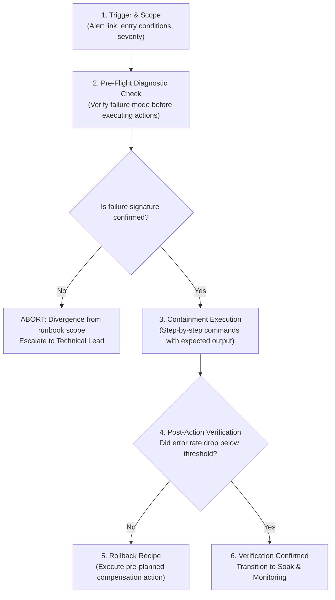
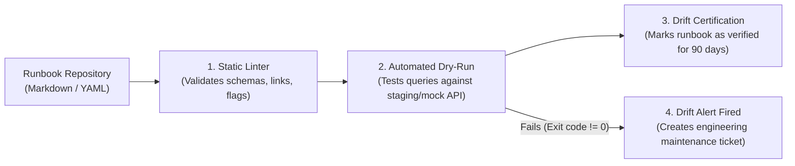

# Runbook Engineering, Continuous Verification & Readiness Scenarios

> **Mandate**: *An unverified runbook is an untested assumption; an outdated runbook is an operational hazard.*  
> 
> Incident runbooks are executable operational contracts designed to minimize cognitive friction, eliminate guesswork, and compress Mean Time to Containment (MTTC). To remain effective, runbooks must not exist as stale wiki pages. They must be treated as version-controlled code, continuously tested against environmental drift, structured with clear pre-flight checks and rollback recipes, and validated through non-destructive tabletop fire-drills and chaos engineering scenarios.

---

## 1 · The Anatomy of an Executable Runbook

An industrial-grade, timeless incident runbook adheres to this strict structural schema:



### Runbook Specification Schema (YAML Standard)

```yaml
id: RBK-STORAGE-004
title: Primary Relational DB Connection Pool Starvation
severity_scope: [P1, P2]
author: SRE Resilience Group
last_verified: "2026-09-15"
prerequisites:
  - Read access to database telemetry
  - Administrative access to ingress rate limiter config
  - Working command terminal with database client installed

trigger_criteria:
  alert_name: DBClientConnectionExhaustion
  metric_query: "db_connections_active / db_connections_max > 0.90"
  duration_window: ">= 3 minutes"

pre_flight_checks:
  - description: "Verify active lock contention"
    command: "SELECT count(*) FROM pg_stat_activity WHERE wait_event_type = 'Lock';"
    expected_signal: "Value > 25 indicates contention; continue to containment."
    abort_condition: "Value < 5 indicates starvation caused by external connection leak, not locks. Abort to RBK-STORAGE-008."

containment_actions:
  - step: 1
    description: "Shed background reporting workloads from connection pool"
    command: "curl -X POST https://config-control.internal/flags/disable-background-sync"
    expected_output: '{"status": "applied", "drained_connections": 45}'
    timeout: 30s
  - step: 2
    description: "Clamp ingress request rate to 75% baseline"
    command: "curl -X PUT https://ingress-control.internal/rate-limits/global -d '{\"rate\": 1500}'"
    expected_output: '{"rate": 1500, "status": "active"}'
    timeout: 15s

rollback_recipe:
  - step: 1
    description: "Restore baseline ingress rate limits"
    command: "curl -X PUT https://ingress-control.internal/rate-limits/global -d '{\"rate\": 2000}'"
  - step: 2
    description: "Re-enable background reporting workloads"
    command: "curl -X POST https://config-control.internal/flags/enable-background-sync"

post_verification:
  query: "SELECT (count(*) * 100.0 / 500) FROM pg_stat_activity;"
  success_criterion: "Active connection percentage drops to < 65% within 120 seconds."
  escalation_path: "If connection count remains > 85%, page Storage Specialist via Escalation Tier 2."
```

---

## 2 · Runbook Drift Detection & Continuous Verification

Runbooks decay rapidly as underlying software architectures, CLI tools, configuration schemas, and network topologies evolve. Apply the **Continuous Runbook Verification Protocol**:



### Anti-Drift Governance Rules
1. **Treat Runbooks as Code**: Every runbook must reside in version-controlled repositories alongside service code, reviewed via pull requests, and subject to peer review.
2. **Automated Diagnostic Canarying**: Pre-flight queries and diagnostic commands must be executed automatically in continuous integration or staging environments on a recurring schedule (e.g., weekly) to verify that table names, flag names, and metrics have not been renamed or deprecated.
3. **90-Day Freshness Expiration**: If a runbook has not been exercised in an actual incident, staging dry-run, or tabletop drill within 90 days, its certification lapses and an automated task is routed to `maintenance`.

---

## 3 · Tabletop Fire-Drills & Readiness Scenarios (Game Days)

Resilience is a muscle built through simulated stress. Organizations and autonomous agent systems must conduct recurring, non-destructive fire-drills to validate operational muscle memory:

```mermaid
sequenceDiagram
    participant Fac as Drill Facilitator (Game Master)
    participant Res as Incident Responders (Team / Agents)
    participant Obs as Telemetry & Observer

    Fac->>Obs: 1. Inject Synthetic Fault (e.g., Emulate third-party timeout in staging)
    Obs-->>Res: 2. Alert Fires: BillingGatewayTimeout
    Note over Res: Responders initiate Arc I (Detect, Confirm, Assess, Declare)
    Res->>Fac: 3. Declare P2 Incident; Assign Incident Commander Lease
    Res->>Obs: 4. Execute Pre-Flight Query & Apply Containment (RBK-BILLING-002)
    Obs-->>Res: 5. Verify Circuit Breaker Trips; Fallback Cache Served
    Res->>Fac: 6. Deliver Structured Status Broadcast & Verify Closure
    Fac->>Res: 7. Conduct Hot Debrief: Audit MTTD, MTTC, and Cognitive Friction
```

### Standard Tabletop Drill Scenarios

| Drill Archetype | Simulated Fault Injection | Key Responder Verification Target |
| :--- | :--- | :--- |
| **Scenario 1: Downstream Dependency Outage** | Inject high latency ($5000\text{ms}$) and 503 errors into mock payment/auth API. | Does the team activate circuit breaking within 5 minutes, or do upstream threads saturate? |
| **Scenario 2: Poison Pill Input Surge** | Send malformed JSON payload that crashes worker deserialization logic repeatedly. | Does the team isolate and dead-letter the poison pill, or do they enter an infinite restart loop? |
| **Scenario 3: Split-Brain Network Partition** | Drop network packets between primary database and secondary read replica. | Does the system enforce fencing tokens and reject stale reads without dual-primary corruption? |
| **Scenario 4: Secret / Certificate Revocation** | Revoke internal service authentication token or expire TLS certificate. | Can responders execute emergency certificate rotation runbook without system restarts? |

### Post-Drill Evaluation Rubric
Following every drill, evaluate responder performance across 4 objective metrics:
1. **Command Velocity**: Was an Incident Commander established in $< 5\text{ minutes}$?
2. **Containment Discipline**: Did responders apply safe, reversible containment before attempting code debugging?
3. **Epistemic Hygiene**: Were hypotheses explicitly separated from verified facts in the incident log?
4. **Runbook Accuracy**: Did the runbook commands execute without syntax errors, missing permissions, or unexpected prompts?
