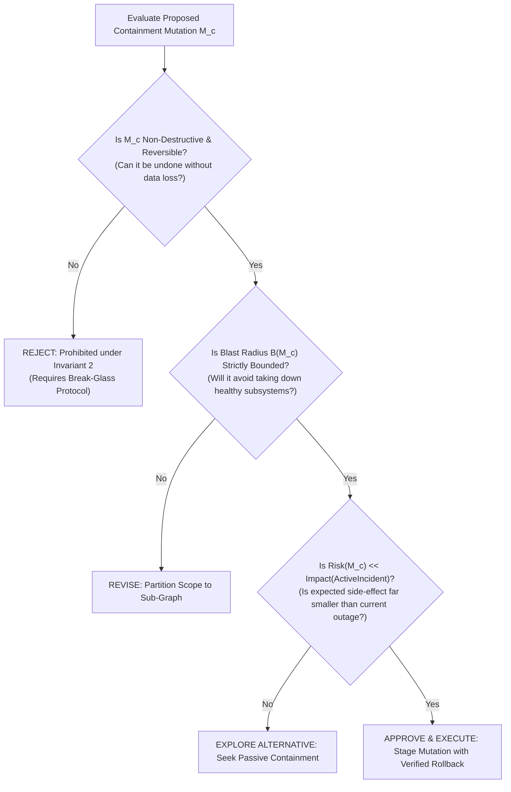
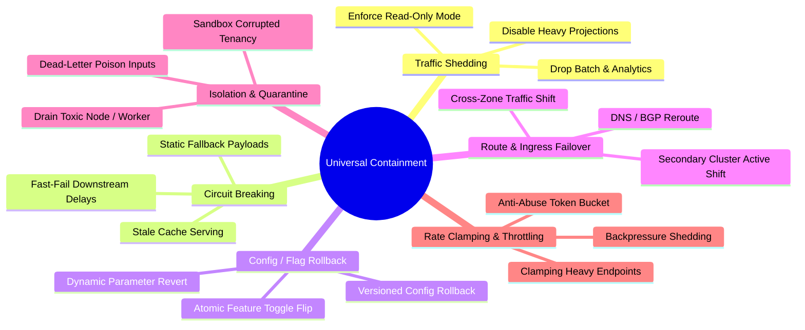
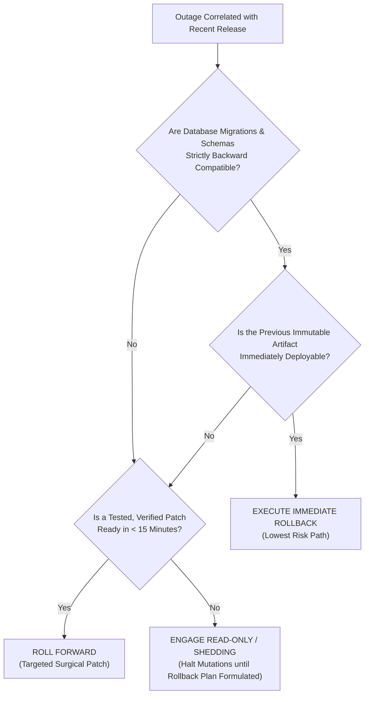
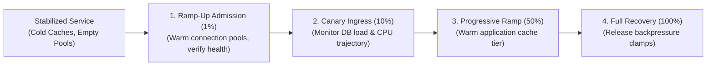

# Stabilization, Containment & Mitigation Patterns

> **Mandate**: *When an active system is hemorrhaging, stop the bleeding before performing the autopsy.*  
> 
> Containment is the disciplined application of safe, reversible operational mutations designed to rapidly decouple users from active system failures. Responders must resist the intellectual temptation to troubleshoot root causes while users suffer degraded service. However, containment must never be blind gambling: every containment action must satisfy the **Safe Containment Gate**, enforce pre-computed blast-radius boundaries, and provide an instant rollback mechanism.

---

## 1 · The Safe Containment Gate

Before applying any operational containment mutation $M_c$, the Incident Commander and Technical Lead must evaluate this formal gate:

$$\text{Authorize}(M_c) \iff \text{Reversible}(M_c) \land \mathcal{B}(M_c) \subseteq \mathcal{B}_{\text{safe}} \land \mathbb{E}[\text{Harm}(M_c)] \ll \mathbb{E}[\text{Harm}(\text{Outage})]$$

---

## 2 · The 6 Universal Containment Archetypes

Regardless of technology or cloud provider, every resilient computing architecture stabilizes via these 6 fundamental containment patterns:

### Archetype Specifications

| Archetype | Mechanism & Action | Primary Failure Modes Addressed | Reversibility Vector |
| :--- | :--- | :--- | :--- |
| **1. Traffic Shedding & Load Dropping** | Reject or defer non-essential traffic (e.g., report exports, background sync, image transcode) to preserve core transaction throughput. | CPU saturation, database connection exhaustion, memory thrashing. | Re-enable deferred queues once latency returns to normal envelope. |
| **2. Circuit Breaking & Fallbacks** | Intercept calls to failing downstream dependencies; return static default responses or stale cached data immediately ($< 1\text{ms}$). | Cascading latency collapse, thread pool starvation, third-party API outage. | Reset circuit breaker to half-open state once probe passes. |
| **3. Feature Flag / Config Rollback** | Flip runtime feature flags or restore previous immutable configuration version without redeploying binaries. | Bad feature rollout, incorrect threshold tuning, unindexed query activation. | Re-enable feature flag in lower staging environment. |
| **4. Ingress / Route Failover** | Divert ingress traffic away from the degraded cluster, region, or database replica to a healthy standby. | Infrastructure hardware fault, regional network partition, localized cluster corruption. | Shift DNS or routing weights back after post-incident verification. |
| **5. Process Isolation & Drain** | Remove degraded worker nodes from active load balancer pool; quarantine poison pill inputs into a dead-letter queue. | Memory leak, runaway thread lockup, toxic input payloads causing repeated crashes. | Unquarantine worker after process restart and diagnostic snapshot. |
| **6. Rate Clamping & Backpressure** | Enforce aggressive rate limits on aggressive client IPs, anomalous query patterns, or unauthenticated traffic surges. | Distributed denial-of-service, rogue internal batch script, runaway consumer loop. | Restore standard rate limits after client throttles back. |

---

## 3 · The Rollback vs. Roll-Forward Decision Lattice

When an incident is triggered by a recent release, configuration push, or migration, responders must choose whether to roll back or roll forward:

### Mandatory Rollback Preconditions
A rollback is authorized **only if**:
1. **Schema Non-Destructiveness**: The new release did not execute non-backward-compatible database schema changes (e.g., dropped columns, altered column types, non-null constraints without defaults).
2. **Message Contract Invariance**: Serialized payloads or message queues can be decoded by the older binary version without deserialization failure.
3. **Verified Artifact Fingerprint**: The rollback target is the exact, uncorrupted binary/container digest that previously ran successfully in production.

---

## 4 · Damped Recovery & Anti-Thundering-Herd Protocols

The most dangerous moment of an incident is often the recovery phase. Abruptly restoring full traffic to a cold system routinely triggers secondary, catastrophic re-collapse.

### The 4-Stage Damped Ramp-Up Protocol
1. **Stage 1 — Cold-Cache Protection & Pre-Warming**:
   - Before routing user requests to restarted instances, execute synthetic warming queries for high-cardinality keys.
   - Forbid empty cache stampedes: enforce probabilistic early expiration or single-flight mutex locks on cache misses.
2. **Stage 2 — Exponential Jittered Admission**:
   - When reconnecting millions of clients or queue consumers, apply randomized backoff jitter:
     $$T_{\text{reconnect}} = \min(T_{\text{max}}, \; U(0, \; 2^{\text{attempt}} \times T_{\text{base}}))$$
   - Prevent all clients from retrying simultaneously at exact 1-minute intervals.
3. **Stage 3 — Stepped Ingress Admission**:
   - Route traffic through a canary valve: admit $1\%$ for 3 minutes $\to 10\%$ for 5 minutes $\to 50\%$ for 5 minutes $\to 100\%$.
   - Continuously evaluate error rates and latency percentiles ($P_{99}$) at each step. If $P_{99}$ exceeds $2\times$ baseline, freeze the ramp immediately.
4. **Stage 4 — Queue Drain Rate Limiting**:
   - Never allow stalled message queues to dump millions of accumulated backlogged jobs into downstream databases at maximum line rate.
   - Clamp consumer concurrency until the backlog is safely drained below critical watermarks.
