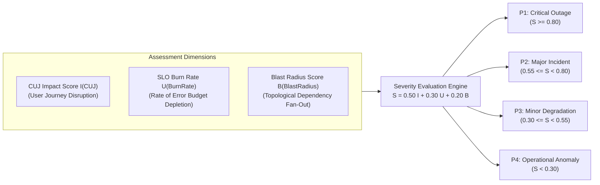
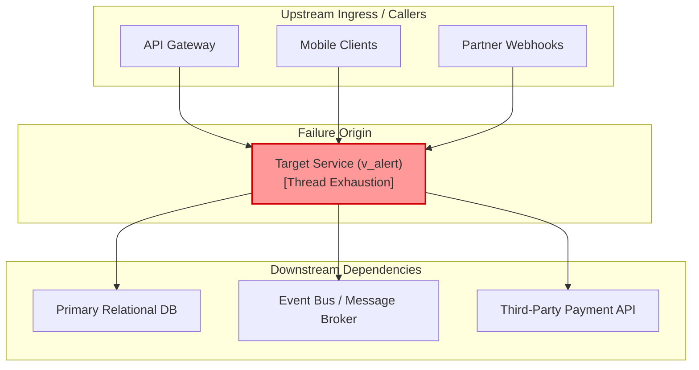
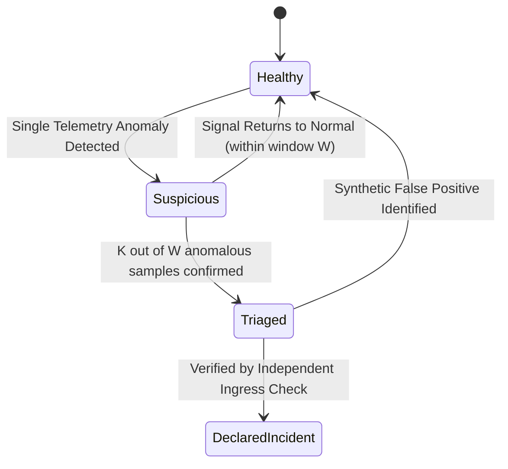

# Triage, Severity Classification & Blast Radius Assessment

> **Mandate**: *Severity is an objective function of user harm, systemic blast radius, and SLO burn rate, not an emotional reaction to panic.*  
> 
> Triage is the critical epistemic gateway of incident response. In the opening moments of an operational disturbance, the responding agent or human engineer must cut through telemetry noise, de-bounce transient flapping, calculate the true topological blast radius, and grade the severity tier with mathematical consistency. Under-grading severity leaves users suffering unmanaged outages; over-grading severity triggers alert fatigue, exhausts engineering reserves, and induces organizational thrashing.

---

## 1 · The Mathematical Severity Formulation

Severity ($S$) is computed as a weighted composite score across three orthogonal operational dimensions:

$$S = w_I \cdot I(\text{CUJ}) + w_U \cdot U(\text{BurnRate}) + w_B \cdot B(\text{BlastRadius})$$

Where weights are normalized such that $w_I + w_U + w_B = 1.0$ (standard baseline: $w_I = 0.50$, $w_U = 0.30$, $w_B = 0.20$).

### Dimensional Scoring Definitions

#### 1. Critical User Journey (CUJ) Impact $I \in [0.0, 1.0]$
* **$1.0$ (Catastrophic)**: Core revenue-generating, safety-critical, or identity/authentication user journey is completely broken; users cannot transact or authenticate; data loss is occurring.
* **$0.7$ (Severe)**: Core user journey is degraded with high failure rate ($> 10\%$) or unacceptably high latency ($P_{99} > 10\times$ normal baseline); no workaround exists.
* **$0.4$ (Moderate)**: Secondary or auxiliary user journey broken (e.g., exporting reporting PDFs, updating profile avatars); primary transaction flow remains operational.
* **$0.1$ (Negligible)**: Cosmetic or non-blocking defect; edge case impacting fewer than $0.1\%$ of active requests.

#### 2. SLO Error Budget Burn Rate $U \in [0.0, 1.0]$
Calculated relative to the multi-window multi-burn-rate standard (from [`observability`](../../observability/SKILL.md)):
$$U = \min\left(1.0, \; \frac{\text{Current Burn Rate}}{\text{Critical Burn Rate Ceiling (14.4x)}}\right)$$
* **$1.0$ (Emergency Burn)**: Burn rate $\ge 14.4\times$ ($2\%$ of monthly error budget consumed in 1 hour; entire budget gone in 2 days).
* **$0.6$ (High Burn)**: Burn rate $\ge 6.0\times$ ($5\%$ of monthly budget consumed in 6 hours).
* **$0.3$ (Moderate Burn)**: Burn rate $\ge 1.0\times$ ($100\%$ budget consumed over 30 days if sustained).
* **$0.0$ (Zero Burn)**: Error rate within normal operating envelope.

#### 3. Topological Blast Radius $B \in [0.0, 1.0]$
Calculated as the fraction of downstream systems, partitions, and tenants impacted:
$$B = \frac{|\text{Affected Partitions}|}{|\text{Total Partitions}|} \times \left(1 + \frac{|\text{Downstream Dep Fan-Out}|}{|\text{Max Dependency Depth}|}\right)$$

---

## 2 · Standard Severity Tier Classification Matrix

| Tier | Severity Description | Operational SLA | Command Structure | Stakeholder Cadence |
| :--- | :--- | :--- | :--- | :--- |
| **P1** | **Critical Outage / Crisis**: Total loss of a core business service, existential security breach, active data corruption, or catastrophic customer impact. | Immediate response ($< 5\text{m}$). Containment target: $< 30\text{m}$. | Dedicated Incident Commander, Technical Lead, Communications Lead, Scribe. | Broadcasts every 15 minutes. |
| **P2** | **Major Incident**: Severe degradation of a primary workflow, partial redundancy failure, or moderate error rate ($> 5\%$) affecting critical tenants. | Response within $15\text{m}$. Containment target: $< 2\text{h}$. | Incident Commander + Technical Lead. | Broadcasts every 30 minutes. |
| **P3** | **Minor Degradation**: Non-critical feature failure, transient latency spike, or localized failure with a readily available workaround. | Response within $1\text{h}$. Resolution target: $< 24\text{h}$. | Single Incident Lead + Domain Specialist. | Hourly or milestone-based updates. |
| **P4** | **Operational Anomaly**: Diagnostic metric threshold exceeded, single worker retry spike, non-blocking test flakiness, zero customer impact. | Response during normal operating cycle. | Single responding engineer / agent. | Logged in normal operational record. |

---

## 3 · Blast Radius Cartography & Dependency Traversal

During triage, assessing blast radius requires tracing the dependency graph $G = (V, E)$ both upstream and downstream from the reporting node $v_{\text{alert}}$:

### Cartographic Rules
1. **Downstream Blast Fan-Out**:
   $$\mathcal{B}_{\text{downstream}}(v) = \{ u \in V \mid \exists \text{ path from } v \text{ to } u \text{ in } G \}$$
   If $v$ fails, does it cause cascading timeouts, unhandled backpressure, or connection leaks in its dependents?
2. **Upstream Ingress Choke Points**:
   $$\mathcal{B}_{\text{upstream}}(v) = \{ w \in V \mid \exists \text{ path from } w \text{ to } v \text{ in } G \}$$
   Which entry points and client applications depend on $v$ to complete their synchronous transactions?
3. **Partition & Tenant Isolation**:
   Verify whether the disturbance is cellular (confined to a single shard, tenant, or availability zone) or global. If isolated to tenant $T_k$, clamp the blast radius by shedding or quarantining tenant $T_k$ rather than restarting the shared cluster.

---

## 4 · Signal De-Bouncing & False-Alarm Suppression

Responders must never initiate high-severity incident protocols on transient metric blips, monitor network hiccups, or synthetic test harness glitches. Apply the **Sliding Window De-Bounce Filter**:

### The $K/W$ Verification Rule
A failure signal is verified as an active incident **if and only if**:
$$\sum_{i=0}^{W-1} \mathbb{I}(\text{Sample}_{t-i} \in \text{Anomalous}) \ge K$$
* **Standard Thresholds**: For a 1-minute sampling interval, require $K = 3$ consecutive anomalous samples over a window of $W = 5$ minutes before declaring P1/P2.
* **Independent External Validation**: Before paging the full command team, verify the signal against an orthogonal external metric (e.g., if CPU utilization shows $100\%$, cross-check whether ingress request latency or error rate has actually degraded; if ingress error rate is flat, investigate monitoring probe malfunction first).

---

## 5 · Step-by-Step Triage Execution Checklist

1. **Ingest Signal**: Capture raw timestamp, reporting probe, and threshold delta.
2. **De-Bounce Check**: Check if signal persisted across $K=3$ consecutive intervals.
3. **Calculate CUJ Disruption**: Identify which critical paths are failing.
4. **Compute Severity $S$**: Apply $S = 0.50 I + 0.30 U + 0.20 B$.
5. **Classify Tier**: Map $S$ into P1, P2, P3, or P4.
6. **Assign Incident Command Lease**: If $S \ge \text{P2}$, formally issue the Incident Commander lease and open the incident ledger.
