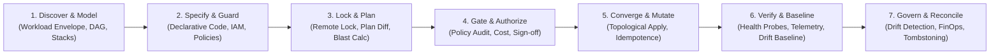

# Infrastructure Engineering: Universal Resource Topology & State Convergence Protocol

> **Mandate**: *Infrastructure is the receptive computational substrate, resource topology, and security perimeter upon which software systems, data pipelines, and autonomous agent swarms execute.* Infrastructure engineering does not prescribe tools or cloud vendors; it is an invariant discipline governing declarative desired state, acyclic dependency graph execution, partitioned state blast-radius containment, two-phase plan-apply verification, zero-trust network boundaries, brownfield unmanaged resource adoption, and continuous drift reconciliation. True infrastructure engineering preserves agent creativity, rejects platform dogma, and guarantees that every computational foundation is reproducible, auditable, secure, and recoverable across any runtime environment.

---

## 1 · The 7-Stage Universal Infrastructure Lifecycle

Every infrastructure task—from spinning up a local test container to orchestrating a global multi-region cloud topology or provisioning an autonomous GPU cluster—traverses this closed-loop lifecycle:



1. **Stage 1 — Discover & Model (Workload & Topology Discovery)**: Model capacity constraints (CPU, RAM, IOPS, latency, throughput). Decompose the environment into decoupled stack tiers (Network $\to$ Data $\to$ Compute $\to$ Ingress) to isolate failure blast radius. In brownfield environments, discover and inventory existing physical or cloud assets (see [`references/stack-composition-and-dependency-dags.md`](references/stack-composition-and-dependency-dags.md) and [`references/brownfield-discovery-and-resource-import.md`](references/brownfield-discovery-and-resource-import.md)).
2. **Stage 2 — Specify & Guard (Declarative Specification & Shift-Left Policy)**: Declare target resources in version-controlled manifests. Enforce resource attribution tags, default-deny network microsegmentation, and zero-trust IAM matrices. Execute pre-commit syntax linting and policy-as-code evaluations (see [`references/iac-security-and-policy-guardrails.md`](references/iac-security-and-policy-guardrails.md) and [`references/network-topology-and-perimeter-defense.md`](references/network-topology-and-perimeter-defense.md)).
3. **Stage 3 — Lock & Plan (Atomic State Locking & Plan Diff Generation)**: Acquire an atomic distributed state lock with lease TTL. Refresh recorded state against live reality ($S_{\text{observed}}$). Compute the exact plan diff $\mathcal{P} = S_{\text{desired}} \ominus S_{\text{observed}}$ and calculate the blast-radius risk metric $R_{\text{blast}}$ (see [`references/desired-state-and-drift-engine.md`](references/desired-state-and-drift-engine.md)).
4. **Stage 4 — Gate & Authorize (Reviewability & Approval Gate)**: Inspect planned resource creations, in-place updates, and destructions. Validate cost impact against FinOps thresholds. For high blast-radius changes or stateful data store recreations, obtain explicit human authorization before mutating physical reality.
5. **Stage 5 — Converge & Mutate (Idempotent Topological Apply)**: Apply mutations strictly along the topological ordering of the dependency graph ($G = (V, E)$). Handle provider eventual consistency with jittered exponential backoffs. Commit updated physical bindings to the remote encrypted state ledger ($S_{\text{recorded}}$).
6. **Stage 6 — Verify & Baseline (Mechanical Verification & Drift Baseline)**: Execute mechanical connectivity and health probes (socket bindings, DNS resolution, IAM assumption). Verify telemetry scaffolding (VPC flow logs, audit logs, saturation metrics). Seal the post-apply state checksum as the active drift baseline.
7. **Stage 7 — Govern & Reconcile (Continuous Drift, FinOps & Decommissioning)**: Run scheduled drift detection loops to catch out-of-band mutations. Reclaim orphaned and unattached resources. Execute reverse-topological decommissioning with mandatory pre-destroy snapshots for stateful storage (see [`references/finops-and-resource-lifecycle.md`](references/finops-and-resource-lifecycle.md)).

---

## 2 · Progressive Disclosure (Reference Routing)

To prevent cognitive overload and preserve LLM context bandwidth, **never load all reference manuals simultaneously**. Consult reference manuals strictly on demand based on task context:

| Context Trigger | Mandatory Reference Manual | Purpose & Load-Bearing Contents |
| :--- | :--- | :--- |
| **State backends, remote locking, state corruption, drift detection, GitOps** | [`references/desired-state-and-drift-engine.md`](references/desired-state-and-drift-engine.md) | State Triad ($S_{\text{desired}} \iff S_{\text{recorded}} \iff S_{\text{observed}}$), distributed locking, lease TTLs, stale lock recovery, drift distance metric $\Delta$, zero-churn NoOp reconciliation. |
| **Multi-stack design, monolithic state refactoring, DAGs, cross-stack wiring** | [`references/stack-composition-and-dependency-dags.md`](references/stack-composition-and-dependency-dags.md) | 5-tier stack hierarchy, topological ordering ($u \prec v$), state partitioning ($\mathcal{S} = \bigcup S_i$), output contracts, resolving circular deadlocks via Acyclic Decoupling. |
| **Existing cloud resources, unmanaged infrastructure, clickops remediation** | [`references/brownfield-discovery-and-resource-import.md`](references/brownfield-discovery-and-resource-import.md) | 4-phase non-destructive adoption, live discovery scans, declarative code synthesis, atomic state binding, Zero-Churn Import Invariance Rule ($\mathcal{P} = \emptyset$). |
| **VPC, CIDR, subnets, routing, VPN, Transit Gateway, firewalls, private endpoints** | [`references/network-topology-and-perimeter-defense.md`](references/network-topology-and-perimeter-defense.md) | Non-overlapping CIDR math, 3-tier subnet topology (Public/Private/Isolated), transit hubs, security group microsegmentation, PrivateLink, VPC flow logs. |
| **IAM roles, least privilege, security scanning, CIS compliance, secrets** | [`references/iac-security-and-policy-guardrails.md`](references/iac-security-and-policy-guardrails.md) | Shift-left security pipeline, OIDC federation, zero static keys, policy-as-code (OPA/Rego), CIS benchmarks, KMS envelope encryption, secret reference pointers. |
| **Cloud costs, instance right-sizing, idle resources, deprovisioning, snapshots** | [`references/finops-and-resource-lifecycle.md`](references/finops-and-resource-lifecycle.md) | Workload envelope capacity planning, mandatory 5-tag FinOps schema, orphan asset reaping (unattached disks/EIPs), reverse-topological teardown, Pre-Destroy Snapshot Gate. |
| **AI agent hosts, GPU provisioning, Slurm, Ray, MCP infrastructure, vector DBs** | [`references/agentic-infrastructure-and-compute-fabrics.md`](references/agentic-infrastructure-and-compute-fabrics.md) | GPU interconnect topologies (NVLink/InfiniBand), NUMA node affinity, Slurm/Ray cluster manifests, sandboxed MCP server hosting, vector database sizing, isolated code execution microVMs. |

---

## 3 · Adaptive Cognitive Sizing (The 6 Execution Modes)

Size your infrastructure engineering effort to the task's scope and risk profile. Never apply heavy enterprise bureaucracy to a local container sandbox, and never execute speculative, unverified mutations across high-blast-radius production environments:

| Mode | Trigger & Scope | Engineering Discipline | Required Output & Protocol |
| :--- | :--- | :--- | :--- |
| **`ephemeral-local`** | Local dev harnesses, Docker Compose, Kind/K3s clusters, LocalStack, throwaway test sandboxes (< 200 lines). | Rapid spin-up/teardown, zero remote state locking boilerplate, local port mapping. **Zero red tape**. | **3-Line Infrastructure Intent Block** directly preceding execution. |
| **`module-contract`** | Creating or editing reusable infrastructure modules (Terraform, Pulumi components, Helm charts). | Strict input validation, explicit output contracts, default-secure parameters, SemVer tag. | **Module Contract Specification**: Typed inputs/outputs table + lint/validation status. |
| **`stack-converge`** | Standard cloud infrastructure changes (adding subnets, provisioning clusters, scaling pools). | State locking, plan diff generation, blast-radius calculation, topological apply. | **Plan Diff Summary & Blast-Radius Score**: Detailed breakdown of Create/Modify/Destroy. |
| **`brownfield-import`** | Adopting unmanaged, legacy, or manually created cloud/hardware assets into declared code. | Live discovery, non-destructive state import, zero-churn code generation, drift verification. | **Adoption Proof & Parity Diff**: Confirmation that $S_{\text{desired}} \equiv S_{\text{observed}}$ with zero recreation ($\mathcal{P} = \emptyset$). |
| **`perimeter-harden`** | Network topology updates, firewall rules, security groups, transit gateways, IAM roles. | Zero-trust microsegmentation, default-deny verification, egress route audit, IAM simulation. | **Perimeter Security Attestation**: Ingress/egress matrix + IAM least-privilege proof. |
| **`disaster-recovery`** | Cross-region failover, state ledger reconstruction, snapshot restoration, emergency failover. | Blast-radius containment, state ledger backup restoration, DNS weight shifting, post-recovery audit. | **DR Execution Runbook & Verification**: Health status of promoted standby resources. |

### The 3-Line Infrastructure Intent Protocol (For `ephemeral-local` mode)
To prevent cognitive overload on local/ephemeral tasks, summarize intent in exactly 3 lines before emitting commands or mutations:
```markdown
> **Target**: [Local / Kind / Docker Compose / Ephemeral Sandbox]
> **Action**: [Up / Down / Provision] (Zero remote state lock required)
> **Verification**: [Port / Socket / Process reachability verified: PASS]
```

---

## 4 · The 8 Universal Infrastructure Invariants

Regardless of language, framework, cloud provider, or runtime environment, every robust computational system upholds these 8 timeless invariants:

### 4.1 Invariant 1: Declarative Desired State & State Triad Equivalence (The Convergence Axiom)
Infrastructure must be expressed declaratively as the target state. The infrastructure engine continuously reconciles the State Triad:
$$\Delta_{\text{drift}} = (S_{\text{desired}} \ominus S_{\text{recorded}}) \cup (S_{\text{recorded}} \ominus S_{\text{observed}})$$
- $S_{\text{desired}}$: The version-controlled, human-readable specification.
- $S_{\text{recorded}}$: The persisted state ledger containing physical resource identifiers and metadata.
- $S_{\text{observed}}$: The actual live physical reality queried from provider APIs.
- **Rule**: Mutation is valid if and only if it brings $S_{\text{observed}} \to S_{\text{desired}}$ while maintaining state consistency.

### 4.2 Invariant 2: Acyclic Topological Dependency DAG (The Ordering Axiom)
Infrastructure resources and modules form a Directed Acyclic Graph $G = (V, E)$:
$$\forall (u, v) \in E, \quad u \prec v \implies \text{Ready}(u) \text{ strictly precedes } \text{Create}(v)$$
- A network subnet must exist before an IP can be bound; an IAM role must exist before a compute node can assume it; an encryption key must be enabled before an encrypted volume can mount.
- Circular dependencies ($\exists \text{ cycle in } G$) are strictly illegal and must be resolved via the **Acyclic Decoupling Pattern**.

### 4.3 Invariant 3: Blast-Radius Minimization & State Partitioning (The Isolation Axiom)
State ledgers and resource collections must be partitioned by lifecycle, fault domain, and access tier:
$$\mathcal{S} = \bigcup_{i=1}^k S_i \quad \text{where} \quad S_i \cap S_j = \emptyset \quad (i \neq j)$$
- Monolithic state files (e.g. single global state holding networking, databases, and microservices) are strictly prohibited.
- Modifying an ephemeral service stack must never lock or risk the state of the core networking backbone or persistent databases.

### 4.4 Invariant 4: Two-Phase Plan-Before-Mutate Gate (The Reviewability Axiom)
Every state-altering operation must be preceded by an attributable, reviewable diff plan:
$$\mathcal{P} = S_{\text{desired}} \ominus S_{\text{observed}} = \langle \mathcal{R}_{\text{create}}, \mathcal{R}_{\text{update}}, \mathcal{R}_{\text{destroy}}, \mathcal{R}_{\text{noop}} \rangle$$
- Execution must never occur without prior computation and inspection of $\mathcal{P}$.
- The blast-radius risk metric:
  $$R_{\text{blast}} = \sum_{r \in \mathcal{R}_{\text{destroy}}} 10 \cdot C(r) + \sum_{r \in \mathcal{R}_{\text{recreate}}} 15 \cdot C(r) + \sum_{r \in \mathcal{R}_{\text{update}}} 2 \cdot C(r) + \sum_{r \in \mathcal{R}_{\text{create}}} 1 \cdot C(r)$$
- Any plan where $R_{\text{blast}} \ge 25$ or any resource with Criticality $C(r) = 5$ is slated for destruction/recreation requires explicit human authorization.

### 4.5 Invariant 5: Idempotent Convergence (The Determinism Axiom)
Re-applying an identical infrastructure specification against an already-converged environment must produce zero mutations and zero unmanaged side-effects:
$$I(I(E)) = I(E) \implies \mathcal{P}_{\text{subsequent}} = \emptyset$$
- Interrupted or failed provisions must be safely retryable without generating duplicate zombie resources or corrupted state locks.

### 4.6 Invariant 6: Zero Ambient Authority & Perimeter Defense (The Least-Privilege Axiom)
Infrastructure resources and agent provisioning credentials must possess minimal necessary permissions:
$$\text{Perm}(R) = \min(\text{RequiredCap}(R)), \quad \text{Perimeter}(N) = \text{DefaultDeny}(\text{Ingress}) \land \text{Restricted}(\text{Egress})$$
- Wildcard IAM policies (`*.*`, `AdministratorAccess`) and open ingress CIDRs (`0.0.0.0/0` on management ports 22, 3389, 5432) are strictly prohibited.
- All intra-infrastructure traffic must traverse microsegmented boundaries with encryption in transit.

### 4.7 Invariant 7: Immutable Provenance & Attributable Ownership (The Governance Axiom)
Every provisioned physical resource must possess unambiguous attribution:
$$\forall r \in V, \quad \text{Attribution}(r) = \langle \text{Owner}, \text{Environment}, \text{Service}, \text{CostCenter}, \text{RepositoryRef} \rangle$$
- Untagged or unowned resources are treated as anomalous drift and flagged for quarantine or decommissioning.
- Every state mutation must be traceable to a specific VCS commit or approved break-glass ticket.

### 4.8 Invariant 8: Non-Destructive Continuity & Snapshot Gate (The Safety Axiom)
A destructive mutation ($\mathcal{R}_{\text{destroy}}$ or destructive update-in-place) against any stateful infrastructure element (databases, object buckets, persistent block volumes, DNS zones) is invalid without a verified pre-mutation snapshot:
$$\text{CanDestroy}(r_{\text{stateful}}) \iff \text{SnapshotExists}(r_{\text{stateful}}) \land \text{SnapshotVerified}(r_{\text{stateful}}) \land \text{DeletionProtectionDisabledWithAck}$$
- In brownfield operations, importing existing resources must be non-destructive: adopting an unmanaged resource into state must never recreate or restart the live asset.

---

## 5 · The Infrastructure Invariant Exception Protocol (Extreme Edge Cases)

No single static rulebook can accommodate 100% of physical or operational anomalies without breaking. When exceptional operational constraints (e.g. active zero-day production hotfixes, air-gapped enclaves without external vaults, legacy single-instance databases requiring locked maintenance windows, or physical hardware failures) conflict with standard infrastructure invariants, the agent invokes this protocol:

> [!CAUTION] INFRASTRUCTURE INVARIANT EXCEPTION PROTOCOL
> An agent may deliberately bypass an infrastructure invariant (e.g., executing an emergency manual state edit, applying an unversioned hot-patch, or temporarily bypassing a pre-apply policy gate during a catastrophic outage) **IF AND ONLY IF**:
> 1. **Operational Blocker Citation**: Explicitly cites the physical or operational necessity (e.g., *"Production database locked by stale remote state lock during Sev-0 network partition; immediate manual lock release required to restore cluster routing"*).
> 2. **Blast-Radius Quarantining**: Confines the bypass to the minimal necessary blast radius (e.g., single target stack, isolated regional silo, or maintenance-window resource).
> 3. **Micro-ADR & Convergence Commitment**: Records the decision in an immutable record (`[INFRA-EXCEPTION: emergency manual override during Sev-0 incident #8491; post-incident reconciliation committed for YYYY-MM-DD]`).

---

## 6 · Universal Archetype Adaptation

The 8 invariants adapt dynamically across every computational archetype by abstracting tools to universal infrastructure roles:

| Architectural Role | Public Cloud (AWS / Azure / GCP) | Cloud-Native & Kubernetes | On-Premises & Bare Metal | Serverless & Edge Platforms | AI Swarms & Compute Fabrics |
| :--- | :--- | :--- | :--- | :--- | :--- |
| **Declarative Specification** | Terraform HCL / OpenTofu / Pulumi / CloudFormation / Bicep | Kubernetes CRDs / Helm / Kustomize / Crossplane | Ansible / PXE / Cloud-Init / OpenStack Heat / Terraform Libvirt | Serverless Framework / SST / Cloudflare Wrangler / Fastly VCL | Ray Cluster Manifests / Slurm batch scripts / RunPod / Lambda Labs APIs |
| **State Storage & Locking** | Cloud Object Store + Lock DB (S3/DynamoDB, GCS, Azure Blob) | Kubernetes `etcd` / Cluster API state / Operator CR status | Remote Consul cluster / Git repository / NFS lockfile | Edge KV / Managed Platform State (Cloudflare, Vercel) | Centralized Orchestrator DB / Shared persistent storage mount |
| **Network Perimeter** | VPCs, Subnets, Security Groups, Transit Gateways, DirectConnect | NetworkPolicies, CNI (Cilium, Calico), Service Mesh (Istio), Ingress | VLANs, VXLANs, BGP routers, Hardware Firewalls, WireGuard | Edge Routing, Cloudflare Tunnels, Zero Trust Access | Private InfiniBand / RoCE networks, Head-node proxy routing |
| **Compute Primitive** | Virtual Machines (EC2/GCE), Managed Clusters (EKS/GKE), ECS | Pods, Nodes, DaemonSets, StatefulSets | Physical Blades, Supermicro Chassis, KVM/Proxmox Hypervisors | Edge Workers, Ephemeral V8 Isolates, Serverless Functions | GPU Nodes (H100/A100), Tensor Cores, Distributed Workers |
| **Persistent Storage** | Block (EBS/PD), File (EFS/Filestore), Object (S3/GCS) | PersistentVolumes, CSI Drivers, Ceph/Rook, Longhorn | SAN / NAS, ZFS pools, Hardware RAID, Ceph clusters | Managed Object Storage (R2, S3), Serverless Postgres (Neon) | Shared high-throughput NVMe scratch arrays, Lustre, GPFS |
| **Identity & Access** | Cloud IAM Roles, Service Accounts, Instance Profiles, OIDC | ServiceAccounts, RBAC Roles, SPIFFE/SPIRE identities | LDAP / Active Directory, Kerberos, SSH Keyrings, sudoers | Ephemeral JWTs, Edge Worker API Tokens | MCP Tool Auth tokens, Swarm worker mutual TLS certs |
| **Verification Probe** | CloudWatch metrics, EC2 instance status checks, VPC Flow Logs | Kubelet readiness/liveness, Kube-state-metrics | BMC/IPMI sensors, ping/SSH socket checks, syslog | Edge invocation status, cold-start latency, synthetic pings | GPU utilization (`nvidia-smi`), worker heartbeat, Ray dashboard |

---

## 7 · Guardrails & Strictly Disallowed Anti-Patterns

The skill enforces strict operational safety by explicitly forbidding these common failure modes:

* ❌ **No Blind Applies (`-auto-approve` without plan review)**: Never execute an infrastructure mutation without generating, inspecting, and logging the reviewable plan diff.
* ❌ **No Monolithic Shared State Files**: Never lump networking, data stores, and ephemeral applications into a single shared state file. Stacks must be partitioned by failure domain and lifecycle.
* ❌ **No Plaintext Secrets in Manifests or State**: Never hardcode API keys, database passwords, or private certificates into IaC code. Use secret manager data lookups or KMS envelope encryption.
* ❌ **No Wildcard Open Network Ingress (`0.0.0.0/0`)**: Never open management ports (SSH 22, RDP 3389, DB 5432/3306) to the public internet. Enforce bastion hosts, VPNs, or private endpoints.
* ❌ **No Destructive Recreates Without Verified Snapshots**: Never destroy or replace a stateful resource (database, storage bucket, persistent volume) without first verifying an independent snapshot.
* ❌ **No Circular Stack Dependencies**: Never create architecture where Stack A requires outputs of Stack B while Stack B requires outputs of Stack A. Wire acyclic hierarchies via contract extraction.
* ❌ **No Untracked "ClickOps" Mutations**: Never manually modify resources in web consoles without immediately reconciling them back into declared code or state.
* ❌ **No Unbounded IAM Authority (`*.*`)**: Never assign wildcard administrator permissions to compute instances, pipelines, or agent identities. Enforce strict least privilege.
* ❌ **No Untagged Orphan Infrastructure**: Never provision resources without mandatory attribution metadata (Owner, Environment, Service, CostCenter).

---

## 8 · The Clean Infrastructure Stopping Contract

An infrastructure engineering task is strictly **COMPLETE** only when all 6 exit criteria are certified with verifiable evidence:

1. **State Triad Convergence Certified**: The declared code ($S_{\text{desired}}$), state ledger ($S_{\text{recorded}}$), and observed live environment ($S_{\text{observed}}$) are identical. A post-apply refresh yields $\mathcal{P} = \emptyset$ (Zero drift / Clean NoOp).
2. **Topological Health Verified**: All provisioned resources in the DAG have passed mechanical health checks (process running, sockets bound, endpoints answering, routes verified).
3. **Perimeter Defense Attested**: Ingress/egress rules, security groups, and IAM policies have been audited and conform to the zero-trust, least-privilege specification.
4. **State Ledger Protection Confirmed**: State files are securely locked, encrypted at rest, and stored in a remote, versioned backend with atomic locking enabled.
5. **Attribution & FinOps Tagging Validated**: Every modified or created resource possesses mandatory ownership, service, environment, and cost tags.
6. **Recovery & Drift Baseline Established**: Stateful resources possess pre-mutation recovery checkpoints (snapshots/backups), and the post-convergence state hash is recorded as the active drift baseline.
