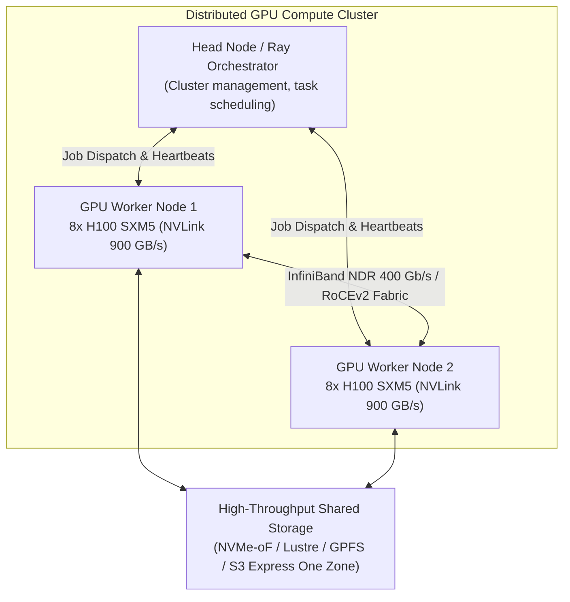
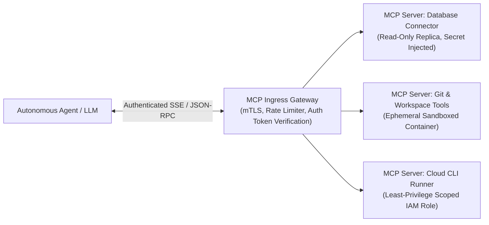
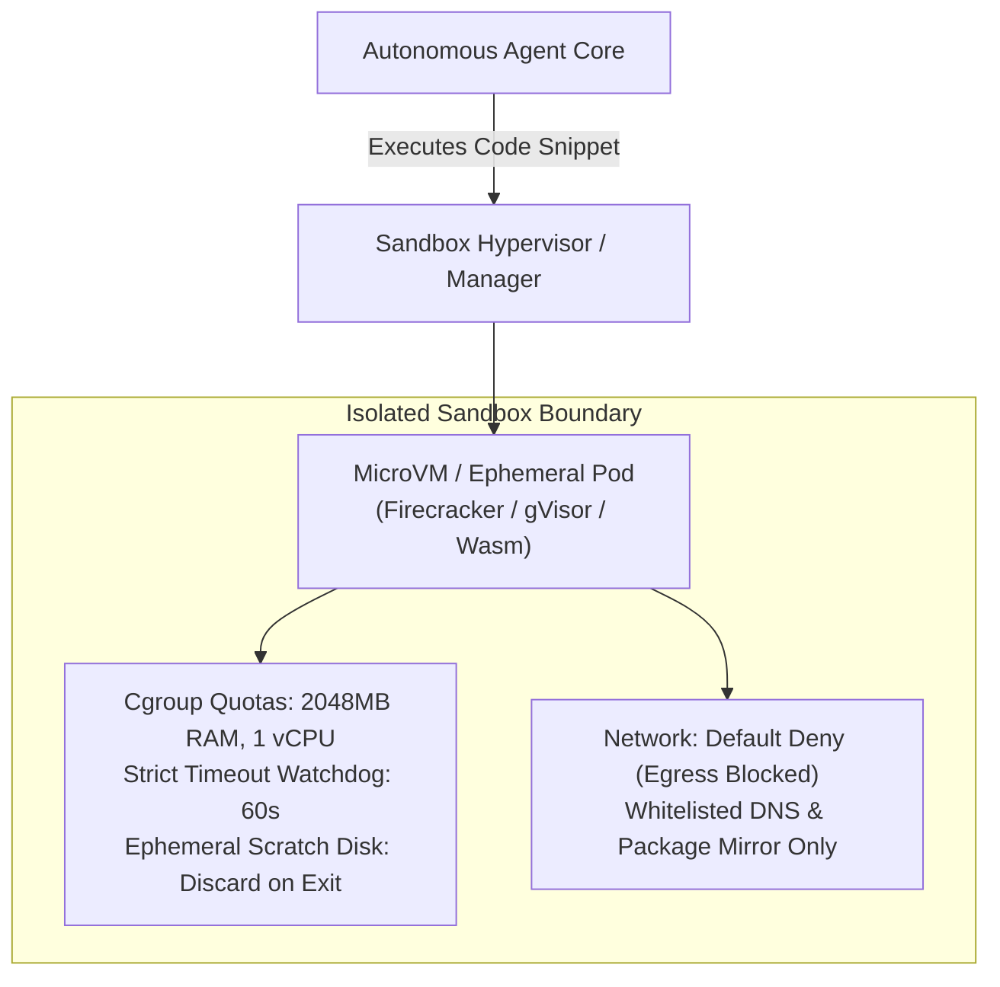

# Agentic Infrastructure, GPU Fabrics, and AI Compute Runtimes

> **Mandate**: Autonomous AI agents, large language model inference clusters, and distributed AI agent swarms introduce fundamentally distinct infrastructure requirements: extreme GPU/TPU memory bandwidth, low-latency inter-node fabrics (InfiniBand/RoCE), stateful vector search engines, and untrusted code execution sandboxes. Infrastructure engineering for AI systems must provide hermetic isolation, deterministic tool-execution hosts, and elastic compute fabrics without compromising enterprise security.

---

## 1 · GPU Fabric Topology & Distributed Orchestration

Training, fine-tuning, and multi-model inference pipelines require hardware-aware infrastructure topologies:

### Key Architectural Invariants:
1. **Intra-Node vs Inter-Node Bandwidth**: Intra-node GPU communication leverages high-speed interconnects (NVLink: ~900 GB/s); inter-node scaling requires non-blocking leaf-spine fabrics (InfiniBand or RoCEv2: $\ge 400\text{ Gbps}$ per node).
2. **NUMA Node & PCI Affinity**: Pin container workloads and memory directly to the NUMA node hosting the target GPU device to avoid PCI bus bottlenecks.
3. **Slurm & Ray Integration**: Provision declarative cluster manifests with pre-configured health checks (`nvidia-smi`, NCCL all-reduce tests) before worker nodes join the scheduler pool.

---

## 2 · Hosting Model Context Protocol (MCP) Servers

MCP servers bridge language models with enterprise tools and data sources. Hosting MCP infrastructure requires strict isolation:

### MCP Infrastructure Guardrails:
- **Zero Ambient Privileges**: Each MCP server container must run under a dedicated, minimal service account granting only the specific capabilities needed for its tools.
- **Process Memory Limits**: Enforce strict cgroup limits (e.g. `memory: 512Mi`, `cpu: 1.0`) on MCP host containers to prevent memory leaks from crashing the host node.
- **Network Microsegmentation**: MCP servers connecting to internal databases must reside in private application subnets, unreachable from the public internet.

---

## 3 · High-Performance Vector Database Infrastructure

Vector similarity search requires specialized memory-to-disk balance:

| Storage Engine | Deployment Archetype | Sizing Invariants & Requirements |
| :--- | :--- | :--- |
| **`pgvector` (PostgreSQL)** | Small-to-medium datasets ($< 10\text{M}$ vectors). | Keep active HNSW index completely in RAM: $\text{RAM}_{\text{index}} \approx 1.2 \times (N \times D \times 4\text{ bytes})$. |
| **Distributed (Qdrant / Milvus)** | Large-scale production ($> 10\text{M}$ vectors). | Dedicated memory-optimized nodes; SSD persistent volume for vector payloads; memory-mapped index segments. |
| **Serverless (Pinecone / Vertex)** | Ephemeral / Elastic workloads. | Zero infrastructure management; verify private VPC endpoint connectivity and query SLA. |

---

## 4 · Untrusted Agent Code Execution Sandboxes

When an autonomous agent writes and executes code dynamically, it must run inside a hermetic, zero-trust sandbox:

### Sandbox Security Invariants:
1. **Container / MicroVM Ephemerality**: Every execution occurs in a single-use container or MicroVM destroyed immediately upon completion ($T_{\text{lifetime}} \le 60\text{s}$).
2. **Egress Isolation**: Deny all outbound network traffic by default. If dependencies must be installed, route requests through a cached internal mirror, never the raw internet.
3. **Read-Only Root Filesystem**: Mount the base container image read-only; allow ephemeral writes only to a temporary in-memory `tmpfs` volume.
