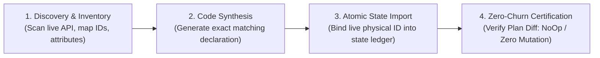
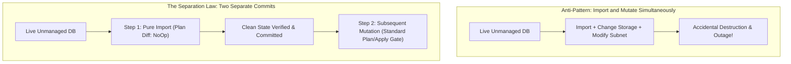
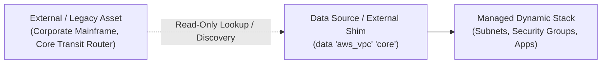

# Brownfield Discovery, Resource Adoption, and Zero-Churn State Import

> **Mandate**: In production engineering, pristine greenfield environments are the exception; messy brownfield reality is the rule. Organizations possess unmanaged, legacy, or manually provisioned ("ClickOps") resources serving live customer traffic. Bringing existing infrastructure under declarative IaC management must be completely non-destructive: adopting an active resource into code must never cause downtime, connection drops, or destructive recreation churn.

---

## 1 · The 4-Phase Non-Destructive Adoption Protocol

Adopting unmanaged physical or cloud resources follows an atomic 4-phase progression:

### Phase 1: Discovery & Inventory Cartography
1. **Query Cloud/Hardware Inventory**: Use provider APIs or inventory scanners (e.g. AWS Resource Groups Tagging API, GCP Asset Inventory, Azure Resource Graph, or nmap/IPMI scans).
2. **Catalog Resource Dependencies**: Map parent-child relationships (e.g. VPC $\to$ Subnets $\to$ Route Tables $\to$ Gateways).
3. **Filter Active from Zombie**: Exclude orphaned, unattached, or abandoned assets slated for decommissioning.

### Phase 2: Declarative Code Synthesis & Attribute Alignment
1. **Author the Target Resource Block**: Define the resource in declarative code matching the exact live attributes.
2. **Account for Implicit Defaults**: Cloud providers inject default values (e.g. `ipv6_enabled = false`, default timeout values, auto-generated tags). These must be aligned in code to prevent false drift.
3. **Prevent Parameter Drift**: Inspect whether certain arguments trigger resource recreation (e.g. changing a subnet CIDR or database identifier requires destroying the original). Ensure synthesized code uses exact live values.

### Phase 3: Atomic State Import & Binding
1. **Execute Native State Binding**: Use the orchestrator's import mechanism (e.g. `terraform import`, `import {}` blocks, Pulumi import, or Crossplane external resource adoption).
2. **Commit Binding to State**: Write the binding directly into $S_{\text{recorded}}$, linking the declared logical address to the physical identifier.

### Phase 4: Zero-Churn Certification (The NoOp Invariance Rule)
> [!CAUTION] THE ZERO-CHURN IMPORT INVARIANCE RULE
> After executing an import, the agent **MUST** run a plan refresh and mathematically verify:
> $$\mathcal{P} = S_{\text{desired}} \ominus S_{\text{observed}} = \emptyset \quad (\text{Pure Clean NoOp})$$
> **Any plan output indicating `~ update in-place` or `- destroy and recreate` is an immediate halt condition.** The engineer or agent must adjust the declarative code until the plan diff is exactly zero before proceeding.

---

## 2 · The Separation Law for Brownfield Operations

Never combine **Adoption** with **Mutation**:

- **Commit 1 (Pure Adoption)**: Brings the resource under IaC management. Net infrastructure mutation: **Zero**.
- **Commit 2 (Functional Evolution)**: Modifies, scales, or refactors the now-managed resource under standard plan review gates.

---

## 3 · Managing Immovable Legacy & External Resources

Not all infrastructure can or should be fully managed by IaC. Physical SAN arrays, corporate VPN concentrators, core ISP circuits, or shared enterprise databases are often maintained by separate teams or external vendors.

### The External Resource Shim Pattern
Instead of importing unmanaged external assets into the mutable state ledger, consume them via **Read-Only Data Lookups**:

| Strategy | When to Use | State Impact | Risk Level |
| :--- | :--- | :--- | :--- |
| **Full Import** | The resource belongs entirely to this project/team and will be managed in code going forward. | Added to $S_{\text{recorded}}$ as mutable. | Medium (Zero-Churn Rule applies). |
| **Read-Only Shim** | Shared corporate network, third-party vendor appliance, or legacy unchangeable hardware. | Read-only reference; zero mutations possible. | Zero (Immutable read). |
| **Parameter Store** | External team updates endpoints dynamically; consumer reads string/ARN. | Decoupled; state reads parameter string. | Low. |

---

## 4 · Common Pitfalls & Guardrails

* ❌ **Parent-Without-Children Trap**: Importing a VPC without its routing tables or security groups. The next apply may attempt to recreate default resources. Always import the complete topological cluster.
* ❌ **Missing Tag Alignment**: Providers frequently add system tags (`aws:cloudformation:stack-id`, `created-by`). Failure to ignore or declare system tags leads to permanent cosmetic drift.
* ❌ **Ignoring Deletion Protection**: Live databases often have deletion protection enabled. Synthetic code without `deletion_protection = true` creates immediate drift and exposes the database to accidental destruction.
