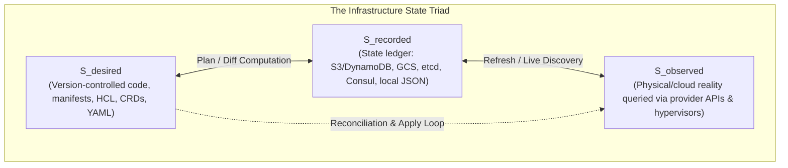
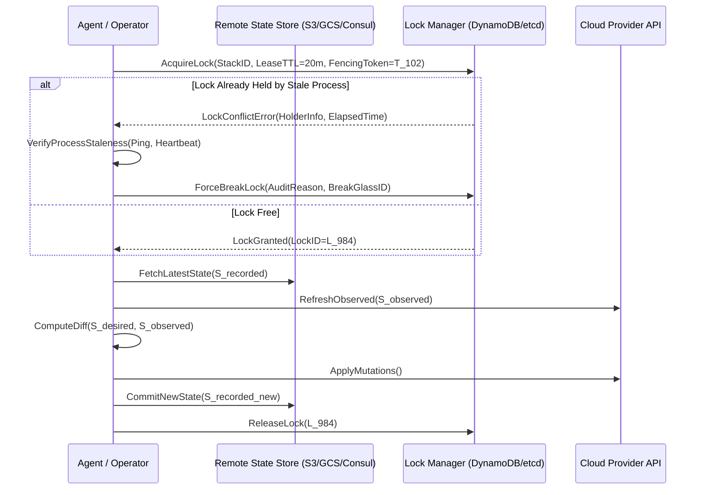
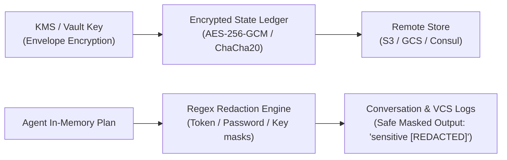
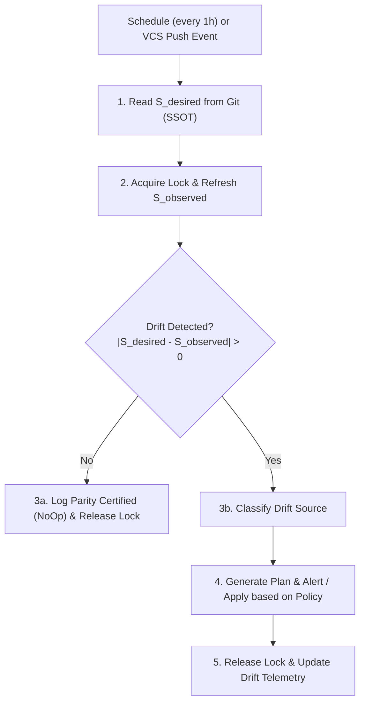

# Desired State, State Triads, and Continuous Drift Reconciliation

> **Mandate**: In physical and virtual infrastructure, declarative intent ($S_{\text{desired}}$), persistent metadata state ($S_{\text{recorded}}$), and live operational reality ($S_{\text{observed}}$) continually diverge due to out-of-band mutations, network anomalies, provider API latency, and operational entropy. Infrastructure reliability requires a closed-loop reconciliation engine governed by atomic distributed state locking, mathematical drift measurement, cryptographic state protection, and zero-churn convergence.

---

## 1 · The State Triad Model

Infrastructure engineering is defined by the continuous synchronization of three distinct state spaces:

### Mathematical Formulation
Let $\mathcal{U}$ be the universe of all possible infrastructure resources. Each resource $r \in \mathcal{U}$ is a tuple $\langle \text{id}, \text{type}, \text{attrs} \rangle$.
- **Declared Intent** $S_{\text{desired}} \subset \mathcal{U}$: What the engineer or autonomous agent specifies in code.
- **Recorded Ledger** $S_{\text{recorded}} \subset \mathcal{U}$: What the orchestrator previously committed to persistent state storage.
- **Observed Reality** $S_{\text{observed}} \subset \mathcal{U}$: What currently exists in the target environment as discovered by live API inspection.

### Drift Metric & Divergence Vector
The total system drift $\Delta_{\text{drift}}$ is partitioned into two orthogonal components:
$$\Delta_{\text{drift}} = \Delta_{\text{unapplied}} \cup \Delta_{\text{out-of-band}}$$
$$\Delta_{\text{unapplied}} = S_{\text{desired}} \ominus S_{\text{recorded}} \quad (\text{Declared changes not yet applied to the environment})$$
$$\Delta_{\text{out-of-band}} = S_{\text{recorded}} \ominus S_{\text{observed}} \quad (\text{Real-world mutations made outside the declarative workflow})$$

Where $\ominus$ represents attribute-aware set difference. When $\Delta_{\text{drift}} = \emptyset$, the system is in **Pure Convergence**.

---

## 2 · Distributed State Locking & Deadlock Recovery

State manipulation requires absolute mutual exclusion. Concurrent writes corrupt state ledgers, sever resource tracking, and cause duplicate provisioning.

### The Stale Lock Recovery Protocol
When an operation encounters an existing lock:
1. **Never Blindly Break Locks**: Do not execute immediate `force-unlock` without verifying holder liveness.
2. **Inspect Lock Metadata**: Parse `LockID`, `HolderHost`, `CreatedAt`, and `OperationType`.
3. **Staleness Threshold**: If `Now - CreatedAt > LeaseTTL` (default: 20 minutes) and the originating runner process/job is proven terminated (via CI/CD API or process tree check), the lock is classified as **Orphaned**.
4. **Attributable Break-Glass**: Break the lock only with explicit logging:
   `[STATE-UNLOCK: Lock L_984 held by dead runner #412 broken after 35m expiry; state digest verified: e3b0c44...]`

---

## 3 · Plan Generation & Blast-Radius Calculus

Before any state mutation, the agent must compute the Plan Diff $\mathcal{P}$:
$$\mathcal{P} = S_{\text{desired}} \ominus S_{\text{observed}} = \langle \mathcal{R}_{\text{create}}, \mathcal{R}_{\text{update}}, \mathcal{R}_{\text{destroy}}, \mathcal{R}_{\text{recreate}} \rangle$$

### Blast-Radius Score ($R_{\text{blast}}$)
The agent calculates the blast-radius score prior to requesting apply authorization:
$$R_{\text{blast}} = \sum_{r \in \mathcal{R}_{\text{destroy}}} 10 \cdot C(r) + \sum_{r \in \mathcal{R}_{\text{recreate}}} 15 \cdot C(r) + \sum_{r \in \mathcal{R}_{\text{update}}} 2 \cdot C(r) + \sum_{r \in \mathcal{R}_{\text{create}}} 1 \cdot C(r)$$

Where Criticality $C(r) \in [1, 5]$:
- $C(r) = 5$: Stateful databases, root DNS zones, core transit hubs, root KMS keys.
- $C(r) = 3$: Load balancers, security groups, compute auto-scaling groups.
- $C(r) = 1$: Ephemeral preview pods, worker nodes, queue subscribers.

> [!CAUTION] BLAST-RADIUS GATING RULE
> If $R_{\text{blast}} \ge 25$ or any resource with $C(r) = 5$ is in $\mathcal{R}_{\text{destroy}} \cup \mathcal{R}_{\text{recreate}}$, autonomous execution is prohibited without explicit human authorization.

---

## 4 · State Plane Cryptographic Secrecy Axiom

State ledgers contain highly sensitive runtime attributes: database master passwords, private TLS keys, access tokens, and internal network IP topologies.

1. **Mandatory Envelope Encryption**: Remote state buckets must enforce server-side KMS encryption with restricted decryption policies.
2. **Redaction Gate**: Agents must never output raw state JSON containing `sensitive = true` values into chat transcripts, commit messages, or ticketing artifacts.
3. **No Local State Storage for Production**: Production state must never be stored on local developer laptops or unencrypted disk drives.

---

## 5 · Continuous GitOps Reconciliation Loop

For self-healing infrastructure, the reconciliation loop executes continuously:

- **Reconcile Forward (Git is King)**: Overwrite out-of-band manual changes with the declared Git configuration.
- **Reconcile Reverse (Brownfield Adoption)**: When an intentional emergency fix occurred in the cloud, export the live configuration into code, open a PR, and commit to Git before next apply.
