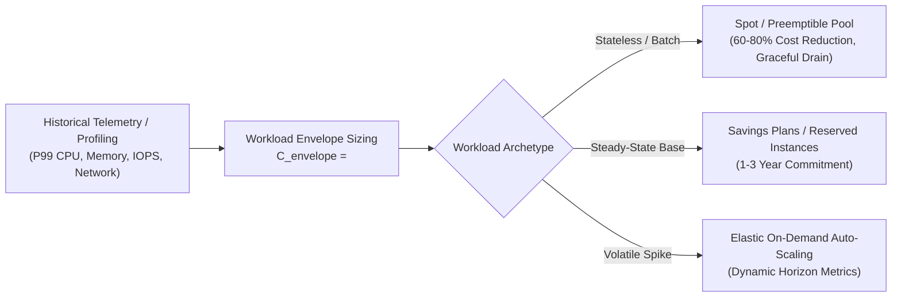
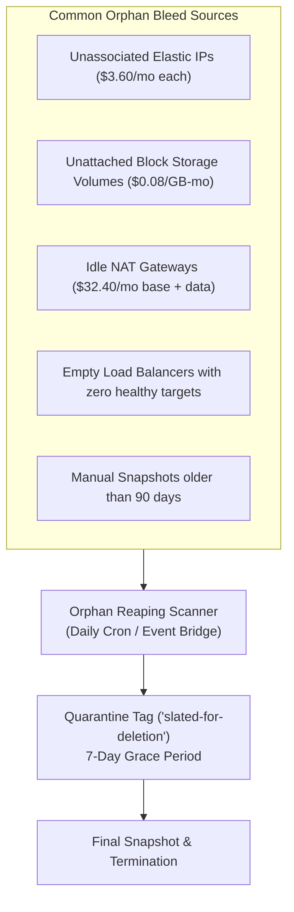
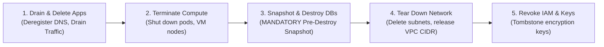

# FinOps, Resource Lifecycle, and Safe Decommissioning

> **Mandate**: In cloud and virtualized infrastructure, architecture is inextricably linked to continuous financial liability. Every unneeded CPU core, over-provisioned IOPS volume, idle NAT gateway, or unattached disk represents financial entropy and security surface. Infrastructure engineering requires rigorous workload capacity modeling, non-negotiable cost attribution tagging, automated orphan asset reclamation, and a safe, snapshot-guarded decommissioning lifecycle.

---

## 1 · Workload Envelope Capacity Planning

Provisioning must be governed by empirical workload profiling rather than speculative over-allocation:



### Sizing Principles:
- **Baseline vs Peak**: Size baseline infrastructure for average load; absorb burst demand using horizontal auto-scaling, serverless burst capacity, or spot worker pools.
- **Storage Tiering**: Transition persistent object storage through automated lifecycle rules: Hot (30 days) $\to$ Infrequent Access (90 days) $\to$ Cold Archive / Glacier (1 year).

---

## 2 · The Mandatory Cost Attribution Tagging Schema

No infrastructure resource may be provisioned without complete provenance and billing attribution:

| Tag Key | Required Format | Description & Purpose |
| :--- | :--- | :--- |
| `Environment` | `production` \| `staging` \| `dev` \| `preview` | Determines SLA, alerting tier, and budget allocation. |
| `Service` | Lowercase kebab-case (e.g. `order-processor`) | Groups resources logically for microservice cost accounting. |
| `Owner` | Team email or Slack handle (`platform-team@corp`) | Direct operational and financial accountability. |
| `CostCenter` | Department billing code (e.g. `CC-9410`) | Enterprise chargeback and finance ledger routing. |
| `RepositoryRef` | VCS repo identifier (`org/repo@v1.2.0`) | Traceability from physical resource back to declarative code. |

```rego
# Policy Rule: Enforce Mandatory Tagging
package infrastructure.finops

mandatory_tags := ["Environment", "Service", "Owner", "CostCenter", "RepositoryRef"]

deny[msg] {
    resource := input.resource_changes[_]
    resource.change.actions[_] == "create"
    missing := [tag | tag := mandatory_tags[_]; not resource.change.after.tags[tag]]
    count(missing) > 0
    msg := sprintf("Resource '%v' is missing mandatory FinOps tags: %v", [resource.address, missing])
}
```

---

## 3 · Orphan Asset Bleed & Automated Reaping

A major source of cloud waste occurs when parent resources are deleted while dependent child assets remain active and billing:



### Detection Heuristics:
1. **Unattached Volumes**: Volumes in state `available` (unattached to any VM) for $> 7$ days $\to$ snapshot and delete.
2. **Idle Load Balancers**: ALBs with zero registered targets for $> 48$ hours $\to$ alert owner, then decommission.
3. **Unassociated Static IPs**: Public IPs not bound to any network interface $\to$ immediate release.

---

## 4 · Reverse Topological Decommissioning & The Snapshot Gate

Tearing down an infrastructure stack requires the exact reverse order of provisioning:

$$\text{DecommissionOrder} = \text{Reverse}(\text{TopologicalSort}(G)) = [S_{\pi(N)}, S_{\pi(N-1)}, \dots, S_{\pi(1)}]$$



> [!CAUTION] THE PRE-DESTROY SNAPSHOT GATE
> Stateful resources (databases, persistent disks, object buckets) must **NEVER** be destroyed without an explicit, verified final snapshot:
> 1. Trigger final snapshot with naming convention: `final-snap-<resource-id>-<timestamp>`.
> 2. Poll snapshot API until status is confirmed `AVAILABLE` and checksum is verified.
> 3. Disable `deletion_protection` only after snapshot certification is written to the audit log.
