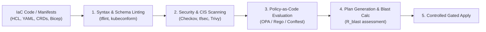
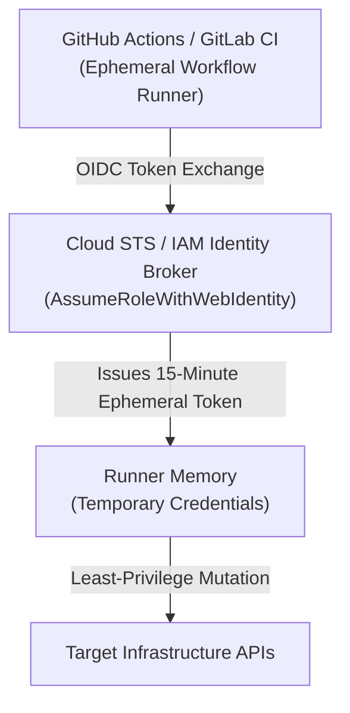
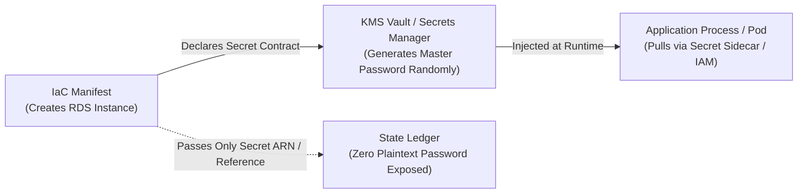

# IaC Security Engineering, Policy-as-Code, and IAM Guardrails

> **Mandate**: Infrastructure as Code manifests define the security boundaries, cryptographic identities, and access control policies of the entire enterprise. A misconfiguration in IaC (e.g. an unencrypted storage bucket, an open ingress port, or a wildcard IAM policy) compromises the entire software estate simultaneously. Security engineering must shift left: deterministic policy gates, zero ambient IAM authority, cryptographic secret protection, and least-privilege microsegmentation must execute prior to state convergence.

---

## 1 · The Shift-Left IaC Security Pipeline

Static analysis and policy evaluation occur during plan compilation, long before cloud APIs receive mutation commands:



### Mandatory Pre-Apply Security Gates:
1. **CIS Benchmark Compliance**: Enforce Center for Internet Security (CIS) foundations (encrypted storage, no default VPCs, root access keys deleted).
2. **Deterministic Blocking**: A high-severity vulnerability (e.g. S3 bucket without public access block, security group allowing `0.0.0.0/0:22`) immediately exits the pipeline with code `1`.

---

## 2 · Least Privilege IAM Architecture & OIDC Federation

Static, long-lived access keys (`AKIA...`) committed to repositories or developer machines represent the single largest cloud attack vector.



### Universal IAM Invariants:
1. **Zero Static Access Keys**: All CI/CD runners and agent processes must authenticate via OpenID Connect (OIDC) or native instance profiles.
2. **Resource-Level Scoping**: Policies must define exact ARNs/resource identifiers. Wildcard permissions (`Resource: "*"`) on stateful services are forbidden.
3. **PassRole Guardrails**: Granting `iam:PassRole` must be strictly restricted to specific target service roles and conditions (`iam:PassedToService`), preventing privilege escalation to root administrative status.

---

## 3 · The Policy-as-Code Evaluation Matrix

Policies are written as declarative contracts (e.g. Open Policy Agent / Rego) and evaluated against the computed Plan Diff:

```rego
# Universal Security Policy Example: Prevent Unencrypted Storage
package infrastructure.security

deny[msg] {
    resource := input.resource_changes[_]
    resource.type == "aws_ebs_volume"
    not resource.change.after.encrypted
    msg := sprintf("EBS volume '%v' must have encryption enabled.", [resource.address])
}

deny[msg] {
    resource := input.resource_changes[_]
    resource.type == "aws_security_group_rule"
    resource.change.after.type == "ingress"
    resource.change.after.cidr_blocks[_] == "0.0.0.0/0"
    contains(resource.change.after.from_port, [22, 3389, 5432, 3306])
    msg := sprintf("Security group rule '%v' exposes management port to 0.0.0.0/0.", [resource.address])
}
```

### Policy Severity Classification

| Severity | Definition | Action Taken by Agent / Pipeline |
| :--- | :--- | :--- |
| **`CRITICAL`** | Publicly accessible database, wildcard IAM admin, unencrypted PII store. | **Hard Block**: Pipeline aborts immediately; state lock released. |
| **`HIGH`** | Missing deletion protection, un-versioned storage bucket, open outbound egress. | **Block**: Requires explicit override justification and supervisor approval. |
| **`MEDIUM`** | Non-standard tagging, sub-optimal log retention period. | **Warning**: Logged in audit trail; execution proceeds. |

---

## 4 · Cryptographic Secret Isolation at the Infrastructure Boundary

Infrastructure manifests provision the data stores and key vaults, but they must **never** contain the secret data values:



- **Dynamic Secret Generation**: Passwords and connection secrets must be generated inside the cloud vault (e.g. AWS Secrets Manager `generate_secret_string`, HashiCorp Vault), not hardcoded in HCL.
- **Reference by Pointer**: Application compute tiers receive the secret's resource ARN/URI, pulling the value dynamically into in-memory environment variables at process boot.

---

## 5 · Break-Glass Audit & Exemption Protocol

During Sev-0 outages or disaster recovery, standard security policies may block emergency mitigation:
1. **Explicit Break-Glass Parameter**: Pass `--break-glass-approval-token="INCIDENT-ID-TIMESTAMP"`.
2. **Immutable Audit Trail**: The execution engine emits an immutable audit event to the security telemetry lake.
3. **Mandatory 24-Hour Reconciliation**: A high-priority follow-up task is automatically scheduled to remediate the temporary bypass back to full compliance.
