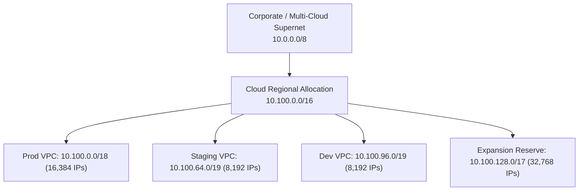
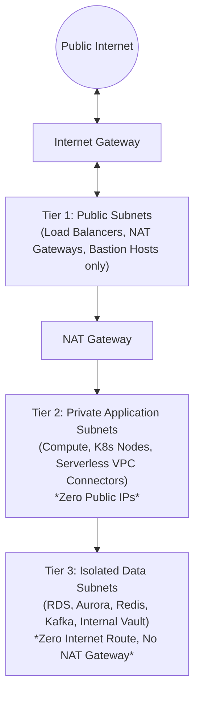
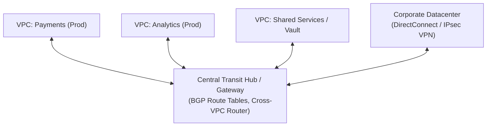
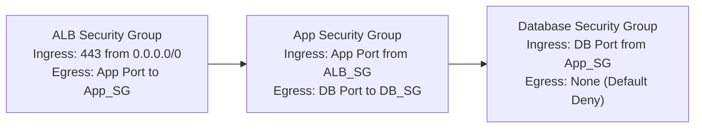

# Network Topology, Perimeter Defense, and Hybrid Transit Hubs

> **Mandate**: Network topology is the nervous system and primary security perimeter of all computational infrastructure. Compute nodes and data stores are only as secure as the routing boundaries and ingress/egress policies that enclose them. Network design must enforce non-overlapping CIDR allocations, strict 3-tier subnet microsegmentation, default-deny traffic flow, private link backbones, and end-to-end packet flow visibility.

---

## 1 · Non-Overlapping CIDR Block Planning

A catastrophic infrastructure flaw is IP address exhaustion or overlapping CIDR blocks that prevent future VPC peering, VPN tunnels, or cloud interconnects.

### Mathematical CIDR Constraints
- Never provision `/24` or smaller for Kubernetes or high-density container clusters (Pod IP exhaustion).
- Calculate required IPs: $N_{\text{IP}} = (N_{\text{nodes}} \times N_{\text{pods/node}}) + N_{\text{load-balancers}} + N_{\text{headroom (50%)}}$.
- Standardize VPC sizes across environments: Production `/18` or `/19`, Staging `/20`, Dev `/20`.

---

## 2 · The 3-Tier Subnet Architecture

Every Virtual Private Cloud (VPC) or software-defined network must be partitioned into three isolated tiers across at least two Availability Zones (AZs):

### Subnet Routing Rules

| Subnet Tier | Default Route (`0.0.0.0/0`) | Public IP Assignment | Accessible From | Hosts Placed |
| :--- | :--- | :--- | :--- | :--- |
| **Tier 1: Public** | Internet Gateway (`igw-xxxx`) | Enabled for ALBs/NAT | Public Internet | Ingress Application Load Balancers, NAT Gateways. |
| **Tier 2: Private** | NAT Gateway (`nat-xxxx`) | **STRICTLY DISABLED** | Public ALBs, Internal Services | Application microservices, EKS/GKE worker nodes, ECS tasks. |
| **Tier 3: Isolated** | **NONE** (Local VPC route only) | **STRICTLY DISABLED** | Private App Tier only | PostgreSQL, MySQL, Redis, DynamoDB VPC endpoints. |

> [!CAUTION] DATABASE ISOLATION RULE
> Databases, caches, and message queues must **NEVER** reside in public subnets or have routes to an Internet Gateway. They must reside in Isolated Data Subnets reachable only by authorized application compute security groups.

---

## 3 · Transit Hubs & Hybrid Mesh Connectivity

When connecting multiple VPCs, on-premises datacenters, and edge networks, point-to-point peering ($O(N^2)$ complexity) collapses. Hub-and-Spoke Transit Gateways ($O(N)$ complexity) must be deployed:

### Transit Routing Rules:
- **Route Table Segmentation**: Isolate production traffic from development traffic within the transit hub using distinct route domains.
- **BGP Autonomous System Numbers (ASN)**: Allocate dedicated private ASNs (RFC 6996: `64512–65534`) to each on-prem and cloud router.

---

## 4 · Zero-Trust Perimeter & Microsegmentation

Network security groups and firewalls must follow stateful, least-privilege microsegmentation:

### Security Group Invariants:
1. **No IP Coupling**: Reference security groups by ID (`source_security_group_id`), never hardcoded private CIDRs, allowing compute instances to scale dynamically without firewall reconfigurations.
2. **Strict Egress Filtering**: Restrict compute egress to required destination endpoints. Prevent compromised worker nodes from establishing outbound C2 (Command & Control) connections.
3. **PrivateLink / Endpoint Gateways**: Route cloud service API traffic (S3, DynamoDB, Secrets Manager) over private hypervisor endpoints, never over public NAT gateways.

---

## 5 · Network Observability & Flow Auditing

A network without packet logging is un-auditable during security incidents:
- **VPC Flow Logs**: Mandatory on all production subnets and transit hubs, captured with `1-minute` aggregation intervals and delivered to a tamper-proof object store.
- **DNS Query Logging**: Route 53 / Cloud DNS query logging enabled to detect DNS tunneling and data exfiltration anomalies.
