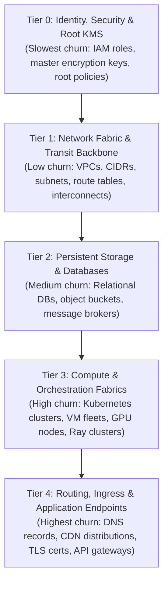
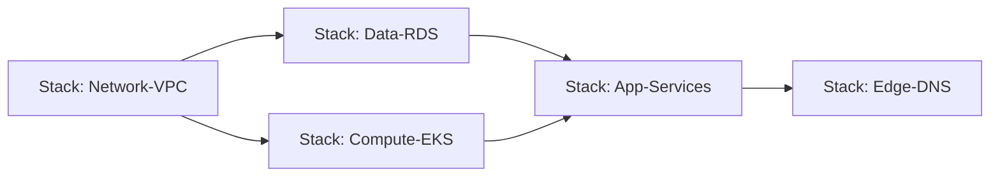
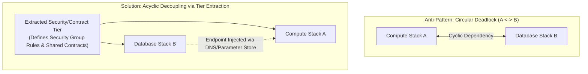

# Stack Composition, Dependency DAGs, and State Partitioning

> **Mandate**: Monolithic infrastructure codebases—where networks, databases, compute clusters, and application ingress share a single state ledger—inevitably suffer from catastrophic failure blast radius, lock contention, circular dependency deadlocks, and glacial execution times. Resilient infrastructure must be decomposed into modular, isolated stacks organized along a Directed Acyclic Graph (DAG) with explicit contract interfaces.

---

## 1 · The 5-Tier Hierarchical Stack Model

Infrastructure stacks are organized strictly by lifecycle volatility, security privilege, and failure blast radius:



### Mathematical Formulation
Let the total infrastructure $\mathcal{I}$ be partitioned into $N$ distinct stacks:
$$\mathcal{I} = \{S_1, S_2, \dots, S_N\} \quad \text{such that} \quad \text{State}(S_i) \cap \text{State}(S_j) = \emptyset \quad \forall i \neq j$$
- Each stack $S_i$ maintains its own dedicated, isolated state ledger.
- Mutations in Tier 4 never lock, risk, or evaluate Tier 1 or Tier 2.

---

## 2 · Dependency Graph Formulation & Topological Ordering

Inter-stack dependencies are modeled as a Directed Acyclic Graph $G = (V, E)$:
- $V = \{S_1, S_2, \dots, S_N\}$ (the set of isolated stacks).
- $E = \{(S_u, S_v) \mid S_v \text{ consumes an output of } S_u\}$.



### Topological Execution Guarantee
To provision or mutate stacks:
$$\text{TopologicalSort}(G) = [S_{\pi(1)}, S_{\pi(2)}, \dots, S_{\pi(N)}] \quad \text{where} \quad (S_u, S_v) \in E \implies \pi(u) < \pi(v)$$
- Lower tiers strictly precede higher tiers during **Provisioning** ($u \prec v$).
- Higher tiers strictly precede lower tiers during **Decommissioning** ($v \prec u$).

---

## 3 · The Acyclic Decoupling Pattern (Resolving Circular Deadlocks)

A common architectural trap occurs when two stacks depend on each other:
* *Example Deadlock*: Stack A (Compute Cluster) needs Stack B's Database Endpoint; Stack B (Database) needs Stack A's Compute Security Group to authorize ingress.



### The 3 Decoupling Mechanisms:
1. **Contract Extraction**: Extract the shared boundary (e.g. security group IDs, IAM roles) into an independent lower-tier stack.
2. **Service Discovery / Parameter Indirection**: Instead of direct state coupling, the provider registers its endpoint in a dynamic registry (SSM Parameter Store, Consul, Cloud Map, or private DNS), which the consumer queries at runtime.
3. **Lazy Ingress Rules**: Define security group rules as independent, standalone resources provisioned after both stacks exist, rather than embedding them inline in stack manifests.

---

## 4 · Inter-Stack Contract Interfaces

Stacks communicate exclusively through typed, versioned outputs:

| Output Attribute | Contract Type | Example Value | Description |
| :--- | :--- | :--- | :--- |
| `vpc_id` | String (Identifier) | `vpc-0a1b2c3d4e5f` | Stable network identifier. |
| `private_subnet_ids` | List[String] | `["subnet-1", "subnet-2"]` | Subnets available for compute placement. |
| `db_cluster_endpoint` | String (FQDN) | `aurora-pg.internal.corp` | Stable DNS name, never a raw IP. |
| `kms_key_arn` | String (ARN) | `arn:aws:kms:...:key/123` | Encryption key identifier. |

> [!IMPORTANT] IMMUTABILITY OF CONTRACT OUTPUTS
> Any change to an exported stack output that breaks downstream consumers (e.g. renaming an output variable, removing a subnet) is considered a **Breaking Interface Change**. It must follow the Expand/Contract deprecation cycle.

---

## 5 · Cross-Environment Directory & Workspace Topologies

To guarantee environment parity without code duplication:

```
infrastructure/
├── modules/                         # Reusable, versioned component templates
│   ├── network-fabric/              # Strict inputs, outputs, validation
│   ├── database-cluster/
│   └── compute-swarm/
├── environments/
│   ├── dev/                         # Dedicated isolated state per environment
│   │   ├── 00-identity/
│   │   ├── 01-network/
│   │   ├── 02-database/
│   │   └── 03-compute/
│   ├── staging/
│   └── prod/                        # Separate cloud accounts / IAM boundaries
```

### Golden Rules:
1. **Code Equivalence**: All environments consume the exact same underlying module versions.
2. **Configuration Delta Only**: Differences between `dev` and `prod` are restricted to capacity sizing, redundancy counts, and billing account IDs.
3. **No Cross-Environment State Sharing**: A production stack must never reference a dev or staging state ledger.
