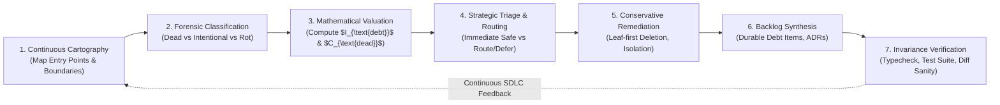
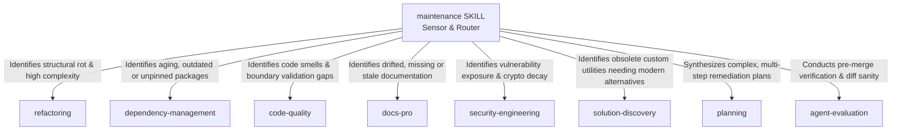

# Software Maintenance: Universal System Vitality & Technical-Debt Protocol

> **Mandate**: *Software and instruction systems naturally deteriorate over time as assumptions evolve, environments drift, and entropy accumulates ($\frac{d\text{Entropy}}{dt} > 0$). Maintenance is the continuous, first-class engineering discipline that preserves system vitality, combats rot, and prevents architectural bankruptcy.*  
> Maintenance is not janitorial guesswork, cosmetic churn, or speculative rewrites. It is the evidence-driven defense of intentional design. Every deletion must be justified by proven unreachability; every technical-debt finding must be priced by future risk and interest; external consumption boundaries and dynamic reflection seams must be rigorously preserved; and agent instructions and skills must be maintained with the exact same rigor as executable production code. True maintenance empowers agent problem-solving creativity, rejects cargo-cult cleanup, and routes complex structural remediations to specialized capability skills.

---

## 1 · The 7-Phase Universal Maintenance Lifecycle

Every maintenance task—from surgically removing a single dead helper to conducting an enterprise-wide technical-debt audit or pruning an agent instruction library—traverses this closed-loop protocol:



1. **Phase 1 — Continuous Cartography & System Boundary Mapping**: Map the union of all Root Entry Points ($\mathcal{R}$) across the system (HTTP endpoints, CLI entry points, message consumers, scheduled jobs, public library exports, and agent prompts). Chart internal call graphs and identify external consumption boundaries (see [`references/dead-code-elimination-and-graph-reachability.md`](references/dead-code-elimination-and-graph-reachability.md)).
2. **Phase 2 — Forensic Classification & Intentionality Audit**: Separate genuine dead weight from intentional latency:
   * Distinguish internal helpers from public API contracts governed by SemVer.
   * Detect dynamic reflection seams ($\Sigma_{\text{dyn}}$), plugin hooks, and foreign-function bindings (FFI/IPC).
   * Separate active feature toggles (*dark launches*) from abandoned flag remnants.
   * Exempt historical and regulatory artifacts (database migration steps, audit logs, compliance tombstones).
3. **Phase 3 — Mathematical Valuation & Risk Modeling**:
   * Compute the **Technical Debt Interest Index** ($I_{\text{debt}}$) based on complexity, churn, and blast radius (see [`references/technical-debt-quantification-and-auditing.md`](references/technical-debt-quantification-and-auditing.md)).
   * Compute the **Dead-Code Confidence Score** ($C_{\text{dead}}$) factoring in unreachability, dynamic invocation probability, and public boundaries.
   * Compute the **Technology Obsolescence Velocity** ($\alpha$) and retirement readiness for aging components (see [`references/technology-radar-and-deprecation-governance.md`](references/technology-radar-and-deprecation-governance.md)).
   * Compute the **Instruction Signal-to-Noise Ratio** ($\text{SNR}_{\text{rule}}$) for agent prompts and skill packages (see [`references/agent-instruction-and-skill-hygiene.md`](references/agent-instruction-and-skill-hygiene.md)).
4. **Phase 4 — Strategic Triage & Arsenal Boundary Routing**: Apply the **Arsenal Routing Contract**:
   * **Local / Leaf-Node Dead Weight** ($C_{\text{dead}} \ge 0.95$, bounded scope): Remediate immediately in Phase 5.
   * **Structural Restructuring**: Route to [`refactoring`](../refactoring/SKILL.md).
   * **Outdated / Vulnerable Packages**: Route to [`dependency-management`](../dependency-management/SKILL.md).
   * **Security Surface Decay**: Route to [`security-engineering`](../security-engineering/SKILL.md).
   * **Obsolete Wheels Requiring Adoption**: Route to [`solution-discovery`](../solution-discovery/SKILL.md).
   * **High Blast-Radius or Multi-Step Debt**: Route to [`planning`](../planning/SKILL.md) and record in the debt register (Phase 6).
5. **Phase 5 — Conservative Remediation & Ordered Excision**:
   * Delete in strict **reverse topological order** (pure leaves $\to$ intermediate functions $\to$ dead modules $\to$ obsolete configuration).
   * For ambiguous candidates ($C_{\text{dead}} < 0.95$), apply explicit deprecation annotations or quarantine shims instead of hard deletion.
6. **Phase 6 — Backlog Synthesis & Explicit Debt Registration**: Convert all validated technical-debt findings that exceed the current task's blast radius into durable, structured work items (see [`examples/debt-register-template.md`](examples/debt-register-template.md) and [`references/maintenance-routing-and-backlog-synthesis.md`](references/maintenance-routing-and-backlog-synthesis.md)).
7. **Phase 7 — Invariance Verification & Health Certification**: Execute the 5-point verification check: static type analysis, full regression test suites, zero diagnostic regressions, diff cleanliness, and documentation coherence.

---

## 2 · Progressive Disclosure (Reference Routing)

To prevent cognitive overload and preserve LLM context bandwidth, **never load all reference manuals simultaneously**. Consult reference manuals strictly on demand based on task context:

| Context Trigger | Mandatory Reference Manual | Purpose |
| :--- | :--- | :--- |
| **Dead code, unused functions, unreachable files, safe deletion ordering** | [`references/dead-code-elimination-and-graph-reachability.md`](references/dead-code-elimination-and-graph-reachability.md) | Graph-oriented reachability proofs, Root Entry Set ($\mathcal{R}$), dynamic seam defense ($\Sigma_{\text{dyn}}$), reverse topological leaf-first deletion. |
| **Code smells, cyclomatic hotspots, duplication, maintainability debt** | [`references/technical-debt-quantification-and-auditing.md`](references/technical-debt-quantification-and-auditing.md) | Mathematical debt interest ($I_{\text{debt}}$), churn-complexity correlation, evidence-based code audits, maintainability index. |
| **Aging frameworks, deprecated APIs, EOL runtimes, sunsetting, tech radar** | [`references/technology-radar-and-deprecation-governance.md`](references/technology-radar-and-deprecation-governance.md) | 4-ring lifecycle (Adopt, Trial, Assess, Hold), obsolescence velocity ($\alpha$), retirement readiness, sunset migration playbooks. |
| **Stale AGENTS.md rules, prompt bloat, overlapping skills, skill retirement** | [`references/agent-instruction-and-skill-hygiene.md`](references/agent-instruction-and-skill-hygiene.md) | Instruction Signal-to-Noise Ratio ($\text{SNR}$), prompt drift forensics, trigger collision audits, skill library pruning, Invariant Shield. |
| **Routing findings to Arsenal skills, backlog tracking, debt registers** | [`references/maintenance-routing-and-backlog-synthesis.md`](references/maintenance-routing-and-backlog-synthesis.md) | Arsenal skill boundary contracts, debt-to-ticket conversion, durable `TECH_DEBT.md` schema, issue tracker integration. |

---

## 3 · Adaptive Cognitive Sizing (The 6 Execution Modes)

Size your maintenance engineering effort to the task's scope and risk profile. Never apply heavy enterprise bureaucracy to a single-file cleanup, and never execute speculative, unverified deletions across high-blast-radius production systems:

| Mode | Trigger & Scope | Engineering Discipline | Required Output & Protocol |
| :--- | :--- | :--- | :--- |
| **`micro-hygiene`** | Single file or function touch; opportunistic cleanup during a feature/fix task. | Remove provably unused local variables, unreferenced private helpers, or dead imports within the active boundary. | **3-Line Maintenance Intent Block** directly in scratchpad/PR. |
| **`dead-code-prune`** | Targeted decommissioning of an obsolete feature, superseded endpoint, or abandoned module. | Reverse topological reachability analysis; verify dynamic dispatch absence; leaf-first excision; invariance verification. | **Excision Bill of Materials**: Unreachability proofs + deleted symbols + zero-break test run. |
| **`tech-debt-audit`** | Pre-refactoring audit, codebase health review, or brownfield onboarding assessment. | Evidence-driven scan: duplication, cyclomatic density, churn-complexity correlation, deprecated API usage. | **Prioritized Technical Debt Audit Report** ($I_{\text{debt}}$ ranking + remediation order). |
| **`tech-radar-review`** | Framework evaluation, long-term tech stack governance, deprecation lifecycle planning. | Evaluate technology vitality, upstream release cadence, runtime EOL horizons, and retirement readiness. | **Technology Radar Matrix** (Adopt, Trial, Assess, Hold) + Sunset Roadmaps. |
| **`agent-hygiene`** | Stale agent instructions, bloated `AGENTS.md`, conflicting skills, low-signal prompts. | Instruction SNR evaluation, trigger collision check, dead link removal, rule consolidation under Invariant Shield. | **Agent Instruction Optimization Diff** (Tokens saved, signal density increased). |
| **`sdlc-sprint`** | Recurring maintenance iteration, scheduled technical-debt sprint, or launch hygiene gate. | Holistic audit across code, dependencies, documentation, agent instructions, and durable backlog feed. | **Repository Health Scorecard** + Prioritized Backlog Feed. |

### The 3-Line Maintenance Intent Protocol (For `micro-hygiene` Mode)
To eliminate bureaucratic overhead on small, localized maintenance tasks, summarize maintenance intent in exactly 3 lines directly before emitting code edits:
```markdown
> **Excision Target**: [Exact symbol/import/variable identified as dead weight]
> **Reachability Proof**: [Why this is strictly unreachable and has zero dynamic/external consumers]
> **Invariance Verification**: [Test suite run or typecheck command confirming zero behavioral regression]
```

> **Boundary**: This skill owns *system vitality assessment, dead code identification, and technical debt governance*. It routes structural code changes to `refactoring`, package lifecycle to `dependency-management`, and security surface decay to `security-engineering`. It does not execute those remediations itself.

---

## 4 · The 8 Universal Maintenance Invariants

Regardless of language, framework, runtime environment, or agent architecture, every robust software system upholds these 8 timeless invariants:

### 4.1 Invariant 1: Continuous Deterioration & Entropy Primacy
Software and instruction systems naturally decay over time as environments, interfaces, and operational assumptions evolve:
$$\frac{d\text{Entropy}}{dt} > 0 \implies \text{Active Maintenance is Mandatory}$$
- Maintenance is a continuous, first-class operational phase, never an emergency one-off reaction.
- Neglecting maintenance converts operational flexibility into compounding technical-debt interest.

### 4.2 Invariant 2: The Separation Law (Maintenance $\oplus$ Feature Churn)
Structural code restructuring follows the Separation Law defined in [`refactoring`](../refactoring/SKILL.md).

### 4.3 Invariant 3: Evidence-Before-Mutation & Intentionality Preservation (Conservative Ambiguity Rule)
No code, configuration, or instruction shall be deleted or deprecated based on speculative assumption:
$$\text{Delete}(e) \implies \text{Evidence}(\text{Unreachable}(e)) \land \text{IntentionalityCheck}(e) = \text{Dead}$$
- **The External Consumption Boundary Rule**: For libraries, SDKs, and shared packages, public API exports defined in package boundary contracts are **Root Entry Points by definition** ($\in \mathcal{R}$). They cannot be deleted as dead code merely because internal repository callers are absent; they must be deprecated across SemVer horizons.
- **The Dynamic Seam Defense Rule**: Dynamic reflection, string dispatch, foreign-function interfaces (FFI/IPC), and plugin hooks must be proven absent ($P_{\text{dynamic}} = 0$). If reachability is ambiguous, **quarantine or annotate with `@deprecated`; do not delete**.
- **The Historical & Compliance Exemption**: Database migration downgrade steps, audit logs, and regulatory compliance paths are exempt from dead-code pruning unless their operational window has formally expired.

### 4.4 Invariant 4: Topological & Graph Reachability Proof (Leaf-First Ordering)
Call graphs and dependency networks form directed graphs. Dead-code excision must prove unreachability from the union of all Root Entry Points ($\mathcal{R}$):
$$\text{Reachable}(x) \iff \exists r \in \mathcal{R} \text{ s.t. } r \xrightarrow{*} x$$
- Excision must execute in strict **reverse topological order** (pure leaves $\to$ intermediate functions $\to$ dead modules $\to$ obsolete configuration), preventing broken compilation or dangling import cascades.
- Strongly Connected Components (circular dead dependency islands) must be identified and excised as an atomic unit.

### 4.5 Invariant 5: Explicit Debt Monetization & Tracking
Every discovered instance of technical debt that is not immediately remediated must be converted into a structured, prioritized work item:
$$I_{\text{debt}}(m) = C_{\text{complexity}}(m) \times F_{\text{churn}}(m) \times B_{\text{blast}}(m)$$
- Unrecorded audit findings are forgotten liabilities that compound interest.
- Technical debt must be tracked in machine-readable registers (`TECH_DEBT.md`) or issue queues with explicit risk and interest ratings.

### 4.6 Invariant 6: Technology Lifecycle & Justified Retirement
Technology radar, package health, and deprecation governance are managed by [`dependency-management`](../dependency-management/SKILL.md). Maintenance identifies outdated components and routes them for modernization.

### 4.7 Invariant 7: Meta-Agent Instruction & Skill Hygiene
Agent instructions (`AGENTS.md`), system prompts, and skill packages are software artifacts subject to semantic decay:
$$\text{SNR}_{\text{rule}} = \frac{\text{Empirical Error Prevention Value}}{\text{Token Footprint} \times \text{Attention Overhead}}$$
- Stale, generic, or conflicting agent rules must be pruned to preserve model attention and context bandwidth.
- **The Invariant Shield**: An agent is strictly forbidden from deleting or weakening any rule classified as a Safety Invariant, Security Gate, or Verification Contract without an explicit human-approved micro-ADR.

### 4.8 Invariant 8: Closed-Loop Invariance & Regression Shielding
Every maintenance action must conclude with strict empirical verification:
1. Baseline test suite passes cleanly with exit code `0`.
2. Static analyzers and typecheckers emit zero new diagnostics.
3. Observable external behavioral contracts remain 100% preserved.
4. Diff inspection confirms zero accidental whitespace churn or unrelated file touches.

---

## 5 · The Maintenance Invariant Exception Protocol (Extreme Edge Cases)

No single static rulebook can accommodate 100% of real-world operational anomalies without breaking. When exceptional operational constraints (e.g. emergency production zero-day hotfixes, brownfield codebases with zero existing tests, hardware firmware constraints, or air-gapped systems) conflict with standard maintenance invariants, the agent invokes this protocol:

> [!CAUTION] MAINTENANCE INVARIANT EXCEPTION PROTOCOL
> An agent may deliberately bypass a maintenance invariant (e.g., applying an emergency inline workaround, deferring leaf-first deletion order, or quarantining dead code via comments in an untested brownfield codebase) **IF AND ONLY IF**:
> 1. **Operational Constraint Citation**: Explicitly cites the physical or organizational blocker (e.g., *"Brownfield repository lacks any test runner or static typechecker; hard deletion carries unacceptable regression risk"* or *"Active production P0 outage requires immediate bypass of SDLC maintenance phase"*).
> 2. **Quarantined Boundary Containment**: Confines the exception inside an isolated boundary (e.g. applying a `@deprecated` annotation with a sunset deadline rather than hard deletion, or isolating legacy shims behind a dedicated quarantine adapter).
> 3. **Micro-ADR & Debt Registration**: Records the trade-off, rationale, and debt retirement ticket in the debt register (`[MAINT-EXCEPTION: Quarantined dead module pending test harness establishment in ticket DEBT-402]`).

---

## 6 · Universal Archetype Adaptation Matrix

The 8 invariants adapt dynamically across every software archetype by abstracting tools to universal discrete roles:

| Archetype | Root Entry Points ($\mathcal{R}$) | Dead Code Detection Seam | Dynamic Seam Risks ($\Sigma_{\text{dyn}}$) | Verification Oracle ($\mathcal{V}$) |
| :--- | :--- | :--- | :--- | :--- |
| **Compiled / Typed**<br>*(Rust, Go, C++, C#)* | `main()`, `pub` exports, trait impls, FFI exports, gRPC/HTTP handlers. | Compiler dead-code warnings, symbol table linker analysis, AST traversal. | Reflection, dynamic library loading (`dlopen`), serialization tags. | Static typechecker, compiler warning flags (`-Werror`), full test binary. |
| **Dynamic / Interpreted**<br>*(Python, TypeScript, Ruby)* | App entry scripts, route controllers, ASGI/WSGI handlers, exported symbols. | Static AST call-graph linters, comprehensive test coverage traces. | `getattr()`, string import lookups, duck-typing interfaces, dynamic kwargs. | Static typecheckers (pyright/tsc), runtime smoke tests, integration suites. |
| **Declarative / Config**<br>*(K8s, Terraform, Docker)* | Cluster state roots, ingress controllers, Dockerfile entrypoints. | Graph unreachability from active ingress/service DAGs. | Runtime variable interpolation, external secret store injection. | Static plan analyzers (`terraform plan`, `kubeconform`), dry-run diffs. |
| **Public Libraries & SDKs**<br>*(NPM, PyPI, Crates.io)* | Public manifest exports, declared package entry points (`index.ts`, `lib.rs`). | Transitive call graphs originating from public export barrels. | Downstream consumer usage invisible to local repository. | SemVer API contract checkers, public interface diff audit, backward-compatibility suites. |
| **Data Pipelines / SQL**<br>*(dbt, BigQuery, Snowflake)* | Ingestion sources, dashboard endpoints, BI views, export models. | DAG lineage graph analysis, unreferenced ephemeral models. | Dynamic SQL string concatenation, external raw table queries. | Lineage compilers (`dbt compile`), dry-run query validators, schema tests. |
| **Embedded & Systems**<br>*(C, Rust embedded, Zig)* | Reset vectors, Interrupt Service Routines (ISRs), hardware registers. | Linker garbage collection (`--gc-sections`), symbol map inspection. | Memory-mapped I/O, linker script sections, volatile pointers. | Hardware-in-the-loop (HIL) simulators, QEMU test harnesses, ROM size analysis. |
| **AI Agent Systems**<br>*(Grimoire, AutoGen, CrewAI)* | System prompts, router rules, slash commands, agent evaluation gates. | Uninvoked skills, unused tool declarations, dead prompt branches. | Semantic prompt steering, implicit context inheritance. | Trajectory verification runs, agent evaluation benchmarks, context token monitors. |

---

## 7 · The Arsenal Skill Boundary & Routing Contract

Maintenance serves as the **Sensor, Classifier, Prioritizer, and Dispatch Router** for project health. It does not duplicate specialized execution protocols; it detects deterioration and routes execution to the appropriate Arsenal skill:



* **When to remain in `maintenance`**:
  * Scanning and mapping system entry points ($\mathcal{R}$).
  * Proving unreachability and executing safe leaf-first dead code excision ($C_{\text{dead}} \ge 0.95$).
  * Calculating technical debt interest ($I_{\text{debt}}$) and logging entries in `TECH_DEBT.md`.
  * Tracking technology lifecycle status on the Tech Radar.
  * Pruning stale agent instructions, prompt bloat, and redundant skill packages.
* **When to transition to sibling skills**:
  * **To [`refactoring`](../refactoring/SKILL.md)**: When living, reachable code has poor modularity, high cyclomatic complexity, or needs structural restructuring without changing behavior.
  * **To [`dependency-management`](../dependency-management/SKILL.md)**: When package manifests and lockfiles require updates, diamond conflicts must be resolved, or changelogs audited.
  * **To [`security-engineering`](../security-engineering/SKILL.md)**: When a debt finding involves active CVE reachability, plaintext secret exposure, or authentication vulnerabilities.
  * **To [`solution-discovery`](../solution-discovery/SKILL.md)**: When an aging internal utility or abandoned library should be replaced with a modern standard library feature or best-of-breed component.
  * **To [`planning`](../planning/SKILL.md)**: When remediation requires a multi-step vertical slicing plan spanning more than $K_{\text{mode}}$ files.

---

## 8 · Guardrails & Strictly Disallowed Actions

- ❌ **No Blind Speculative Deletion**: Never delete code based on local absence of calls without proving unreachability from all root entry points ($\mathcal{R}$) and verifying dynamic reflection absence ($P_{\text{dynamic}} = 0$).
- ❌ **No Silent API Alterations**: Never delete or alter a public library export without following formal SemVer deprecation lifecycle procedures.
- ❌ **No Mixed Maintenance-Feature Commits**: Never bundle dead-code excision, dependency updates, or debt cleanup into a pull request implementing business features.
- ❌ **No "Debugging Forward" on Broken Excision**: If deleting code causes test failures or compiler errors, immediately revert (`git checkout -- path`). Do not attempt to fix unrelated code to justify a deletion.
- ❌ **No Unrecorded Debt Findings**: Never complete a technical-debt audit without recording all unaddressed findings in a structured, machine-readable debt register (`TECH_DEBT.md`).
- ❌ **No Weakening of Safety Invariants**: Never prune an agent rule, security constraint, or verification gate under the guise of "prompt optimization" without an explicit micro-ADR.
- ❌ **No Deletion of Compliance or Migration Tombstones**: Never delete database downgrade migrations, legal audit trails, or regulatory retention mechanisms.

---

## 9 · The Maintenance Stopping Contract

A maintenance task is strictly **COMPLETE** only when all of the following conditions are verified:

1. **Evidence-Backed Justification**: Every excised symbol, module, or configuration parameter is backed by a verified unreachability proof ($C_{\text{dead}} \ge 0.95$) or an approved deprecation schedule.
2. **Zero Orphaned References**: All imports, type stubs, documentation cross-references, and build manifests corresponding to deleted symbols have been pruned cleanly.
3. **Behavioral Invariance & Green Test Suite**: Full regression test suite passes cleanly with exit code `0`. Observable external functionality and public contracts are completely invariant.
4. **Zero Diagnostic Regressions**: Compilers, linters, and typecheckers emit zero new warnings or errors.
5. **Debt Visibility Certification**: Any identified deterioration not remediated in the current pass is fully documented in `TECH_DEBT.md` with an assigned $I_{\text{debt}}$ rating and reproduction context.
6. **Diff Cleanliness**: The git diff contains strictly maintenance-related modifications—zero bundled feature changes or cosmetic whitespace churn.
