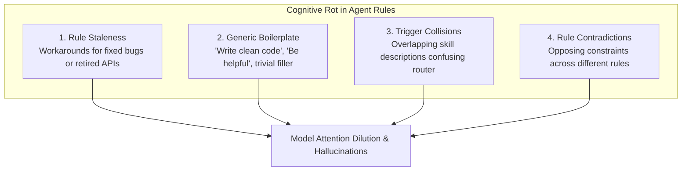
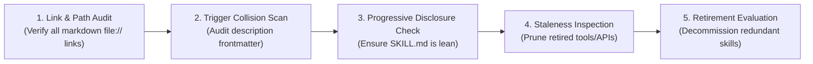

# Agent Instruction & Skill Library Hygiene

> **Mandate**: *Agent instructions, system prompts, rulebooks (`AGENTS.md`), and skill libraries are software code.* As codebases evolve, agent guidance accumulates obsolete rules, redundant constraints, and cognitive bloat. Stale instructions cause model hallucinations, attention dilution, and erratic tool invocation. An agent must maintain its own instruction system with the exact same rigor, evidence, and verification gates applied to production code.

---

## 1 · Cognitive Bloat & Instruction Drift Forensics

Autonomous agents operate under bounded context and attention bandwidth. When rulebooks (`AGENTS.md`) and skill definitions grow unconstrained, **instruction dilution** occurs: the model misses critical invariants because the context is saturated with low-signal noise.



### The 4 Symptoms of Instruction Decay:
1. **Rule Staleness**: Instructions directing the agent to use CLI tools, build flags, or file paths that no longer exist in the repository.
2. **Generic Boilerplate Noise**: High-token, low-information phrases (e.g. *"Think carefully"*, *"Write clean, readable code"*, *"Always strive for excellence"*). These provide zero empirical error prevention and dilute core invariants.
3. **Trigger Collisions**: Two or more skills claiming the same domain (e.g., both `data-cleaning` and `data-autocleaning` triggering on "clean data"), causing random or indecisive agent dispatch.
4. **Broken Markdown Links & Dead References**: References pointing to deleted files or old branch names.

---

## 2 · The Instruction Signal-to-Noise Ratio ($\text{SNR}_{\text{rule}}$)

Every rule in `AGENTS.md` and every section in a `SKILL.md` must justify its token footprint:

$$\text{SNR}_{\text{rule}} = \frac{\text{Empirical Error Prevention Value}}{\text{Token Footprint} \times \text{Attention Overhead}}$$

```
                        INSTRUCTION EVALUATION RUBRIC
                        
  ┌───────────────────────┬────────────────────────────────────────────────────────┐
  │ SNR Tier              │ Protocol & Action                                      │
  ├───────────────────────┼────────────────────────────────────────────────────────┤
  │ High ($\text{SNR} \ge 1.0$) │ Retain in Core Rules (`AGENTS.md` / `SKILL.md`).       │
  │                       │ Non-negotiable safety invariant, structural contract,  │
  │                       │ or critical failure prevention gate.                   │
  ├───────────────────────┼────────────────────────────────────────────────────────┤
  │ Medium ($0.3 \le \text{SNR} < 1.0$) │ Relocate to Progressive Disclosure Reference.          │
  │                       │ Valuable domain knowledge or detailed procedure that   │
  │                       │ is only needed on-demand during specific tasks.        │
  ├───────────────────────┼────────────────────────────────────────────────────────┤
  │ Low ($\text{SNR} < 0.3$)    │ Prune & Delete.                                        │
  │                       │ Generic platitudes, redundant phrasing, or obsolete    │
  │                       │ guidance with zero measurable error prevention value.  │
  └───────────────────────┴────────────────────────────────────────────────────────┘
```

---

## 3 · The Invariant Shield (Protected Rules)

> [!CAUTION] THE INVARIANT SHIELD
> An agent optimizing or pruning instructions is strictly forbidden from deleting, weakening, or altering any rule classified under **The Invariant Shield**:
> 1. **Safety & Data Loss Invariants** (e.g., destructive command verification, secret protection).
> 2. **Verification Gates** (e.g., requirement that all tests must pass before declaring completion).
> 3. **Architectural Separation Laws** (e.g., separating refactoring from behavioral changes).
> 
> *Optimization of protected rules is restricted strictly to syntactic compression and eliminating duplicate statements.*

---

## 4 · Skill Library Auditing & Retirement Protocol

When maintaining a skill repository (such as `.agents/skills/`), execute this 5-point audit:



### 1. Link & Path Verification
* Parse all relative and absolute file links in `SKILL.md` and reference manuals.
* Verify that every linked file exists on disk.
* Flag any broken anchors or shifted line numbers.

### 2. Trigger Collision & Description Audit
* Extract the `description` frontmatter of all registered skills.
* Perform semantic overlap analysis: Do two skills have nearly identical trigger phrases?
* If overlapping, refine descriptions to establish distinct, mutually exclusive boundaries.

### 3. Progressive Disclosure Check
* Verify that root `SKILL.md` files remain focused on high-level invariants, lifecycles, and sizing modes.
* Verify that verbose step-by-step procedures, large cheat sheets, and deep background material reside in `references/`.

### 4. Staleness Inspection
* Check for deprecated package manager commands (e.g. `npm install --legacy-peer-deps` workarounds from 2021).
* Check for references to old compiler versions or decommissioned CI pipelines.

### 5. Skill Retirement & Consolidation Gate
* If a skill's functionality has been superseded by a more universal skill (e.g., an ad-hoc cleanup script superseded by `maintenance`), mark the older skill for retirement:
  1. Add deprecation notice to frontmatter: `deprecated: true`.
  2. Direct users and agents to the successor skill.
  3. Archive the obsolete skill directory.
