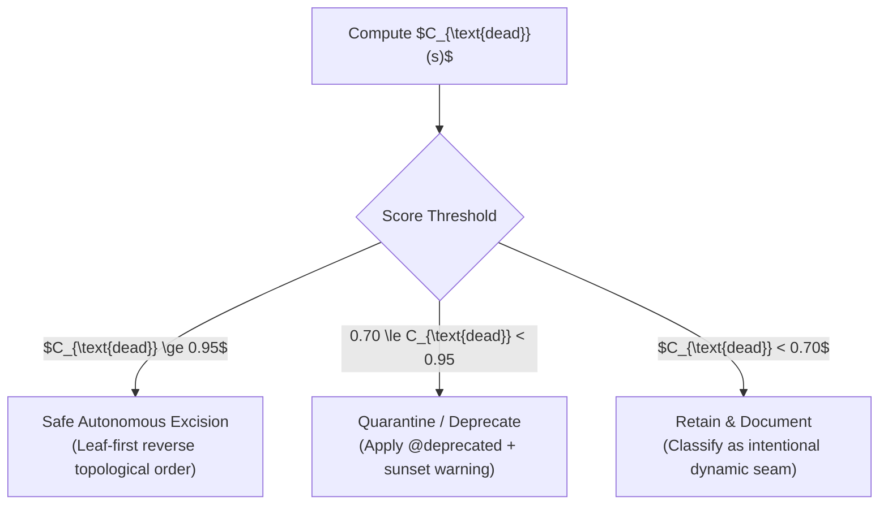
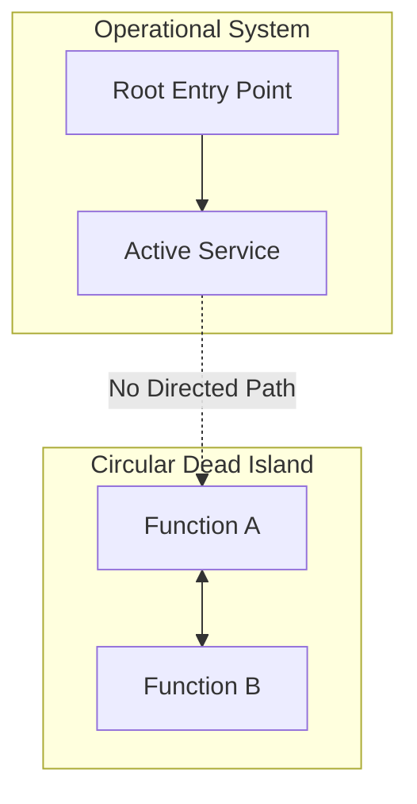

# Dead-Code Elimination & Graph-Oriented Reachability

> **Mandate**: *Code deletion without reachability proof is reckless destruction; code retention without reachability proof is cowardice.* An agent must rigorously prove that candidate symbols, files, and configurations are mathematically unreachable from all declared Root Entry Points, preserve all dynamic reflection seams and public library contracts, and execute deletions in reverse topological order.

---

## 1 · Graph-Oriented Reachability Foundations

Every software system can be modeled as a directed graph $G = (V, E)$, where vertices $V$ represent code entities (functions, classes, variables, modules, templates, routes) and directed edges $E = \{(u, v)\}$ represent static or dynamic call/reference dependencies ($u \to v$ means $u$ invokes, imports, or references $v$).

### 1.1 The Root Entry Point Set ($\mathcal{R}$)
The system is executed or consumed exclusively through its **Root Entry Points** $\mathcal{R} \subset V$:
$$\mathcal{R} = \mathcal{R}_{\text{http}} \cup \mathcal{R}_{\text{cli}} \cup \mathcal{R}_{\text{event}} \cup \mathcal{R}_{\text{cron}} \cup \mathcal{R}_{\text{pub\_api}} \cup \mathcal{R}_{\text{isr}} \cup \mathcal{R}_{\text{agent}}$$

Where:
* $\mathcal{R}_{\text{http}}$: HTTP, gRPC, WebSocket, and GraphQL route handlers and controllers.
* $\mathcal{R}_{\text{cli}}$: Command-line entry points, binary `main()` functions, and script entrypoints.
* $\mathcal{R}_{\text{event}}$: Message queue consumers (Kafka, RabbitMQ, SQS), webhook listeners, and event handlers.
* $\mathcal{R}_{\text{cron}}$: Scheduled daemon tasks, background workers, and migration scripts.
* $\mathcal{R}_{\text{pub\_api}}$: Public barrel exports (`index.ts`, `lib.rs`, `__all__`, public C/C++ headers) in libraries and SDKs.
* $\mathcal{R}_{\text{isr}}$: Hardware reset vectors, Interrupt Service Routines, and memory-mapped boot hooks in embedded systems.
* $\mathcal{R}_{\text{agent}}$: System prompts, tool definitions, and user slash commands in AI agent systems.

### 1.2 The Reachability Equation
A symbol $s \in V$ is **Operationally Reachable** if and only if there exists a directed path from at least one root entry point to $s$:
$$\text{Reachable}(s) \iff \exists r \in \mathcal{R} \text{ s.t. } r \rightsquigarrow s$$

Any symbol where $\text{Reachable}(s) = \text{False}$ is an unreachability candidate.

---

## 2 · The Dead-Code Confidence Score ($C_{\text{dead}}$)

Static analysis alone is insufficient in environments utilizing dynamic dispatch, reflection, dependency injection, or public external consumers. The agent must evaluate the **Dead-Code Confidence Score**:

$$C_{\text{dead}}(s) = P_{\text{unreachable}}(s) \times (1 - P_{\text{dynamic}}(s)) \times (1 - P_{\text{boundary}}(s))$$

### 2.1 Score Parameters & Weighting

| Parameter | Definition & Metric | Evaluation Criteria |
| :--- | :--- | :--- |
| **$P_{\text{unreachable}}(s)$** | Static unreachability proof $\in \{0, 1\}$. | $1.0$ if static call-graph traversal from $\mathcal{R}$ finds zero paths to $s$; $0.0$ if any path exists. |
| **$P_{\text{dynamic}}(s)$** | Dynamic invocation probability $\in [0, 1.0]$. | Probability that $s$ is invoked via reflection, string lookup, dependency injection, foreign-function interface, or naming convention. |
| **$P_{\text{boundary}}(s)$** | External consumption probability $\in \{0, 1.0\}$. | $1.0$ if $s$ is exported at the declared package perimeter (e.g. library SDK barrel); $0.0$ if strictly internal/private. |

### 2.2 Action Thresholds



---

## 3 · Dynamic Seam Defense ($\Sigma_{\text{dyn}}$)

Before declaring $P_{\text{dynamic}}(s) = 0$, the agent must actively search for dynamic reflection patterns:

1. **String-Based Dispatch**:
   * Inspect string literal occurrences matching symbol name: `grep -rn "symbol_name" .`
   * Check dynamic member lookups: `getattr(obj, name)`, `obj[method_name]()`, `Class.forName(name)`, `dlsym(handle, name)`.
2. **Dependency Injection & Service Locators**:
   * Inspect IoC registration containers (Spring, Guice, NestJS, InversifyJS, Dagger).
   * Verify if symbol is bound via interface token or string tag.
3. **Serialization & Deserialization**:
   * Does the symbol represent a DTO, schema model, or JSON payload field? (Check `@JsonProperty`, `serde`, `dataclass`, Pydantic).
4. **Foreign Function Interfaces (FFI) & IPC**:
   * Check bindings in C/C++/Rust exports consumed by Python, Node.js, WebAssembly, or JNI.

---

## 4 · The "Verification Sink" Axiom (Handling Tests)

> [!IMPORTANT] THE VERIFICATION SINK AXIOM
> Tests are **verification sinks**, never operational root entry points:
> $$\mathcal{R}_{\text{test}} \cap \mathcal{R}_{\text{operational}} = \emptyset$$

A naive dead-code scanner often reports dead functions as "active" because they have 100% test coverage in `tests/`.

### Detection & Excision Protocol:
1. Construct the operational call graph $G_{\text{op}}$ using exclusively $\mathcal{R}_{\text{operational}}$ (excluding test files).
2. If $s$ is unreachable in $G_{\text{op}}$, verify callers:
   * If callers exist **only** inside `test/`, `spec/`, or mock fixtures, $s$ is **Test-Isolated Dead Weight**.
3. **Atomic Excision Rule**: Excite the dead symbol and its corresponding orphaned unit test atomically in the same commit. Never leave tests that assert against deleted internal symbols.

---

## 5 · Reverse Topological Deletion Algorithm (Leaf-First Ordering)

Deleting code in arbitrary order causes broken imports, compilation failures, and confusing compiler diagnostics. Excision must proceed in **Reverse Topological Order**:

```
                       REVERSE TOPOLOGICAL ORDER
                       
         [Root Entry Points: HTTP / CLI / Crons]
                            │
                            ▼
                [Intermediate Controllers]
                            │
                            ▼
                   [Service Layer Modules]
                            │
                            ▼
              [Dead Leaf Functions / Helpers]   ◄── FIRST TO DELETE (Step 1)
```

### The 4-Step Deletion Pipeline:
1. **Step 1: Leaf Node Deletion**:
   * Delete pure leaf functions/methods that have zero outgoing calls to internal code.
   * Run compiler / typechecker. Verify zero broken references.
2. **Step 2: Caller / Intermediate Node Deletion**:
   * Now that the leaves are gone, former intermediate callers become new leaves.
   * Delete newly orphaned intermediate callers.
   * Run compiler / typechecker.
3. **Step 3: Module / File Deletion**:
   * When an entire file contains zero living symbols, remove the file.
   * Prune all import statements importing that file across the codebase.
4. **Step 4: Dependency & Config Deletion**:
   * Check if any third-party dependencies in `package.json`, `Cargo.toml`, or `pyproject.toml` were used exclusively by the excised files.
   * Route package removal to `dependency-management`.

---

## 6 · Circular Dead Dependency Islands (Strongly Connected Components)

A common dead-code trap is the **Circular Dead Island**: Function $A$ calls Function $B$, and Function $B$ calls Function $A$, but neither is reachable from $\mathcal{R}$.



* Naive reference counters see `ref_count(A) = 1` and `ref_count(B) = 1`, and fail to flag either.
* **Algorithm**:
  1. Compute the transitive forward closure from all roots: $\text{ReachableSet} = \text{BFS}(\mathcal{R}, G)$.
  2. Compute the complement set: $\text{UnreachableSet} = V \setminus \text{ReachableSet}$.
  3. Identify all Strongly Connected Components (SCCs) within $\text{UnreachableSet}$ using Tarjan's or Kosaraju's algorithm.
  4. Excite the entire SCC atomically as a single cohesive batch.

---

## 7 · Brownfield & Untested Codebases (The Quarantine Protocol)

When operating in brownfield codebases with zero test suites or unverified dynamic behavior, hard deletion carries unacceptable regression risk. The agent invokes the **Conservative Quarantine Protocol**:

1. **Do Not Delete**: Leave the executable body intact.
2. **Apply Deprecation Annotations**:
   * *TypeScript / JavaScript*: `/** @deprecated [DEBT-ID] Scheduled for excision. */`
   * *Python*: `@warnings.warn("Deprecated; scheduled for excision", DeprecationWarning, stacklevel=2)`
   * *Rust*: `#[deprecated(since = "x.y.z", note = "Scheduled for excision in DEBT-ID")]`
   * *Go*: `// Deprecated: Scheduled for excision in DEBT-ID.`
3. **Log Debt Register Item**: Add a structured entry in `TECH_DEBT.md` with an assigned review horizon.
4. **Log Runtime Warning**: If execution is ever triggered in staging/prod, telemetry will capture the dynamic call site.
