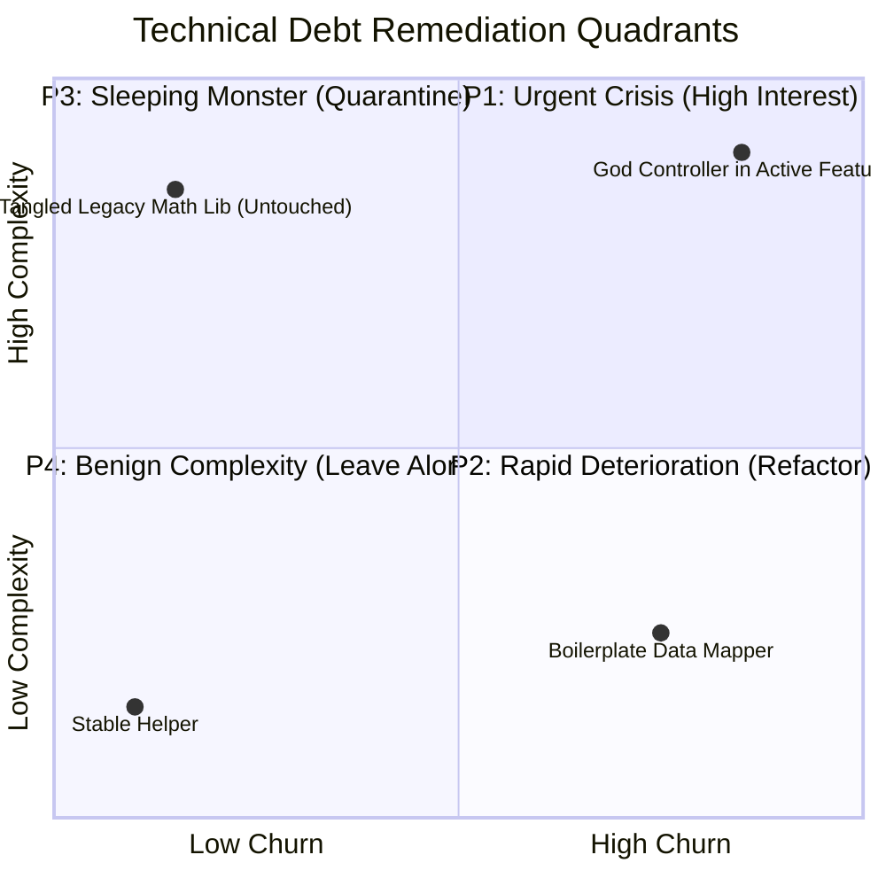
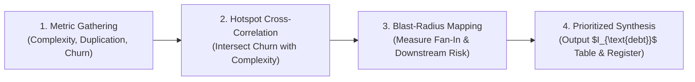

# Technical-Debt Quantification & Evidence-Driven Auditing

> **Mandate**: *Technical debt is not subjective aesthetic displeasure; it is the measurable drag on engineering velocity and system reliability caused by suboptimal structural decisions.* An agent must quantify technical debt using falsifiable metrics (complexity, churn, blast radius), prioritize remediation by compounding interest rather than cosmetic noise, and conduct thorough empirical analysis before touching a single line of code.

---

## 1 · The Technical Debt Interest Index ($I_{\text{debt}}$)

Not all complex code is urgent debt. A complex algorithm that is never modified and rarely fails costs zero ongoing interest. Conversely, a moderately complex module modified three times a week by four engineers accumulates crushing interest.

The agent quantifies technical debt using the **Technical Debt Interest Index**:

$$I_{\text{debt}}(m) = C_{\text{complexity}}(m) \times F_{\text{churn}}(m) \times B_{\text{blast}}(m)$$

```
                               $I_{\text{debt}}$ COMPONENT MATRIX
                               
      ┌─────────────────────────────────────────────────────────────────────────┐
      │  $C_{\text{complexity}}(m)$: Cognitive & Cyclomatic Density              │
      │  (Nesting depth, branching factor, fan-out, parameter proliferation)    │
      └────────────────────────────────────┬────────────────────────────────────┘
                                           │ $\times$
      ┌────────────────────────────────────┴────────────────────────────────────┐
      │  $F_{\text{churn}}(m)$: Modification Velocity & Volatility               │
      │  (Commit frequency, lines changed per quarter, defect-fix recurrence)  │
      └────────────────────────────────────┬────────────────────────────────────┘
                                           │ $\times$
      ┌────────────────────────────────────┴────────────────────────────────────┐
      │  $B_{\text{blast}}(m)$: Architectural Blast Radius & Centrality          │
      │  (Fan-in: count of downstream modules depending on this interface)       │
      └─────────────────────────────────────────────────────────────────────────┘
```

### 1.1 Mathematical Formulation of Parameters

1. **Complexity Factor ($C_{\text{complexity}}$)**:
   $$C_{\text{complexity}}(m) = \log_2 \left( 1 + \text{Cyclomatic}(m) \right) \times \left( 1 + \frac{\text{Cognitive}(m)}{10} \right)$$
   * Normalizes extreme branch counts while heavily penalizing deep nesting, tangled conditionals, and implicit state mutations.
2. **Churn Factor ($F_{\text{churn}}$)**:
   $$F_{\text{churn}}(m) = \frac{\text{Commits in Last 90 Days}(m)}{10} + \frac{\text{Defect Fix Commits}(m)}{2}$$
   * Files modified frequently or repeatedly associated with bug-fix commits have high churn.
3. **Blast Radius Factor ($B_{\text{blast}}$)**:
   $$B_{\text{blast}}(m) = 1 + \log_{10} \left( 1 + \text{FanIn}(m) \right)$$
   * Downstream consumers that depend directly on module $m$. Core utilities and data models have high fan-in ($B > 2.0$), while leaf controllers have low fan-in ($B \approx 1.0$).

---

## 2 · The 4-Quadrant Prioritization Matrix

Based on the calculated $I_{\text{debt}}$, modules are classified into 4 distinct quadrants:



### Remediation Strategies by Quadrant:

* **Quadrant 1: Urgent Crisis (High Complexity + High Churn)**:
  * **Top Priority ($I_{\text{debt}} \ge 25.0$)**.
  * Directly impedes ongoing feature development and generates continuous production defects.
  * *Action*: Schedule immediate structural decomposition via [`refactoring`](../../refactoring/SKILL.md).
* **Quadrant 2: Rapid Deterioration (Low Complexity + High Churn)**:
  * **Second Priority ($10.0 \le I_{\text{debt}} < 25.0$)**.
  * Simple code suffering from rapid copy-paste duplication and structural rot.
  * *Action*: Extract reusable domain models or common utilities; enforce linting.
* **Quadrant 3: Sleeping Monster (High Complexity + Low Churn)**:
  * **Third Priority ($5.0 \le I_{\text{debt}} < 10.0$)**.
  * Legacy code that is horrifying to read but rarely touched and currently stable in production.
  * *Action*: **Do not refactor blindly**. Pin with characterization tests. Only refactor when a planned business feature explicitly requires modifying this module.
* **Quadrant 4: Benign (Low Complexity + Low Churn)**:
  * **Lowest Priority ($I_{\text{debt}} < 5.0$)**.
  * Stable, isolated utilities. Retain as-is; do not waste engineering effort.

---

## 3 · The Evidence-Driven Code Audit Protocol

When an agent executes the `tech-debt-audit` mode, it must follow this 4-step evidence pipeline:



### Step 1: Metric Gathering
* **Duplication**: Identify identical or near-identical code blocks ($> 10$ lines) duplicated across multiple call sites.
* **Size & Cohesion**: Identify God classes ($> 500$ lines), sprawling functions ($> 50$ lines), and classes with low Cohesion of Methods (LCOM).
* **Deep Conditionals**: Identify cyclomatic hotspots with nesting depth $\ge 4$.
* **Deprecated API Invocations**: Scan for usage of superseded internal symbols or obsolete standard library calls.

### Step 2: Hotspot Cross-Correlation
Never report complexity in isolation. Cross-reference static complexity with repository git history:
* Which files have appeared in the most commits over the last 90 days?
* Which files have the highest ratio of bug-fix commits (commits mentioning `fix`, `bug`, `patch`)?

### Step 3: Blast-Radius Mapping
* Trace downstream dependencies using static import graphs.
* Assess what percentage of the test suite exercises this module.

### Step 4: Prioritized Synthesis
Produce the **Technical Debt Audit Scorecard** ranking the top hotspots strictly by $I_{\text{debt}}$.

---

## 4 · Technical Debt Audit Scorecard Template

Every `tech-debt-audit` must emit a structured scorecard formatted as follows:

| Target Module / Symbol | $C_{\text{complexity}}$ | $F_{\text{churn}}$ | $B_{\text{blast}}$ | $I_{\text{debt}}$ Score | Root Structural Cause | Recommended Action & Route |
| :--- | :--- | :--- | :--- | :--- | :--- | :--- |
| `src/core/checkout.ts` | $6.2$ (God class) | $4.5$ (18 commits) | $2.8$ (12 callers) | **$78.1$ (P1)** | Sprawling state machine mixed with DB calls | Decompose via `refactoring` into State pattern |
| `src/auth/token_verify.py`| $3.1$ (Nested if/else)| $2.0$ (6 commits)  | $3.5$ (34 callers) | **$21.7$ (P2)** | Legacy JWT fallback logic mixed with v2 | Extract validator; deprecate fallback |
| `legacy/crypto_math.c` | $8.0$ (Complex math)| $0.2$ (1 commit)   | $1.1$ (1 caller)   | **$1.8$ (P4)**  | Opaque numerical constants | Retain; pin characterization tests |
