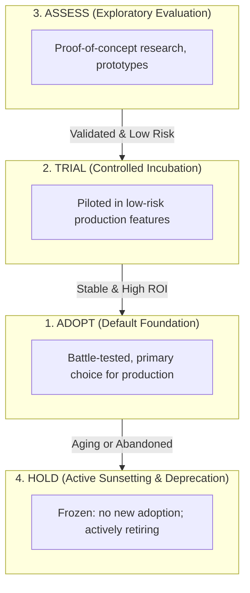
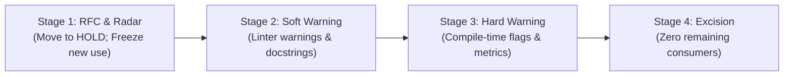

# Technology Radar & Deprecation Governance

> **Mandate**: *Software technologies age. What was idiomatic five years ago is technical debt today, and what is trendy today may be abandoned tomorrow.* An agent must govern the macro lifecycle of languages, frameworks, libraries, and tools using a structured Technology Radar, track obsolescence velocity, and enforce staged, non-disruptive deprecation sequences rather than chaotic midnight rip-and-replace churn.

---

## 1 · The 4-Ring Technology Lifecycle Radar

The repository's tech stack (languages, frameworks, datastores, build tools, external libraries) is governed across 4 concentric rings:



### Definitions & Policy Mandates:
* **ADOPT**: Default industry or organization standards. Mandatory for all new development unless an explicit ADR justifies an exception.
* **TRIAL**: Vetted candidates deployed to non-critical microservices or bounded features to assess ergonomics, operational characteristics, and reliability.
* **ASSESS**: Active investigation and spike experiments in isolated sandbox branches. Strictly forbidden in production.
* **HOLD**: Prohibited for any new features or services. Existing usages are slated for structured retirement.

---

## 2 · Technology Obsolescence Velocity ($\alpha$)

To determine when an `ADOPT` technology should transition to `HOLD`, the agent evaluates the **Obsolescence Velocity**:

$$\alpha(T) = \frac{\Delta \text{EOL} + \Delta \text{CVE} + \Delta \text{Upstream}}{\text{Ecosystem Migration Rate}}$$

```
                       OBSOLESCENCE SIGNALS MATRIX
                       
  ┌───────────────────────────┬────────────────────────────────────────────────────────┐
  │ Signal Category           │ Falsifiable Warning Threshold                          │
  ├───────────────────────────┼────────────────────────────────────────────────────────┤
  │ 1. Runtime EOL Horizon    │ Official runtime reaches End-Of-Life in < 6 months      │
  │                           │ (e.g. Node 16, Python 3.8, Java 8).                   │
  ├───────────────────────────┼────────────────────────────────────────────────────────┤
  │ 2. Upstream Abandonment   │ Repository archived, zero commits in > 18 months, or   │
  │                           │ critical security issues unattended by maintainers.    │
  ├───────────────────────────┼────────────────────────────────────────────────────────┤
  │ 3. Paradigm Incoherence   │ Upstream ecosystem standardized on an incompatible     │
  │                           │ architectural model (e.g. CommonJS in pure ESM world). │
  ├───────────────────────────┼────────────────────────────────────────────────────────┤
  │ 4. Native Replacement    │ Language or standard library introduced native built-in│
  │                           │ that makes third-party package redundant.              │
  └───────────────────────────┴────────────────────────────────────────────────────────┘
```

---

## 3 · The 3 Mandatory Retirement Conditions

An agent must **never** decommission or deprecate an active technology without satisfying all three conditions:

$$\text{Retire}(T) \iff \text{Signal}(T = \text{HOLD}) \land \text{Successor}(T_s) \land \text{AdapterReady}(T, T_s)$$

1. **Obsolescence Signal Confirmed**: Evidence-backed classification in the `HOLD` ring.
2. **Vetted Successor Established**: An identified replacement occupying the `ADOPT` or `TRIAL` ring (sourced via [`solution-discovery`](../../solution-discovery/SKILL.md)).
3. **Anti-Corruption Boundary Adapter Ready**: The legacy technology must be encapsulated behind an opaque interface, preventing its types and conventions from leaking into core domain logic during migration.

---

## 4 · The 4-Stage Deprecation Cadence

Ripping out a major framework or API in a single unvetted pull request causes chaos. Decommissioning follows a disciplined 4-stage cadence:



### Stage 1: Announcement & Radar Classification
* Move technology to `HOLD` in the repository's Tech Radar.
* Record an Architectural Decision Record (ADR) detailing the retirement justification and recommended successor.
* Enforce pre-commit or CI rules blocking any new imports or manifest declarations of the technology.

### Stage 2: Soft Warning (Non-Breaking)
* Decorate all exposed APIs with deprecation notices:
  * JSDoc / TSDoc: `@deprecated Use SuccessorModule instead. Scheduled for removal in Release X.`
  * Python: `@warnings.warn("Use SuccessorModule instead.", DeprecationWarning)`
  * Rust / C++: `#[deprecated]`, `[[deprecated]]`
* Static linters emit non-blocking warnings.

### Stage 3: Hard Compile / Runtime Warning
* Transition linter/compiler flags to emit actionable warnings or fail CI if new call sites are introduced (`-Dwarnings`).
* Emit operational telemetry counters tracking any remaining active runtime calls: `legacy_feature_invocation_total`.
* Execute staged migrations on existing call sites using [`refactoring`](../../refactoring/SKILL.md).

### Stage 4: Clean Excision
* When telemetry and static analysis confirm **zero active call sites**, remove the implementation in a clean, attributable commit.
* Remove third-party dependencies from package manifests using [`dependency-management`](../../dependency-management/SKILL.md).
* Verify full regression test suite passes cleanly with exit code `0`.
