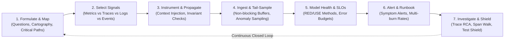

# Observability Engineering: Universal Telemetry, Diagnostics & Service Vitality Protocol

> **Mandate**: *Observability is not the accumulation of vendor SDKs, logs, or metrics. It is the mathematical property of an information-processing system that allows an operator or autonomous agent to infer its internal state solely from its external outputs.*  
> Telemetry exists to answer falsifiable operational questions, not to generate passive noise. Every discrete unit of computation must carry continuous causal correlation across boundary hops; high-cardinality data must be mathematically budgeted; telemetry must never crash or degrade the host system; and mechanical process vitality must never be conflated with operational service health. True observability engineering liberates agent problem-solving creativity, rejects vendor dogma, and guarantees deterministic diagnosability across any software archetype.

---

## 1 · The 7-Phase Universal Observability Lifecycle

Every observability task—from adding diagnostic logging to a single function to architecting enterprise telemetry or diagnosing an active production outage—traverses this closed-loop lifecycle:



1. **Phase 1 — Formulate & Map (Question Cartography)**: Map critical user and agent journeys. Enumerate the exact operational questions an on-call engineer or autonomous agent must answer during a degradation. Identify known failure modes, dark-flight paths, and external dependency seams (see [`references/telemetry-signals-and-question-first-design.md`](references/telemetry-signals-and-question-first-design.md)).
2. **Phase 2 — Select Signals & Cardinality Budgeting**: Allocate the correct signal type according to the diagnostic job:
   * **Metrics**: Continuous numerical aggregations over time ($O(1)$ storage per window). Best for service health, trends, and alerting.
   * **Traces**: Distributed request lifecycles and span DAGs across boundaries. Best for latency decomposition, causal sequencing, and bottleneck isolation.
   * **Logs**: High-cardinality, discrete contextual narratives. Best for forensic deep-dives and post-mortem verification.
   * **Events**: Infrequent, state-changing milestones (deployments, migrations, config rollouts). Best for correlating against metric deviations.  
   Enforce strict cardinality budgeting ($C = \prod |V_i| \le \text{Threshold}_{\text{safe}}$).
3. **Phase 3 — Instrument & Propagate (Observability-Driven Development)**: Embed telemetry before or alongside code implementation. Ensure continuous causal context propagation (`trace_id`, `span_id`, baggage) across all process, thread, network, queue, and agent hops. Enforce bidirectional boundary hygiene: redact secrets outbound and sanitize inputs inbound (see [`references/context-propagation-and-distributed-tracing.md`](references/context-propagation-and-distributed-tracing.md)).
4. **Phase 4 — Ingest, Sample & Sanitize (Zero-Blast-Radius Isolation)**: Route telemetry through non-blocking, memory-bounded asynchronous buffers. Apply multi-tier dynamic sampling: retain 100% of errors and high-latency anomalies via tail-based sampling while rate-limiting routine events. Telemetry backpressure must drop records gracefully with a self-monitoring counter (`telemetry_dropped_total`), never stalling application threads.
5. **Phase 5 — Model Service Health & Establish SLOs**: Disentangle mechanical vitality ($S_{\text{vital}}$) from true service health ($H_{\text{service}}$). Define Service Level Indicators (SLIs) using the **RED** (Rate, Errors, Duration) method for request interfaces or **USE** (Utilization, Saturation, Errors) method for compute resources. Compute error budget burn rates (see [`references/service-health-slos-and-alert-engineering.md`](references/service-health-slos-and-alert-engineering.md)).
6. **Phase 6 — Actionable Alerting & Runbook Pairing**: Configure multi-window multi-burn-rate alerts triggered by user-impacting symptoms rather than speculative internal metrics. Pair every alert directly with an actionable, deterministic triage runbook and diagnostic query links. Eradicate alert fatigue.
7. **Phase 7 — Investigate, Trace RCA & Engineering Shield**: During degradations, execute trace-based root cause analysis. Traverse the span tree hierarchically from symptom to root cause. Convert every discovered production failure mode into a permanent automated regression test or evaluation benchmark (see [`references/trace-rca-and-incident-diagnostics.md`](references/trace-rca-and-incident-diagnostics.md)).

---

## 2 · Progressive Disclosure (Reference Routing)

To prevent cognitive overload and preserve LLM context bandwidth, **never load all reference manuals simultaneously**. Consult reference manuals strictly on demand based on task context:

| Context Trigger | Mandatory Reference Manual | Purpose |
| :--- | :--- | :--- |
| **Signal choice, metric vs log vs trace, cardinality bounds, PII sanitization** | [`references/telemetry-signals-and-question-first-design.md`](references/telemetry-signals-and-question-first-design.md) | Question-first framework, signal taxonomy, cardinality growth math ($C = \prod \|V_i\|$), source-level redaction & input sanitization. |
| **Distributed tracing, traceparent, baggage, span hierarchies, async correlation** | [`references/context-propagation-and-distributed-tracing.md`](references/context-propagation-and-distributed-tracing.md) | W3C Trace Context specifications, distributed context carriers, async boundary propagation, critical path extraction. |
| **SLIs, SLOs, Error Budgets, RED/USE methods, alert burn rates, runbook authoring** | [`references/service-health-slos-and-alert-engineering.md`](references/service-health-slos-and-alert-engineering.md) | Formulating SLIs, multi-window burn rate alerting, zero-fatigue paging rules, standardized runbook templates. |
| **AI agents, LLM applications, RAG pipelines, token cost, evals-as-telemetry** | [`references/ai-agent-and-llm-observability.md`](references/ai-agent-and-llm-observability.md) | Tracing cognitive agent loops, tracking TTFT/ITL, cost attribution per tenant, integrating offline evals with runtime metrics. |
| **Production outage, latency spike, walking span trees, RCA to regression tests** | [`references/trace-rca-and-incident-diagnostics.md`](references/trace-rca-and-incident-diagnostics.md) | Hierarchical span traversal, separating symptom from root cause, statistical latency bisecting, converting RCA into test shields. |
| **Auditing legacy codebases, telemetry debt, dark flights, gap prioritization** | [`references/observability-audit-and-gap-remediation.md`](references/observability-audit-and-gap-remediation.md) | 5-axis observability audit rubric, risk-weighted gap scoring ($R = B \times P$), prioritizing telemetry debt remediation. |

---

## 3 · Adaptive Cognitive Sizing (The 6 Execution Modes)

Size your observability engineering effort to the task's scope, operational risk, and blast radius. Never apply heavy enterprise bureaucracy to a single-line script or local prototype, and never execute speculative, blind mutations across high-blast-radius production systems:

| Mode | Trigger & Scope | Engineering Discipline | Required Output & Protocol |
| :--- | :--- | :--- | :--- |
| **`micro-trace`** | Local script, CLI utility, single function/endpoint bug fix ($< 50$ lines). | Question-first log/metric addition, basic context tag, zero external collector dependencies. **Zero boilerplate**. | **3-Line Observability Intent Block** directly preceding code modification. |
| **`feature-telemetry`** | New feature, REST/gRPC endpoint, database operation, background job (1–5 files). | Observability-Driven Development (ODD): define questions, choose signals, instrument latency/errors, ensure context propagation, redact PII. | **Telemetry Specification Table**: Questions $\to$ Signals $\to$ Attributes $\to$ Error paths. |
| **`service-slo`** | Production microservice, API gateway, core backend daemon, public service. | Formal SLI/SLO definition (RED/USE), error budget allocation, multi-window burn rate alerts, dashboard queries, operational runbooks. | **Service Health Contract**: SLI formulations, SLO thresholds, alert configurations, linked triage runbook. |
| **`agent-eval-chain`** | AI agent workflows, LLM applications, RAG pipelines, multi-agent swarms. | Trajectory tracing: prompt/completion tokens, TTFT, tool execution latency, agent handoff context, eval scoring as telemetry, cost tracking. | **Agent Observability Manifest**: Span hierarchy DAG + Token/Cost attribution + Guardrail metrics. |
| **`audit-and-gap`** | Legacy service onboarding, production pre-flight audit, telemetry debt remediation. | Systematic code and config audit for dark-flight paths, missing error attributes, unhandled exceptions, and metric cardinality traps. | **Observability Debt Audit Report**: Risk-ranked gaps ($R = B \times P$) + Prioritized remediation plan. |
| **`incident-rca`** | Active or post-mortem incident investigation, latency spike, degraded service. | Trace span tree walk from symptom to root cause, anomaly classification, correlation across logs/metrics, test shield generation. | **Incident Diagnostic & RCA Report**: Span causality tree, timeline, root cause proof, regression shield. |

### The 3-Line Observability Intent Protocol (For `micro-trace` Mode)
To eliminate bureaucratic overhead on small, localized tasks, summarize observability intent in exactly 3 lines directly before emitting code edits:
```markdown
> **Operational Question**: [What exact diagnostic question does this telemetry answer?]
> **Signal & Attributes**: [Signal type (Log/Metric/Span) and non-sensitive attributes included]
> **Verification**: [Command or check confirming the telemetry emits cleanly and is queryable]
```

---

## 4 · The 8 Universal Observability Invariants

Regardless of language, framework, cloud provider, or runtime environment, every robust computational system upholds these 8 timeless invariants:

### 4.1 Invariant 1: Question-Driven Telemetry Primacy (The Diagnostic Axiom)
Telemetry exists exclusively to answer operational questions regarding system vitality, user journeys, or failure modes:
$$\text{Emit}(\tau) \implies \exists Q_{\text{operational}} \text{ s.t. } \text{Answers}(\tau, Q_{\text{operational}})$$
* **Prohibition**: Speculative "just in case" log spam and duplicate metrics that answer no falsifiable question are forbidden.

### 4.2 Invariant 2: Context & Causality Propagation Continuity (The Correlation Axiom)
Every computational transaction must preserve an immutable causal correlation context across threads, processes, network requests, message queues, and agent steps:
$$\forall \text{span } s_i, \quad \text{TraceId}(s_i) = \text{TraceId}(\text{Parent}(s_i)) \land \text{SpanId}(s_i) \neq \emptyset$$
* Telemetry without correlation is unindexable noise. Unbound logs during a distributed request are an architectural failure.

### 4.3 Invariant 3: Dual-Horizon Health & Vitality Disentanglement (The SRE Axiom)
Mechanical process vitality ($S_{\text{vital}}$) is decoupled from functional service health ($H_{\text{service}}$):
$$\text{HealthyService} \iff S_{\text{vital}}(\text{pid}, \text{port}) \land H_{\text{service}}(\text{SLIs}, \text{latency}, \text{errors}, \text{correctness})$$
* An HTTP 200 `/healthz` response from a deadlocked application or an agent returning exit code 0 while outputting hallucinated nonsense is **degraded**. Observability must monitor actual transaction success.

### 4.4 Invariant 4: Cardinality & Bounded Resource Stewardship (The Sustainability Axiom)
Metric label/tag dimensions must have finite, mathematically bounded cardinality:
$$\text{Cardinality}(M) = \prod_{k=1}^n |V_{d_k}| \le \text{Threshold}_{\text{safe}} \quad (O(1) \text{ storage per window})$$
* **Strict Rule**: Unbounded identifiers (UUIDs, user emails, raw query strings, IP addresses, arbitrary error strings) are strictly forbidden in metric dimensions. They belong in distributed trace span attributes or structured log payloads.

### 4.5 Invariant 5: Bidirectional Boundary Hygiene & Sanitization (The Security Axiom)
Telemetry streams must never compromise system security or integrity:
$$\text{Outbound}(\text{Telemetry}) \cap \text{Secrets} = \emptyset \quad \land \quad \text{Inbound}(\text{Telemetry}) \cap \text{Injections} = \emptyset$$
* *Outbound*: Scrub PII, bearer tokens, API keys, credentials, and customer secrets at the emission source.
* *Inbound*: Neutralize control characters, ANSI escape codes, and prompt-injection payloads in untrusted input before recording to telemetry streams.

### 4.6 Invariant 6: Critical-Path & Failure-Mode Diagnosability (The Completeness Axiom)
Every high-value user transaction and agent decision chain must have end-to-end branch diagnosability:
$$\forall \text{Branch } b \in \text{CriticalPath}, \quad \text{Outcome}(b) \in \{\text{Traced}, \text{Counted}, \text{Attributed}\}$$
* Any failure mode that degrades a request must leave deterministic evidence in the telemetry stream explaining both the symptom and the causal mechanism.

### 4.7 Invariant 7: Actionable, Runbook-Bound Alerting (The Anti-Fatigue Axiom)
An alert is an operational interruption; it is valid if and only if it demands immediate intervention and provides context:
$$\text{ValidAlert}(A) \iff \text{Actionable}(A) \land \text{Urgent}(A) \land \text{HasRunbook}(A) \land \text{CitesContext}(A)$$
* Paging on non-actionable internal indicators (e.g., transient CPU spike with zero latency impact) is prohibited. Every alert must include: Summary, Severity, Affected SLI/Blast Radius, Direct Query/Dashboard link, and Step-by-Step Triage Runbook.

### 4.8 Invariant 8: Zero-Blast-Radius Telemetry Isolation (The Observer Effect Axiom)
The collection of telemetry must never degrade, stall, or crash the host application:
$$\text{Impact}(\text{Telemetry}) \ll \text{Budget}_{\text{system}} \quad \land \quad \text{Failure}(\text{TelemetryPipeline}) \not\to \text{Failure}(\text{Application})$$
* Telemetry execution must be asynchronous and non-blocking in hot paths. When telemetry buffers fill under network backpressure, telemetry must be dropped gracefully with a self-monitoring drop counter (`telemetry_dropped_total`), never backpressuring core application threads.

---

## 5 · The Observability Invariant Exception Protocol

When exceptional physical or operational constraints conflict with standard observability invariants, the agent invokes this formal protocol:

> [!CAUTION] OBSERVABILITY INVARIANT EXCEPTION PROTOCOL
> An agent may deliberately bypass an observability invariant (e.g., bypassing context propagation in a sub-microsecond interrupt routine, or disabling logging during an emergency memory exhaustion Sev-0 incident) **IF AND ONLY IF**:
> 1. **Operational Blocker Citation**: Explicitly cites the physical or operational barrier (e.g., *"Hard real-time ISR execution budget is 2 microseconds; context propagation adds 8 microseconds; bypassed"*).
> 2. **Blast-Radius Quarantining**: Restricts the bypass strictly to the isolated function or emergency time window.
> 3. **Micro-ADR & Convergence Plan**: Records the exception (`[OBS-EXCEPTION: real-time ISR bypassed; hardware register probe substituted; committed YYYY-MM-DD]`).

---

## 6 · Universal Archetype Adaptation

The 8 universal invariants adapt dynamically across every software archetype by abstracting tools into functional telemetry roles:

| Dimension | Cloud & Containers (K8s, Envoy) | Serverless & Edge (Lambda, Workers) | Bare-Metal & Monoliths (Systemd, Unix) | Client & Mobile (iOS, Android, Web) | AI Agents & LLM Swarms | Embedded & IoT (FreeRTOS, Edge HW) | Libraries & SDKs (NPM, PyPI, Cargo) | Data Pipelines (Airflow, dbt, Spark) | Air-Gapped & High-Sec Enclaves |
| :--- | :--- | :--- | :--- | :--- | :--- | :--- | :--- | :--- | :--- |
| **Context Carrier** | W3C `traceparent` via HTTP/gRPC headers | Injected event envelope metadata / AWS X-Ray header | ThreadLocal storage / AsyncLocalStorage / IPC context | Network request trace headers / Session ID breadcrumbs | Session ID + Agent Run ID + Turn/Step Index in state | CAN bus packet tag / Fixed-byte message header | Context object parameter passed through public API | Airflow `dag_run_id` / Kafka header `traceparent` | File-backed envelope header / Local socket ID |
| **Primary Signals** | OTel Traces, Prometheus RED metrics, JSON stdout | Tail-sampled Spans, CloudWatch metrics, structured logs | Systemd journal logs, StatsD/Prometheus daemon metrics | Breadcrumbs, crash logs, client session performance traces | Cognitive span tree (thought, tool, model), token/cost counters | Circular ring-buffer logs, watchdog counters, state pins | Diagnostic callbacks, noop-by-default event hooks | Pipeline stage duration metrics, lineage events, task logs | Local append-only encrypted syslog, binary event ring-buffer |
| **Cardinality Rule** | Bounded enum labels (`http_status`, `method`); UUIDs in traces | Keep dimensions $\le 5$ (region, function, status); IDs in logs | Static instance labels; process PID in structured logs | Aggregate by OS/App version; never user ID in metrics | Aggregate by Agent Name/Model ID/Tool Name; session IDs in traces | Hardcoded sensor channel IDs; zero dynamic string tags | Zero metrics emitted by default; expose raw values to consumer | Aggregate by DAG ID/Task ID; row keys in trace context | Hardcoded error category enums; zero dynamic user fields |
| **Privacy / Redaction** | OTel collector regex masking processor / app interceptor | Source code sanitization before logger invocation | Syslog filter / in-memory scrubber utility | On-device PII stripper / sanitized crash reporter | Prompt/completion PII redaction; secret mask in tool arguments | No PII collected; physical sensor data sanitized on edge | Zero logging of user payload parameters | Data masking in ETL stages before emitting audit records | Deterministic source-level zero-leakage sanitizer |
| **Service Health (SLO)** | $99.9\%$ requests $< 200\text{ms}$ & error rate $< 0.1\%$ | Invocation error rate $< 0.05\%$, init duration $< 500\text{ms}$ | Process uptime + TCP listener latency + error log rate | Crash-free user sessions $\ge 99.9\%$, cold launch $< 1.5\text{s}$ | Task completion rate $\ge 95\%$, tool error rate $< 2\%$, eval score | Watchdog heartbeat interval $< 500\text{ms}$, reset count $= 0$ | Downstream integration test suite pass rate $= 100\%$ | Pipeline completion within SLA window, zero record drop | Local health loop probe pass rate, zero core dump |
| **RCA Traversal** | Distributed span tree walk (Jaeger/Tempo), upstream isolation | Trace timeline waterfall inspection in serverless console | `journalctl` timestamp correlation + core dump inspection | Crashlytics stack trace grouping + user breadcrumb trail | Step-by-step cognitive trajectory replay + tool failure diff | Logic analyzer capture / flash memory crash dump decode | Minimal reproducible test case in test runner harness | Task DAG execution Gantt chart + failed partition log | Local binary event log extraction & offline decode |

---

## 7 · Protocols for the 8 Extreme Operational Edge Cases

1. **Microsecond Latency Budgets (HFT, Kernel Drivers, Game Engines)**: Compile-time zero-cost toggles (`#ifdef` / const generics), lockless pre-allocated ring buffers in shared memory, atomic bitfield counters, and deferred serialization off the critical execution path.
2. **Ultra-Constrained Embedded Hardware (16KB RAM, No OS, No Filesystem)**: Hardware GPIO pin toggling for external logic analyzer timing; 1-byte packed event codes in circular RAM; watchdog timer resets tracked via non-volatile hardware registers.
3. **Air-Gapped / Classified / Zero-Connectivity Enclaves**: Local, append-only, cryptographically sealed and encrypted disk ring-buffers; offline batch compaction; zero external network egress assumptions.
4. **Non-Deterministic Multi-Agent Swarms & Stochastic Drift**: Spans encompass the full cognitive triad: $\langle \text{PromptHash}, \text{ToolExecution}, \text{EvaluationDelta} \rangle$; live evaluations treated as continuous telemetry; token and financial cost attributed per agent session; trajectory hashing for deterministic reproduction.
5. **Hyperscale Traffic (1,000,000+ requests/sec)**: Head-based probabilistic sampling ($0.1\%$) combined with 100% **tail-based anomaly sampling** (all 5xx errors and latency $> \text{P99}$ retained); exponential histogram buckets rather than raw samples.
6. **Cascading Telemetry Backpressure**: Strictly non-blocking ring buffer architecture. Buffer saturation triggers immediate record drop with an atomic `telemetry_dropped_total` counter, never backpressuring application threads.
7. **Closed-Source Legacy / Black-Box Upstreams**: Ingress/egress proxy interception (Envoy/eBPF) injecting `traceparent` headers; synthetic blackbox health probes executing end-to-end customer transactions periodically.
8. **Ephemeral Serverless & Zero-Traffic Cold-Starts**: Synchronous flush-on-exit contract wrapped in the runtime invocation lifecycle; synthetic heartbeat pinging to eliminate cold-start blindness.

---

## 8 · Guardrails & Strictly Disallowed Anti-Patterns

The skill enforces strict operational safety by explicitly forbidding these common failure modes:

* ❌ **No Cardinality Explosion**: Never inject high-cardinality values (user IDs, emails, raw SQL queries, UUIDs, timestamps) into metric dimensions.
* ❌ **No Telemetry Without Correlation**: Never emit isolated logs or error messages in a distributed workflow without attaching the active `trace_id` and `span_id`.
* ❌ **No Plaintext Secrets or PII**: Never transmit passwords, API tokens, Authorization headers, or customer secrets in telemetry streams.
* ❌ **No Blind Cause-Based Alerting**: Never page on internal indicators (e.g. CPU spikes) without demonstrated user impact or SLI degradation.
* ❌ **No Alerts Without Actionable Runbooks**: Never deploy an alert that lacks an actionable, step-by-step triage runbook.
* ❌ **No Conflating Vitality with Health**: Never declare a service healthy solely because a ping returns 200 or an agent exits with code 0.
* ❌ **No Blocking Telemetry in Hot Paths**: Never allow logging or telemetry transmission to block application threads or exhaust memory.
* ❌ **No Raw Prompt Dumps in Trace Payloads**: Never dump multi-megabyte prompt histories or raw vector embeddings into trace spans without truncation.
* ❌ **No Silent Telemetry Drops**: When telemetry is dropped under load, it must be tracked via an internal self-monitoring drop counter.

---

## 9 · The Clean Observability Stopping Contract

An observability engineering task is certified strictly **COMPLETE** only when all 6 exit criteria are proven with evidence:

1. **Question Traceability Certified**: Every telemetry signal directly maps to a documented operational question and diagnostic requirement.
2. **Cardinality & Cost Bound Proven**: Metric tag sets are verified to be finite, bounded enums; high-cardinality attributes are strictly confined to traces or structured logs.
3. **Context Propagation Verified**: Trace correlation headers propagate continuously across all relevant boundaries without breaking causality.
4. **Bidirectional Boundary Hygiene Verified**: Outbound telemetry is verified to scrub PII and secrets; inbound inputs are sanitized against injection attacks.
5. **Health & Alerting Actionability Proven**: Service health indicators (RED/USE) reflect true operational reality, and all configured alerts are bound to concrete, verifiable triage runbooks.
6. **Telemetry Verified via Query**: Emitted telemetry is verified by executing an actual query against the local collector, stdout stream, or mock harness, proving it parses and indexes cleanly.
