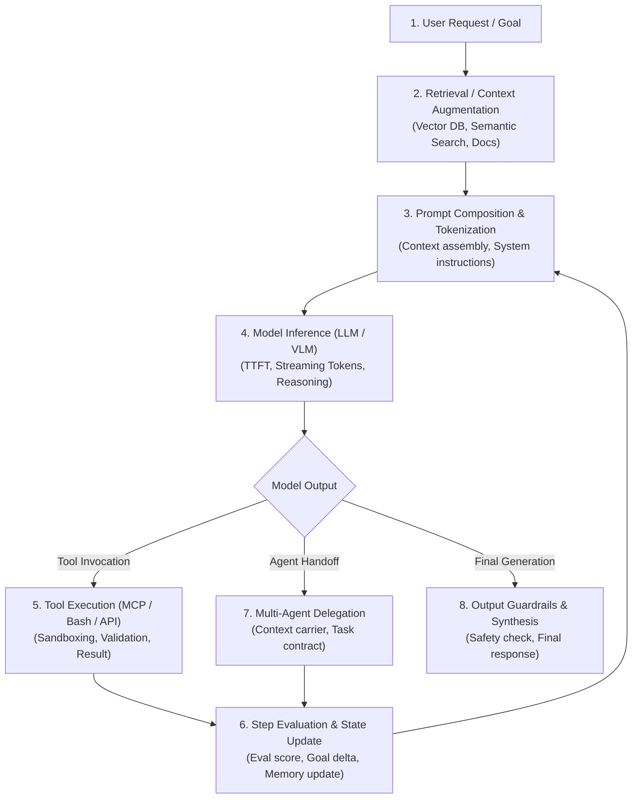
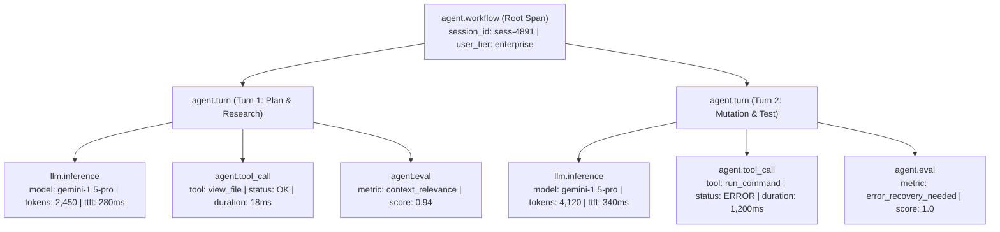
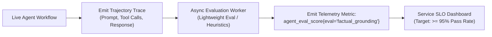

# AI Agent & LLM Observability Engineering

> **Mandate**: *AI agents are non-deterministic, multi-step cognitive systems. An agent can exit with status code 0, return HTTP 200, and generate syntactically valid JSON—while completely hallucinating, failing its primary goal, or bankrupting token budgets.*  
> Traditional application monitoring measures process and network health; agent observability measures cognitive fidelity, latency decomposition, token economics, tool reliability, and trajectory convergence.

---

## 1 · The Cognitive Execution Loop

Every agentic or generative AI workflow traverses a multi-stage cognitive loop. Observability must provide continuous span tracing across each distinct phase:



---

## 2 · The Cognitive Span Hierarchy DAG

To observe agent reasoning without losing causal relationships, structure agent spans into this standardized hierarchical DAG:



### 2.1 Standardized Span Attributes for AI Systems
Conform to open semantic conventions (`gen_ai.*` and `agent.*`):

| Span Type | Mandatory Attributes | Operational Purpose |
| :--- | :--- | :--- |
| `agent.workflow` | `agent.name`, `session.id`, `user.id_hash`, `agent.goal_hash` | Traces end-to-end task execution from user prompt to final completion. |
| `agent.turn` | `agent.turn_index`, `agent.max_turns`, `agent.state_size_bytes` | Measures progress through multi-step reasoning loops. |
| `llm.inference` | `gen_ai.system`, `gen_ai.request.model`, `gen_ai.usage.prompt_tokens`, `gen_ai.usage.completion_tokens`, `gen_ai.usage.cached_tokens`, `gen_ai.response.ttft_ms`, `gen_ai.request.temperature`, `gen_ai.estimated_cost_usd` | Decomposes latency into inference vs client overhead; tracks token burn and financial liability. |
| `agent.retrieval` | `rag.query_length`, `rag.documents_retrieved`, `rag.top_score`, `rag.latency_ms` | Evaluates retrieval quality and vector database performance. |
| `agent.tool_call` | `tool.name`, `tool.call_id`, `tool.execution_duration_ms`, `tool.exit_code`, `tool.error_type` | Isolates external tool failures from cognitive model errors. |
| `agent.eval` | `eval.name`, `eval.score`, `eval.pass_threshold`, `eval.evaluation_mode` | Records automated evaluations as first-class runtime telemetry. |
| `agent.handoff` | `agent.source_id`, `agent.target_id`, `agent.contract_id`, `agent.handoff_tokens` | Tracks task delegation across multi-agent swarms. |

---

## 3 · Golden Metrics of Generative AI & Agents

Monitor these 5 Golden Telemetry Signals to maintain healthy, cost-effective agent fleets:

### 3.1 Latency Decomposition: TTFT vs. ITL
Do not measure only total response duration; generative models stream tokens over seconds or minutes:
* **Time-to-First-Token (TTFT)**: Time from prompt transmission until the first generated token arrives at the client ($t_{\text{TTFT}} = t_{\text{token}_1} - t_{\text{request}}$). Measures prompt ingestion and initial reasoning latency.
* **Inter-Token Latency (ITL)**: Time between subsequent streaming tokens ($t_{\text{ITL}} = \frac{t_{\text{completion}} - t_{\text{token}_1}}{N_{\text{tokens}} - 1}$). Measures model generation speed.
* **Tool Overhead Ratio**: Percentage of total workflow duration spent executing tools vs awaiting model inference:
  $$\text{Ratio}_{\text{tool}} = \frac{\sum t_{\text{tools}}}{t_{\text{total\_workflow}}} \times 100\%$$

### 3.2 Token Economics & Financial Attribution
Track token consumption continuously across models and tenants:
$$\text{Cost}_{\text{session}} = \sum_{i=1}^M \left( \text{Tokens}_{\text{prompt}, i} \times P_{\text{prompt}} + \text{Tokens}_{\text{comp}, i} \times P_{\text{comp}} \right)$$
* **Cached Token Ratio**: Track cache hit efficiency ($\frac{\text{Tokens}_{\text{cached}}}{\text{Tokens}_{\text{prompt}}} \times 100\%$) to verify prompt-caching optimization.
* **Context Saturation Ratio**: Alert when prompt token count exceeds $80\%$ of the model's context window ($R_{\text{sat}} = \frac{\text{Tokens}_{\text{prompt}}}{\text{Window}_{\text{max}}} \ge 0.8$).

### 3.3 Tool Reliability & Error Attribution
* **Tool Failure Rate**: $\frac{\sum \text{Tool Calls with Exit Code } \neq 0}{\sum \text{Total Tool Calls}} \times 100\%$.
* **Loop Oscillation Index**: Detects whether an agent is stuck calling the same tool with identical failing inputs:
  $$\text{Oscillation} \iff \exists \text{ consecutive tools } T_t, T_{t+1} \text{ s.t. } \text{Hash}(T_t) == \text{Hash}(T_{t+1}) \land \text{Status}(T_t) == \text{ERROR}$$

### 3.4 Guardrails & Content Safety Interceptions
* **Input Injection Rate**: Frequency of prompt injection or jailbreak triggers.
* **Output Filtering Rate**: Frequency of model responses suppressed by content safety filters or hallucination checks.

---

## 4 · Evaluations as Runtime Telemetry (Evals-as-Telemetry)

In traditional software, tests run only during CI/CD. In non-deterministic AI systems, **evaluations must run continuously in production**:



### 4.1 Production Eval Strategy
1. **Lightweight Heuristic Evals (100% of traffic)**: Fast, non-LLM checks running synchronously: JSON schema validity, markdown link validity, forbidden word checks, regex pattern matches.
2. **Model-Based Evals (Sampled 1–5% of traffic)**: Asynchronous workers running targeted judge models assessing:
   * *Faithfulness / Grounding*: Does the response rely strictly on retrieved context?
   * *Answer Relevance*: Does the response fulfill the user's specific request?
   * *Trajectory Efficiency*: Did the agent solve the task with the minimum necessary tool calls?
3. **Eval Degradation Alerts**: If the rolling 6-hour average of `agent_eval_score` drops below $0.90$, trigger a P2 alert for prompt/model drift.

---

## 5 · Safe Payload Sanitization for Agent Telemetry

Agent prompts often contain entire codebases, documents, or user queries. Storing full prompt text in traces causes massive storage inflation and leaks secrets:

1. **Payload Truncation**: Truncate prompt and response attributes to a maximum of $1,024$ characters per span attribute, appending an explicit `[TRUNCATED: original_length=N]`.
2. **Prompt Hashing**: Always record the SHA-256 hash of the system prompt and user prompt (`prompt.system_hash`, `prompt.user_hash`). This enables exact version tracking without logging massive text repeatedly.
3. **Masking Sensitive Tool Arguments**: Scrub sensitive fields in tool arguments (e.g. `password`, `api_key`, `token`) before serializing tool calls to span attributes:
   ```json
   {
     "tool.name": "connect_database",
     "tool.args_sanitized": {
       "host": "db.internal.net",
       "port": 5432,
       "password": "[REDACTED:sha256_prefix_3a1b]"
     }
   }
   ```
