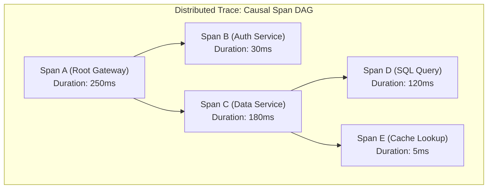
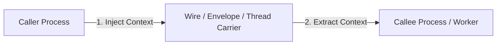
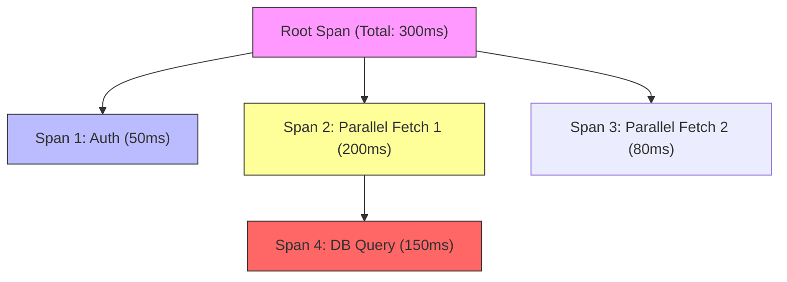
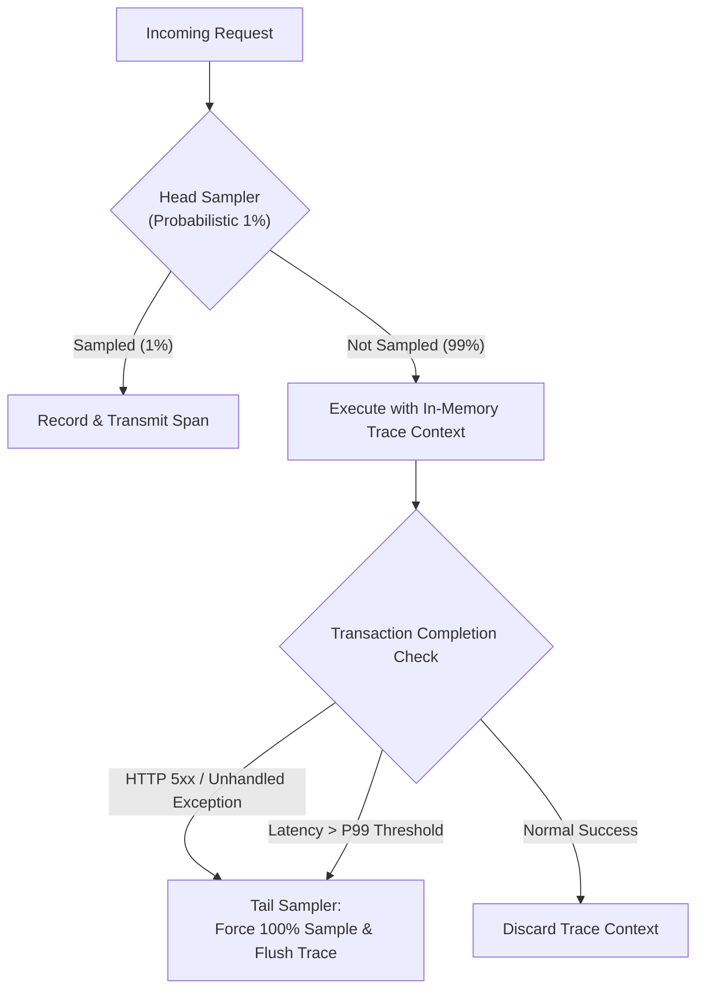

# Context Propagation & Distributed Tracing

> **Mandate**: *Isolated telemetry inside a multi-service or asynchronous workflow is blind noise. Distributed tracing provides the causal fabric that binds disparate computations into an intelligible Directed Acyclic Graph (DAG).*  
> Every request, background job, or agent turn must generate or adopt an immutable trace context that propagates uninterrupted across network hops, thread boundaries, message queues, and model inference loops.

---

## 1 · The Physics of Distributed Causality

In distributed systems, physical timestamps cannot be relied upon to determine event order due to clock skew ($|\Delta t| > 0$). Causality must be established logically via **Lamport's Happens-Before Relation** ($\to$):



### 1.1 Anatomy of a Span
A span $S$ is the fundamental unit of work in a trace. Every span must contain:
1. **Name**: Low-cardinality operation identifier (e.g. `POST /v1/checkout`, `db.query.select_users`, `agent.tool.run_command`).
2. **Trace ID**: 16-byte cryptographic random identifier shared by all spans in the transaction.
3. **Span ID**: 8-byte unique identifier for this specific unit of work.
4. **Parent Span ID**: 8-byte identifier of the preceding span (null for the root span).
5. **Timestamps**: Monotonic start and end times ($\Delta t = t_{\text{end}} - t_{\text{start}}$).
6. **Status**: Canonical state: `UNSET`, `OK`, or `ERROR` (with error message and causal description).
7. **Attributes (Tags)**: Key-value metadata providing operational context (e.g., `db.system: postgresql`, `http.status_code: 200`, `agent.turn_index: 3`).
8. **Events**: Timestamped structured annotations marking milestones *within* the span duration (e.g., `cache_miss`, `prompt_tokenized`).
9. **Links**: Causal references to spans in *other* traces (critical for batch operations, fan-out joins, or multi-agent handoffs).

---

## 2 · The W3C Trace Context Standard

To ensure complete vendor-neutral interoperability, systems must adhere to the W3C Trace Context specification across wire protocols:

### 2.1 The `traceparent` Header
The universal context carrier over wire protocols (HTTP, gRPC, AMQP, Kafka):
```text
traceparent: 00-4bf92f3577b34da6a3ce929d0e0e4736-00f067aa0ba902b7-01
             │  └───────────────┬───────────────┘ └───────┬────────┘ └─┬┘
          version          trace_id                    parent_id     flags
```
* **Version**: `00` (current standard).
* **Trace ID**: 32-hex-character string (16 bytes) identifying the entire distributed trace.
* **Parent ID / Span ID**: 16-hex-character string (8 bytes) identifying the caller span.
* **Trace Flags**: 8-bit field. `01` indicates the trace is recorded/sampled; `00` indicates not sampled.

### 2.2 The `tracestate` Header
Carries vendor-specific opaque routing data alongside the standard `traceparent` (e.g. `congo=t61rcWkgMzE,rojo=00f067a`). It must be passed transparently without modification across intermediaries.

### 2.3 Baggage vs. Span Attributes
* **Baggage**: Key-value pairs transmitted across process boundaries via the W3C `baggage` header.
  * *Use case*: Propagating business context (e.g. `tenant_id=enterprise_42`, `user_tier=platinum`) downstream so deep callee services can access it without querying a database.
  * *Caution*: Baggage is sent on **every downstream HTTP/RPC call**. Keep baggage strictly under 5 small key-value pairs to prevent header bloat. Never place secrets or unbounded payloads in baggage.
* **Span Attributes**: Metadata stored locally within the current span. Not transmitted downstream across the network.

---

## 3 · Context Carriers Across Diverse Runtime Boundaries

Context propagation fails most frequently at runtime and protocol boundaries. Follow these proven patterns:



| Runtime / Boundary | Context Carrier Mechanism | Injection / Extraction Pattern |
| :--- | :--- | :--- |
| **HTTP / REST** | HTTP Header (`traceparent`, `baggage`) | Set request headers before send; read request headers on route entry. |
| **gRPC** | Metadata Key (`traceparent`) | Attach client call metadata; read in server interceptor. |
| **Kafka / RabbitMQ** | Message Headers / AMQP Properties | Write byte headers into message envelope; extract in consumer loop. |
| **Node.js / TypeScript** | `AsyncLocalStorage` | Wrap asynchronous execution tree in `asyncLocalStorage.run(context, fn)`. |
| **Go** | `context.Context` | Pass `ctx` as the first argument to every function; extract via `trace.SpanFromContext(ctx)`. |
| **Python** | `contextvars.ContextVar` | Use asyncio-aware context variables; propagate across coroutines automatically. |
| **Java** | `ThreadLocal` / `ScopedValue` (Loom) | Open span in `try-with-resources`; clean up on scope exit. |
| **Rust** | `tracing::Span` / Futures | Attach `.instrument(span)` to asynchronous futures before polling. |
| **AI Multi-Agent Swarms** | Session State Manifest | Inject `trace_id` and `current_span_id` into agent state dictionaries and tool payloads. |

---

## 4 · Critical Path Analysis: Isolating Bottlenecks

A distributed trace often consists of parallel spans, asynchronous background tasks, and fan-out branches. Finding the true latency bottleneck requires extracting the **Critical Path**.


*In the diagram above, Span 3 (80ms) runs concurrently with Span 2 (200ms). Span 3 does NOT contribute to the critical path latency.*

### 4.1 Critical Path Calculation Rules
1. **Sequential Chain**: When span $B$ begins after span $A$ finishes, both are on the critical path:
   $$\text{Duration}_{\text{crit}} = \text{Duration}(A) + \text{Duration}(B)$$
2. **Concurrent Fork**: When spans $B$ and $C$ execute concurrently under parent $A$:
   $$\text{Duration}_{\text{crit}} = \max(\text{Duration}(B), \text{Duration}(C))$$
   The branch with the maximum duration forms the critical path; shorter branches are concurrent slack.
3. **Self-Time vs. Callee-Time**: For any span $S$:
   $$\text{SelfTime}(S) = \text{TotalDuration}(S) - \sum_{C \in \text{Children}(S)} \text{Duration}(C)$$
   A high self-time indicates CPU-bound bottlenecks or un-instrumented code within the host function itself.

---

## 5 · The Dynamic Multi-Tier Sampling Lattice

Tracing 100% of requests in high-volume production is economically and computationally impossible. Tracing 1% uniformly guarantees missing intermittent failures in low-volume paths.



### 5.1 Tail-Based Anomaly Sampling Protocol
1. **In-Memory Flight**: All requests carry a lightweight, in-memory trace context during execution, even if not pre-selected by the head sampler.
2. **Forced Capture Triggers**: If any of the following occur during request lifecycle, promote the entire trace to **100% Retained**:
   * Status code is an unhandled error ($5\text{xx}$ or internal application crash).
   * Total latency exceeds the service P99 SLO threshold ($t_{\text{duration}} > \text{Threshold}_{\text{P99}}$).
   * Trace carries an explicit diagnostic debug flag (`debug=true`).
   * Trace involves a VIP tenant or Canary cohort.
3. **Routine Rate-Limiting**: For successful, low-latency requests, apply probabilistic rate-limiting (e.g. 10 traces per second maximum per endpoint).
