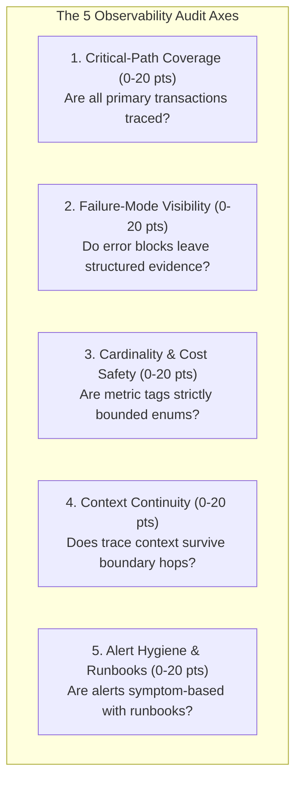

# Observability Audit & Gap Remediation

> **Mandate**: *You cannot manage or repair what you cannot observe. Brownfield systems suffer from two chronic pathologies: "dark flights" (critical business operations executing in total darkness) and "deafening static" (millions of un-indexed, un-correlatable log lines).*  
> An observability audit is a disciplined, risk-weighted diagnostic inspection that discovers telemetry debt, classifies blind spots by operational risk, and produces an actionable, prioritized remediation plan.

---

## 1 · The 5-Axis Observability Audit Rubric

Inspect the codebase, deployment manifests, and monitoring configurations across these 5 core axes (0–20 points each, 100 points total):



### 1.1 Detailed Scoring Breakdown

| Axis | 0–10 Points (Severe Gaps / High Risk) | 11–15 Points (Partially Observable) | 16–20 Points (Production Grade) |
| :--- | :--- | :--- | :--- |
| **1. Critical-Path Coverage** | Critical endpoints lack tracing; background workers execute with zero duration or throughput metrics ("Dark Flight"). | HTTP endpoints return status codes, but internal database, cache, or external API calls are opaque. | 100% of primary user/agent paths have distributed spans decomposing latency across all internal and external dependencies. |
| **2. Failure-Mode Visibility** | Bare `except Exception: pass` or `catch(e) {}` blocks that swallow errors silently or log generic strings (`"Error occurred"`). | Exceptions are logged, but lack root cause error signatures, input state hashes, or span status updates. | Every failure branch records structured causal error tuples, sets span status to `ERROR`, and increments error counters. |
| **3. Cardinality Safety** | High-cardinality values (User IDs, UUIDs, email addresses, raw SQL queries) are used as metric tags/labels. | Labels are mostly enums, but unbounded error strings or raw URLs with query params leak into metrics. | All metric dimensions are strictly bounded enums ($C \le \text{Threshold}$); high-cardinality values are confined to traces/logs. |
| **4. Context Continuity** | Trace context is dropped when making asynchronous calls, spawning goroutines/threads, or queuing messages. | HTTP headers propagate trace context, but message queues or background jobs lose parent trace IDs. | W3C `traceparent` and baggage propagate seamlessly across all network calls, queues, worker threads, and agent steps. |
| **5. Alert Hygiene & Runbooks** | Paging alerts fire on internal hardware metrics (CPU/RAM spikes); alerts lack runbooks and frequently trigger false alarms. | Alerts fire on HTTP 5xx errors, but lack multi-window burn rate evaluation; runbooks are generic or outdated. | Alerts fire strictly on SLO error budget burn rates; every alert includes direct dashboard links and copy-paste runbooks. |

---

## 2 · Risk-Weighted Gap Prioritization

Never attempt to fix all telemetry debt simultaneously. Prioritize gaps using the **Operational Risk Formulation**:

$$\text{RiskScore}(G) = \text{BlastRadius}(G) \times \text{FailureProbability}(G) \times (1.0 - \text{CurrentVisibility}(G))$$

* **Blast Radius ($1–5$)**:
  * $5$: Core revenue path, authentication, payment processing, data integrity.
  * $3$: Secondary user feature, reporting dashboard, asynchronous notification.
  * $1$: Internal batch maintenance script, dev tool.
* **Failure Probability ($1–5$)**:
  * $5$: Complex distributed integration, external 3rd-party API, high-concurrency mutation.
  * $3$: Standard database CRUD operation with established indices.
  * $1$: In-memory deterministic pure calculation.
* **Current Visibility ($0.0–1.0$)**:
  * $0.0$: Total darkness (no logs, no metrics, no spans).
  * $0.5$: Basic stdout logging with no correlation or latency metrics.
  * $1.0$: Fully instrumented distributed trace with RED metrics.

**Remediation Rule**:
* Gaps with $\text{RiskScore} \ge 15$: **P0 Critical** (Remediate immediately before new feature development).
* Gaps with $8 \le \text{RiskScore} < 15$: **P1 High** (Schedule in next engineering sprint).
* Gaps with $\text{RiskScore} < 8$: **P2 Moderate** (Address organically during routine code maintenance).

---

## 3 · Detecting "Dark Flights" in Codebases

A "Dark Flight" is any critical code path that can fail catastrophically without leaving a measurable operational footprint.

### 3.1 Common Dark Flight Patterns & Code Smells
1. **The Swallowed Exception**:
   ```python
   # ❌ Dark Flight: Failure is completely invisible to monitoring
   try:
       charge_customer_card(account_id, amount)
   except PaymentGatewayError:
       pass # or logger.info("payment issue") without error status or counter
   ```
   *Remediation*: Emit error counter, set span error status, record structured failure log.
2. **The Unmonitored Async Consumer**:
   ```typescript
   // ❌ Dark Flight: If consumer queue backs up or jobs crash, system flies blind
   channel.consume(queueName, async (msg) => {
       await processInvoice(JSON.parse(msg.content));
       channel.ack(msg);
   });
   ```
   *Remediation*: Wrap message handling in a distributed trace extracted from message headers; track queue processing duration and message error rate.
3. **The Unbounded Cardinality Trap**:
   ```go
   // ❌ Cardinality Explosion: Creates new metric series for every unique customer
   httpRequestsTotal.WithLabelValues(r.Method, r.URL.Path, r.Header.Get("X-User-ID")).Inc()
   ```
   *Remediation*: Strip user ID from metric labels; sanitize `r.URL.Path` to route pattern (`/users/:id`); place user ID in trace span attribute.

---

## 4 · Standardized Observability Debt Audit Report Schema

When executing in `audit-and-gap` mode, record findings in this structured report format:

```markdown
# Observability Debt Audit Report: [Target System / Service]

## 1. Executive Summary & Posture Score
* **Total Observability Score**: [X] / 100
* **Posture Assessment**: [Grade: A (>=90) / B (75-89) / C (60-74) / D (40-59) / F (<40)]
* **Critical Dark Flights Identified**: [Number of P0 gaps]
* **Cardinality Traps Identified**: [Number of exploding metric labels]

## 2. Axis-by-Axis Scoring Breakdown
1. **Critical-Path Coverage**: [Score] / 20 — [Brief rationale]
2. **Failure-Mode Visibility**: [Score] / 20 — [Brief rationale]
3. **Cardinality Safety**: [Score] / 20 — [Brief rationale]
4. **Context Continuity**: [Score] / 20 — [Brief rationale]
5. **Alert Hygiene & Runbooks**: [Score] / 20 — [Brief rationale]

## 3. Prioritized Telemetry Gap Matrix

| Gap ID | Component / File | Description of Gap | Blast Radius (1-5) | Prob (1-5) | Risk Score | Remediation Priority |
| :--- | :--- | :--- | :--- | :--- | :--- | :--- |
| **GAP-01** | `services/payment.py` | Swallowed `CardError` in billing retry loop; zero metric emitted. | 5 | 4 | **20.0** | **P0 - Critical** |
| **GAP-02** | `gateway/routes.go` | User email address used as Prometheus metric label `user_email`. | 4 | 5 | **18.0** | **P0 - Critical** |
| **GAP-03** | `workers/export.ts` | Async job worker drops trace context; unable to trace export stalls. | 3 | 3 | **9.0** | **P1 - High** |

## 4. Immediate Remediation Action Plan
1. **Fix GAP-01 (`services/payment.py`)**:
   Wrap payment call in child span `payment.charge`; emit metric `payment_failures_total{gateway="stripe", code="..."}`.
2. **Fix GAP-02 (`gateway/routes.go`)**:
   Remove `user_email` label from `http_requests_total`; store `user.id_hash` in trace span attributes.
3. **Fix GAP-03 (`workers/export.ts`)**:
   Extract `traceparent` from AMQP envelope and instantiate parent trace span in consumer handler.
```
