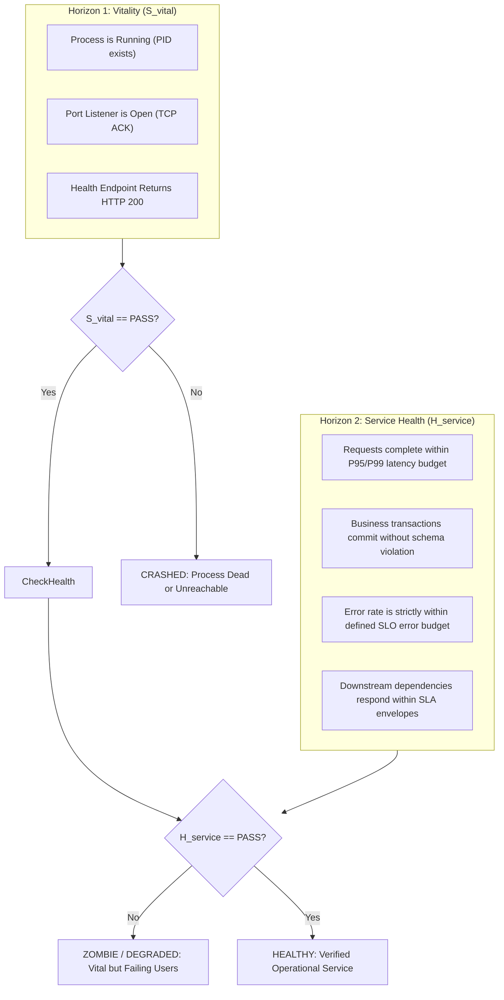
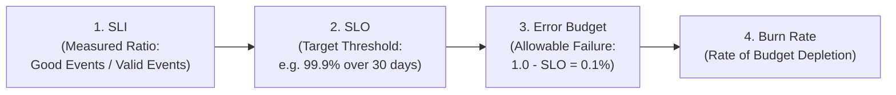

# Service Health, SLOs & Alert Engineering

> **Mandate**: *An alert that does not require an immediate operational response is not an alert; it is toxic noise that breeds operational apathy.*  
> Service health must be measured by user-experienced reliability and error budget consumption, not by arbitrary CPU spikes or container uptime. Every pageable alert must be symptom-driven, multi-window burn-rate validated, and strictly bound to an actionable, deterministic triage runbook.

---

## 1 · The Dual-Horizon Health Model

A system can be mechanically alive while functionally catastrophic. True service health decouples physical vitality from operational correctness:



$$\text{ServiceHealth} \iff S_{\text{vital}}(\text{process}, \text{ports}) \land H_{\text{service}}(\text{SLIs}, \text{latency}, \text{errors}, \text{correctness})$$

---

## 2 · The Two Telemetry Modeling Archetypes: RED & USE

Choose the telemetry modeling method according to the computational role of the component:

```
+---------------------------------------------------------------------------------------------------+
| Component Archetype       | Primary Job                | Modeling Method | Golden Signals         |
+---------------------------+----------------------------+-----------------+------------------------+
| Request Interfaces        | Servicing external calls   | RED Method      | Rate, Errors, Duration |
| Compute / OS Resources    | Processing raw workloads   | USE Method      | Util, Saturation, Error|
+---------------------------+----------------------------+-----------------+------------------------+
```

### 2.1 The RED Method (For Request-Driven Services & APIs)
Applies to HTTP endpoints, gRPC services, GraphQL resolvers, message consumers, and agent turn loops:
1. **Rate**: The number of requests serviced per second ($R = \frac{\Delta \text{Requests}}{\Delta t}$).
2. **Errors**: The number of requests that fail per second ($E = \frac{\Delta \text{Errors}}{\Delta t}$). Compute Error Rate: $\frac{E}{R}$.
3. **Duration**: The latency distribution of requests. Always track percentiles ($\text{P50}$, $\text{P95}$, $\text{P99}$), never simple averages.

### 2.2 The USE Method (For Internal Hardware & Resources)
Applies to CPUs, memory pools, disk I/O, database connection pools, thread workers, and network queues:
1. **Utilization**: The percentage of time the resource was busy ($U = \frac{\text{BusyTime}}{\text{TotalTime}} \times 100\%$).
2. **Saturation**: The degree to which work is queued awaiting the resource (e.g. queue length, thread backlog, swap usage). *Saturation indicates immediate impending degradation*.
3. **Errors**: The count of physical or operational error events (e.g. disk write failures, memory allocation errors, dropped network packets).

---

## 3 · SLIs, SLOs & Error Budget Mathematics

Reliability is not a binary 100% ideal. 100% reliability is an anti-pattern that halts innovation and wastes capital.



### 3.1 Mathematical Formulations
* **Service Level Indicator (SLI)**: A quantifiable metric measuring real user success:
  $$\text{SLI} = \frac{\sum \text{Successful Events}}{\sum \text{Valid Events}} \times 100\%$$
  *Example*: Percentage of HTTP requests returning $< 500$ within $250\text{ms}$.
* **Service Level Objective (SLO)**: The target reliability over a compliance window (e.g. 30 rolling days):
  $$\text{SLO} = 99.9\% \quad (\text{"Three Nines"})$$
* **Error Budget ($EB$)**: The allowable unreliability over the compliance window:
  $$EB = 1.0 - \text{SLO} = 1.0 - 0.999 = 0.001 \quad (0.1\% \text{ of requests may fail})$$

### 3.2 Multi-Window Multi-Burn-Rate Alerting
Never alert on raw instantaneous error counts (triggers false alarms on single blips). Alert on **Error Budget Burn Rate** ($B$):
$$B = \frac{\text{Current Error Rate}}{1.0 - \text{SLO}}$$
* $B = 1$: Consumes 100% of the budget over the exact compliance period (30 days). No emergency.
* $B = 14.4$: Consumes 100% of the budget in 2 days (or 2% of budget in 1 hour). **Page on-call engineer immediately**.

#### The Standard Google SRE Multi-Window Alerting Table
To eradicate false positives while detecting catastrophic outages within minutes, evaluate two time windows concurrently (Short window for immediacy, Long window for sustained trend):

| Severity | Target Response | Budget Consumed | Long Window ($t_{\text{long}}$) | Short Window ($t_{\text{short}}$) | Burn Rate ($B$) |
| :--- | :--- | :--- | :--- | :--- | :--- |
| **P1 / Page** | Immediate (5 min) | $2\%$ in 1 hour | 1 hour | 5 minutes | **$14.4\times$** |
| **P1 / Page** | Urgent (30 min) | $5\%$ in 6 hours | 6 hours | 30 minutes | **$6.0\times$** |
| **P2 / Ticket** | Next Business Day | $10\%$ in 3 days | 3 days | 6 hours | **$1.0\times$** |

*Rule*: Trigger the alert **IF AND ONLY IF** both the Long Window AND Short Window burn rates exceed threshold $B$.

---

## 4 · Zero-Fatigue Alert Engineering

Alert fatigue occurs when engineers are repeatedly woken by non-actionable alarms, causing them to ignore alerts during real disasters.

### 4.1 Symptom-Based vs. Cause-Based Alerting
* ❌ **Cause-Based Alert (Anti-Pattern)**: Paging because *"Database CPU is 92%"* or *"Pod memory is 88%"*. If queries still complete within SLO, this is a non-incident that trains responders to snooze alarms.
* ✅ **Symptom-Based Alert (Golden Standard)**: Paging because *"Checkout API P99 latency exceeded 500ms for 5 minutes, burning 3% of error budget"*. CPU and memory are investigated *after* the symptom is detected.

### 4.2 The 5-Point Alert Validation Gate
Before any alert rule is committed to production monitoring configs, it must satisfy all 5 criteria:
1. **User/Consumer Impact**: Does this alert represent actual degradation experienced by a user or dependent system?
2. **Urgent Actionability**: Does this condition require a human or autonomous agent to take immediate action right now?
3. **Low Noise Ratio**: Has this alert fired fewer than 2 false positives during historical replay over the last 30 days?
4. **Single Root Page**: Does a cascading failure generate a single aggregated incident rather than 50 separate alerts?
5. **Mandatory Runbook Binding**: Is the alert linked directly to a verified, copy-paste triage runbook?

---

## 5 · Standardized Actionable Runbook Template

Every committed alert definition MUST link to a runbook following this standard schema:

```markdown
# Runbook: [ALERT_NAME] (e.g. HighErrorBudgetBurn_CheckoutService)

## 1. Executive Summary & Blast Radius
* **Severity**: [P1 - Critical / P2 - High / P3 - Moderate]
* **Impacted Service**: [Service name, cluster, or agent fleet]
* **User Symptom**: [What users are currently experiencing, e.g., 500 errors on payment submission]
* **SLI / Burn Rate**: [Target SLI, current burn rate, time until 100% budget exhaustion]

## 2. Immediate Diagnostic Dashboards & Trace Queries
* **Primary Dashboard**: [Direct URL or CLI query to service overview]
* **Pre-Filtered Trace Query**: [Direct link to traces filtering `status_code=500 AND duration > 2s`]
* **Recent Deployment Events**: [Command or dashboard showing changes deployed in last 60 minutes]

## 3. Triage & Mitigation Escalation Ladder (Step-by-Step)
1. **Check Infrastructure Vitality**:
   Run: `kubectl get pods -l app=checkout -n prod` or equivalent status inspection.
   *If pods are CrashLooping, execute rollback command below.*
2. **Execute Emergency Rollback (If recently deployed)**:
   Run: `git revert <commit>` or traffic reroute alias to previous known-good deployment.
3. **Shed Load / Enable Circuit Breaker**:
   If database connection saturation is root cause, toggle flag `CHECKOUT_DEGRADED_MODE=true` to reject background batch tasks.

## 4. Post-Mitigation Verification
* Confirm error budget burn rate drops below $1.0\times$ within 10 minutes of mitigation.
* Escalate to `trace-rca` to capture span tree evidence and build regression shield.
```
