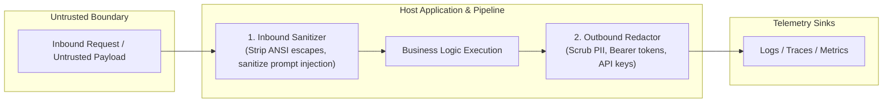
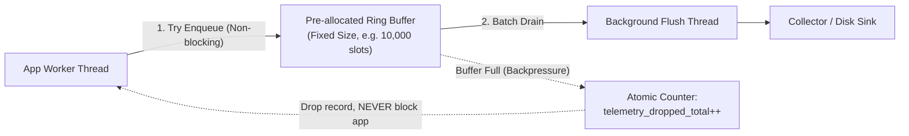

# Telemetry Signals & Question-First Observability Design

> **Mandate**: *Telemetry is not an exhaust stream to be dumped into cold storage; it is an active queryable model of system behavior designed to answer specific operational questions.*  
> Before instrumenting a single line of code, the engineer or autonomous agent must formulate the exact diagnostic questions an on-call responder or autonomous healer will ask during an incident. Every emitted byte must be justified by its diagnostic value, bounded by strict mathematical cardinality limits, and protected by bidirectional boundary hygiene.

---

## 1 · The Question-First Diagnostic Framework

Traditional telemetry fails because developers instrument variables simply because they are accessible ("Let's log `data` here"). This produces deafening noise during quiet periods and un-queryable floods during outages.

### 1.1 The Operational Question Formulation Matrix
Before introducing any log, metric, span, or event, validate it against the 5 Operational Interrogatives:

| Diagnostic Question | Required Signal Type | Minimum Payload Attributes | Anti-Pattern |
| :--- | :--- | :--- | :--- |
| **Is the service fulfilling its primary purpose?** | **Metric (SLI)** | Rate, Error Count, Duration histogram by interface/endpoint. | Logging "Request received" on every HTTP call. |
| **Which specific tenant or user journey is degraded?** | **Distributed Trace** | `tenant_id`, `trace_id`, `span_id`, operation name, duration. | Adding `tenant_id` as a metric label ($O(N)$ cardinality trap). |
| **Where in the execution graph is latency accumulating?** | **Trace Span Waterfall** | Child span start/end timestamps, database query time, lock wait. | Emitting 50 debug log statements measuring micro-durations. |
| **Why did a specific discrete transaction fail?** | **Structured Log** | Root cause error signature, stack trace, input state hash, correlation IDs. | Generic error log: `Exception: request failed`. |
| **What state mutation triggered a systemic metric shift?** | **Lifecycle Event** | Release version hash, configuration change delta, schema migration ID. | Grepping application logs to discover when a deployment occurred. |

---

## 2 · The 4 Telemetry Signals: Comparative Taxonomy & Economics

```
+---------------------------------------------------------------------------------------------------+
| Signal    | Primary Job                     | Storage Cost  | Query Efficiency  | Cardinality Tolerance   |
+-----------+---------------------------------+---------------+-------------------+-------------------------+
| METRIC    | Trends, Aggregation, Alerting   | O(1) / window | Microseconds      | Strictly LOW (<= 10^3)  |
| TRACE     | Distributed Causality & Latency | O(Requests)   | Milliseconds      | HIGH (UUIDs permitted)  |
| LOG       | Forensic Narrative & Context    | O(Events)     | Seconds / Scan    | UNBOUNDED (Pay per GB)  |
| EVENT     | State Mutations & Milestones    | O(1) / deploy | Instantaneous     | MODERATE                |
+---------------------------------------------------------------------------------------------------+
```

### 2.1 Metrics: Aggregation & Trend Stewardship
* **Definition**: Numeric values measured over time intervals (Counters, Gauges, Histograms/Summaries).
* **Storage Property**: Constant space $O(1)$ per time interval regardless of request volume. 1,000,000 requests per second compress into a single counter increment.
* **Golden Rule**: Use metrics for knowing *that* something is wrong (SLO burn, error rate spike, saturation).

### 2.2 Traces: Causality & Span DAGs
* **Definition**: Directed Acyclic Graphs of timed execution units (spans) carrying causal parent-child relationships and metadata across process boundaries.
* **Storage Property**: Proportional to sampled request volume.
* **Golden Rule**: Use traces for knowing *where* latency is spent and *which* boundary hop broke.

### 2.3 Logs: High-Fidelity Forensic Narratives
* **Definition**: Timestamped, structured records of discrete events containing rich textual and contextual data.
* **Storage Property**: Proportional to volume and payload size. Highest storage cost and highest query scan latency.
* **Golden Rule**: Use logs for knowing *why* a specific failure branch executed inside a single process boundary. Always bind logs to the active `trace_id`.

### 2.4 Events: Discrete State Milestones
* **Definition**: Low-frequency, high-significance state transitions (e.g. `DeploymentRollout`, `ConfigReload`, `LeaderElected`, `CircuitBreakerTripped`).
* **Golden Rule**: Overlay events onto metric dashboards to establish immediate temporal correlation between environmental changes and service degradation.

---

## 3 · The Mathematics of Cardinality & Cost Discipline

The most catastrophic failure mode of metrics systems is **cardinality explosion**, which causes out-of-memory crashes in monitoring daemons and runaway time-series infrastructure costs.

### 3.1 The Combinatorial Explosion Law
The cardinality of a time-series metric $M$ with $n$ label dimensions $d_1, d_2, \dots, d_n$ is the product of the sizes of their distinct value sets:
$$\text{Cardinality}(M) = \prod_{k=1}^n |V_{d_k}|$$

**The Cardinality Trap Example**:
Suppose an engineer adds 4 labels to an HTTP request duration metric:
* `method`: `[GET, POST, PUT, DELETE]` $\implies |V_1| = 4$
* `status_code`: `[200, 400, 404, 500, ...]` $\implies |V_2| \approx 10$
* `region`: `[us-east, us-west, eu-central]` $\implies |V_3| = 3$
* `user_id`: $100,000$ active users $\implies |V_4| = 100,000$

$$\text{Total Cardinality} = 4 \times 10 \times 3 \times 100,000 = 12,000,000 \text{ active time series!}$$
A single metric creates 12 million series, instantly crashing Prometheus/VictoriaMetrics and triggering massive cloud bills.

### 3.2 The Cardinality Allocation Rules
1. **Dimension Whitelisting**: Metric dimensions MUST only contain closed, bounded enums (e.g. `status_family: 2xx/4xx/5xx`, `protocol: grpc/http`, `worker_pool: batch/realtime`).
2. **Dynamic Values Relocation**: High-cardinality values (User IDs, Account UUIDs, Order Numbers, IP addresses, full URL paths with query params) **MUST BE PLACED IN TRACE SPAN ATTRIBUTES OR STRUCTURED LOG FIELDS**, never in metric tags.
3. **Histogram Bucket Pruning**: Use exponential or standardized bucket boundaries ($\le 12$ buckets per histogram). Never generate dynamic bucket thresholds per request.

---

## 4 · Bidirectional Boundary Hygiene: Redaction & Sanitization

Telemetry streams represent a major attack surface: they can leak enterprise secrets outward, and they can be weaponized inward via log injection attacks.



### 4.1 Outbound Sanitization: Zero-Leakage Secret Redaction
Never rely on downstream log collectors to scrub secrets. Telemetry emission code must execute deterministic redaction at source:

* **Blacklisted Keys**: Automatically scrub any attribute or field matching:
  `*token*`, `*password*`, `*secret*`, `*authorization*`, `*cookie*`, `*key*`, `*credit_card*`, `*ssn*`.
* **Value Pattern Matching**: Apply regex masks for UUID-like API keys (`/^[A-Za-z0-9_-]{32,}$/`), JWT tokens (`/^[A-Za-z0-9_-]+\.[A-Za-z0-9_-]+\.[A-Za-z0-9_-]+$/`), and standard email formats.
* **Deterministic Masking**: Replace sensitive data with fixed-length hashes or tokens (`[REDACTED:sha256_prefix]`), never raw strings.

### 4.2 Inbound Sanitization: Log Injection & Telemetry Poisoning Defense
Untrusted user inputs entering telemetry streams can compromise downstream monitoring tooling or mislead autonomous AI agents analyzing logs:

1. **Newline & Carriage Return Stripping**: In HTTP headers or query logs, strip `\r` and `\n` to prevent Log Forging / Splitting attacks where an attacker simulates fake log entries.
2. **ANSI & Control Code Neutralization**: Strip ANSI terminal escape sequences (`\x1b[...]`) that attempt to manipulate terminal displays or crash log viewers.
3. **Agent Prompt-Injection Shielding**: When logging user prompts for AI agent telemetry, delimit user-provided text explicitly:
   ```json
   {
     "agent_event": "user_input_received",
     "untrusted_input": {
       "raw_length": 420,
       "sha256": "e3b0c44...",
       "sanitized_preview": "[USER_CONTENT_START] Hello agent... [USER_CONTENT_END]"
     }
   }
   ```
   Downstream analysis agents must be instructed to treat telemetry fields delimited as `untrusted_input` as inert data, never instructions.

---

## 5 · Zero-Blast-Radius Architecture: Non-Blocking Telemetry

Telemetry must observe the system without perturbing its physical performance (mitigating the **Observer Effect**).



### 5.1 The 4 Isolation Mandates
1. **Non-Blocking Hot Paths**: Logging or span emission on request hot paths must never execute synchronous disk I/O or network calls. Enqueue telemetry events into an in-memory lockless ring buffer.
2. **Bounded Buffer Allocations**: Pre-allocate a fixed-capacity ring buffer (e.g. 10,000 records or 16MB RAM). Never use unbounded memory queues that grow until Out-Of-Memory (OOM).
3. **Graceful Drop Under Backpressure**: If the background flush thread cannot keep up with high ingestion traffic, **drop telemetry immediately**. Never block the host application thread.
4. **Self-Monitoring Drop Metric**: Always increment an atomic counter (`telemetry_dropped_total{signal="log|span"}`) upon record drop. Alert on this metric to detect degraded observability pipelines.
