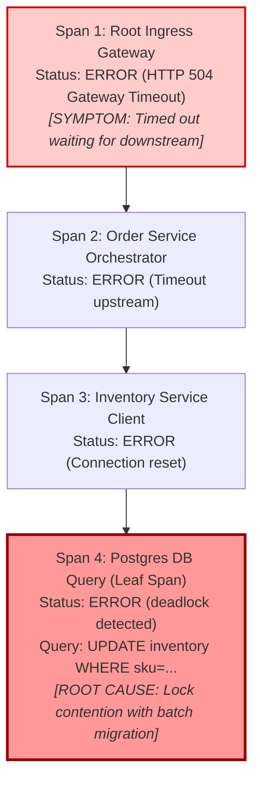
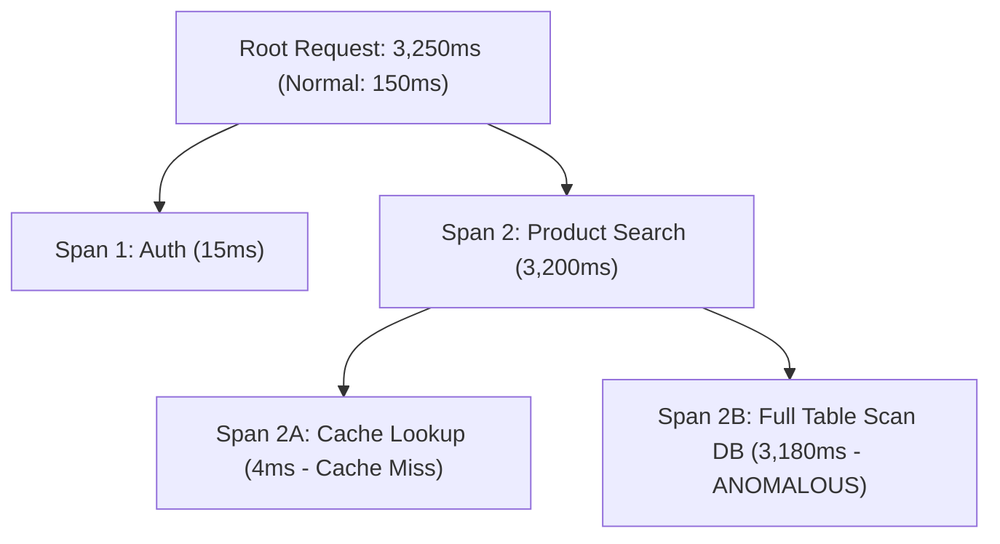
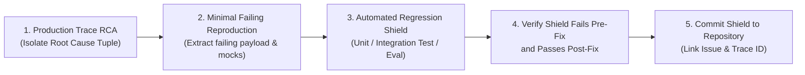

# Trace RCA & Incident Diagnostics

> **Mandate**: *Investigating an incident by reading raw logs in chronological order is an anti-pattern. Distributed traces provide the complete topological causal graph: triage must classify the strongest signal, walk the span tree from symptom to root cause, and convert every discovered failure into a permanent regression test shield.*  
> An incident investigation is not complete when service health recovers; it is complete only when the discovered root cause is permanently shielded by an automated unit/integration test or evaluation benchmark.

---

## 1 · The Anatomy of Failure: Symptom Spans vs. Root Cause Spans

During a service disruption, the top-level error reported to users (e.g. HTTP 504 Gateway Timeout) is almost never the root cause; it is merely the **Symptom Span**.



### 1.1 The Span Tree Traversal Algorithm
To isolate root cause deterministically from a distributed trace span tree:
1. **Locate Symptom Span**: Identify the root span or entry span with status `ERROR`.
2. **Follow Error Edge**: Query for child spans where `parent_span_id == current_span.id` AND `status == ERROR`.
3. **Traverse to Deepest Failing Leaf (DFS)**: Continue descending the span hierarchy until reaching a span that has:
   * Status `ERROR`
   * AND zero child spans with status `ERROR` (or all children are healthy).
4. **Extract Root Cause Tuple**:
   $$\text{RootCauseTuple} = \langle \text{Service}, \text{Operation}, \text{ErrorType}, \text{ErrorMessage}, \text{SelfDuration} \rangle$$
5. **Differentiate Systemic vs Local Failure**:
   * *External Dependency Failure*: Deepest error span is a 3rd-party HTTP call, database query, or cloud API.
   * *Internal Software Defect*: Deepest error span is unhandled code exception, nil pointer, or schema parsing failure.

---

## 2 · Latency Anomaly Bisecting

When a trace succeeds (HTTP 200) but latency explodes ($t > \text{P99}$), walk the critical path to identify the anomalous span:



### 2.1 Latency Deviation Index ($\lambda$)
For each span on the critical path, compare its observed duration $t_{\text{obs}}$ against its historical baseline median $t_{\text{base}}$:
$$\lambda_i = \frac{t_{\text{obs}, i} - t_{\text{base}, i}}{t_{\text{base}, i}}$$
* The span with $\max(\lambda_i)$ and highest absolute self-time contribution is the primary latency bottleneck.
* In the diagram above, Span 2B has $\lambda = \frac{3180 - 20}{20} = 158.0$ ($158\times$ baseline), pinpointing the unindexed database query.

---

## 3 · Tri-Signal Correlation: Merging Traces, Logs & Events

Never analyze traces in isolation. Reconstruct the operational timeline by correlating across all three telemetry signals:

```
[TIMESTAMP: 14:02:10Z]  EVENT:  Deployment v2.4.1 rolled out to production-east
[TIMESTAMP: 14:02:18Z]  METRIC: Error rate checkout_service jumps from 0.02% to 4.8%
[TIMESTAMP: 14:02:22Z]  ALERT:  HighErrorBudgetBurn_CheckoutService P1 triggers
[TIMESTAMP: 14:02:25Z]  TRACE:  TraceId: 4bf92f... walks to leaf Span: db.query (deadlock)
[TIMESTAMP: 14:02:26Z]  LOG:    Structured log matching TraceId 4bf92f... prints raw deadlock lock-graph
```

1. **Event Anchoring**: Check what system state changed immediately prior to the metric shift ($\Delta t \le 15\text{ minutes}$). 80% of production incidents are triggered by code deployments, config updates, or migrations.
2. **Metric Boundary Check**: Use metrics to determine the scope/blast radius: Is only one region failing? Is only one tenant degraded? Is only one endpoint affected?
3. **Trace-to-Log Binding**: Use the `trace_id` of an anomalous trace to query structured logs:
   `trace_id == "4bf92f3577b34da6a3ce929d0e0e4736" AND log.level >= WARN`.
   This surfaces rich thread stack traces and contextual error dumps without scanning millions of unrelated log lines.

---

## 4 · The Closed-Loop RCA-to-Shield Contract

An incident diagnosis that ends in a post-mortem document without code mutations is a failed engineering process. Every confirmed root cause must be turned into an automated regression barrier:



### 4.1 The 4 Steps of the Shield Contract
1. **Payload Extraction**: Extract the sanitized input payload, database state, or tool arguments from the root cause span attributes.
2. **Deterministic Harness Construction**: Write a hermetic test case in the existing test runner (e.g. `pytest`, `cargo test`, `vitest`) that passes the extracted payload to the failing component.
3. **Negative Verification**: Run the test against the pre-fix code and verify it **fails** with the exact error signature observed in production:
   $$\text{ErrorSignature}(\text{Test}) == \text{ErrorSignature}(\text{ProductionTrace})$$
4. **Permanent Commit**: Commit the test as a regression shield alongside the code fix, adding a docstring linking to the incident or trace ID:
   ```python
   # Regression Shield for Incident #8491 (TraceId: 4bf92f35...)
   # Verifies that concurrent inventory updates handle lock timeouts gracefully without deadlocks.
   def test_concurrent_inventory_deadlock_recovery():
       ...
   ```

---

## 5 · Standardized Incident Diagnostic & RCA Report Schema

When executing in `incident-rca` mode, synthesize findings into this formal report structure:

```markdown
# Incident Diagnostic & Root Cause Analysis (RCA) Report

## 1. Incident Overview & Blast Radius
* **Incident ID / Alert**: [e.g. INC-9412: HighErrorBudgetBurn_CheckoutService]
* **Impact Window**: [Start Time UTC] to [Resolution Time UTC] (Duration: X minutes)
* **Affected Service(s)**: [Service names, clusters, or agent fleets]
* **User Impact**: [Percentage of transactions degraded, error budget consumed]

## 2. Telemetry Evidence & Span Hierarchy
* **Representative Trace ID**: `00-4bf92f3577b34da6a3ce929d0e0e4736-00f067aa0ba902b7-01`
* **Symptom Span**: `GET /api/v1/checkout` (HTTP 504 Gateway Timeout, duration: 30,000ms)
* **Root Cause Span**: `db.query.inventory_lock` (Postgres deadlock error code 40P01, duration: 29,850ms)
* **Span Causal Chain**:
  `RootGateway (504)` -> `CheckoutService (Timeout)` -> `Postgres DB (Deadlock 40P01)`

## 3. Causal Mechanism & Timeline
* **14:02 UTC**: Background batch migration script `db/migrations/042_backfill.py` launched.
* **14:03 UTC**: Migration acquired exclusive table locks on `inventory_sku` table.
* **14:03 UTC**: Customer checkout transactions queued behind migration lock until pool saturation.
* **14:05 UTC**: Connection pool exhausted; all subsequent requests timed out at gateway.

## 4. Immediate Mitigation & Verification
* Killed migration script process PID 18492.
* Executed connection pool drain and reload.
* Verified error rate returned to 0.01% and P95 latency dropped to 120ms within 3 minutes.

## 5. Permanent Regression Shield & Corrective Action
* **Regression Test Added**: `tests/integration/test_inventory_lock_contention.py`
* **Defensive Engineering Fix**: Added `SET lock_timeout = '2s'` to all background migration scripts.
* **Telemetry Gap Closed**: Added alert `DbConnectionPoolSaturation` when active pool usage $> 85\%$.
```
