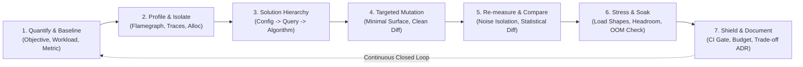

# Performance Engineering: Universal Profiling, Capacity & Resource Optimization Protocol

> **Mandate**: *Performance engineering is not the intuition-driven tweaking of code that "looks slow." It is the empirical discipline of measuring, profiling, and systematically reducing the resource cost of computational systems under representative workloads.*  
> No reactive optimization may be applied without an established baseline; greenfield systems must be engineered against formal performance budgets; optimizations must target profiled bottlenecks on the critical path; measurements must reflect true distribution percentiles rather than misleading averages; and optimizations must strictly preserve functional correctness, security posture, and architectural integrity. True performance engineering liberates agent problem-solving creativity, rejects tool dogma, and guarantees deterministic efficiency across any software archetype.

---

## 1 · The 7-Phase Universal Performance Lifecycle

Every performance task—from optimizing a single computational loop or database query to architecting multi-region distributed capacity or tuning LLM inference engines—traverses this closed-loop lifecycle:



1. **Phase 1 — Quantify, Scope & Baseline (The Grounding Phase)**: Establish the explicit performance objective (e.g., reduce $P_{99}$ latency by 45%, achieve 12,000 req/sec at $< 1\%$ error rate, cut memory footprint below 256MB). For existing code, record the pre-mutation baseline ($M_{\text{pre}}$) under an ecologically valid, representative workload. For greenfield systems, establish the formal Performance Budget ($\text{Budget}_{\text{target}}$) (see [`references/greenfield-budgeting-vs-brownfield-tuning.md`](references/greenfield-budgeting-vs-brownfield-tuning.md)).
2. **Phase 2 — Profile & Isolate (The Cartography Phase)**: Route the diagnostic inquiry to the appropriate profiler category (CPU on/off-path, memory allocations/retention, I/O wait, lock contention, accelerator VRAM). Generate and inspect flame graphs, trace waterfalls, or execution plans to isolate the true critical path. Bounding profiler overhead below 3% ensures measurements reflect reality (see [`references/profiling-taxonomy-and-routing.md`](references/profiling-taxonomy-and-routing.md)).
3. **Phase 3 — Solution Hierarchy & Amdahl Evaluation (The Design Phase)**: Evaluate solutions in order of operational complexity: Configuration/Infra Tuning $\to$ Database/Storage Access $\to$ Algorithmic/Data-Structure Transformation $\to$ Concurrency/Pipelining $\to$ Hardware Scaling. Calculate Amdahl's theoretical maximum speedup to verify that the target routine dominates total execution time ($p \ge 0.20$) before mutating code (see [`references/configuration-and-tuning-hierarchy.md`](references/configuration-and-tuning-hierarchy.md)).
4. **Phase 4 — Targeted Mutation (The Implementation Phase)**: Apply the minimal justified code or configuration change directly to the profiled bottleneck. Maintain strict locality of behavior. Never commingle cosmetic refactoring, formatting changes, or unrelated feature additions with a performance diff (see [`references/resource-optimization-patterns.md`](references/resource-optimization-patterns.md)).
5. **Phase 5 — Re-measure, Statistical Diff & Validation (The Verification Phase)**: Execute the identical benchmark harness under comparable physical conditions on an uninstrumented release build. Verify that the delta $\Delta M = M_{\text{post}} - M_{\text{pre}}$ satisfies the target with statistical significance ($p < 0.01$ over $\ge 30$ samples). Confirm that secondary resources (e.g. heap size, thread count, disk write amplification) have not regressed.
6. **Phase 6 — Stress, Soak & Headroom Verification (The Capacity Phase)**: Subject the optimized system to multi-tier traffic models: Smoke test (sanity), Load test (steady-state SLA), Stress test (saturation/breaking point), Soak test (multi-hour leak/creep detection), and Spike test (burst recovery). Correct for coordinated omission (see [`references/workload-modeling-and-load-testing.md`](references/workload-modeling-and-load-testing.md)).
7. **Phase 7 — Shield, Document & Persist (The Permanence Phase)**: Convert the verified performance victory into a permanent automated regression test (benchmark assertion, CI performance budget, or load test gate). Document trade-offs (space vs. time, consistency vs. latency, bounded accuracy relaxations) in a durable Performance ADR (see [`references/benchmarking-rigor-and-regression-gates.md`](references/benchmarking-rigor-and-regression-gates.md)).

---

## 2 · Progressive Disclosure (Reference Routing)

To prevent cognitive overload and preserve LLM context bandwidth, **never load all reference manuals simultaneously**. Consult reference manuals strictly on demand based on task context:

| Context Trigger | Mandatory Reference Manual | Purpose |
| :--- | :--- | :--- |
| **New feature, greenfield project, architecture design, setting latency/memory budgets** | [`references/greenfield-budgeting-vs-brownfield-tuning.md`](references/greenfield-budgeting-vs-brownfield-tuning.md) | Proactive performance budgets, complexity class selection, mechanical sympathy, initial schema design without historical baselines. |
| **Selecting profilers, CPU flamegraphs, memory leaks, lock contention, off-CPU wait** | [`references/profiling-taxonomy-and-routing.md`](references/profiling-taxonomy-and-routing.md) | Question-to-profiler routing, sampling vs instrumentation, on/off-CPU analysis, frame graph interpretation, bounding observer overhead. |
| **Load testing, stress testing, soak testing, traffic shaping, k6, locust, capacity planning** | [`references/workload-modeling-and-load-testing.md`](references/workload-modeling-and-load-testing.md) | Open vs closed workload models, Poisson arrivals, load generator saturation defense, soak test leak detection, threshold assertions. |
| **Latency percentiles, SLA/SLO thresholds, queueing theory, Little's Law, Amdahl's Law** | [`references/latency-distributions-and-percentiles.md`](references/latency-distributions-and-percentiles.md) | Coordinated omission correction, Amdahl's Law math, Universal Scalability Law ($\alpha, \beta$), tail latency mitigation, queueing saturation models. |
| **Data structures, cache locality, zero-copy, DB query plans, locks, SIMD, vectorization** | [`references/resource-optimization-patterns.md`](references/resource-optimization-patterns.md) | Algorithmic $O(N)$ reduction, mechanical sympathy, lock-free synchronization, database execution plan tuning, batching, pooling. |
| **Config tuning, pool sizing, thread pools, memory limits, build flags, economic ROI** | [`references/configuration-and-tuning-hierarchy.md`](references/configuration-and-tuning-hierarchy.md) | Performance solution hierarchy: config tuning vs query tuning vs code rewrite vs hardware scaling; calculating financial and engineering ROI. |
| **AI/LLM pipelines, TTFT, token throughput, KV cache, GPU memory, batching, vLLM** | [`references/ai-and-accelerated-workloads.md`](references/ai-and-accelerated-workloads.md) | LLM inference mechanics, KV cache sizing, continuous batching, prompt caching, token generation profiling, quantization trade-offs. |
| **Benchmarking harnesses, statistical validation, CI regression gates, compiler dead-code** | [`references/benchmarking-rigor-and-regression-gates.md`](references/benchmarking-rigor-and-regression-gates.md) | Blackhole anti-elimination, JIT warmup handling, statistical hypothesis testing (Welch's t-test), CI performance gates, preventing harness skew. |

---

## 3 · Adaptive Cognitive Sizing (The 6 Execution Modes)

Size your performance engineering effort strictly to the task's scope, operational risk, and blast radius. Never apply heavy enterprise load-testing bureaucracy to a single-line script or utility, and never execute speculative, unmeasured mutations across high-blast-radius production systems:

| Mode | Trigger & Scope | Engineering Discipline | Required Output & Protocol |
| :--- | :--- | :--- | :--- |
| **`micro-benchmark`** | Single function, loop, DB query, or utility ($< 50$ lines). | Quick pre-check, micro-benchmark run, focused code edit, post-verification. **Zero ceremony**. | **3-Line Performance Intent Block** directly before code edit. |
| **`hotpath-opt`** | Production endpoint, business logic path, rendering tree (1–5 files). | CPU/Memory profiling, Amdahl hypothesis, targeted refactor, before/after percentile comparison. | **Performance Delta Table**: Baseline $\to$ Mutation $\to$ Post-metric $\to$ Correctness check. |
| **`load-and-capacity`** | Service capacity, SLA verification, API scaling under concurrency. | Synthetic load generation, traffic shaping (ramp, steady, spike), latency percentiles, saturation analysis. | **Load Test Evaluation Report**: P50/P95/P99 latency curves, error rates, throughput saturation point. |
| **`client-vitals`** | Web/Mobile user perceived performance (Core Web Vitals, INP, LCP, frame drops). | Lab vs Field analysis, main-thread unblocking, bundle tree-shaking, asset optimization, layout shift fix. | **UX Performance Scorecard**: Lab audit, CWV metrics before/after, rendering timeline diff. |
| **`ai-inference-opt`** | LLM inference, embedding pipelines, RAG vector search, batch processing. | TTFT (Time to First Token), ITL (Inter-Token Latency), KV-cache footprint, GPU utilization, token cost. | **AI Performance Manifest**: TTFT/ITL percentiles, memory ceiling, throughput (tok/s), cost delta. |
| **`system-audit`** | Pre-launch audit, legacy system diagnosis, architectural scalability review. | Multi-tier profiling, dependency bottleneck mapping, database query audit, capacity headroom calculation. | **Scalability Audit & Remediation Roadmap**: Ranked bottlenecks, order-of-magnitude scaling limits, mitigation plan. |

### The 3-Line Performance Intent Protocol (For `micro-benchmark` Mode)
To eliminate bureaucratic overhead on small, localized tasks, summarize performance intent in exactly 3 lines directly before emitting code edits:
```markdown
> **Baseline Metric**: [Recorded pre-change metric: e.g. 14.2ms / 4.8MB heap / O(N^2) scan on 10k items]
> **Bottleneck & Mutation**: [Profiled bottleneck and targeted structural/algorithmic fix]
> **Verified Post-Metric**: [Measured post-change metric and confirmation that tests pass: e.g. 1.1ms (-92%), 100% tests green]
```

---

## 4 · The 8 Universal Performance Invariants

Regardless of language, framework, cloud provider, or runtime environment, every robust computational system upholds these 8 timeless invariants:

### 4.1 Invariant 1: Empirical Verification & Dual-Track Baseline Primacy (The Anti-Speculation Axiom)
No performance mutation may be applied without verifiable grounding:
- **Brownfield Code**: A pre-mutation numerical baseline ($M_{\text{pre}}$) must be captured under representative workload conditions before modifying code:
  $$\Delta M = M_{\text{post}} - M_{\text{pre}} \quad (\text{where } M_{\text{pre}} \text{ is historically recorded})$$
- **Greenfield Code**: When authoring new systems where no code yet exists, the agent must define a formal **Performance Budget** ($\text{Budget}_{\text{target}}$) and verify that initial prototypes operate within that envelope.
* **Prohibition**: Refactoring code solely because a syntax pattern or algorithm "looks slow" without profiling or budget evidence is strictly forbidden.

### 4.2 Invariant 2: Dominant Term & Amdahl's Law Alignment (The Bottleneck Axiom)
Optimizations must target the profiled dominant resource consumer on the active critical path. Under Amdahl's Law:
$$S_{\text{overall}} = \frac{1}{(1 - p) + \frac{p}{s}}$$
* Optimizing a sub-routine that accounts for fraction $p < 0.05$ of total execution time without relieving a critical serialization lock yields negligible return ($S_{\text{overall}} \le 1.05$) and is forbidden as premature micro-optimization.

### 4.3 Invariant 3: Distribution Honesty & Coordinated Omission Defense (The Tail Latency Axiom)
System performance must be evaluated across distribution percentiles ($P_{50}, P_{90}, P_{95}, P_{99}, P_{99.9}$) rather than arithmetic mean/average:
$$\text{Mean}(\mathbf{L}) \text{ is invalid for SLA verification}; \quad \text{Enforce } P_{99}(\mathbf{L}) \le \text{Threshold}_{\text{target}}$$
* Load generation harnesses must use open-system arrival models (e.g. Poisson arrivals) to prevent coordinated omission from artificially deflating reported latency percentiles during server backpressure.

### 4.4 Invariant 4: Ecological Validity & Environmental Parity (The Workload Axiom)
Performance evaluations must reflect production reality in data volume, memory layout, cache warmup states, network latency, and concurrency shapes:
$$\text{Workload}_{\text{test}} \sim \text{Workload}_{\text{prod}} \quad \land \quad \text{Noise}(\text{Environment}) \le \text{Tolerance}$$
* Environmental variance (thermal throttling, GC pauses, JIT compilation, noisy neighbors) must be isolated through statistical validation ($p < 0.01$ via Welch's t-test or Mann-Whitney U test across $\ge 30$ iterations).

### 4.5 Invariant 5: Semantic Integrity & Bounded Relaxation (The Correctness Axiom)
An optimization that silently alters functional contracts, introduces concurrency races, compromises security boundaries, or weakens transactional consistency is a defect:
$$\text{PassRate}_{\text{post}} = 100\% \quad \land \quad \text{SecurityPosture}_{\text{post}} \ge \text{SecurityPosture}_{\text{pre}}$$
* **Bounded Relaxation Exception**: The agent may employ approximate computing, lossy compression, or probabilistic data structures (HyperLogLog, Bloom filters, Count-min sketch) *if and only if* an explicit error budget ($\epsilon \le \epsilon_{\text{max}}$) is formally specified and permitted by system requirements.

### 4.6 Invariant 6: Smallest Justified Mutation Surface & Separation of Concerns (The Blast-Radius Axiom)
The optimization must touch the minimal possible surface area required to eliminate the bottleneck:
$$\text{Diff}(\text{Optimization}) \cap \text{Diff}(\text{CosmeticRefactoring}) = \emptyset$$
* Broad architectural redesigns, code beautification, and cosmetic variable renames must never be commingled with a performance optimization patch.

### 7.7 Invariant 7: The Solution Hierarchy Primacy (The Economics Axiom)
Before rewriting complex business logic or introducing distributed caches, evaluate solutions in order of operational return on investment:
1. **Configuration & Infrastructure Tuning** (connection pools, memory limits, GC flags, thread counts).
2. **Database & Storage Query Planning** (indexes, query structure, batching, eager loading).
3. **Algorithmic & Data-Structure Improvements** (reducing time/space complexity class, cache locality).
4. **Concurrency & Asynchronous Pipelining** (lock-free primitives, workers, non-blocking I/O).
5. **Hardware & Vertical Scaling** (when engineering rewrite costs exceed lifetime compute savings).

### 4.8 Invariant 8: Regression Shielding & Durable Stopping Contract (The Permanence Axiom)
Every verified performance improvement or resolved regression must be locked with an automated regression check:
$$\exists \text{Gate}_{\text{CI}} \text{ s.t. } \text{Assert}(\text{Metric}_{\text{future}} \le \text{Metric}_{\text{threshold}})$$
* Performance gains must not rely on memory; they must be defended by automated benchmark tests, CI performance budgets, or load test gates.

---

## 5 · The Performance Invariant Exception Protocol

When physical, operational, or business constraints require a deliberate bypass of a performance invariant, the agent invokes this formal protocol:

> [!CAUTION] PERFORMANCE INVARIANT EXCEPTION PROTOCOL
> An agent may deliberately bypass a performance invariant (e.g. bypassing statistical baseline runs during an active Sev-0 outage, or accepting an approximate result without an empirical distribution) **IF AND ONLY IF**:
> 1. **Operational Blocker Citation**: Explicitly cites the physical or operational barrier (e.g., *"Production database CPU is pinned at 100%; cannot execute 30-run baseline without collapsing customer traffic; deploying emergency query index fix immediately"*).
> 2. **Blast-Radius Quarantining**: Restricts the bypass strictly to the emergency window or isolated module.
> 3. **Micro-ADR & Convergence Plan**: Records the exception (`[PERF-EXCEPTION: emergency unindexed query fix deployed without full baseline; post-incident 30-run statistical verification scheduled; committed YYYY-MM-DD]`).

---

## 6 · Universal Archetype Adaptation Matrix

The 8 universal invariants adapt dynamically across all 9 computational archetypes by mapping physical resources to archetype-specific metrics and profilers:

| Dimension | Web & Frontend | APIs & Microservices | Bare-Metal & Monoliths | Mobile & Native Apps | AI & LLM Systems | Embedded & IoT / Real-Time | Data Pipelines & Batch | Databases & Storage | Cloud & Serverless |
| :--- | :--- | :--- | :--- | :--- | :--- | :--- | :--- | :--- | :--- |
| **Primary Metric** | Core Web Vitals (LCP, INP, CLS), TBT | P99 Latency, Req/Sec, Error Rate at Saturation | CPU instructions per cycle (IPC), Lock Wait | App Cold Start, Frame Render Time (60/120fps), Battery | TTFT, Inter-Token Latency (ITL), Tokens/Sec/GPU | Interrupt Latency, Deadlines ($\mu\text{s}$), Stack RAM | Rows/Sec, Stage Wall Time, Partition Skew | Query P99, IOPS, Buffer Pool Hit %, Lock Wait | Cold Start Duration, Memory-Duration ($GB\cdot s$) |
| **Profiler Class** | Chrome Performance Timeline, Lighthouse | Distributed Traces (OTel), eBPF, async-profiler | Perf, Valgrind, DTrace, Flamegraphs | Instruments, Android Studio Profiler, Systrace | PyTorch Profiler, Nsight Systems, vLLM metrics | Hardware Logic Analyzer, JTAG register trace | Spark UI, Query DAG Visualizer, dbt timing | `EXPLAIN (ANALYZE, BUFFERS)`, slow query logs | CloudWatch Insights, OpenTelemetry trace waterfalls |
| **Key Resource Bottleneck** | Main-thread blocking, DOM size, JS bundle size | Thread pool exhaustion, DB connection pool, I/O wait | Cache misses (L1/L2/L3), memory allocs, mutex locks | UI thread stutters, over-draw, background radio wake | KV-cache VRAM saturation, CUDA kernel launch overhead | Constrained SRAM/Flash, DMA bus contention | Memory spill to disk, straggler tasks, shuffles | Unindexed full table scans, lock escalation, disk sync | Container initialization, CPU throttling, cold boot |
| **Workload Model** | Real User Monitoring (RUM) + Synthetic Lab throttling | Open/Closed workload generator (k6, Locust, wrk2) | Local benchmark suites (Criterion, JMH, Google Benchmark) | Automated UI monkey testing, cold launch macrobenchmarks | Prompt batch arrays, varying token length distributions | Real-time sensor input loops, hardware stimuli generators | Multi-terabyte sample partitions, backfill simulations | Concurrent OLTP transaction mix, heavy analytical joins | Concurrency step-load scaling, burst invocation spikes |
| **Regression Gate** | Lighthouse CI score $\ge 90$, Bundle size budget check | P99 latency threshold check in staging CI pipeline | Continuous microbenchmarks with statistical variance bounds | App launch time assertions, binary size tracking | TTFT $< 300\text{ms}$ gate, GPU memory leakage regression test | Cycle count check against hard realtime deadline | ETL pipeline SLA milestone alerts, stage duration alarms | Query execution plan regression tests (noSeqScan check) | Cold start execution time budget assertions in CI |

---

## 7 · Protocols for the 12 Extreme Operational Edge Cases

1. **Coordinated Omission in Load Testing**: When testing under load, closed-loop generators pause while waiting for delayed responses, artificially hiding long queues. *Protocol*: Enforce open-arrival rate generators (Poisson arrival) and record scheduled arrival timestamps alongside completion timestamps.
2. **JIT Warmup & Non-Deterministic Variance**: Managed runtimes (JVM, V8, CLR, PyPy) produce wildly inaccurate initial timings due to tiered JIT compilation and GC cycles. *Protocol*: Enforce mandatory warmup iterations, discard startup phases, and require Welch's t-test ($p < 0.01$) over $\ge 30$ steady-state samples.
3. **Tail Latency Amplification in Distributed Scatter-Gather**: When a request fans out to $M$ independent nodes, overall latency is $\max(L_1, L_2, \dots, L_M)$, causing severe $P_{99}$ degradation. *Protocol*: Implement hedged requests with speculative duplicate retries at the 95th percentile, adaptive timeouts, and circuit breakers.
4. **Memory Allocator Fragmentation & GC Thrashing**: High throughput allocation of short-lived objects leading to stop-the-world GC pauses or native heap fragmentation. *Protocol*: Switch to zero-copy buffer views, object pools, off-heap buffers, or arena/slab allocation patterns; track allocation rate per request.
5. **Thundering Herd / Cache Stampedes**: Concurrently expiring hot cache keys causing thousands of simultaneous backend queries. *Protocol*: Implement probabilistic early expiration (XFetch algorithm), single-flight mutexes on cache misses, and background refresh loops.
6. **AI Accelerator & VRAM Saturation**: Concurrent LLM inference requests exhausting accelerator memory during KV-cache generation. *Protocol*: Implement continuous dynamic batching (paged attention), KV-cache quantization (FP8/INT4), dynamic prompt truncation, and speculative decoding.
7. **Hard Real-Time Interrupt Latency ($\mu\text{s}$ Boundaries)**: Microsecond deadlines where dynamic memory allocation or unbounded lock acquisition causes catastrophic failure. *Protocol*: Zero dynamic allocation on the critical path, lock-free circular ring buffers, static memory pre-allocation at boot, and cache-line pre-fetching.
8. **Load-Generator Saturation Masking**: The load-testing machine reaches 100% CPU or exhausts local file descriptors, reporting high latency caused by the generator, not the target. *Protocol*: Continuously monitor load-generator telemetry (CPU, open FDs, socket states); if load-generator CPU exceeds 75%, reject the test run and scale the generator horizontally.
9. **Compiler Dead-Code Optimization Elimination**: Modern optimizing compilers detect pure benchmark loops whose output is unused and optimize the computation into a no-op ($0.0\text{ns}$). *Protocol*: Use blackhole consumers (`benchmark::DoNotOptimize`, `std::hint::black_box`) and non-constant input feeds.
10. **Cascading Collapse Under Overload**: Systems pushed beyond saturation spend all cycles context-switching or servicing failed retries, causing throughput to collapse toward zero. *Protocol*: Measure "goodput" (successful requests meeting SLA) rather than raw throughput; implement adaptive concurrency limits (e.g. TCP Vegas style) and load shedding.
11. **Cold Starts in Ephemeral Serverless & Native Apps**: Container initialization and framework bootstrapping causing multi-second delays on initial invocation. *Protocol*: Minimize static initialization, lazy-load non-critical dependencies, use ahead-of-time (AOT) compilation, and configure provisioned concurrency where needed.
12. **Slow Resource & Memory Creep**: Minor memory retention, uncollected handles, or cache leaks that pass 5-minute tests but crash production after 48 hours. *Protocol*: Execute continuous soak tests ($\ge 4\text{--}24$ hours) at 70% capacity to verify that heap retention and open file handles stabilize at a constant horizontal asymptote.

---

## 8 · Guardrails & Strictly Disallowed Anti-Patterns

The skill enforces strict operational safety by explicitly forbidding these common failure modes:

* ❌ **No Optimization Without Measurement**: Never modify code for "performance" without an empirical baseline and measured post-mutation delta (or budget compliance in greenfield code).
* ❌ **No Reporting Raw Averages/Means**: Never declare a system performant based solely on average/mean latency; report percentiles ($P_{50}, P_{95}, P_{99}$) and sample sizes.
* ❌ **No Violating Amdahl's Law**: Never spend engineering cycles optimizing routines that account for negligible fractions of total execution time while ignoring the primary bottleneck.
* ❌ **No Sacrificing Correctness or Security**: Never bypass input validation, disable safety checks, remove defensive bounds checks, or compromise consistency guarantees to make code run faster.
* ❌ **No Blind Caching**: Never introduce in-memory or distributed caches without an explicit, mathematically sound invalidation strategy, TTL, and cache-size eviction policy (LRU/LFU/ARC).
* ❌ **No Conflating Refactoring with Performance**: Never mix generic architectural restructuring, stylistic changes, or variable cleanups with targeted performance optimization diffs.
* ❌ **No Ignoring Coordinated Omission**: Never run closed-loop load generators that queue locally during outages and report artificially optimistic latency percentiles.
* ❌ **No Measuring Only in Development/Debug Mode**: Never benchmark code compiled in debug mode with logging, assertions, or tracing enabled that skews production assembly/runtime behavior.
* ❌ **No Observer Overhead Blindness**: Never profile with heavyweight instrumentation that consumes $> 3\%$ CPU or alters the cache characteristics of the system without calibrating out the observer effect.

---

## 9 · The Clean Performance Stopping Contract

A performance engineering task is certified strictly **COMPLETE** only when all 6 exit criteria are proven with evidence:

1. **Baseline & Delta Formally Certified**: Both pre-mutation baseline ($M_{\text{pre}}$) and post-mutation metric ($M_{\text{post}}$) are documented with exact percentage and absolute improvements under identical workload conditions (or budget compliance proven for greenfield code).
2. **Bottleneck Attribution Verified**: Evidence from a profiler, trace waterfall, or query execution plan confirms that the optimization targeted the true critical path.
3. **Distribution Honesty Proven**: Latency improvements are demonstrated across percentiles ($P_{50}, P_{95}, P_{99}$), with no hidden tail degradation or error rate inflation.
4. **Functional & Security Invariance Verified**: Full test suite runs with 100% pass rate; static typing and security boundaries remain intact with zero regressions.
5. **Secondary Resource Parity Verified**: Confirmation that the optimization did not trade off acceptable latency for unacceptable memory bloat, thread leaks, socket starvation, or disk thrashing.
6. **Regression Shield Deployed**: An automated regression check (CI benchmark threshold, budget gate, or load test assertion) is established to prevent future regressions.
