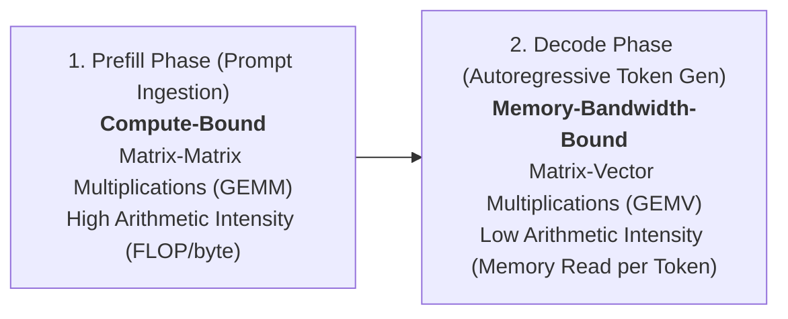
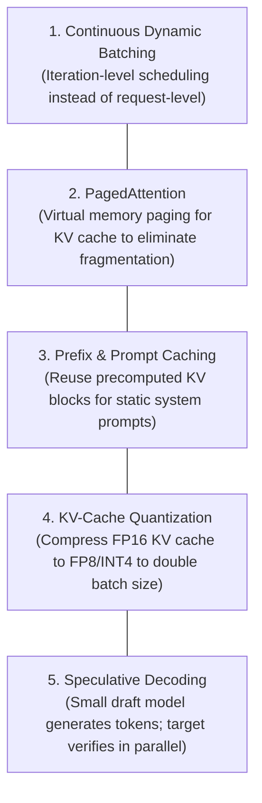

# AI, LLM & Accelerator Performance Engineering

> **Mandate**: *LLM inference performance is governed by a fundamental physical dichotomy: prompt prefill is compute-bound, while token decoding is memory-bandwidth bound. Optimize the GPU memory hierarchy, minimize KV-cache churn, and amortize host-to-device transfers.*

---

## 1 · The Dual-Phase Physics of LLM Inference

Every Large Language Model inference workload consists of two physically distinct computational phases:

| Phase | Bottleneck Resource | Primary Metric | Core Optimization Technique |
| :--- | :--- | :--- | :--- |
| **Prefill Phase** | GPU Tensor Core Compute (FLOPs) | **TTFT** (Time to First Token) | FlashAttention (SRAM tiling), Chunked Prefill, FP8 GEMM |
| **Decode Phase** | High-Bandwidth Memory (HBM) Bandwidth | **ITL** (Inter-Token Latency) / **TPOT** | KV-Cache Quantization, Continuous Batching, Speculative Decoding |

---

## 2 · Key AI Performance Metrics

1. **TTFT (Time to First Token)**: Latency from initial request submission until the client receives the first token. Represents prompt processing and context loading.
2. **ITL (Inter-Token Latency)**: Duration between subsequent generated tokens during streaming. Must remain below the human reading perception threshold ($\le 30\text{--}50\text{ms/token}$).
3. **Total Token Throughput**: Aggregate output tokens generated per second across all concurrent requests per GPU:
   $$\text{Throughput} = \frac{\sum \text{Tokens Generated}}{\text{Total Wall-Clock Time (s)}}$$
4. **KV-Cache Memory Saturation**: Memory allocated to store key/value projection vectors for active conversations:
   $$\text{VRAM}_{\text{KV}} = 2 \times n_{\text{layers}} \times n_{\text{heads}} \times d_{\text{head}} \times \text{batch\_size} \times \text{seq\_len} \times \text{bytes\_per\_elem}$$

---

## 3 · Core LLM Optimization Patterns

### 3.1 Continuous (Iteration-Level) Batching
Traditional request-level batching waits for the slowest request in a batch to finish, leaving GPUs severely underutilized during the decode phase of shorter requests.
- **Continuous Batching**: Operates at the token-iteration level. When a short request finishes, a new request is immediately injected into the batch at the next token iteration without waiting for the batch to complete.

### 3.2 PagedAttention (Virtual Memory for KV Cache)
In naive inference engines, memory for a request's KV cache is allocated contiguously based on the maximum possible context length ($4\text{k}\dots 32\text{k}$ tokens), causing $> 60\text{--}80\%$ memory fragmentation.
- **PagedAttention**: Partitions KV caches into non-contiguous physical memory pages, dynamically allocated as tokens are generated. Enables near-zero ($< 4\%$) memory waste, effectively doubling or tripling concurrent serving capacity on the same GPU.

### 3.3 Prompt & Prefix Caching
Multi-agent systems, code editors, and conversational bots frequently reuse identical system prompts and context prefixes.
- **Prefix Caching**: Computes the KV cache for the shared prefix once and caches it in HBM. Downstream requests skip the prefill computation entirely for the cached token prefix, reducing TTFT by **$80\text{--}95\%$**.

### 3.4 KV-Cache & Model Weight Quantization
Moving model weights and KV caches from GPU High-Bandwidth Memory (HBM) into SRAM is the primary latency bottleneck of the decode phase.
- **FP8 / INT4 Quantization**: Halves (FP8) or quarters (INT4) the bytes transferred across the memory bus per generated token, directly increasing token generation speed by up to $1.8\times\dots 2.5\times$ with negligible loss in perplexity.

---

## 4 · Vector Search & RAG Optimization

In Retrieval-Augmented Generation (RAG) pipelines, vector search latency frequently dominates end-to-end request time:

1. **HNSW (Hierarchical Navigable Small World)**: Best for sub-millisecond query latency ($< 5\text{ms}$) at high recall ($> 95\%$), but requires storing graphs entirely in RAM.
2. **IVF-PQ (Inverted File with Product Quantization)**: Compresses vector embeddings by $8\times\dots 16\times$, allowing millions of vectors to fit in memory with slight recall trade-offs.
3. **Pre-Filtering vs. Post-Filtering**: Always execute scalar attribute filtering *before* or *during* vector graph traversal (single-stage filtered search) rather than retrieving 1,000 vectors and filtering in application memory.
