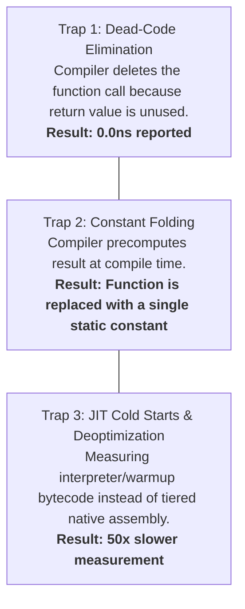

# Benchmarking Rigor, Statistical Significance & CI Regression Gates

> **Mandate**: *A benchmark that does not actively defend against compiler dead-code elimination, JIT warmup artifacts, and statistical variance is measuring noise. Lock verified performance gains into permanent automated gates in continuous integration.*

---

## 1 · The 3 Fatal Traps of Microbenchmarking

Modern optimizing compilers (LLVM, GCC, Rust, Go, Clang) and Just-In-Time (JIT) runtimes (JVM C2, V8, .NET RyuJIT) are aggressively optimized to delete code that produces unused results.



### 1.1 The Blackhole Anti-Elimination Protocol
To ensure the compiler actually executes the benchmarked code:
- **Rust**: Use `std::hint::black_box(result)`.
- **C++ (Google Benchmark)**: Use `benchmark::DoNotOptimize(result)`.
- **Java (JMH)**: Return the value from the `@Benchmark` method or feed it into a `Blackhole.consume(result)`.
- **Go**: Assign result to an exported package-level variable: `var Sink int; Sink = result`.
- **JavaScript / V8**: Prevent dead-code elimination by passing results to an external side-effect sink or running via benchmark harnesses like Benchmark.js/Tinybench.

### 1.2 Preventing Constant Folding
Never feed static hardcoded literals into benchmark loops if the function is pure. The compiler will calculate the answer once during compilation and replace the loop body with a static literal. Always inject inputs from a pre-allocated randomized array or external source.

---

## 2 · Statistical Significance & Noise Filtering

Never declare an optimization successful based on a single benchmark run or a small sample:

### 2.1 The 30-Iteration Sampling Rule
Execute $\ge 30$ independent iterations after runtime warmup has completed. A sample size $N \ge 30$ satisfies the Central Limit Theorem, allowing reliable calculation of confidence intervals.

### 2.2 Welch's t-Test for Performance Dels
When comparing baseline measurements ($\mathbf{M}_{\text{pre}}$) against post-optimization measurements ($\mathbf{M}_{\text{post}}$), variances are almost always unequal. Apply **Welch's t-test**:

$$t = \frac{\bar{X}_1 - \bar{X}_2}{\sqrt{\frac{s_1^2}{N_1} + \frac{s_2^2}{N_2}}}$$

*Certification Rule*: A performance improvement is certified **statistically significant** if and only if:
$$p < 0.01 \quad (\text{greater than } 99\% \text{ confidence that the speedup is not random noise})$$

---

## 3 · Establishing Automated CI Regression Gates

A performance optimization that is not defended by an automated test will inevitably regress within six months:

```mermaid
flowchart LR
    Commit["Git Push / PR"] --> CI["CI Runner"]
    CI --> Bench["Run Isolated Benchmark Suite"]
    Bench --> Check{"Delta vs Baseline<br/>> Allowed Threshold?"}
    Check -->|No| Pass["✅ Build Passes"]
    Check -->|Yes (+7% latency)| Fail["❌ Fail PR with Regression Warning"]
```

### 3.1 Relative Regression Thresholds vs. Absolute Timing
Because cloud CI runners (e.g. GitHub Actions, GitLab CI) run on shared multi-tenant hardware with variable CPU frequency scaling:
- **Do not assert absolute execution time** in CI (e.g. `assert(time < 12.4ms)`), which causes severe flakiness.
- **Assert Relative Ratios or Normalized Counters**:
  1. Instruction Count via hardware performance counters (`perf stat -e instructions`)
  2. Memory Allocations per Operation (`allocs/op` or bytes allocated)
  3. Relative Delta against a concurrent baseline run on the same CI instance:
     $$\frac{\text{Time}_{\text{PR}} - \text{Time}_{\text{main}}}{\text{Time}_{\text{main}}} \le \text{Tolerance} \quad (\text{e.g. } \le +5\%)$$
  4. Query Count Assertions (e.g. assert that an API endpoint triggers $\le 2$ SQL queries, catching N+1 regressions instantly).

### 3.2 Automated CI Benchmark Checklist
- [ ] Runtime warmup iterations discarded.
- [ ] Blackhole consumer prevents dead-code elimination.
- [ ] Number of SQL queries / remote RPCs asserted explicitly.
- [ ] Memory allocations per operation asserted with zero tolerance for unbounded growth.
- [ ] PR is blocked if $P_{99}$ latency regresses by $> 5\%$ with statistical significance.
