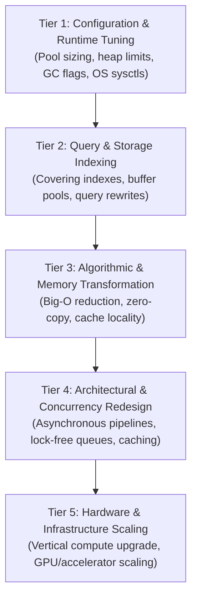

# The Performance Solution Hierarchy & Economic ROI

> **Mandate**: *Never spend weeks rewriting application code when a configuration flag or a database index resolves the bottleneck in five minutes. Never spend \$20,000 of engineering time to save \$50 a year in server costs.*

---

## 1 · The 5-Tier Performance Solution Hierarchy

When addressing a verified performance bottleneck, traverse this hierarchy in strict order from lowest operational complexity to highest:

---

## 2 · Tier 1: Configuration & Pool Sizing Mathematics

Mischosen runtime configuration parameters are the single most common cause of synthetic bottlenecks in production systems:

### 2.1 Database Connection Pool Sizing
A common intuition error is configuring massive connection pools (e.g. 500 connections for 500 web threads). In reality, database disks and CPU cores can only process a finite number of queries concurrently. Excess connections force the database engine to waste all CPU cycles context switching between competing transactions.

#### The Universal Pool Sizing Formula (HikariCP / PostgreSQL Rule)
$$\text{Pool Size} = (\text{CPU Cores} \times 2) + \text{Effective Spindle Count}$$
- For a database server with 16 CPU cores and fast NVMe SSD storage ($\text{spindle} \approx 1$):
  $$\text{Optimal Pool Size} = (16 \times 2) + 1 = 33 \text{ connections}$$
*Result*: Sizing the connection pool to 33 connections frequently yields **$4\times\dots 10\times$ higher throughput and lower $P_{99}$ latency** than sizing it to 200 connections.

### 2.2 Worker & Thread Pool Sizing
- **CPU-Bound Tasks**: Sizing thread pools beyond physical CPU cores induces severe context-switching overhead:
  $$\text{Threads}_{\text{CPU-bound}} = N_{\text{cores}} \quad (\text{or } N_{\text{cores}} + 1)$$
- **I/O-Bound Tasks**: Sizing depends on the ratio of wait time to compute time:
  $$\text{Threads}_{\text{I/O-bound}} = N_{\text{cores}} \times \left(1 + \frac{\text{Wait Time}}{\text{Compute Time}}\right)$$

### 2.3 Kernel & OS Network Sysctls (Linux)
When high-throughput services experience dropped connections under burst traffic, verify kernel network buffer parameters before touching application code:
- `net.core.somaxconn = 65535` (expands the listen queue backlog from default 128/4096)
- `net.ipv4.tcp_max_syn_backlog = 65535` (prevents dropping half-open TCP handshakes)
- `net.ipv4.tcp_tw_reuse = 1` (safely reuses `TIME_WAIT` sockets for outgoing connections)
- `fs.file-max = 2097152` (prevents process file descriptor exhaustion)

---

## 3 · Tier 2: Database & Storage Query Tuning

Before refactoring backend services:
1. **Inspect Missing Indexes**: Ensure queries executing on hot paths have indexes covering `WHERE`, `JOIN`, and `ORDER BY` columns.
2. **Eliminate N+1 Queries**: Ensure ORM queries fetch associations in single batched lookups.
3. **Database Buffer Hit Ratio**: Ensure the database shared buffer pool (e.g. `shared_buffers` in PostgreSQL, `innodb_buffer_pool_size` in MySQL) is sized to hold active working sets in RAM ($70\text{--}80\%$ of dedicated database server memory).

---

## 4 · The Economic Return on Optimization (ROI)

Software engineering time is expensive; cloud infrastructure is often relatively cheap. A timeless engineering protocol balances human capital against operational expenditure:

### 4.1 The Optimization ROI Equation
$$\text{ROI}_{\text{perf}} = \frac{\Delta \text{Annual Cloud Savings} - \text{Depreciation}}{\text{Engineering Hours Spent} \times \text{Hourly Labor Rate}}$$

*Scenario Evaluation*:
- **Scenario A**: An agent spends 40 hours of engineering (\$4,000 labor cost) refactoring a microservice to save \$15/month (\$180/year) in server costs.
  $$\text{ROI} = \frac{\$180}{\$4,000} = 0.045 \quad (\mathbf{Economically\ Irresponsible})$$
- **Scenario B**: An agent spends 4 hours of engineering (\$400 labor cost) adding a composite index and tuning connection pools, reducing database CPU from 95% to 20%, avoiding a \$2,500/month cluster upgrade (\$30,000/year savings).
  $$\text{ROI} = \frac{\$30,000}{\$400} = 75.0 \quad (\mathbf{High\ Value})$$

### 4.2 When Hardware Scaling is the Optimal Engineering Decision
Vertical hardware scaling (e.g., upgrading RAM, adding CPU cores, or switching to higher IOPS storage) is the rational choice when:
1. The system is within business latency budgets ($P_{99} \le \text{SLA}$).
2. The engineering cost of an architectural rewrite exceeds 2 years of hardware upgrade costs.
3. The business bottleneck is time-to-market rather than infrastructure margins.
