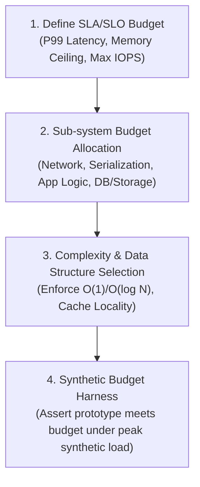

# Greenfield Performance Budgeting vs. Brownfield Performance Tuning

> **Mandate**: *Performance cannot be sprinkled onto a completed architecture like seasoning. For new systems, it must be proactively budgeted into algorithmic contracts; for legacy systems, it must be reactively discovered through empirical profiling.*

---

## 1 · The Dual-Track Performance Matrix

Software engineering operates under two distinct performance regimes. Attempting to apply brownfield profiling to non-existent code creates paralysis, while building greenfield systems without performance budgets creates catastrophic architectural technical debt:

| Dimension | Greenfield Performance Budgeting | Brownfield Performance Tuning |
| :--- | :--- | :--- |
| **Operational State** | System, module, or feature is being created from scratch. No historical metrics exist. | System is operational or running. Historical metrics, user traffic, and code exist. |
| **Primary Mechanism** | **Proactive Budgeting**: Algorithmic complexity limits, data modeling, latency envelopes. | **Reactive Optimization**: Profiling, flame graphs, bottleneck isolation, delta verification. |
| **Guiding Law** | Architectural Mechanical Sympathy & Big-$O$ Complexity Bounds. | Amdahl's Law ($S = \frac{1}{(1-p) + p/s}$) & Profiler Critical Path. |
| **Verification Gate** | Budget Compliance Verification against simulated synthetic stress workloads. | Statistical Delta Certification ($\Delta M = M_{\text{post}} - M_{\text{pre}} < 0$). |
| **Failure Mode** | Premature over-engineering or architectural blindspots ($O(N^2)$ query in core path). | Speculative optimization ("code looks slow") without profiler evidence. |

---

## 2 · Greenfield Performance Budgeting Protocol

When architecting a new service, endpoint, database schema, or pipeline, execute this 4-step budgeting protocol before implementation:

### 2.1 The Latency Budget Breakdown (Sub-system Allocation)
For an endpoint with a total $P_{99}$ latency target of $100\text{ms}$, budget every millisecond across the physical call path:

$$\text{Budget}_{\text{total}} \ge T_{\text{network\_transit}} + T_{\text{tls\_handshake}} + T_{\text{ingress\_proxy}} + T_{\text{deserialization}} + T_{\text{app\_logic}} + T_{\text{db\_storage}} + T_{\text{serialization}}$$

*Example Breakdown Matrix*:
- Ingress Gateway / Routing: $\le 5\text{ms}$
- Request Auth & Deserialization: $\le 5\text{ms}$
- Application Logic (In-Memory Processing): $\le 15\text{ms}$
- Primary Database / Storage Query: $\le 50\text{ms}$
- External Upstream Services (Hedged): $\le 20\text{ms}$
- Response Serialization & Egress: $\le 5\text{ms}$
- **Total Operational Ceiling**: $\mathbf{100\text{ms}}$

### 2.2 Complexity Class Envelopes
During greenfield design, enforce computational upper bounds on public interfaces:
- **Lookups & Access**: Must be strictly $O(1)$ (hash map, array index) or $O(\log N)$ (balanced tree, B-Tree index).
- **Collection Processing**: Must be bounded at $O(N)$ or $O(N \log N)$. Nested loops iterating over unbounded collections ($O(N^2)$) are strictly rejected at design time.
- **Memory Footprint**: Memory usage must scale sub-linearly with request volume ($O(1)$ per request through streaming/chunking rather than buffering entire payloads in RAM).

### 2.3 Greenfield Mechanical Sympathy Guidelines
When authoring initial implementations:
1. **Contiguous Memory over Pointer Chasing**: Prefer flat arrays/vectors over linked lists or deeply nested object graphs to maximize CPU L1/L2 cache hit ratios.
2. **Streaming over Buffering**: Use streaming abstractions for file I/O, network transfers, and JSON/Protobuf processing to prevent memory spikes proportional to file size.
3. **Connection & Resource Pre-allocation**: Initialize connection pools, thread pools, and pre-sized collections during system boot rather than lazily allocating in the request hot path.

---

## 3 · Brownfield Performance Tuning Protocol

When improving an existing system, the agent must adhere to the **Measurement-First Empirical Protocol**:

### 3.1 The 4-Step Baseline Capture
1. **Isolate the Test Environment**: Execute benchmarks on dedicated or quiet hardware to eliminate virtualization noise, CPU frequency scaling jitter, and thermal throttling.
2. **Warm Up the Runtime**: For managed runtimes (JVM, V8, CLR, PyPy), run $\ge 1,000$ discardable warmup iterations until JIT tier-2 compilation and GC stabilize.
3. **Capture Pre-Mutation Baseline ($M_{\text{pre}}$)**: Run $\ge 30$ iterations under representative production workloads. Record:
   - Latency Percentiles: $P_{50}, P_{90}, P_{95}, P_{99}, P_{99.9}$
   - Throughput: Requests / Operations / Tokens per second
   - Resource Footprint: Peak Resident Set Size (RSS), CPU core saturation %, Heap allocation rate
4. **Lock Baseline Artifact**: Record the baseline in persistent project documentation before touching a single line of production code.

---

## 4 · Stopping & Transition Criteria

- **Greenfield Transition**: A greenfield system transitions to brownfield governance the moment its initial prototype is deployed to a staging or production environment with an active synthetic test harness.
- **Budget Rejection Gate**: If a greenfield design exceeds its sub-system budget during initial benchmarking, the design is halted for architectural revision before code is merged.
