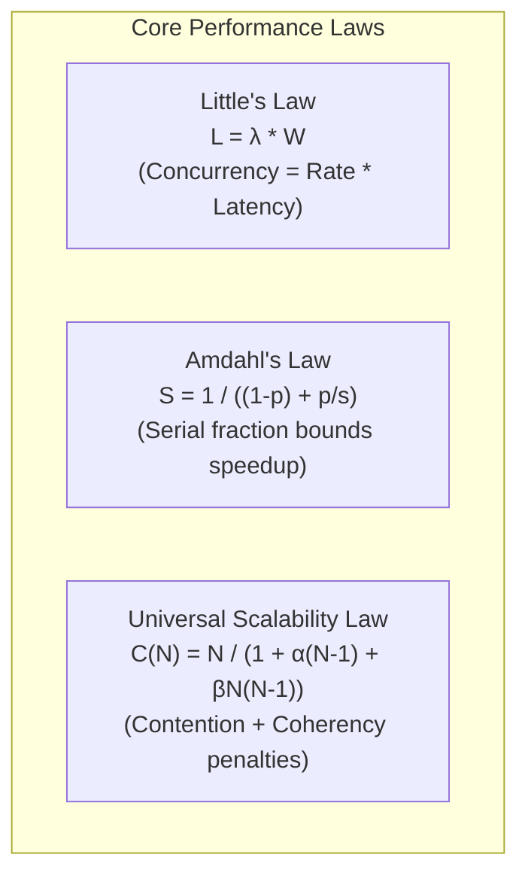

# Latency Distributions, Queueing Theory & Universal Scalability

> **Mandate**: *Average latency does not exist in production. Latency is an empirical probability distribution with fat tails, non-linear queueing hockey sticks, and cross-talk coherency penalties. Engineer for the distribution, not the mean.*

---

## 1 · The Myth of the Average & Percentile Primacy

In concurrent software systems, latency distributions are **strictly non-normal**; they are multi-modal and heavy-tailed. 

```
Probability
  ^
  |  * (Fast path: cache hit)
  |  **
  |  ***
  |  ****       * (Slow path: DB query / GC pause)
  |  *****     ***
  +---------------------------------------------> Latency (ms)
      P50      P95   P99           P99.9 (The Tail)
```

### 1.1 Why Arithmetic Means Are Forbidden
- If $99$ requests complete in $2\text{ms}$ and $1$ request blocks for $2,000\text{ms}$ on a lock:
  - $\text{Mean Latency} = \frac{99 \times 2 + 2000}{100} = 21.98\text{ms}$
  - $P_{50} = 2\text{ms}$
  - $P_{99} = 2,000\text{ms}$
- Stating *"Average response time is 22ms"* masks that 1 in 100 users experiences a 2-second freeze. Any SLA or SLO formulated on mean/average is mathematically invalid.

### 1.2 The Standard Percentile Hierarchy
- **$P_{50}$ (Median)**: Typical user experience. Reflects algorithmic efficiency and fast-path execution.
- **$P_{90} / P_{95}$**: Typical degradation under routine load. Highlights thread scheduling and connection pool waits.
- **$P_{99} / P_{99.9}$ (The Long Tail)**: The extreme experience. Governed by stop-the-world GC pauses, lock contention, packet retransmits, cache misses, and database disk flushes.

---

## 2 · Tail Latency Amplification in Distributed Systems

In modern distributed microservices and frontends that execute scatter-gather fan-outs, tail latency compounds exponentially:

### 2.1 The Fan-Out Probability Math
If a single composite request issues $M$ independent parallel sub-requests to downstream services, each with a 99th percentile latency of $> 1\text{s}$ ($p = 0.01$):

$$P(\text{Request delayed by at least one sub-call}) = 1 - (1 - p)^M$$

| Number of Fan-Out Calls ($M$) | Individual Service $P_{99}$ | Composite Request Failure/Delay Probability |
| :--- | :--- | :--- |
| **1** | $1\%$ ($0.01$) | $1.0\%$ |
| **10** | $1\%$ ($0.01$) | $9.6\%$ |
| **50** | $1\%$ ($0.01$) | $39.5\%$ |
| **100** | $1\%$ ($0.01$) | $\mathbf{63.4\%}$ |

*Key Insight*: With $100$ parallel downstream dependencies, **over $63\%$ of user requests will experience the 99th-percentile tail delay**, even if every individual microservice is healthy 99% of the time.

### 2.2 Tail Mitigation Protocols
1. **Hedged Requests**: Send a duplicate copy of the sub-request to an alternative replica if the primary replica has not responded by the 95th percentile duration. Cancel whichever returns second.
2. **Dynamic In-Flight Timeouts**: Set timeouts based on the remaining budget of the upstream request rather than static fixed numbers.
3. **Adaptive Concurrency Limits**: Throttle clients at the gateway before downstream queues inflate.

---

## 3 · Core Mathematical Laws of Performance



### 3.1 Little's Law ($L = \lambda W$)
In any steady-state queuing system:
$$L = \lambda W$$
- $L$: Average number of concurrent requests in the system.
- $\lambda$: Arrival rate (requests per second).
- $W$: Average response time (latency in seconds).

*Operational Application*: If your API handles $\lambda = 1,000\text{ req/s}$ with an average latency of $W = 0.050\text{s}$ ($50\text{ms}$), you must maintain at least $L = 50$ concurrent connections or worker threads. If latency degrades to $W = 500\text{ms}$, concurrency requirements instantly balloon to $L = 500$.

### 3.2 Amdahl's Law (The Speedup Ceiling)
$$S(s) = \frac{1}{(1 - p) + \frac{p}{s}}$$
- $p$: Fraction of code that is parallelizable or optimizable.
- $1 - p$: Strictly serial fraction that cannot be accelerated.
- $s$: Speedup factor of the optimized portion.

*Practical Limit*: If a function spends $80\%$ of its time waiting on a synchronous database lock ($1 - p = 0.80$), even making the remaining $20\%$ of application code infinitely fast ($s \to \infty$) yields a maximum theoretical speedup of:
$$S_{\text{max}} = \frac{1}{0.80} = 1.25\times \quad (\text{only } 25\% \text{ overall gain})$$
*Rule*: Never optimize code until you target the dominant serial fraction.

### 3.3 The Universal Scalability Law (Neil Gunther)
Traditional models assume throughput scales linearly with added workers. Gunther's USL captures the physical reality of concurrent systems:

$$C(N) = \frac{N}{1 + \alpha(N - 1) + \beta N(N - 1)}$$
- $N$: Number of CPU cores, workers, or nodes.
- $\alpha$: **Contention Penalty** (queueing for shared resources, e.g. mutex locks, database connection pools).
- $\beta$: **Coherency Penalty** (cross-talk, cache invalidation traffic, distributed consensus state sync).

```
Capacity C(N)
  ^               Linear Ideal (α=0, β=0)
  |              /
  |             /   Contention Limit (α>0, β=0)
  |            /---___
  |           /       \__ Retrograde Collapse (β>0: Coherency cross-talk)
  +-------------------------------------> Concurrency N
```

*The Retrograde Phenomenon*: When $\beta > 0$ (cross-node cache coherency, two-phase commits), adding more nodes beyond a critical saturation point **reduces total throughput**. Systems degrade into retrograde collapse because nodes spend all bandwidth communicating state changes to each other.
