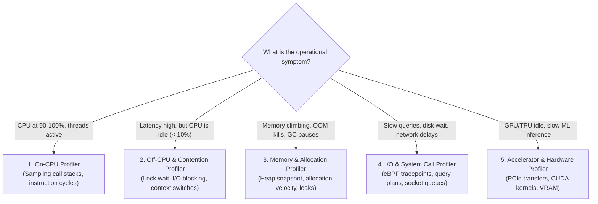

# Profiler Taxonomy, Question Routing & Observer Overhead

> **Mandate**: *Never guess where time or memory is spent. Route the operational diagnostic question to the specialized profiler category, bound the observer overhead, and let the execution graph dictate the engineering focus.*

---

## 1 · The Universal Profiler Taxonomy

Profilers are divided into five functional categories based on the physical resource being measured:

### 1.1 On-CPU vs. Off-CPU Analysis
- **On-CPU Time**: Time threads spend actively executing instructions on a physical CPU core.
  - *Tooling Archetypes*: Linux `perf`, `async-profiler` (Java), `pprof` (Go), `py-spy` (Python), Instruments (macOS/iOS), Chrome DevTools Performance tab.
  - *Visualization*: Flame graphs where horizontal width represents proportion of total on-CPU cycles.
- **Off-CPU Time**: Time threads spend blocked waiting for a resource (I/O, database response, lock acquisition, sleep, page fault).
  - *Diagnostic Reality*: If a request takes $500\text{ms}$ but only consumes $5\text{ms}$ of CPU time, an On-CPU profiler is useless. You must run an **Off-CPU profiler** (e.g. eBPF `offcputime`, thread state dumps).

### 1.2 Memory & Allocation Profilers
- **Allocation Rate (Velocity)**: Total bytes allocated per second. High allocation velocity triggers severe GC pressure and cache thrashing, even if total heap memory remains constant.
- **Retained Heap (State)**: Objects that remain reachable and cannot be garbage collected. Essential for diagnosing true memory leaks.

---

## 2 · Question-to-Profiler Routing Matrix

| Operational Symptom | Diagnostic Question | Mandatory Profiler Class | Expected Artifact |
| :--- | :--- | :--- | :--- |
| **High CPU Saturation** (CPU > 80%) | Which exact functions and call stacks consume cycles? | On-CPU Sampling Profiler | CPU Flame Graph / Hotspot list |
| **High Latency, Low CPU** (CPU < 20%) | What are threads blocked on (locks, DB, disk, network)? | Off-CPU / Wait-State Profiler | Off-CPU Flame Graph / Lock contention log |
| **Periodic Latency Spikes** (P99 jitter) | Are stop-the-world GC pauses or kernel page faults stalling execution? | GC & Allocation Profiler | Allocation trace / GC pause duration histogram |
| **Process Crash / OOM Kill** | Which data structures are accumulating without eviction? | Retained Heap Snapshot | Heap Dominator Tree / Path-to-GC-root diff |
| **Slow Database Endpoint** | Is the storage engine performing full table scans or lock escalation? | Query Execution Plan Analyzer | `EXPLAIN (ANALYZE, BUFFERS)` output |
| **GPU / Accelerator Underutilization** | Are PCIe host-to-device transfers bottlenecking compute? | Hardware Trace / Accelerator Profiler | Kernel Execution Timeline / CUDA trace |

---

## 3 · Bounding the Observer Effect (Heisenbug Defense)

The act of profiling introduces instrumentation overhead that can alter system behavior, skew cache lines, and create synthetic bottlenecks:

### 3.1 The 3% Overhead Rule
The chosen profiler must consume **less than 3% of total CPU cycles** during measurement. Heavyweight byte-code instrumentation or tracing every function call is strictly forbidden in production or high-throughput benchmarks.

### 3.2 Sampling Frequency & Nyquist-Shannon Considerations
- **Avoid Lockstep Sampling**: Never sample at an even integer frequency (e.g., $100\text{Hz}$ or $1000\text{Hz}$) that can synchronize with periodic timer interrupts, thread scheduling ticks, or clock cycles.
- **Recommended Sampling Rate**: Use prime numbers (e.g., $97\text{Hz}$ or $997\text{Hz}$) to capture an unbiased distribution across execution phases.

### 3.3 The Final Release Verification Law
While profilers identify the bottleneck, **all final pre-mutation and post-mutation benchmark numbers must be measured on uninstrumented release builds** with profiling hooks disabled.
