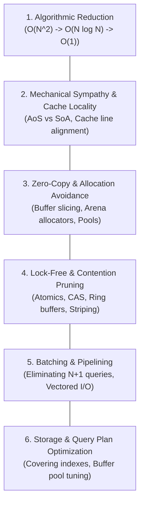

# Universal Resource Optimization Patterns

> **Mandate**: *Mechanical sympathy is the alignment of software logic with the physical architecture of hardware. Optimization is not clever code golf; it is designing algorithms and data structures that respect the physics of memory hierarchies, CPU caches, and I/O pipelines.*

---

## 1 · The 6 Core Resource Patterns

---

## 2 · Detailed Pattern Engineering

### 2.1 Pattern 1: Algorithmic & Big-$O$ Complexity Reduction
Before considering micro-optimizations, verify that the algorithm operates in the minimal feasible complexity class:

| Anti-Pattern (High Complexity) | Optimized Pattern (Sub-Linear / Linear) | Concrete Example |
| :--- | :--- | :--- |
| **Nested loops over lists** ($O(N \times M)$) | **Hash Set / Map lookup** ($O(N + M)$) | Converting list containment check into a pre-hashed set lookup. |
| **Linear search on sorted data** ($O(N)$) | **Binary Search** ($O(\log N)$) | Bisecting sorted intervals or using index trees. |
| **Unbounded in-memory sorting** ($O(N \log N)$) | **Top-$K$ Min-Heap** ($O(N \log K)$) | Finding top 10 elements in 1,000,000 items without sorting the entire dataset. |
| **Repeated computation of overlapping sub-problems** ($O(2^N)$) | **Memoization / Dynamic Programming** ($O(N)$) | Caching sub-problem evaluations with bounded eviction. |

---

### 2.2 Pattern 2: Mechanical Sympathy & Memory Cache Locality
CPUs do not read individual bytes from RAM; they fetch **$64\text{-byte}$ cache lines**. 
- **L1 Cache access**: $\sim 1\text{ns}$ (4 CPU cycles)
- **Main Memory RAM access**: $\sim 100\text{ns}$ (300+ CPU cycles)

Every pointer-chasing traversal (e.g. linked lists, deeply nested pointer graphs) incurs a **cache miss penalty of $300\times$**.

#### Structure of Arrays (SoA) vs. Array of Structures (AoS)
When processing collections where algorithms access only specific fields (e.g., updating entity positions):
* **AoS (Cache Inefficient)**:
  `struct Particle { float x, y, z; int id; char name[32]; float mass; };`  
  *Problem*: Iterating over `x, y, z` pulls `id`, `name`, and `mass` into the $64\text{-byte}$ cache line, wasting $> 75\%$ of cache bandwidth.
* **SoA (Cache Optimal)**:
  `struct Particles { float x[N]; float y[N]; float z[N]; ... };`  
  *Advantage*: `x` values are packed contiguously in memory. A single cache line holds 16 consecutive coordinates, maximizing SIMD vectorization and cache hits.

#### False Sharing Elimination
When two threads on separate cores write to distinct variables located on the **same $64\text{-byte}$ cache line**, the CPU cache coherence protocol (MESI) constantly invalidates the cache line between cores:
- *Solution*: Pad independent concurrent variables or use thread-local state to ensure distinct threads write to separate cache lines.

---

### 2.3 Pattern 3: Zero-Copy & Allocation Avoidance
Memory allocations trigger kernel syscalls (e.g. `brk`, `mmap`), fragmentation, and garbage collection pauses.

1. **Borrowing Views over Duplication**: Pass slice views (`std::string_view` in C++, `&str` in Rust, `Span<T>` in C#, byte slices in Go) rather than duplicating sub-strings or sub-arrays.
2. **Object Pooling**: Pre-allocate and reuse expensive buffers (e.g., network packet buffers, JSON parsing contexts) rather than allocating on every request.
3. **Arena / Slab Allocators**: For short-lived request contexts, allocate from a contiguous memory arena and deallocate the entire arena at once in $O(1)$ time upon request completion.

---

### 2.4 Pattern 4: Lock-Free Synchronization & Contention Pruning
Mutexes and synchronized locks cause thread suspension, kernel context switching ($> 1\text{--}2\mu\text{s}$ per switch), and priority inversion.

1. **Atomic Primitives (CAS)**: Replace coarse locks with atomic primitives (`Compare-And-Swap`, atomic counters) for simple state updates.
2. **Lock Striping / Partitioning**: Instead of a single global lock protecting a map, partition the map into $K = 64$ stripes, each with its own mutex, reducing collision probability by $64\times$.
3. **Single-Writer Ring Buffers (Disruptor Pattern)**: Use lock-free circular ring buffers with sequence counters for ultra-high-throughput producer-consumer queues.

---

### 2.5 Pattern 5: Batching & Pipelining (I/O Amortization)
The cost of an I/O boundary crossing (syscall, network round-trip, database query) is dominated by the fixed overhead, not the payload size:

1. **Eliminate the $N+1$ Database Query Antipattern**:
   * *Anti-Pattern*: Query 100 users, then loop and execute a separate `SELECT * FROM orders WHERE user_id = ?` for each user (101 round-trips).
   * *Optimized*: Execute a single `SELECT * FROM orders WHERE user_id IN (...)` (1 round-trip).
2. **Vectored I/O (`readv` / `writev`)**: Gather data from multiple disjoint memory buffers into a single system call to avoid intermediate buffer copying.

---

### 2.6 Pattern 6: Storage Engine & Database Query Plan Optimization
1. **Covering Indexes**: Design indexes where all columns requested by the `SELECT` query reside within the B-Tree index itself (`CREATE INDEX ... INCLUDE (...)`). The database never accesses the table heap (index-only scan).
2. **Leading Column Ordering**: Place the highest cardinality or strict equality filter columns as the leading keys in composite indexes.
3. **Avoid Wildcard Projections**: `SELECT *` forces the database to read off-row LOBs (Large Objects) and disables index-only scans. Project only required columns.
